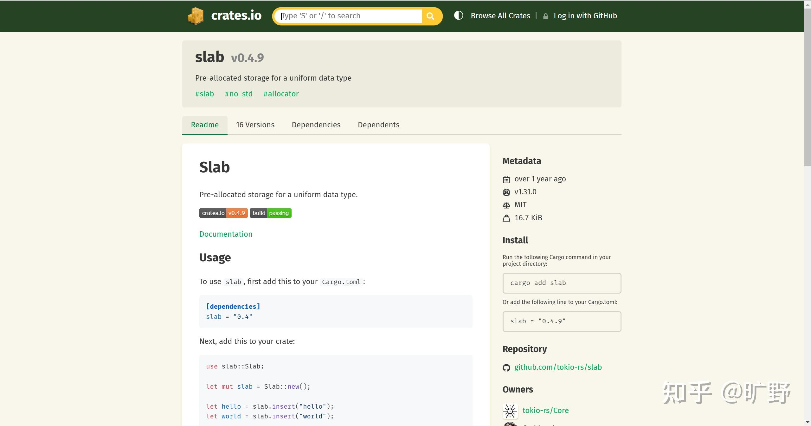
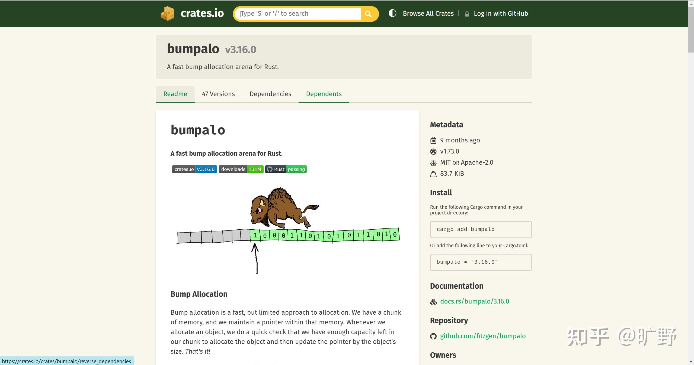

你提到的情况，**将Java项目迁移到Rust后性能变慢**，确实是一个经典问题，它直接暴露了无GC语言中内存管理的“深坑”——**如何处理内存碎片**。

## **GC语言和无GC语言：内存碎片的区别**

### GC语言（如Java、Python）

有**垃圾回收器**兜底，碎片问题通常是“自动”解决的：

**分配策略**：

常用**堆分代模型**：年轻代对象短命，老年代稳定。  
垃圾回收会整理堆空间（如标记-清除算法、压缩内存）。

**释放内存：** 开发者不操心！系统定期清理无用对象，碎片自动合并。

**GC的代价**：引入暂停（Stop-the-World），性能不稳定。

## 无GC语言（如C/C++/Rust）

**开发者负责管理内存，碎片问题就是你自己的锅**

**分配策略：** 靠内存分配器（allocator），比如：

malloc/free 系统调用：简单粗暴，但碎片化严重。  
定制分配器：根据特定场景优化。

**释放内存：** 开发者手动回收，或者靠智能指针（Rust）。

**无GC语言的挑战：** 频繁分配/释放导致内存碎片化，进而影响性能。

## **为什么你迁移到Rust后性能变慢了？**

Rust的内存管理主要靠**所有权系统**，但分配器和分配/释放模式仍然决定性能。在你的场景下，性能问题可能源于以下几点：

### **频繁分配/释放：堆分配太多**

Java中，JVM可能利用\*\*线程本地分配缓冲区（TLAB）\*\*来优化小对象分配；而Rust在默认情况下，可能直接调用系统分配器（如 malloc/free）。这会导致内存分配频繁进入内核，开销巨大。小对象释放时产生大量碎片。

### **分配器的选择**

Rust默认使用系统分配器（jemalloc 或操作系统的 malloc）。它在处理大量大小随机的对象时，可能表现出明显的碎片化问题，特别是当分配/释放的模式缺乏规律时。

### **内存碎片问题具体表现**

-   对象随机大小分配，释放时难以合并，导致**碎片化**。
-   后续需要分配内存时，碎片化的堆空间无法满足需求，增加分配失败率，触发更多系统调用。

* * *

## 问题来了：**无GC语言如何处理碎片问题？**

无GC语言处理碎片化的核心思想是：**分配器策略 + 数据结构设计**。下面有些常用的处理方法：

### **自定义分配器**

Rust允许你**自定义分配器**，为特定场景优化内存分配。例如：

**1\. 分区分配器（Slab Allocator）**

将内存划分成大小固定的块，减少碎片化。

非常适合频繁分配/释放固定大小对象的场景。

Rust有现成的实现，比如 [slab](https://link.zhihu.com/?target=https%3A//crates.io/crates/slab)。

**2.区域分配器（Region Allocator）**

-   分配一大块连续内存，所有对象都分配在其中。
-   释放时不逐个释放，而是一次性释放整个区域。
-   适合生命周期相近的对象（如模拟项目的短命对象）。

Rust可以用 [bumpalo](https://link.zhihu.com/?target=https%3A//crates.io/crates/bumpalo)。

**3.定制内存池**

针对特定大小的对象维护内存池，复用已释放的内存块，避免碎片化。

### **数据结构优化**

除了调整分配器，还可以通过数据结构设计来降低分配/释放压力：

**减少堆分配**

使用栈分配代替堆分配（Rust的默认值语义）。  
如果对象生命周期短，尽量避免将其存放到堆中。

**使用缓冲池**

在模拟项目中，可以提前创建足够的缓冲区。对象生成时复用已分配的缓冲区，避免频繁分配/释放。

* * *

## **无GC不是高性能的保证，分配策略才是关键**

**无GC语言就像开跑车，不会开就翻车；而GC语言是公交车，稳是稳，但不一定快。**

你遇到的性能问题，很可能是因为默认分配器和Java的TLAB机制差异导致的。**调整分配器、设计对象池、优化分配模式**，才是高性能 Rust 项目的正确打开方式。

如有帮助，记得点赞关注~ 我是旷野，探索无尽技术！