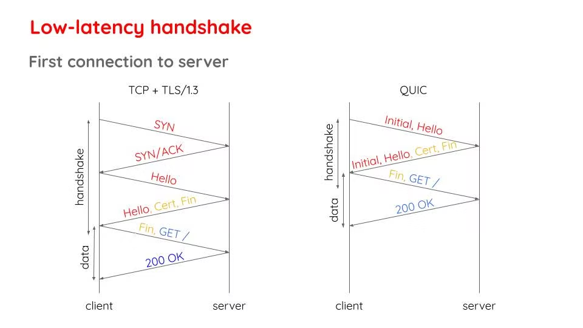
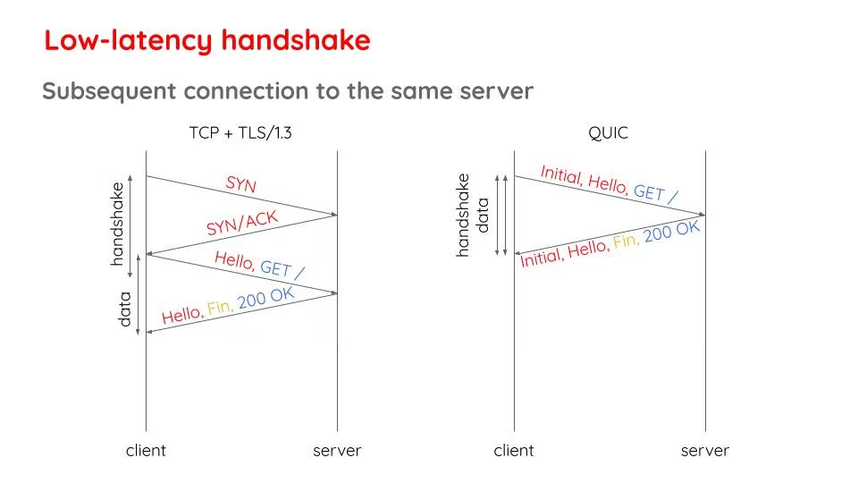

这是一大误解，UDP 是比 TCP 快，但这和 HTTP/3.0 比 HTTP/2.0 快没关系。不是说 UDP 不可靠的问题突然就被谷歌解决了，HTTP/3.0 就突然可以用它了，不是的。QUIC 的本意就是为了改进传输层协议，但是谷歌在 QUIC 前也做过一些改进 TCP 的尝试，发现网络上的中间设备只支持传统的 TCP 和 UDP，因为兼容性问题，改进后的 TCP 协议需要耗时很多年推进设备更新换代才能用，等不了这么久，所以才发明了 QUIC，如果可以的话，QUIC 宁愿成为一个新的传输层协议，既不基于 TCP 也不基于 UDP，同样是因为中间设备，谷歌早已经知道是不可行的，所以必须是基于已有的 UDP 重新发明一次 TCP，也就是可以认为 QUIC 是 TCP 2.0，TCP 之所以比 UDP 耗时的那些操作 QUIC 得重新发明一遍（不过是以更聪明的方式），否则怎么能变的可靠呢？TCP 需要三次握手建立连接，QUIC 同样也有需要握手建立连接，TCP 有重传机制，QUIC 也同样得有。

QUIC 比老的 TCP 快的原因最主要是因为握手次数减少，如果是和这个域名第一次连接，QUIC 需要两个来回，而传统的 HTTP/2.0 需要三个来回，快了 30%，这是得益于 QUIC 集成了 TLS，TLS 的握手和连接本身的握手可以一起进行：

如果是第二次连接这个域名，不需要再传递 TLS 证书，HTTP/2.0 需要两个来回，HTTP/3.0 仅需要一个来回，提速了 50%：

所以并不是因为 UDP 突然变的又快有可靠了。