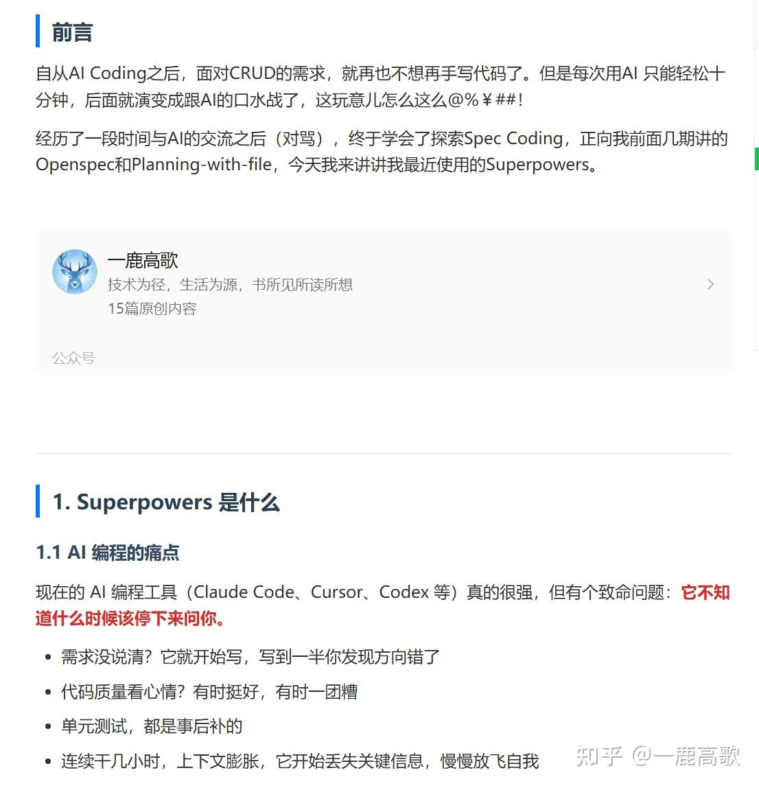

### **建议前往原文链接，**更好的排版体验

[https://mp.weixin.qq.com/s/TSGEa7flU6FvIw3drTzdQw](https://link.zhihu.com/?target=https%3A//mp.weixin.qq.com/s/TSGEa7flU6FvIw3drTzdQw)

  

**原文排版，如下：**



### 前言

### 自从AI Coding之后，面对CRUD的需求，就再也不想再手写代码了。但是每次用AI 只能轻松十分钟，后面就演变成跟AI的口水战了，这玩意儿怎么这么@%￥##！

### 经历了一段时间与AI的交流之后（对骂），终于学会了探索Spec Coding，正向我前面几期讲的Openspec和Planning-with-file，今天我来讲讲我最近使用的Superpowers。

* * *

### 1\. Superpowers 是什么

### 1.1 AI 编程的痛点

现在的 AI 编程工具（Claude Code、Cursor、Codex 等）真的很强，但有个致命问题：**它不知道什么时候该停下来问你。**

-   需求没说清？它就开始写，写到一半你发现方向错了
-   代码质量看心情？有时挺好，有时一团糟
-   单元测试，都是事后补的
-   连续干几小时，上下文膨胀，它开始丢失关键信息，慢慢放飞自我

  

### 1.2 Superpowers 的定位

**Superpowers** 是一个插件化的 AI 编程技能框架，给 AI 加上了软件开发的工作流程和最佳实践。

通俗点说，它给 AI 配了了一套「打工人的自我修养」：

-   先理解需求，再动手
-   先写测试，再写代码
-   遇到问题系统化调试，别乱猜
-   写完代码自review，不行的重做

**它让 AI 像一个资深开发者一样工作，而不是一个无脑写代码的工具人。**

### 

### 1.3 核心特性

| 特性 | 说明 |
| ----- | ----- |
| 自动触发技能 | AI 在任何任务前都会检查并调用相关技能 |
| 强制 TDD | 写代码前必须先写测试 |
| 任务拆解 | 把大功能拆成 2-5 分钟的小任务 |
| 子代理开发 | 启动多个子代理并行工作 |
| 代码审查 | 任务间自动审查，按严重度报告问题 |

* * *

### 2\. 安装教程

Superpowers 支持多种 AI 编程平台，安装方式略有不同，这里只向你展示Claude Code，其他的大家自行摸索下（因为我用的Claude Code），挺容易上手的。

### 2.1 Claude Code（推荐）

Claude Code 是官方亲儿子，安装最简单：

```text
# 1. 注册插件市场
/plugin marketplace add obra/superpowers-marketplace

# 2. 安装插件
/plugin install superpowers@superpowers-marketplace

# 3. 验证安装
/help
```

安装完成后，你会看到新的命令：

-   `/superpowers:brainstorm - 交互式需求精炼`
-   `/superpowers:write-plan - 生成实施计划`
-   `/superpowers:execute-plan - 批量执行计划`
-   `/superpowers:request-code-review - 代码审查`

> *⚠️ 注意：安装完成后建议**重启 Claude Code** 或开新会话，让插件生效。*

### 

### 2.2 验证安装

不管用哪个平台，安装完成后**新建一个会话**，然后问：

> *"帮我规划一个新功能：用户登录功能"*

如果 AI 正常触发了 brainstorming 开始问你问题，说明装好了！

* * *

### 3\. 核心工作流

Superpowers 把开发流程分成 **7 个阶段**，AI 会自动按顺序执行。

### 3.1 头脑风暴（Brainstorming）

**触发时机：** 任何新功能或需求前

AI 不会直接写代码，而是先通过提问理解需求：

-   "这个功能给谁用？"
-   "用什么技术栈？"
-   "有没有类似的现有功能可以参考？"

它会提出 2-3 种方案，**分段展示设计让你确认**，而不是直接塞给你一整个文档。

> *📝 设计确认后，AI 会自动保存到 `docs/plans/` 目录。*

### 

### 3.2 创建工作空间（Git Worktrees）

**触发时机：** 设计确认后

在使用 git 的项目中，AI 会用 `git worktrees` 创建一个**独立的开发分支**，不污染主分支。

好处：你可以同时开多个功能，互不影响。

### 

### 3.3 编写计划（Writing Plans）

**触发时机：** 设计文档确认后

AI 把大功能拆成**极小的任务**（每个 2-5 分钟），每个任务包含：

-   精确的文件路径
-   完整的测试代码
-   运行命令和预期输出
-   验证步骤

### 

### 3.4 执行计划（Subagent-Driven Development）

**触发时机：** 计划确认后

AI 开始执行任务，有两种模式：

| 模式 | 说明 |
| ----- | ----- |
| 子代理驱动 | 启动子代理逐任务实施 + 双阶段审查 |
| 批量执行 | 在独立会话中批量跑，定期暂停让你检查 |

### 3.5 测试驱动开发（TDD）

**触发时机：** 任何实现或 bugfix 前

**这是 Superpowers 最严格的部分：**

```text
RED → GREEN → REFACTOR
```

1.  **RED：先写一个会失败的测试**
2.  **GREEN：写最少的代码让测试通过**
3.  **REFACTOR：优化代码，然后 commit**

### **TDD 核心概念详解**

先解释一下这三个颜色的含义：

-   **RED（红色）= 测试失败 → 表示"这个功能还没有实现"**
-   **GREEN（绿色）= 测试通过 → 表示"功能刚刚好能用"**
-   **REFACTOR（重构） = 优化代码 → 在保持功能不变的前提下，让代码更优雅**

> *💡 为什么叫 RED/GREEN？大多数测试框架的测试结果界面：失败显示红色，通过显示绿色。久而久之就成了行业黑话。*

### 背后的思想：像侦探一样写代码

TDD 的核心思维是**「先定义答案，再写题目」**：

-   传统开发：先写代码 → 再写测试 → 看看有没有bug
-   TDD：先写测试（定义期望结果）→ 再写代码 → 保证测试通过

举个例子：就像做数学题之前，先看一下参考答案，再去解题。这样做的好处是：**你非常清楚自己要实现什么**，不会写偏。

### 

### **一个完整的 TDD 循环**

让我们用一个完整的例子来演示：假设要实现「用户注册功能」。

**第 1 步：RED（写一个会失败的测试）**

先想清楚：「用户注册应该有什么行为？」

-   邮箱为空 → 应该报错
-   邮箱格式不对 → 应该报错
-   密码太短 → 应该报错
-   正常注册 → 应该成功

先写第一个测试：

```text
// 场景：测试「邮箱为空」的情况
@Test
void shouldRejectEmptyEmail() {
    // 准备测试数据
    String email = "";
    String password = "password123";

    // 调用要测试的方法
    RegistrationResult result = userService.register(email, password);

    // 断言：期望返回「邮箱不能为空」的错误
    assertFalse(result.isSuccess());
    assertEquals("Email is required", result.getErrorMessage());
}

// 运行测试 → FAIL ❌（因为 register 方法还不存在）
```

此时：代码还没写，测试肯定失败（RED）。

**第 2 步：GREEN（写最少的代码让测试通过）**

现在才开始写生产代码，但只写「刚好能让测试通过」的程度：

```text
// 最少实现：只处理空邮箱的情况
public RegistrationResult register(String email, String password) {
    if (email == null || email.isEmpty()) {
        return new RegistrationResult(false, "Email is required");
    }
    // 其他情况暂时不管
    return new RegistrationResult(true, null);
}

// 运行测试 → PASS ✅
```

此时：测试通过了（GREEN），功能刚好能用。

> *⚠️ 注意：很多新手会在这里「想太多」——比如顺便把「邮箱格式验证」也写了。这是错的！TDD 的精髓是**只写能让当前测试通过的最少代码**。*

**第 3 步：REFACTOR（优化代码）**

测试通过了，现在可以「 refactor 」——在**不改变功能**的前提下，让代码更优雅：

```text
// 优化前
if (email == null || email.isEmpty()) {
    return new RegistrationResult(false, "Email is required");
}

// 优化后（提取方法，提高可读性）
if (isBlank(email)) {
    return RegistrationResult.failure("Email is required");
}

private boolean isBlank(String str) {
    return str == null || str.trim().isEmpty();
}

// 运行测试 → 仍然 PASS ✅（功能没变，只是更优雅了）
```

Refactor 完成后，**commit 提交**，然后进入下一个 TDD 循环。

### 循环往复：从小功能到大系统

刚才只是一个测试用例。真实开发中，你会不断循环这个流程：

```text
RED（写新测试）→ GREEN（最小实现）→ REFACTOR（优化）→ commit
   ↓
RED（写新测试）→ GREEN（最小实现）→ REFACTOR（优化）→ commit
   ↓
RED（写新测试）→ GREEN（最小实现）→ REFACTOR（优化）→ commit
   ↓
...（如此往复，最终堆出完整功能）
```

  

整个过程中：

-   **每次只做一件事，不会手忙脚乱**
-   **每次改动都有测试保护，不怕改坏**
-   **测试即文档，其他人看测试就知道登录功能的所有边界情况**
-   **小步提交，每个 commit 都是「能跑」的代码**

  

每完成一次循环，就有一个具体的小功能被测试覆盖。这样**测试和代码是同步生长的**，而不是事后补的。

### 为什么 Superpowers 强制 TDD？

传统 AI 写代码的痛点：

-   AI 咔咔写一堆代码 → 运行报错 → 不知道哪里的问题
-   AI 以为「写完了」→ 实际上漏了这个那个边界情况
-   改 Bug 时，修复一个又冒出另一个（因为没有测试保护）

TDD 的好处：

-   **每一次改动都有测试保护，不怕「改坏」**
-   **测试即文档，新手看测试就知道功能该怎么用**
-   **小步前进，每次只改一点点，出了问题立刻知道**
-   **强制思考,AI 必须先想清楚「要实现什么」才能写测试**

> *这套流程看起来麻烦，但实际上防止了 AI 写「看起来对」但实际不工作的代码。*

### 

### 3.6 代码审查（Code Review）

**触发时机：** 任务之间或任务完成后

AI 会自动审查代码，检查：

-   是否符合计划
-   是否有 YAGNI（过度设计）
-   是否有安全问题
-   性能是否合理

问题按严重度分类：**Critical** 会阻止继续，**Major** 和 **Minor** 可以后续处理。

### 3.7 完成分支（Finishing Branch）

**触发时机：** 所有任务完成后

AI 会：

-   验证所有测试通过
-   展示变更摘要
-   让你选择：合并 / 创建 PR / 保留分支 / 丢弃
-   自动清理 worktree

* * *

### 4\. 技能库详解

Superpowers 内置 **14 个核心技能**，覆盖开发全流程。

### 4.1 核心技能一览

| 技能 | 作用 |
| ----- | ----- |
| brainstorming | 需求精炼，通过问答探索方案 |
| test-driven-development | TDD 循环（RED-GREEN-REFACTOR） |
| systematic-debugging | 4 阶段系统化调试 |
| writing-plans | 任务拆解成 2-5 分钟小任务 |
| subagent-driven-development | 子代理并行开发 + 双阶段审查 |
| requesting-code-review | 自动代码审查 |
| receiving-code-review | 响应审查反馈 |
| using-git-worktrees | 隔离分支开发 |
| finishing-a-development-branch | 分支完成与合并 |
| dispatching-parallel-agents | 并行代理工作流 |
| verification-before-completion | 完工前验证 |
| using-superpowers | 技能系统入门 |
| writing-skills | 创建新技能 |

### 

### 4.2 手动触发技能

虽然技能会自动触发，但你也可以**手动强制调用**：

```text
/superpowers:brainstorm          # 强制需求精炼
/superpowers:write-plan          # 强制生成计划
/superpowers:request-code-review      # 强制代码审查
```

* * *

### 5\. 实战演练

说了这么多，来看看实际效果。

### 5.1 场景：添加用户登录功能

**你说：** "我想添加一个用户登录功能，支持用户名密码和短信验证码。"

**AI 响应（自动触发 brainstorming）：**

> *"好的，我们来细化一下需求：*

1.  *这是 Web 应用还是移动端？*
2.  *短信验证码需要对接第三方平台吗？*
3.  *登录后需要 JWT 令牌还是 Session？*

*请依次回答～"*

**你回答完问题后，AI 会：**

-   提出 2-3 种架构方案（比如：JWT vs Session、单一登录 vs 多设备登录）
-   分段展示设计文档
-   让你确认每个部分

**确认设计后，AI 自动：**

1.  创建 git worktree 新分支
2.  生成详细实施计划（每个任务 2-5 分钟）
3.  开始执行：先写测试 → RED → 写代码 → GREEN → commit
4.  任务间自动代码审查
5.  完成后让你选择合并或创建 PR

**你只需要：** 在关键节点确认，其他时间可以喝着咖啡看 AI 干活。

### 5.2 效果对比

| 指标 | 不用 Superpowers | 用 Superpowers |
| ----- | ----- | ----- |
| 返工率 | 高（经常写错方向） | 低（先确认设计） |
| 测试覆盖率 | 较低 | 更高（接近 100%） |
| 代码质量 | 不稳定 | 稳定 |
| 文档 | 无 | 自动生成 |
| 连续工作时间 | 较短 | 可连续工作几小时（官网数据） |

* * *

### 6\. 最佳实践

### 6.1 从小功能开始

第一次用建议选一个 **1-2 小时的小功能**，体验完整流程。

### 6.2 需求不明确时用 brainstorming

如果需求还没想清楚，可以直接告诉 AI 你的想法，`brainstorming` 技能会自动触发：

> *"我想优化系统性能，但不确定瓶颈在哪"*

AI 会通过问答帮你分析需求、探索方案，而不是盲目开始写代码。这正是 Superpowers 的设计理念--**先理解需求，再动手**。

### 6.3 归档前先验证

在分支任务完成后、归档前，Superpowers 会自动触发 `finishing-a-development-branch` 技能，它会：

-   验证所有测试通过
-   检查是否有遗漏的任务
-   对比实现与设计是否一致
-   让你选择：合并 / 创建 PR / 保留分支 / 丢弃

也**可以手动触发验证：`/superpowers:request-code-review` 让 AI 提前做一次代码审查。**

* * *

### 7\. 常见问题

### Q1：简单功能也要走流程？

建议这样，Superpowers 的设计理念是：**即使是简单功能，也需要 TDD**。

当然，你可以选择「绕过」，但框架会阻止你。

### Q2：怎么更新？

### 框架后面是否还支持更新

```text
/plugin update superpowers
```

技能会自动更新。

  

**Q3：Superpowers与Openspec的使用场景有什么区别**

| 场景 | Superpowers | OpenSpec |
| ----- | ----- | ----- |
| 项目规模 | 中大型项目，需要全流程工程化 | 大型项目，多人协作 |
| 开发方式 | 强调 TDD + 代码审查 | 强调规范文档 + 任务拆分 |
| 适用人群 | 追求代码质量的企业/团队 | 需要规范协作，需要对变更进行归档的开发团队 |
| AI 助手 | Claude Code (主要) | Cursor / Copilot / Claude Code |
| 安装方式 | Claude Code 插件市场 | Node.js (npm/pnpm) |

* * *

**🚀 立即安装：**

```text
/plugin marketplace add obra/superpowers-marketplace
/plugin install superpowers@superpowers-marketplace
```

  

**往期精彩：**

[这才是更适合CRUD老炮们的Spec Coding方式](https://link.zhihu.com/?target=https%3A//mp.weixin.qq.com/s%3F__biz%3DMzkyODMyMTAyMQ%3D%3D%26mid%3D2247484292%26idx%3D1%26sn%3D31fb19baa947c920abe28595a9d34fae%26scene%3D21%23wechat_redirect)

[AI Coding之OpenSpec + Claude Code + Java 实战全记录](https://link.zhihu.com/?target=https%3A//mp.weixin.qq.com/s%3F__biz%3DMzkyODMyMTAyMQ%3D%3D%26mid%3D2247483999%26idx%3D1%26sn%3D62f1d0ad04a73b096ed09eaf14adc4bb%26scene%3D21%23wechat_redirect)

[Openclaw Skills加载机制，这次说得够细了吧](https://link.zhihu.com/?target=https%3A//mp.weixin.qq.com/s%3F__biz%3DMzkyODMyMTAyMQ%3D%3D%26mid%3D2247484036%26idx%3D1%26sn%3D4b74121fd27c1929267671f315900e61%26scene%3D21%23wechat_redirect)

[openclaw.json 解读攻略：读完这篇，你比 90% 人更懂OpenClaw 配置](https://link.zhihu.com/?target=https%3A//mp.weixin.qq.com/s%3F__biz%3DMzkyODMyMTAyMQ%3D%3D%26mid%3D2247483919%26idx%3D1%26sn%3Dab74bd7c45a46d2336fb9d70278d696b%26scene%3D21%23wechat_redirect)

  

**欢迎关注，进群，和我们一起面向AI前进**