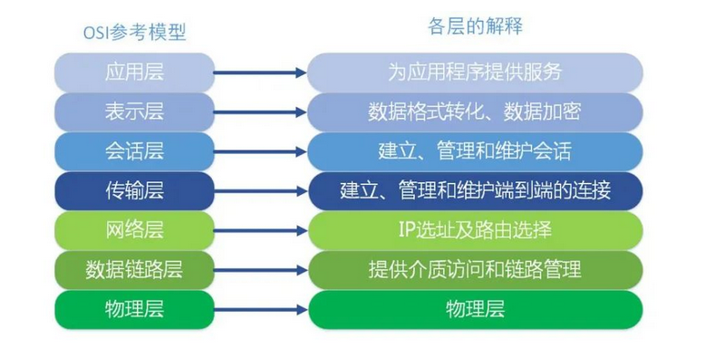
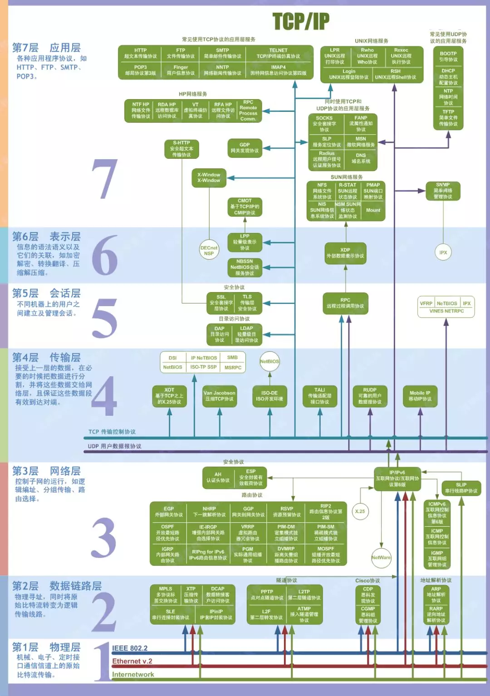
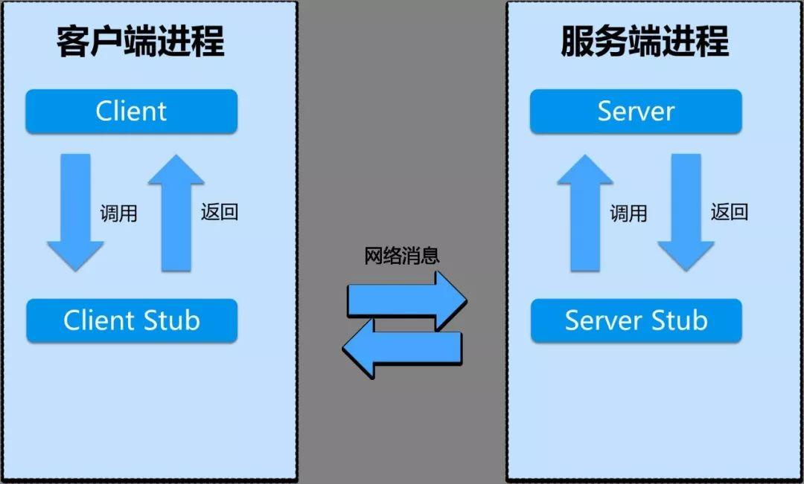

很长时间以来都没有怎么好好搞清楚 RPC（即 Remote Procedure Call，远程过程调用）和 HTTP 调用的区别，不都是写一个服务然后在客户端调用么？这里请允许我迷之一笑~Naive！

本文简单地介绍一下两种形式的 C/S 架构，先说一下他们最本质的区别，就是 RPC 主要是基于 TCP/IP 协议的，而 HTTP 服务主要是基于 HTTP 协议的。

我们都知道 HTTP 协议是在传输层协议 TCP 之上的，所以效率来看的话，RPC 当然是要更胜一筹啦！下面来具体说一说 RPC 服务和 HTTP 服务。

## **OSI 网络七层模型**

在说 RPC 和 HTTP 的区别之前，我觉的有必要了解一下 OSI 的七层网络结构模型（虽然实际应用中基本上都是五层）。

它可以分为以下几层：（从上到下）

-   第一层：应用层。定义了用于在网络中进行通信和传输数据的接口。
-   第二层：表示层。定义不同的系统中数据的传输格式，编码和解码规范等。
-   第三层：会话层。管理用户的会话，控制用户间逻辑连接的建立和中断。
-   第四层：传输层。管理着网络中的端到端的数据传输。
-   第五层：网络层。定义网络设备间如何传输数据。
-   第六层：链路层。将上面的网络层的数据包封装成数据帧，便于物理层传输。
-   第七层：物理层。这一层主要就是传输这些二进制数据。

实际应用过程中，五层协议结构里面是没有表示层和会话层的。应该说它们和应用层合并了。

我们应该将重点放在应用层和传输层这两个层面。因为 HTTP 是应用层协议，而 TCP 是传输层协议。

好，知道了网络的分层模型以后我们可以更好地理解为什么 RPC 服务相比 HTTP 服务要 Nice 一些！

## **RPC 服务**

从三个角度来介绍 RPC 服务，分别是：

-   RPC 架构
-   同步异步调用
-   流行的 RPC 框架

### **RPC 架构**

先说说 RPC 服务的基本架构吧。我们可以很清楚地看到，一个完整的 RPC 架构里面包含了四个核心的组件。

分别是：

-   Client
-   Server
-   Client Stub
-   Server Stub（这个Stub大家可以理解为存根）

分别说说这几个组件：

-   客户端（Client），服务的调用方。
-   服务端（Server），真正的服务提供者。
-   客户端存根，存放服务端的地址消息，再将客户端的请求参数打包成网络消息，然后通过网络远程发送给服务方。
-   服务端存根，接收客户端发送过来的消息，将消息解包，并调用本地的方法。

RPC 主要是用在大型企业里面，因为大型企业里面系统繁多，业务线复杂，而且效率优势非常重要的一块，这个时候 [RPC 的优势](https://link.zhihu.com/?target=http%3A//mp.weixin.qq.com/s%3F__biz%3DMzU2MTI4MjI0MQ%3D%3D%26mid%3D2247487610%26idx%3D3%26sn%3D7eb273976b43ccb51add0336418a1995%26chksm%3Dfc7a7dd4cb0df4c2b5250108a3af17b3bde2bcaeb69cbe582c35bdd92dc769335085ba622788%26scene%3D21%23wechat_redirect)就比较明显了。实际的开发当中是这么做的，项目一般使用 Maven 来管理。

比如我们有一个处理订单的系统服务，先声明它的所有的接口（这里就是具体指 Java 中的 Interface），然后将整个项目打包为一个 jar 包，服务端这边引入这个二方库，然后实现相应的功能，客户端这边也只需要引入这个二方库即可调用了。

为什么这么做？主要是为了减少客户端这边的 jar 包大小，因为每一次打包发布的时候，jar 包太多总是会影响效率。另外也是将客户端和服务端解耦，提高代码的可移植性。

### **同步调用与异步调用**

什么是同步调用？什么是异步调用？同步调用就是客户端等待调用执行完成并返回结果。

异步调用就是客户端不等待调用执行完成返回结果，不过依然可以通过回调函数等接收到返回结果的通知。如果客户端并不关心结果，则可以变成一个单向的调用。

这个过程有点类似于 Java 中的 Callable 和 Runnable 接口，我们进行异步执行的时候，如果需要知道执行的结果，就可以使用 Callable 接口，并且可以通过 Future 类获取到异步执行的结果信息。

如果不关心执行的结果，直接使用 Runnable 接口就可以了，因为它不返回结果，当然啦，Callable 也是可以的，我们不去获取 Future 就可以了。

### **流行的 RPC 框架**

目前流行的开源 RPC 框架还是比较多的。下面重点介绍三种：

**①gRPC 是 Google 最近公布的开源软件，基于最新的 HTTP2.0 协议，并支持常见的众多编程语言。**

我们知道 HTTP2.0 是基于二进制的 HTTP 协议升级版本，目前各大浏览器都在快马加鞭的加以支持。

这个 RPC 框架是基于 [HTTP 协议](https://link.zhihu.com/?target=http%3A//mp.weixin.qq.com/s%3F__biz%3DMzU2MTI4MjI0MQ%3D%3D%26mid%3D2247496859%26idx%3D1%26sn%3D155b62e92880c8f0712bd68892e61157%26chksm%3Dfc799935cb0e10232c4c4641b61a85f75bc7608f8cf26668904d7ba31cae5e74803b79911091%26scene%3D21%23wechat_redirect)实现的，底层使用到了 Netty 框架的支持。

**②Thrift 是 Facebook 的一个开源项目，主要是一个跨语言的服务开发框架。它有一个代码生成器来对它所定义的 IDL 定义文件自动生成服务代码框架。**

用户只要在其之前进行二次开发就行，对于底层的 RPC 通讯等都是透明的。不过这个对于用户来说的话需要学习特定领域语言这个特性，还是有一定成本的。

**③Dubbo 是阿里集团开源的一个极为出名的 RPC 框架，在很多互联网公司和企业应用中广泛使用。协议和序列化框架都可以插拔是及其鲜明的特色。**

同样的远程接口是基于 Java Interface，并且依托于 Spring 框架方便开发。可以方便的打包成单一文件，独立进程运行，和现在的微服务概念一致。

## **HTTP 服务**

其实在很久以前，我对于企业开发的模式一直定性为 HTTP 接口开发，也就是我们常说的 RESTful 风格的服务接口。

的确，对于在接口不多、系统与系统交互较少的情况下，解决信息孤岛初期常使用的一种通信手段；优点就是简单、直接、开发方便。

利用现成的 HTTP 协议进行传输。我们记得之前本科实习在公司做后台开发的时候，主要就是进行接口的开发，还要写一大份接口文档，严格地标明输入输出是什么？说清楚每一个接口的请求方法，以及请求参数需要注意的事项等。

比如下面这个例子：

> POST [http://www.httpexample.com/restful/buyer/info/shar](https://link.zhihu.com/?target=http%3A//www.httpexample.com/restful/buyer/info/shar)

接口可能返回一个 JSON 字符串或者是 XML 文档。然后客户端再去处理这个返回的信息，从而可以比较快速地进行开发。

但是对于大型企业来说，内部子系统较多、接口非常多的情况下，RPC 框架的好处就显示出来了，首先就是长链接，不必每次通信都要像 HTTP 一样去 3 次握手什么的，减少了网络开销。

其次就是 RPC 框架一般都有注册中心，有丰富的监控管理；发布、下线接口、动态扩展等，对调用方来说是无感知、统一化的操作。

## **总结**

RPC 服务和 HTTP 服务还是存在很多的不同点的，一般来说，RPC 服务主要是针对大型企业的，而 HTTP 服务主要是针对小企业的，因为 RPC 效率更高，而 HTTP 服务开发迭代会更快。

总之，选用什么样的框架不是按照市场上流行什么而决定的，而是要对整个项目进行完整地评估，从而在仔细比较两种开发框架对于整个项目的影响，最后再决定什么才是最适合这个项目的。

一定不要为了使用 RPC 而每个项目都用 RPC，而是要因地制宜，具体情况具体分析。

> 作者：浮生一梦  
> 来源：[直观讲解--RPC调用和HTTP调用的区别](https://link.zhihu.com/?target=http%3A//blog.csdn.net/m0_38110132/article/details/81481454)

照惯例，推荐非常实用的Java进阶资料：

[主流Java进阶技术（学习资料分享）​mp.weixin.qq.com/s/IWOcj3Om2lW32ksFnIxNLA​mp.weixin.qq.com/s/IWOcj3Om2lW32ksFnIxNLA](https://link.zhihu.com/?target=https%3A//mp.weixin.qq.com/s/IWOcj3Om2lW32ksFnIxNLA)

**如果觉得有用欢迎点赞、关注~~**