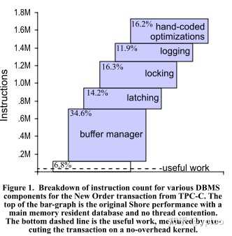

在21世纪初，由于主存容量和性价比的提升，数据库的大部分数据可以缓存在主存中了\[1\]。因此关于内存数据库的讨论的就非常热门，当时有一篇著名的文章（2008-SIGMOD-OLTP Through the Looking Glass, and What We Found There \[2\]）回答了提问者的这个问题：

> 同样是将数据缓存在内存中， 同样支持LRU淘汰，是不是设置了很大的innodb buffer pool之后可以不用redis了？

论文结论表明：直接开辟一个很大的buffer pool，保证所有的页都存储在其中，并不是最有效的方式。更高效的方式是设计memory-oriented的DBMS，这个工作属于当时著名的[H-Store](https://link.zhihu.com/?target=https%3A//hstore.cs.brown.edu/)项目。

论文表示，使用一个足够大的buffer pool是次优的，根本原因在于：**磁盘DBMS的所有模块，即buffer pool结构，日志技术，事务并发，存储模型等等模块，都是面向磁盘页而设计的，因此其首要目标不是减少内存代价，而是I/O代价。**这意味着，采用传统的磁盘DBMS开辟一块很大的buffer pool，能够显著减少磁盘I/O，但是其内存访问代价却并不是最优的选择。

原论文使用朴素的方法测量了磁盘DBMS下数据可以完全存放在buffer pool中的各个模块代价，如下图所示：

如果采用提问者的方法，将分别有34.6%，16.3%和11.9%的指令花费在buffer manager，locking和日志机制上，**如果采用memory-oriented DBMS设计（数据结构和访问模式redesign），buffer manager的代价可以避免，locking和日志的代价可以大大降低，从而达到更优的时间性能。**

  

谢谢！

  

**参考文献：**

\[1\]. H. Garcia-Molina and K. Salem, "Main memory database systems: an overview," in TKDE, vol. 4, no. 6, pp. 509-516, Dec. 1992.

\[2\]. S. Harizopoulos, D. J. Abadi, S. Madden, and M. Stonebraker. 2008. OLTP through the looking glass, and what we found there. In proceeding of SIGMOD'08. Association for Computing Machinery, New York, NY, USA, 981–992.