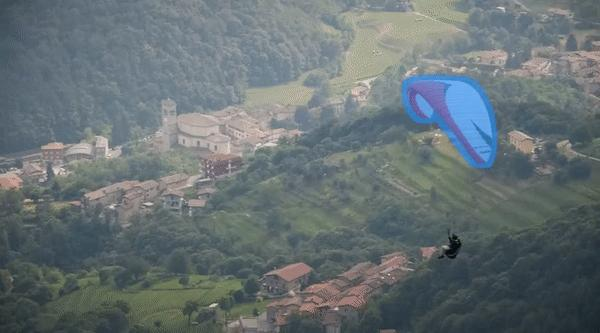

不用这么复杂啊，直接SAM + Tracking + Video Inpainting就能实现自动化抹除ikun。

参考我们的开源项目Inpaint Anything中的Remove Anything Video：）

[https://github.com/geekyutao/Inpaint-Anything](https://link.zhihu.com/?target=https%3A//github.com/geekyutao/Inpaint-Anything)

我可以上个Demo给大家看看：

  

  

  

原理就是，只需要在视频的第一帧点击下要抹除的目标，tracking模型随即开始跟踪目标并输出对应的bounding box；这个bounding box可以作为SAM的prompt实现分割，即得到每一帧的目标mask；有了mask之后，video inpainting模型就可以进行填补了，目标物体随之从视频中抹去。

  

理论上上述方法非常可行有效，但我们做实验下来，发现实际瓶颈在于目前的video inpainting模型的效果不是非常好，导致最后目标移除的效果有限。

有兴趣的朋友可以一起contribute我们的Inpaint Anything项目，目前star数量接近4k，持续更新中：）