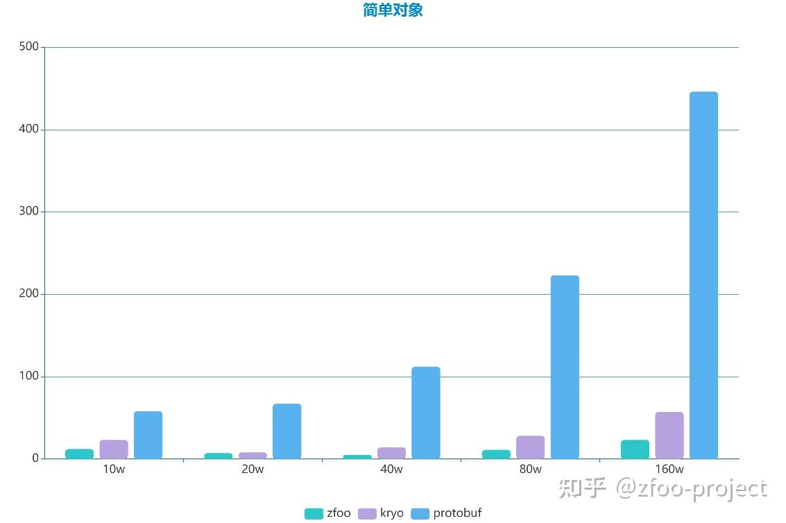
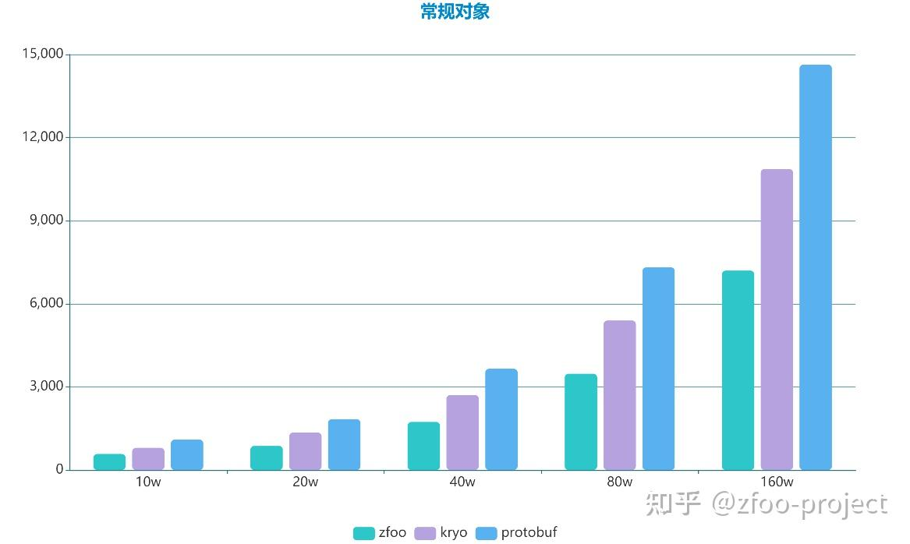
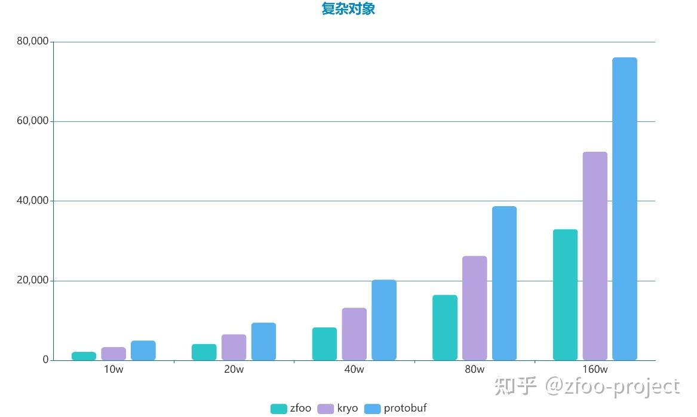

### 因为二进制序列化速度，比字符串序列化快几百倍，序列化后的体积也小几倍。用在通信上即能降低带宽也能提高速度，大大降低了服务器的成本。

### 然后自荐一下我写的Java序列化框架zfoo，比protobuf简洁100倍

-   zfoo protocol是目前的Java二进制序列化和反序列化最快的框架，并且线程安全
-   协议目前原生支持Java Javascript C# Lua，协议理论上可以跨平台
-   主要是用Javassist字节码增强动态生成顺序执行的序列化和反序列化函数，顺序执行的函数可以轻易的被JIT编译以达到极致的性能
-   单线程环境，在没有任何JVM参数调优的情况下速度比Kryo快40%，比Protobuf快110%

[zfoo-project/zfoo](https://link.zhihu.com/?target=https%3A//github.com/zfoo-project/zfoo/tree/main/protocol)

\-------------------------------------------------------------------------------------

2021-05-31，补充回答：

那些说我这套协议不能支持增删字段的，请仔细思考一下，为什么kryo同样不能增删字段却在大量开源项目如spark和dubbo中使用。

我这套即比kryo快，还能跨平台，难道不香吗？

之所以不支持，是因为在我做游戏服务器的项目里确实有场景不需要支持，是做了非常多的权衡的。那些需要支持协议增删字段的，我都是使用spring boot的http。

> 目前的序列化过后对象的大小如下：  
> 简单对象，zfoo包体大小8，kryo包体大小5，protobuf包体大小8  
> 常规对象，zfoo包体大小547，kryo包体大小594，protobuf包体大小984  
> 复杂对象，zfoo包体大小2214，kryo包体大小2525，protobuf包体大小5091  
>   
> 如果考虑支持修改协议类属性名称，必须让字段的读写顺序可控，这就需要注解来标识属性的顺序（protostuff就是这样做的），但是感觉这样不优雅。  
> 如果考虑支持字段增加和减少，需要消耗5%左右的性能（预估），并且增加一倍的包体积大小（写入字段的顺序），感觉不是非常划算。  
> 因为可以通过协议版本号来解决这个问题，所以去支持这样的增删操作动力并不是非常的大。

开源不易，每一个框架都有特定的使用场景，不要妄加评论。

