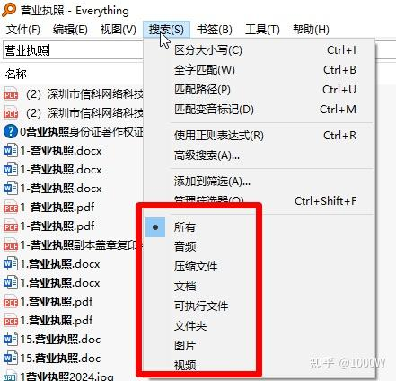
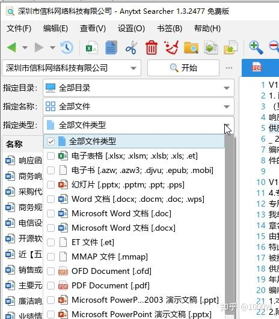
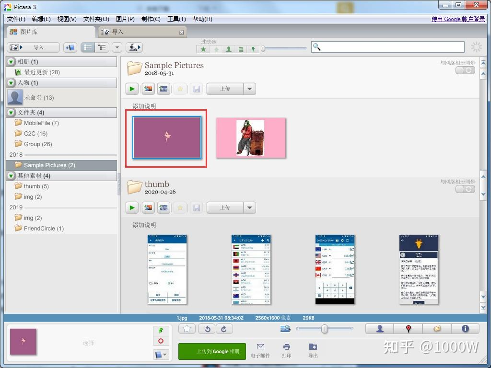

今天我整理了一份**真正实用、体积小、无广告、无需登录**的冷门神器清单。

## 📁 文件搜索：Everything —— 秒搜全盘文件

如果你还在用 Windows 自带的搜索功能，那你真的OUT了。

**Everything** 是一款基于 NTFS 索引的极速文件搜索工具。安装后几秒建完索引，之后输入关键词，**毫秒级返回结果**——哪怕你硬盘里有上百万个文件。

> ✅ 优点：免费、轻量（<2MB）、支持正则、可挂载为服务  
> ⚠️ 注意：仅支持 NTFS 分区（Win 用户基本都满足）  

* * *

## 🔍 文本内容搜索：AnyTXT Searcher —— 全文检索之王

Everything 只能搜文件名？那如果我想找“包含‘项目预算’的 Word 文档”怎么办？

**AnyTXT Searcher** 就是答案。它能对 PDF、Word、Excel、TXT、代码等数十种格式进行**全文内容索引和搜索**，速度惊人。

> ✅ 支持中文分词、OCR（图片内文字识别）、多线程索引  
> 💡 和 Everything 配合使用，堪称本地信息管理双子星  

  

* * *

## 🖼 图片查看：Google Picasa（虽已停更，但依然好用）

虽然 Google 官方早已停止更新 **Picasa**，但它依然是我心中**最轻快、最直观的图片管理器**。启动快、界面清爽、批量处理方便，还能简单修图。

> ✅ 支持 Win10/11（兼容模式运行）  
> ❌ 缺点：不再更新，需自行寻找安装包（注意来源安全）  

* * *

## ▶️ 视频播放：QVOD 精简版？等等，有更好的选择

说实话，**QVOD 已成历史**，且存在安全风险。如今更推荐：

-   **PotPlayer**（韩系神器，解码强、无广告）
-   或 **MPV**（极简命令行播放器，开发者最爱）

但如果你坚持怀旧，务必从可信渠道获取，并断网使用。

* * *

## ⚡ 下载工具：迅雷精简版（5MB，无广告无登录）

原版迅雷臃肿到令人发指，但**民间流传的“迅雷精简版”**（如 XunleiLite）只有 5MB，**去除了所有广告、会员弹窗、后台服务**，只保留核心下载功能。

> ✅ 支持磁力、BT、HTTP  
> ⚠️ 提示：非官方版本，请自行评估安全性  

* * *

## 💻 代码查看：EditPlus（2MB 的临时救星）

临时要看一段 Python 或 HTML 代码？别开 VS Code 了！

**EditPlus** 仅 2MB，启动秒开，支持语法高亮、正则替换、FTP 编辑，是我处理小脚本的首选。

> ✅ 轻量、稳定、支持自定义语言模板  
> 💡 学生党写作业、运维改配置，够用了  

* * *

## 📄 PDF 处理：PDF24 Creator —— 本地全能转换器

需要合并 PDF？转 PDF 为 Word？加水印？加密？

**PDF24** 全部支持，而且**完全离线运行、无需联网、不收集数据、永久免费**。比很多在线工具还强大。

> ✅ 德国开发，注重隐私  
> ✅ 支持虚拟打印机，一键“打印”成 PDF  

* * *

## 🖥 服务器运维：护卫神 vs 宝塔

很多人用宝塔面板，但你知道 **护卫神** 吗？

它是一款国产免费服务器环境部署工具，支持 IIS/Apache/Nginx + PHP + MySQL 一键安装，**无账号体系、无远程监控、资源占用极低**，特别适合老旧服务器或内网环境。

> ✅ 对比宝塔：更轻、更干净、无“云锁”式监控  
> ⚠️ 界面较老，但功能扎实  

* * *

## 🔒 服务器安全：云锁（比安全狗更强？）

在主机防护领域，**云锁**确实比早期的安全狗更稳定、规则更灵活，支持防 CC、防爆破、文件监控等。

> ✅ 免费版功能已足够中小企业使用  
> ❗ 但注意：任何安全软件都可能引入性能开销，按需启用  

* * *

## 💾 磁盘分析：TreeSize Free —— 看清谁在吃你的硬盘

C 盘又红了？**TreeSize** 用可视化树状图告诉你：哪个文件夹占了最多空间，连隐藏的系统缓存都不放过。

> ✅ 免费版足够日常使用  
> ✅ 支持右键集成，一键扫描当前目录  

* * *

## 🎨 图片处理：Photoshop CS3（50MB 的奇迹）

别笑！**PS CS3 精简版**仅 50MB，却支持图层、滤镜、通道等核心功能，**完美兼容 Win10/11**，处理简单修图、切图、海报完全够用。

> ✅ 启动快、不吃内存  
> ⚠️ 非 Adobe 官方版本，请注意版权与安全  

* * *

## 📝 办公套件：WPS 英文版（60MB，真·无广告）

你没看错——**WPS 国际版（英文界面）几乎没有广告**！体积小、启动快、兼容性好，导出 PDF 也不加水印。

> ✅ 适合只想安静写文档的人  
> 💡 切换语言后，广告模块大幅减少  

* * *

## 📤 局域网传输：飞鸽传书（200KB 的古董神器）

两台电脑在同一网络？**飞鸽传书**（FeiQ）仅 200KB，打开即用，拖文件就传，**无需安装、不依赖互联网**。

> ✅ 内网传大文件比微信/QQ 快十倍  
> ⚠️ 注意防火墙设置  

* * *

## 🌐 建站系统：TXTcms（500KB 的企业级 CMS）

你没看错，**500KB** 的 PHP CMS 系统，支持栏目、文章、SEO、模板，适合搭建小型官网或内部知识库。

> ✅ 极简、无数据库依赖（用文本存储）  
> ✅ 适合新手学习或轻量部署  

* * *

## 🗜 解压工具：7-Zip（200KB，开源免费）

**7-Zip** 是唯一值得推荐的解压缩软件。开源、无广告、支持 ZIP/RAR/7z/TAR 等几乎所有格式，还能加密压缩。

> ✅ 比 WinRAR 更干净，比 Bandizip 更安全  
> ✅ 右键集成，操作流畅  

* * *

## 🌐 浏览器彩蛋：Edge —— “下载其他浏览器的浏览器”

微软 Edge 如今确实好用，但网友调侃它最大的作用是：“**用来下载 Chrome 或 Firefox**”。

不过话说回来，Edge 在 PDF 阅读、内存管理、兼容性上进步巨大，值得一试。

* * *

## 🔎 搜索引擎：Yandex —— 俄罗斯的“万能搜”

**Yandex** 是俄罗斯的 Google，但它有个神奇之处：**能搜到很多 Google 和百度找不到的内容**，尤其是学术资料、冷门资源、甚至某些被屏蔽的页面。

> ⚠️ 但请注意：**不建议长期使用**，涉及隐私和地缘政治风险  
> 💡 偶尔应急可以，别设为主页  

\-------以上为修改后版本，以下为原文------

everything，最强文档搜索。

anytext，最强文本搜索。

Google picasa，图片查看器。

qvod，播放器。

迅雷精简版，5M，无登录、无广告。

editplus，2M，临时代码查看。

pdf24，本地格式转换软件、不连网、无登录、免费。

护卫神，服务器维护、环境搭建，无登录、免费，比宝塔强。

云锁，服务器安全，比安全狗强大。

treesize，磁盘所有文件夹、文档的容量查看。

Photoshop CS3，50M，图片处理，支持win10。

WPS英文版，60M，无广告。

飞鸽传书，200KB，局域网传输。

TXTcms，500KB的企业级网站CMS系统。

7zip，200KB，免费、无广告解压缩软件。

edge，继IE后，他成为了下载其他浏览器的浏览器。

Yandex，万能搜索引擎，啥都能搜到，不建议长期使用。