注意：我这里推荐的并不是阅读源码，仅推荐个人学习和使用。

也可以参考https://github.com/tuyucheng777/awesome-java

首当其冲的必须是Google Guava，提供集合、并发、缓存、数学工具类

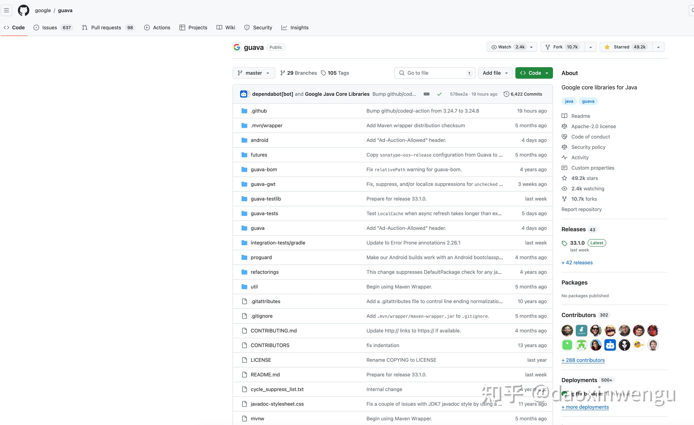

Eclipse Collection是一个高性能的集合库，高盛银行开源

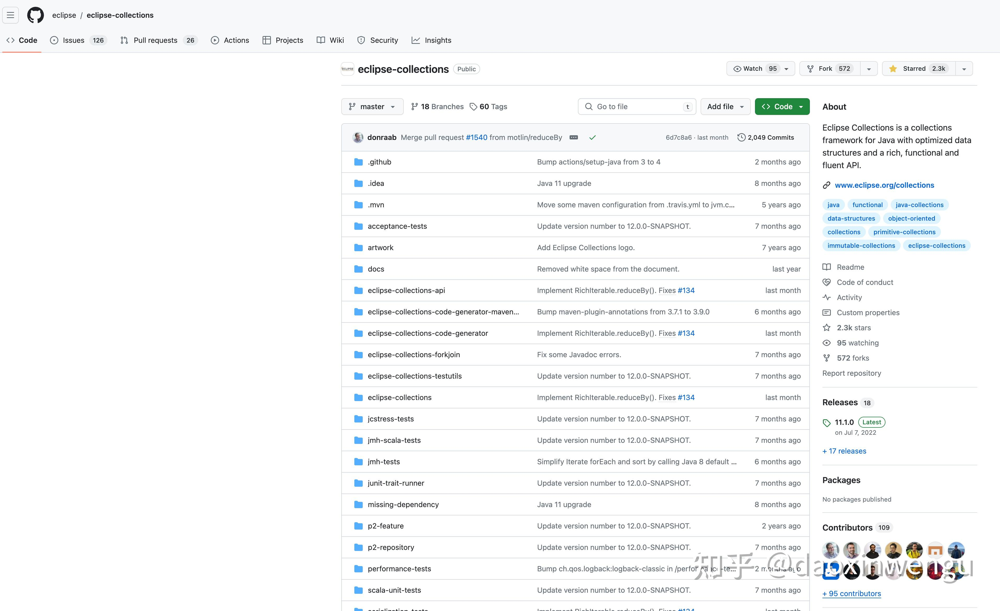

苹果开源的配置语言Pkl

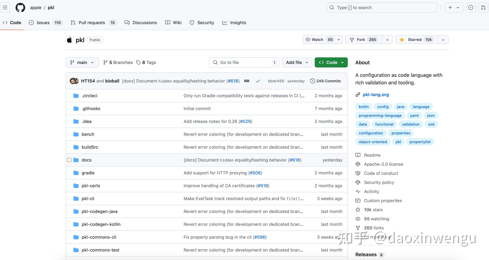

JUnit-Pioneer是一个JUnit 5扩展，提供很多方便的JUnit 5 Extension

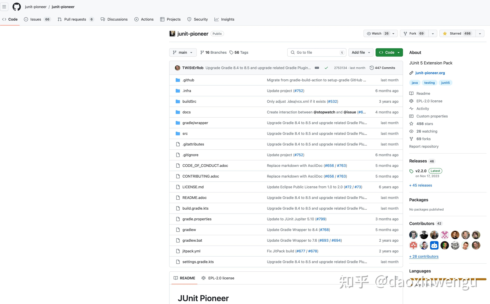

Mockito是一个Mock框架

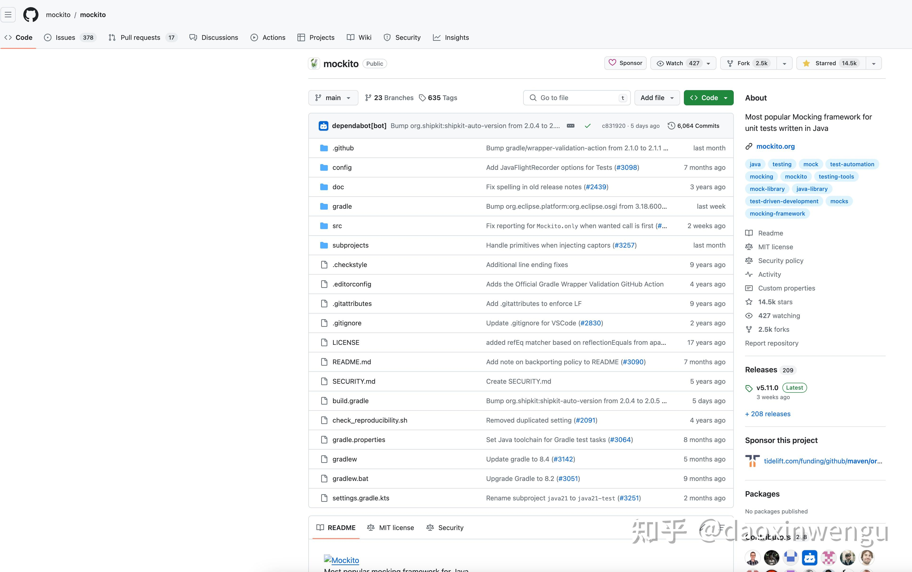

Disruptor是一个高性能的无锁队列

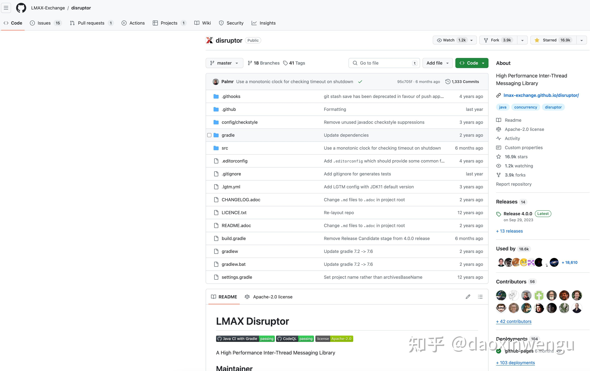

Vavr是一个Java 8函数编程库

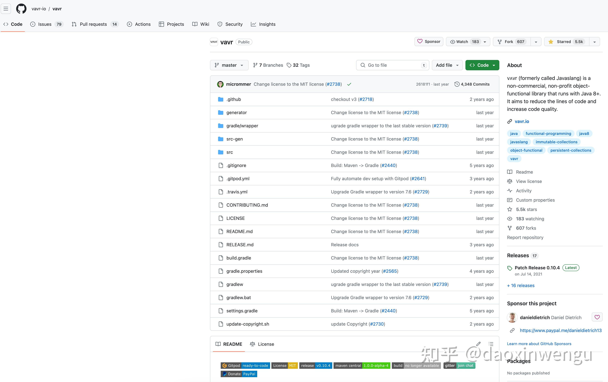

CAS是一个SSO库

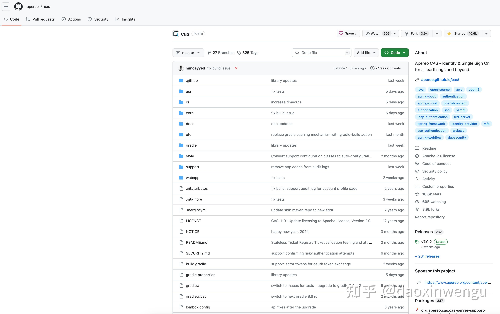

NullAway是一个工具库，减少NPE

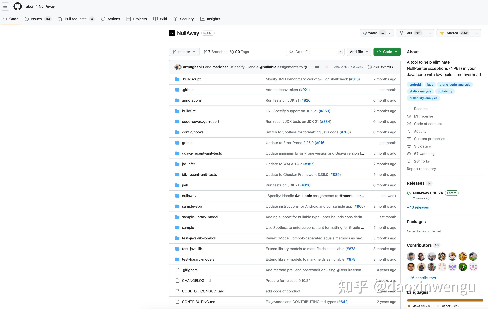

Instancio是一个测试数据Mock库

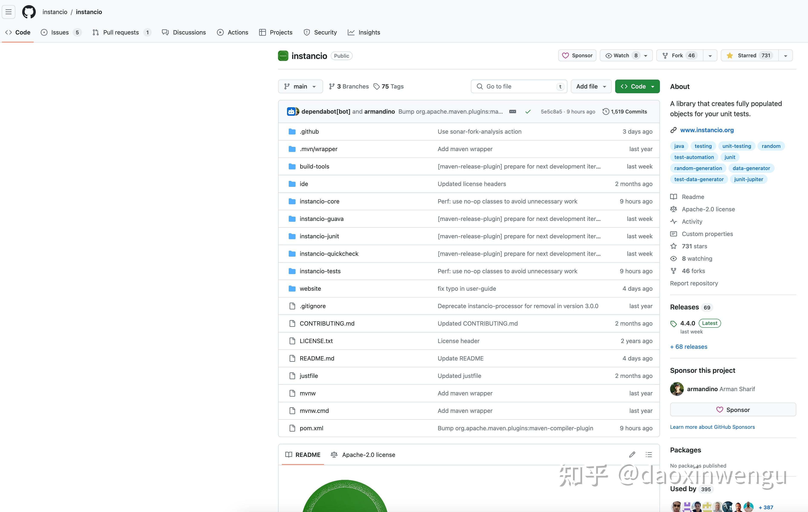

TestContainer允许在测试中启动、访问Docker容器

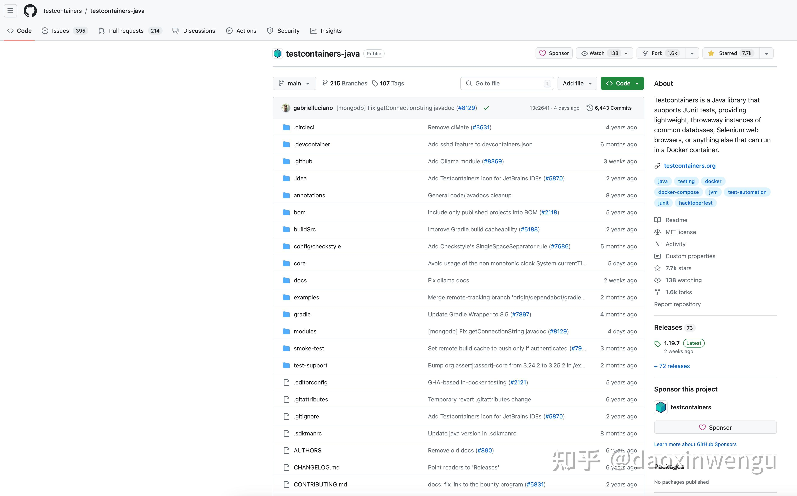

Caffeine高性能缓存库

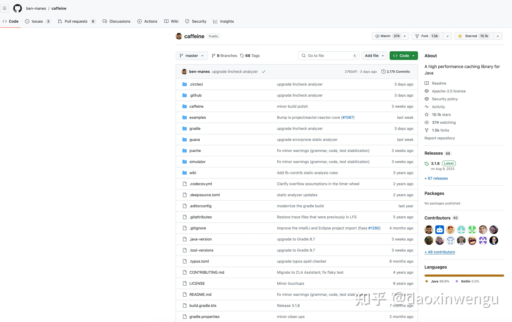

苹果封装Netty的网络框架Servicetalk

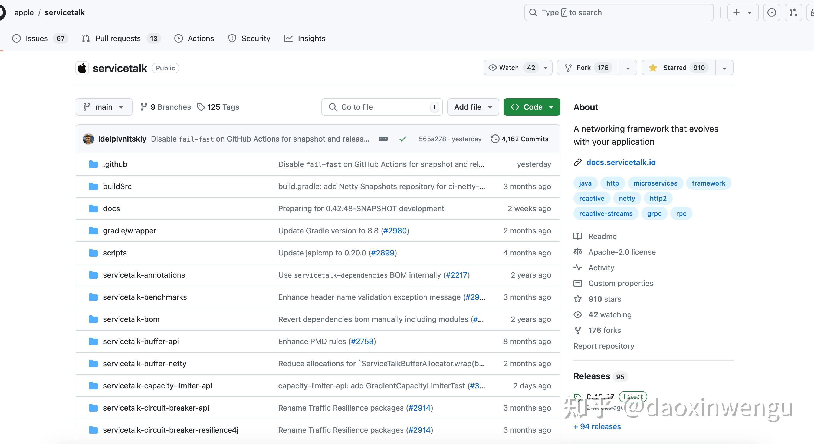

\------------------------------------------8/13修改-------------------------------------------------

测试相关：

\[JUnit 5\]([https://github.com/junit-team/junit5](https://link.zhihu.com/?target=https%3A//github.com/junit-team/junit5))：单元测试框架

\[AssertJ\]([https://github.com/assertj/assertj](https://link.zhihu.com/?target=https%3A//github.com/assertj/assertj))：测试断言库

\[RestAssured\]([https://github.com/rest-assured/rest-assured](https://link.zhihu.com/?target=https%3A//github.com/rest-assured/rest-assured))：API接口测试库

\[Pact\]([https://github.com/pact-foundation/pact-jvm](https://link.zhihu.com/?target=https%3A//github.com/pact-foundation/pact-jvm))：契约测试库

\[JsonPath\]([https://github.com/json-path/JsonPath](https://link.zhihu.com/?target=https%3A//github.com/json-path/JsonPath))：JsonPath的Java实现

\[Cucumber\]([https://github.com/cucumber/cucumber-jvm](https://link.zhihu.com/?target=https%3A//github.com/cucumber/cucumber-jvm))：BDD框架

\[Karate\]([GitHub - karatelabs/karate: Test Automation Made Simple](https://link.zhihu.com/?target=https%3A//github.com/karatelabs/karate))：BDD框架

\[Selenium\]([https://github.com/SeleniumHQ/selenium](https://link.zhihu.com/?target=https%3A//github.com/SeleniumHQ/selenium))：BDD自动化测试框架

\[Selenide\]([https://github.com/selenide/selenide](https://link.zhihu.com/?target=https%3A//github.com/selenide/selenide))：Selenium的封装

\[Gatling\]([https://github.com/gatling/gatling](https://link.zhihu.com/?target=https%3A//github.com/gatling/gatling))：编程式的负载测试框架

\[Wiremock\]([https://github.com/wiremock/wiremock](https://link.zhihu.com/?target=https%3A//github.com/wiremock/wiremock))：接口Mock库

\[Spock\]([https://github.com/spockframework/spock](https://link.zhihu.com/?target=https%3A//github.com/spockframework/spock))：包含单测、断言、Mock功能的框架

\[Microcks\]([https://github.com/microcks/microcks](https://link.zhihu.com/?target=https%3A//github.com/microcks/microcks))：微服务Mock工具

\[Awaitility\]([https://github.com/awaitility/awaitility](https://link.zhihu.com/?target=https%3A//github.com/awaitility/awaitility))：测试异步程序的库

开发框架：

\[Quarkus\]([https://github.com/quarkusio/quarkus](https://link.zhihu.com/?target=https%3A//github.com/quarkusio/quarkus))：更现代的微服务、云框架，红帽开源

\[Micronaut\]([https://github.com/micronaut-projects/micronaut-core](https://link.zhihu.com/?target=https%3A//github.com/micronaut-projects/micronaut-core))：JVM微服务框架，Oracle开源

\[Dropwizard\]([https://github.com/dropwizard/dropwizard](https://link.zhihu.com/?target=https%3A//github.com/dropwizard/dropwizard))：构建Restful接口的Web框架，Yammer开源

\[Ktor\]([https://github.com/ktorio/ktor](https://link.zhihu.com/?target=https%3A//github.com/ktorio/ktor))：Kotlin中构建异步微服务的轻量级框架

\[[http://Rest.li](https://link.zhihu.com/?target=http%3A//Rest.li)\]([https://github.com/linkedin/rest.li](https://link.zhihu.com/?target=https%3A//github.com/linkedin/rest.li))：REST框架、领英开源

\[Javalin\]([https://github.com/javalin/javalin](https://link.zhihu.com/?target=https%3A//github.com/javalin/javalin))：轻量级Java、Kotlin框架

\[Blade\]([https://github.com/lets-blade/blade](https://link.zhihu.com/?target=https%3A//github.com/lets-blade/blade))：轻量级的MVC框架

\[Primefaces\]([https://github.com/primefaces/primefaces](https://link.zhihu.com/?target=https%3A//github.com/primefaces/primefaces))：开发JSF应用的UI库

\[Helidon\]([https://github.com/helidon-io/helidon](https://link.zhihu.com/?target=https%3A//github.com/helidon-io/helidon))：虚拟线程上的微服务框架，Oracle开源

\[JHipster\]([https://github.com/jhipster/generator-jhipster](https://link.zhihu.com/?target=https%3A//github.com/jhipster/generator-jhipster))：前后端全栈框架

\[Hilla\]([https://github.com/vaadin/hilla](https://link.zhihu.com/?target=https%3A//github.com/vaadin/hilla))：支持React/Web组件的全栈框架

\[Akka\]([https://github.com/akka/akka](https://link.zhihu.com/?target=https%3A//github.com/akka/akka))：Actor模型的异步框架

\[Vert.X\]([https://github.com/eclipse-vertx/vert.x](https://link.zhihu.com/?target=https%3A//github.com/eclipse-vertx/vert.x))：响应式框架

\[Camel\]([https://github.com/apache/camel](https://link.zhihu.com/?target=https%3A//github.com/apache/camel))：开发企业级集成模式的框架

\[Armeria\]([https://github.com/line/armeria](https://link.zhihu.com/?target=https%3A//github.com/line/armeria))：Netty创始人推出的微服务框架，可以使用Spring Boot、gRPC、Dropwizard等不同技术开发

AI框架：

\[LangChain4j\]([https://github.com/langchain4j/langchain4j](https://link.zhihu.com/?target=https%3A//github.com/langchain4j/langchain4j))：Java版Langchain

\[Semantic Kernel\]([https://github.com/microsoft/semantic-kernel-java](https://link.zhihu.com/?target=https%3A//github.com/microsoft/semantic-kernel-java))：将LLM技术快速轻松地集成到基于Java的应用程序中，微软开发

\[Spring AI\]([https://github.com/spring-projects/spring-ai](https://link.zhihu.com/?target=https%3A//github.com/spring-projects/spring-ai))：Spring生态里的AI框架

\[Spring AI Alibaba\](*[https://github.com/alibaba/spring-ai-alibaba](https://link.zhihu.com/?target=https%3A//github.com/alibaba/spring-ai-alibaba)*)：Java Agentic AI框架

\[Agents Flex\]([https://gitee.com/agents-flex/agents-flex](https://link.zhihu.com/?target=https%3A//gitee.com/agents-flex/agents-flex))：基于Java的LLM应用开发框架以及智能体流程编排框架

  
\[FIT Framework\]([https://github.com/ModelEngine-Group/fit-framework](https://link.zhihu.com/?target=https%3A//github.com/ModelEngine-Group/fit-framework))：Java企业级AI开发框架

\[JoyAgent\]([https://github.com/jd-opensource/joyagent-jdgenie](https://link.zhihu.com/?target=https%3A//github.com/jd-opensource/joyagent-jdgenie))：京东开源的端到端产品级通用智能体

\[Embabel\]([https://github.com/embabel/embabel-agent](https://link.zhihu.com/?target=https%3A//github.com/embabel/embabel-agent))：Spring创始人开源的JVM代理框架

\[Koog\]([https://github.com/JetBrains/koog](https://link.zhihu.com/?target=https%3A//github.com/JetBrains/koog))：JetBrains开源的Kotlin/JVM代理开发框架

\[ADK Java\]([https://github.com/google/adk-java](https://link.zhihu.com/?target=https%3A//github.com/google/adk-java))：谷歌开源的Java代理开发工具包

\[Tinyflow\]([https://gitee.com/tinyflow-ai/tinyflow](https://link.zhihu.com/?target=https%3A//gitee.com/tinyflow-ai/tinyflow))：Tinyflow是一个轻量的AI智能体流程编排解决方案

\[LangGraph4j\]([https://github.com/langgraph4j/langgraph4j](https://link.zhihu.com/?target=https%3A//github.com/langgraph4j/langgraph4j))：Java版LangGraph

\[Ali LangEngine\]([https://github.com/AIDC-AI/Agentic-ADK](https://link.zhihu.com/?target=https%3A//github.com/AIDC-AI/Agentic-ADK))：阿里巴巴LangEngine是一个用Java编写的AI应用开发框架

\[JLama\]([https://github.com/tjake/Jlama](https://link.zhihu.com/?target=https%3A//github.com/tjake/Jlama))：Java的现代LLM推理引擎

\[Llama3.java\]([https://github.com/mukel/llama3.java](https://link.zhihu.com/?target=https%3A//github.com/mukel/llama3.java))：Java中的实用Llama 3推理

其他库：

\[P6spy\]([https://github.com/p6spy/p6spy](https://link.zhihu.com/?target=https%3A//github.com/p6spy/p6spy))：非侵入的SQL跟踪库

\[Async-HTTP-Client\]([https://github.com/AsyncHttpClient/async-http-client](https://link.zhihu.com/?target=https%3A//github.com/AsyncHttpClient/async-http-client))：异步HttpClient

\[MapStruct\]([https://github.com/mapstruct/mapstruct](https://link.zhihu.com/?target=https%3A//github.com/mapstruct/mapstruct))：基于注解处理器的Bean映射工具

\[Camunda\]([https://github.com/camunda/camunda-bpm-platform](https://link.zhihu.com/?target=https%3A//github.com/camunda/camunda-bpm-platform))：更现代化的BPM工具

\[gRP\]([https://github.com/grpc/grpc-java](https://link.zhihu.com/?target=https%3A//github.com/grpc/grpc-java))：gRPC Java实现

\[gRPC-Boot-Starter\]([https://github.com/LogNet/grpc-spring-boot-starter](https://link.zhihu.com/?target=https%3A//github.com/LogNet/grpc-spring-boot-starter))：个人(非官方)开发的gRPC Spring Boot Starter

\[Ebean\]([https://github.com/ebean-orm/ebean](https://link.zhihu.com/?target=https%3A//github.com/ebean-orm/ebean))：比较简单的ORM库

\[Coroutines\]([https://github.com/Kotlin/kotlinx.coroutines](https://link.zhihu.com/?target=https%3A//github.com/Kotlin/kotlinx.coroutines))：Kotlin协程

\[Quasar\]([https://github.com/puniverse/quasar](https://link.zhihu.com/?target=https%3A//github.com/puniverse/quasar))：Java协程库

\[FXGL\]([https://github.com/AlmasB/FXGL](https://link.zhihu.com/?target=https%3A//github.com/AlmasB/FXGL))：JavaFX游戏引擎

\[RxJava\]([https://github.com/ReactiveX/RxJava](https://link.zhihu.com/?target=https%3A//github.com/ReactiveX/RxJava))：响应式框架

\[RSocket\]([https://github.com/rsocket/rsocket-java](https://link.zhihu.com/?target=https%3A//github.com/rsocket/rsocket-java))：RSocket的Java实现

\------------------------------------------8/14修改-------------------------------------------------

\[Manifold\]([https://github.com/manifold-systems/manifold](https://link.zhihu.com/?target=https%3A//github.com/manifold-systems/manifold))：一个比较有趣的语法糖库，提供扩展方法、运算符重载、字符串模板、元编程等功能，这是一个编译期插件

\[Pulsar\]([https://github.com/apache/pulsar](https://link.zhihu.com/?target=https%3A//github.com/apache/pulsar))：新一代消息处理平台