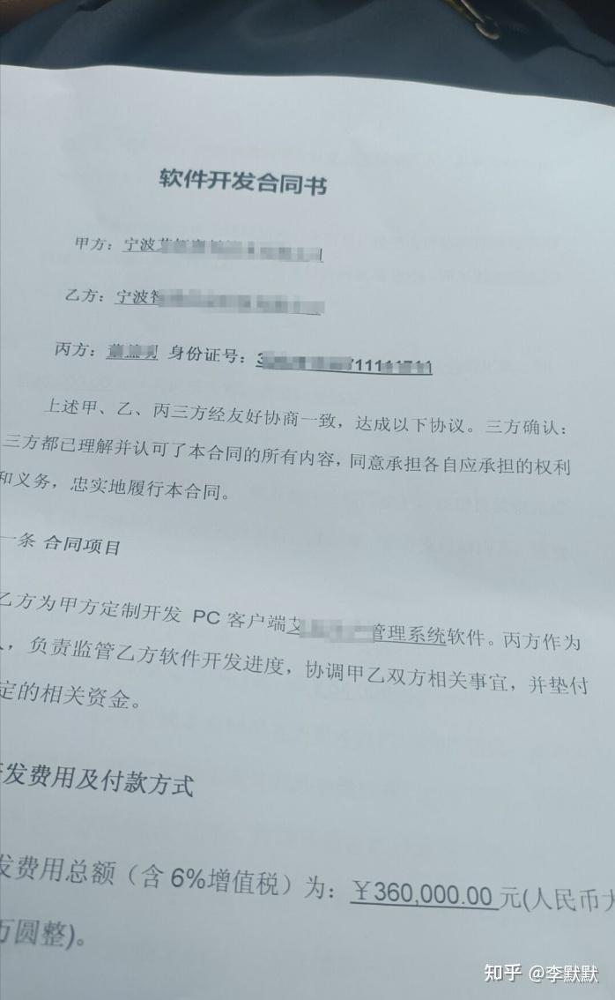
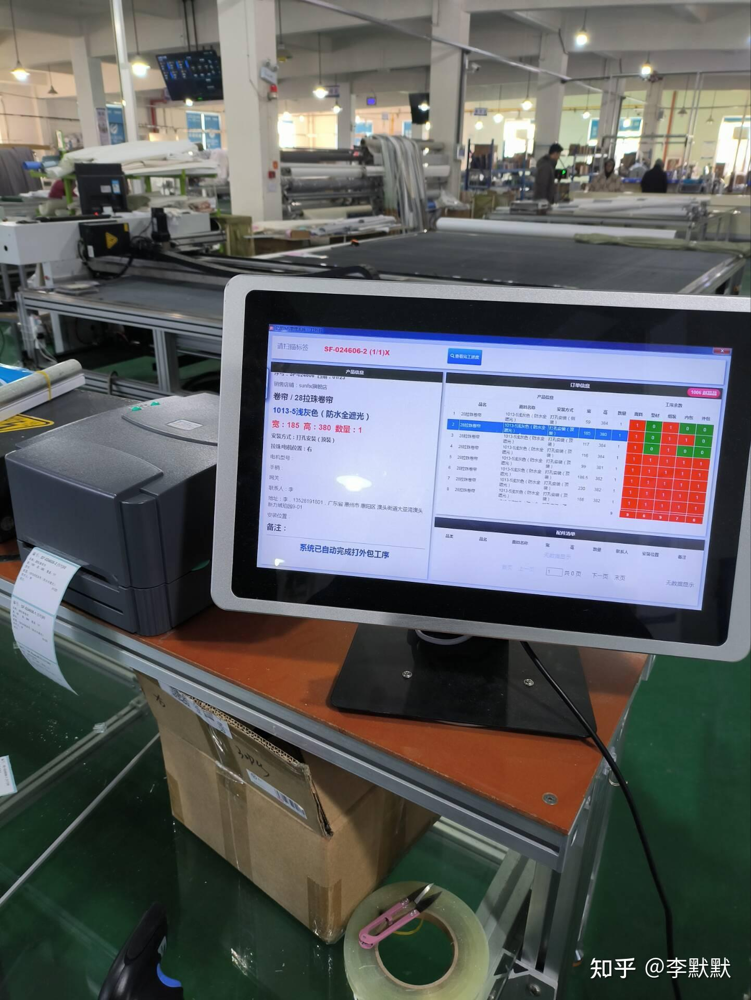

必须推荐 [Enhancer + ONENESS](https://link.zhihu.com/?target=http%3A//enhancer.io)，现在有很多独立开发者用它接业务，年入十几个甚至上百个W。成本优势摆在那里。不要只盯着互联网，大把大把的企业、工厂需要数字化系统，又不能像互联网公司动辄几千万上亿打造一套系统。如果能用几十万的预算把这个需求满足好，这里面有巨大的市场。

我一个大学师兄，毕业五年后自己出来单干，专门给他老家宁波慈溪的企业提供数字化方案，那边的小家电企业，一片一片的，这哥们连续几年一个人每年可以交付 5 到 8 个项目，每个项目差不多20w-60w，每年的服务费还要另外收取。

这是系统用在生产线的样子，功能上基本都是增、删、改、查，界面很简陋，但是工厂不看 UI：

这只是其中一个项目。我问他怎么可能一个人写出这么多项目，他说以前肯定不行，因为每个项目需求都不一样，虽然都是要管销售、采购、生产、仓库、财务，但每个环节及其上下关联都要定制化，工作量特别大，一年到头可能也弄不了一个项目。但是现在这个 enhancer 平台开发工具，专门就是搞这种定制化的，特别方便，一个30w的项目，纯开发时间可能就 20 天左右，而且很多都有现成模板可以复制来改，项目越多，速度越快。

我又问他，为什么能接到这么多项目，你是怎么销售的？他说，一旦你接到第一单，那么每个工厂都会有上下游供应商，他们会相互推荐的，都希望自己的客户和供应链更强更先进嘛。而且现在正好国家对制造业搞数字化项目有补贴，很多工厂为了评上智能制造先进企业申请补贴，对于做系统都非常积极。比如：

[关于2025年度卓越级智能工厂项目的公示](https://link.zhihu.com/?target=https%3A//mp.weixin.qq.com/s/QW70Gh-CTQUypSYQZqB64g)

[湖北省经信厅关于公布智能工厂梯度培育2025年度第二批先进级智能工厂名单的通知](https://link.zhihu.com/?target=https%3A//mp.weixin.qq.com/s/jJ4ruURKmc4Bf0FxSRuxtg)

[关于2024年浙江省未来工厂、智能工厂和数字化车间名单的公示](https://link.zhihu.com/?target=https%3A//mp.weixin.qq.com/s/stUKIdaaLxY0Byo7SH4WpA)

所以，不要只盯着互联网，这个领域已经严重饱和内卷了！不要只盯着互联网！