## 第一款，IPMAC。

IPMAC是一款可以快速搜索和扫描你们宿舍、办公室、公司局域网内设备的IP地址及MAc地址的小工具.

IPMAC仅仅74K，小巧的离谱，而且是免安装、即打即用。广告？更是不存在的！！

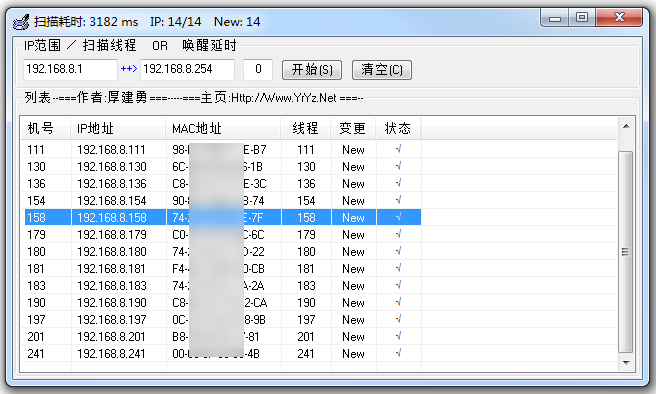

IPMAC是一个大神开发的小工具，它利用ARP请求原理及多线程扫描，输入IP扫描范围，点击开始，它就能快速扫描到局域网内所有设备的IP地址和MAC地址。

并且！！它还可以保存和导出列表，实乃是网工必备神器。

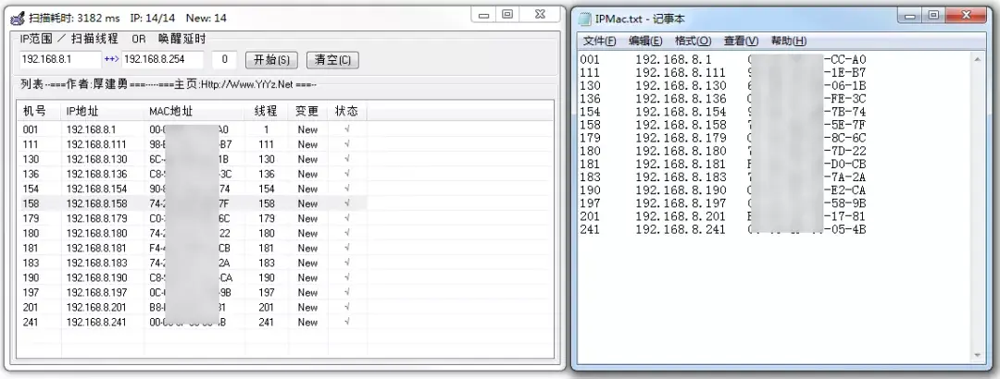

最后，还是老规矩：搜索微信订阅号 **晓技术**，然后回复 **1125**，就能一键获取以上神器。

  

## 第二款，AI lossless zoomer。

AI lossless zoomer使用了腾讯开源的AI算法，可以将模糊的、有锯齿和马赛克的低分辨率图片进行无损放大，帮助我们看清图片、提高图片质量。

这款软件主要用于人像处理，尤其擅长处理二次元动漫图片。

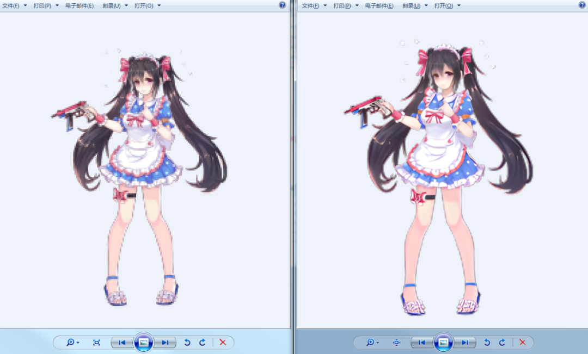

AI lossless zoomer虽然算不上小巧（68.5M），但使用起来特别简单，几乎0门槛：将图片拖拽到操作区，点击开始任务，数秒即可完成图片的修复。处理好后，会自动弹出修复好的文件所在目录。

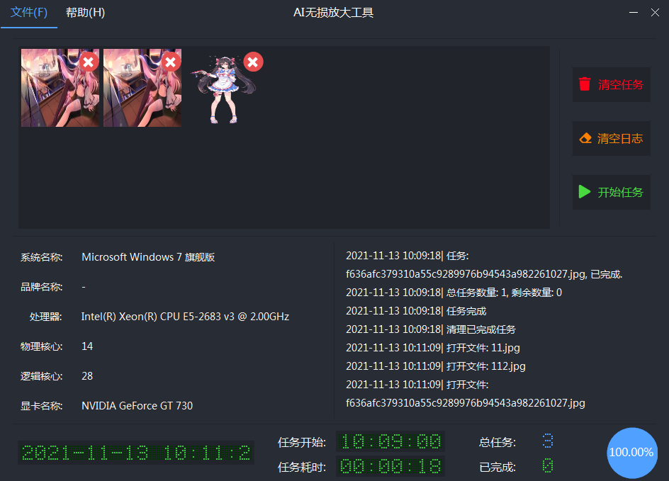

此外，AI lossless zoomer支持批量处理操作，多张照片一齐无损修复。搜索微信订阅号 **晓技术** ，回复 **1113**，就能一键获取AI lossless zoomer的安装包。

  

## 第三款，Spacedesk。

Spacedesk是一款投屏软件，它可以将电脑屏幕投屏到闲置的手机、废弃的平板、多余的iPad上，从而实现多屏协作。

最最最值得称赞的是，Spacedesk是可以破次元壁的！它可以将Windows系统投屏到iOS手机、安卓设备、iPad、iMac上，没有所谓生态的限制。只要你的两台设备处于同一个网络环境下，你就可以实现屏幕扩展。

  

Spacedesk仅仅5.5M，支持所有的Windows系统；安卓手机、iOS手机也都有它的App。它的上手方式也十分简单，几乎为0。

先在主设备上运行Spacedesk，界面如下。可以看到，Spacedesk的状态（ON/OFF），IP地址，连接设备数量......

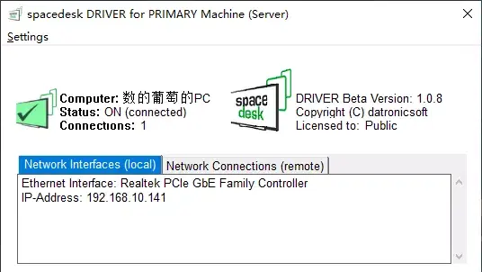

然后，在子设备上运行Spacedesk，界面如下。可以看到，它连接到的电脑，点击列表中的一个，瞬间连接，相当开心。

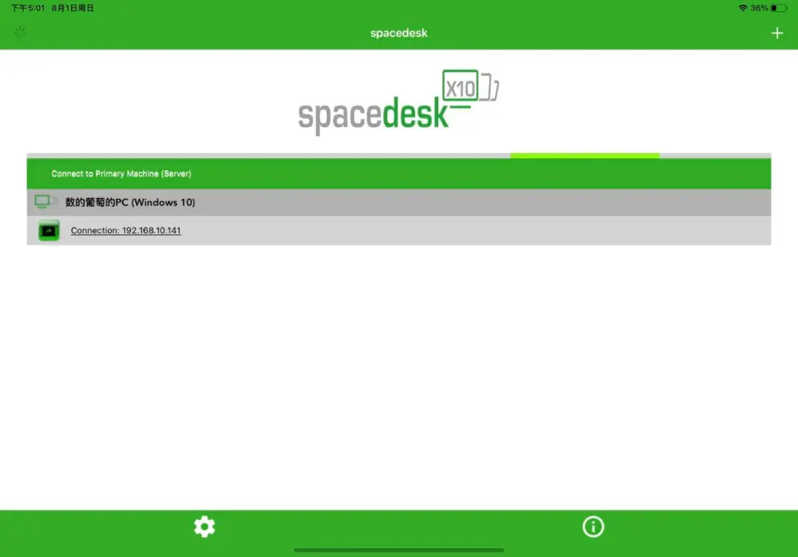

更牛批的是，Spacedesk支持鼠标跨屏使用，你可以用鼠标控制iPad的屏幕；Spacedesk也支持触屏，你可以在iPad上拖拽电脑上打开的页面、放大或缩小。好用到离谱。

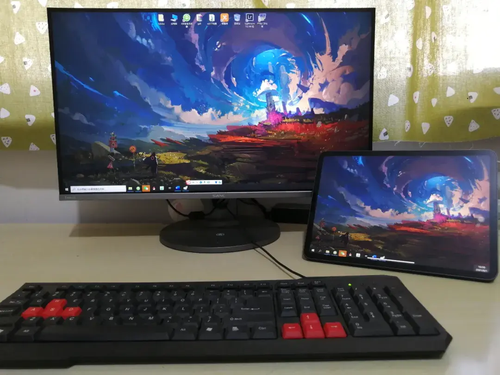

在微信订阅号 **晓技术** ，对话框发送 **投屏**，就能一键获取这款神器（win8/win10系统的）。

## 第四款，PTGui。

PTGui是一款「 接片 」软件，它可以将多张照片拼接成一张视野超广、超震撼的全景图。并且，它的上手难度几乎为0，拿起来就能用。

先来看看它的效果（横屏观看）。这些照片都是在乌兰哈达火山群拍摄，后期用PTGui接片，这比广角镜头香多了。

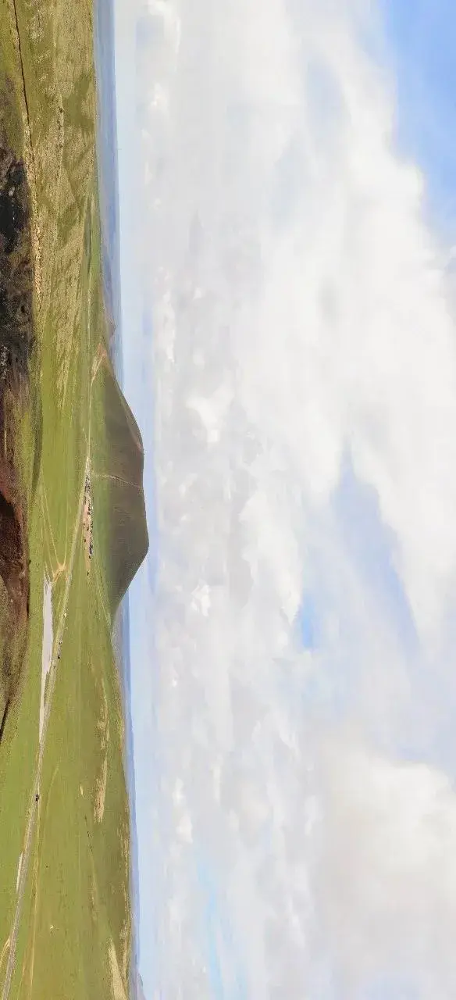

和那些巨无霸软件一比，PTGui并不大，只有不到19.5M，支持所有的Windows系统。用PTGui接片，只需3步：导入照片，自动对齐，生成全景图。

除了第一步需要你把冰箱门儿打开，后面的操作都是软件自动分析、自动完成的。既傻瓜、又强大。

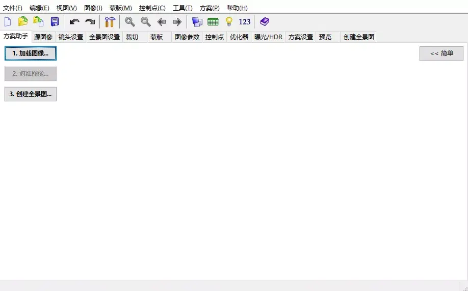

箭头所指就是合成后的全景图，1611-1618是上下两排、一排4张的前期图。

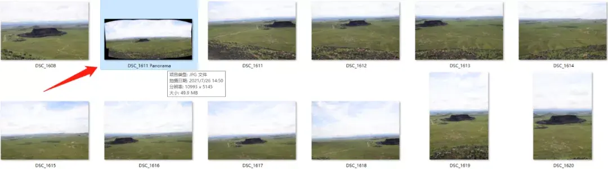

此外，PTGui还是制作720°全景照片的大杀器，它的功能相当硬核，你可以慢慢探索。对了，英文不好的小伙伴儿请认准PTGui汉化版。

搜索订阅号 **晓技术** ，发送 **0729**，就能一键获取这款神器。

  

## 第五款**，洛雪音乐助手**。

它是一款界面简洁、功能专一的音乐播放和下载工具，不同于网抑云、QQ音乐、酷狗…这些动辄就收费的软件，洛雪音乐助手聚合了海量的音乐平台，并抓取了海量的歌曲资源，无需VIP、没有广告、不用试听，用户就可以实现听歌自由，也可免费下载，真正的好用不火。

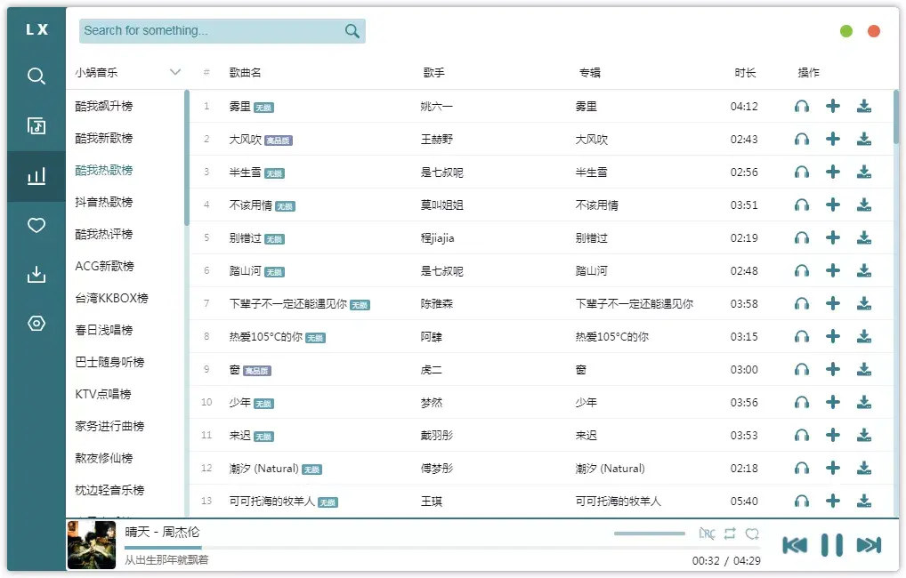

  

## 第六款**，哔哩下载姬**。

这款软件才853KB，却十分有用；它可以毫无压力地下载B站上的视频，用户只需要输入B站视频的播放地址，即使是4K画质的视频也能轻松下载。

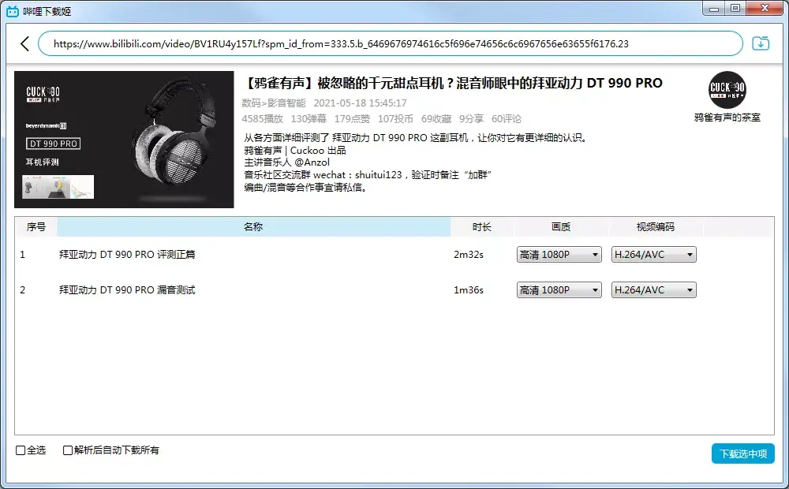

此外，这款软件还支持音视频分离，用户可以轻松提取到.acc格式的音频；对了，哔哩下载姬还能去水印，不过、它采取的是裁切画面的方式消除水印。

搜索微信订阅号 **晓技术** ，然后回复 **0616**，就能一键获取第4和5款软件的安装包。