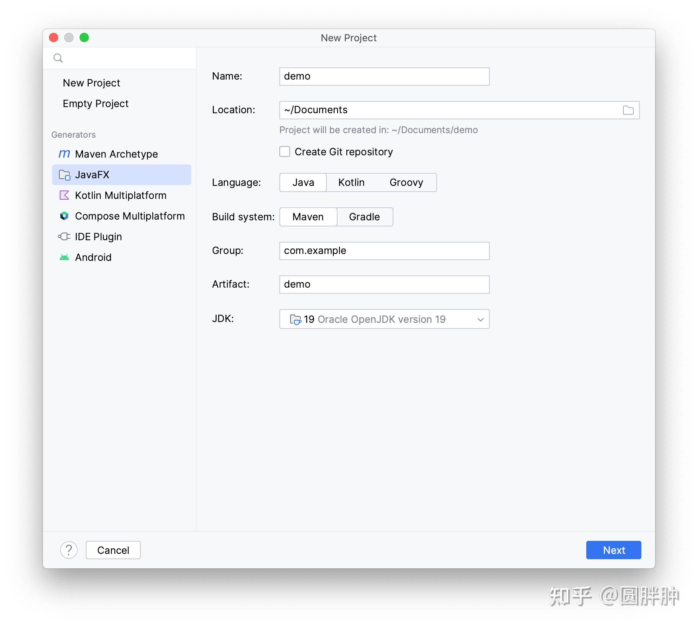
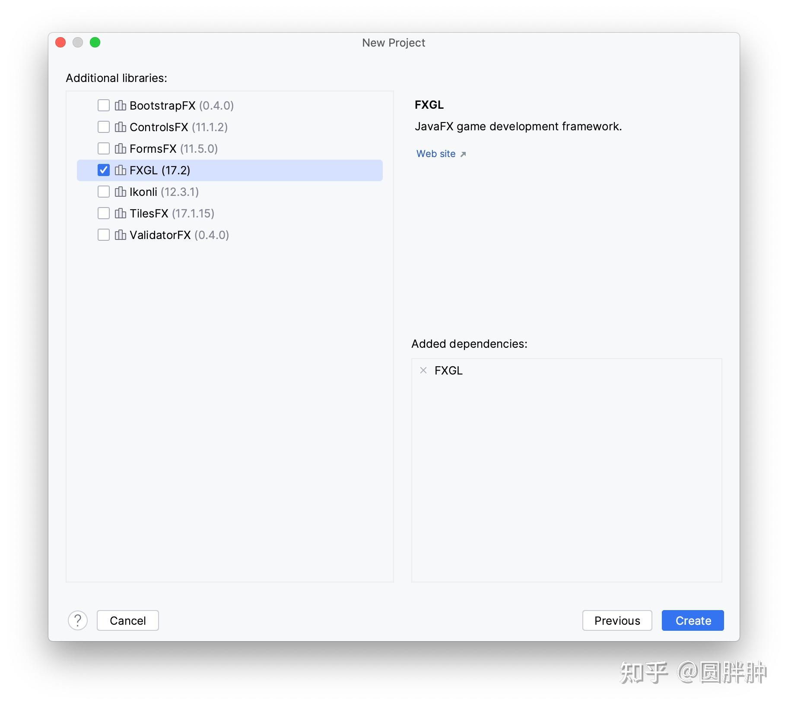

诶哟，让我意外的是，这么多回答推荐了javafx，看来同学们都有认真写代码呀

先正面回答问题，推荐：javafx，尤其是你只会java的前提下

具体原因如下

swing确实已经过时，官方发布javafx，其本意就是用来替代swing

后来因为java自身要模块化，所以javafx被剥离出jdk，单独成为一个项目

但是为了兼容历史代码，所以awt和swing两个老的gui模块，依旧被放在jdk中，跟着jdk一起下发

swing所在的模块叫做desktop，jdk.desktop.jmod，你下载的jdk里面，jmod也就是模块这个目录下，就可以找到这个模块

swing的功能基本上不再继续发展了，就是维持现有功能，并做最底程度的维护为主

swing和awt已经很多年，没有新增功能了

相比之下，javafx在最近的版本中，依旧在新增功能和api，比如最新的20，就在property这个类中新增了when这个函数，之前19加了map和flat map

很明显，现在官方的重点是放在javafx上了

然后官方性质的下载站点上，javafx跟jdk，还有jmc等工具放在一起，供用户免费下载，当然你可能不需要这么干，等下我会说，一般我们是怎么做的，如果后面panama毕业了，那么这里还会新增jextract工具下载，因为jextract很大，而且需要依赖llvm

网站在这里：[JDK Builds from Oracle](https://link.zhihu.com/?target=https%3A//jdk.java.net/)

jdk点java点net，看这个域名就知道了，现在有一种流传的说法说是oracle想把javafx再要回去，放在jdk里面，一起下载，well，不知道这个传言是真是假，但是开源的工具，有不少啊，一开始被开放出来，后来又被要了回去，比如ibm的openj9，本来说好，给adoptopenjdk的，后来又被ibm要了回去，可能ibm觉得，哎哟，openj9做得不错嘛，内存占用还挺小的，有价值哦，所以就又要回去，不给adoptopenjdk了

所以现在javafx虽然还是独立于jdk的项目，但是java上gui的开发重点，都放在了javafx上了，swing维持最底层度的维护就是了，已经多年没有新功能增加了，但是bug修复一直在进行，java就这点做得好，很多老的工具，他们还在持续维护

然后说一下怎么用javafx

你会java的话，其实javafx用起来相当容易

你写java代码，你多半需要一个好用的开发工具，也就是ide，一般推荐jetbrains的intellij idea的社区版，社区版免费，而且功能少，收费的终极版新增的功能主要是针对java web的，如果你只是开发gui的话，用不到那些东西，社区版够你用了

然后ide中集成了java的build系统，也就是maven或者gradle

然后你安装好ide之后，你可以根据idea给你提供的向导，点点点，就可以生成一个非常简单的javafx项目了

直接截图了

你一路点next下去，就能生成项目了，不需要你自己去手动下载javafx，idea会帮你生成一个maven项目，然后maven中会自动添加javafx的依赖，然后idea中的maven会帮你下载javafx，然后你就可以开始愉快滴开发啦

这里我个人推荐使用fxgl这个游戏引擎，我个人的经验，哪怕是开发gui项目，fxgl也比javafx简单，因为fxgl作者是英国大学教人做游戏的教授，他在gui和游戏开发领域，颇有造诣，你用了就知道，fxgl比javafx还简单，而且兼容javafx的node，用起来超级简单方便

具体做法就是在这个界面中，选择fxgl，打勾

最后，fxgl作者在github和twitter上相当活跃和积极，他手下好像也有一批中国学生，在帮忙做一些项目，其中就包括汉化fxgl的文档，你可以在fxgl的github仓库的discussion或者twitter上，跟作者愉快滴交流，作者正在努力学习中文ing，所以他也能看懂一些简单的中文

祝你开发愉快

* * *

忘了说了，javafx和fxgl做出来的软件，是可以用graal做aot/native image编译的

而awt和swing至少目前为止，是做不到这一点的，据说swt也可以aot掉，但是我没有经验

然后demo的话，fxgl自身仓库中有aot的例子项目，javafx的aot/native image编译例子在这里

[https://github.com/gluonhq/hello-gluon-ci](https://link.zhihu.com/?target=https%3A//github.com/gluonhq/hello-gluon-ci)

用的是github action，目前已经可以编译成六个平台上的目标软件，包括：

linux，windows，macosx，安卓，ios和树莓派linux（就是aarch64 linux）

当然除了前三个之外，后面几个相对麻烦一点，这也没办法，如果你针对的是安卓或者ios的话，可以考虑flutter或者xcode/swiftui，会简单一点，因为Google和苹果会帮你把这些问题搞定