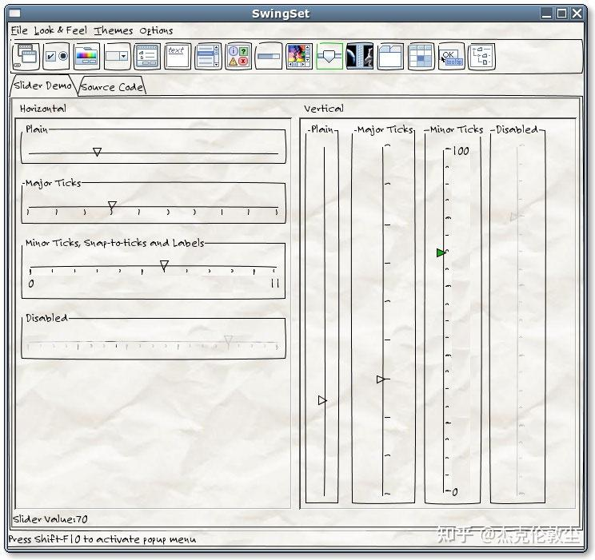
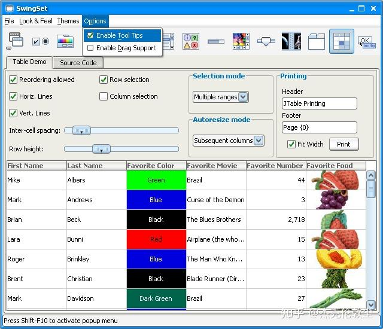
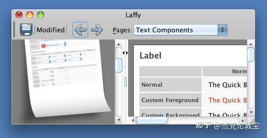
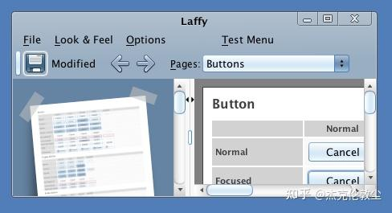
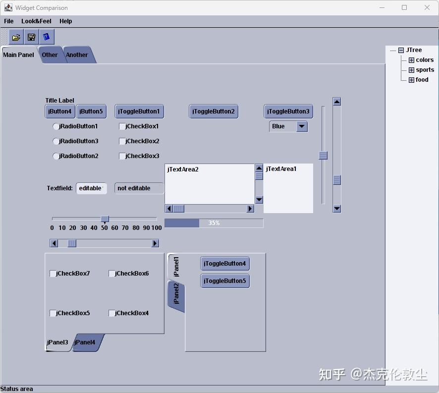
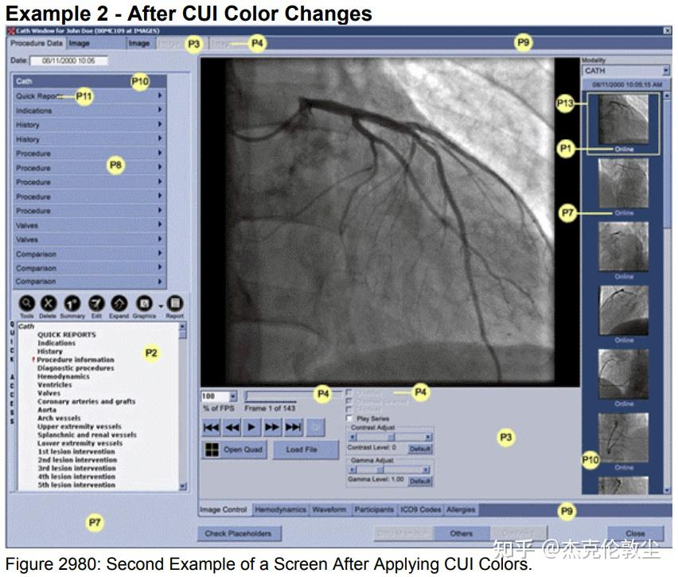

发现网上都说swing并不适应当前的时代 ------他们说错了。

**Java Swing 目前在跨 Linux/Windows/Mac 三大平台的 GUI 开发框架中，仍是最顶尖、最一流的。**

Java Swing 的主要特点如下：  
**a)跨 Linux/Windows/Mac 三大平台；  
b)支持多种界面布局, 包括 css3 支持的流式布局；  
c)支持更换主题，内置多种主题；  
d)支持组件自绘功能；  
e)部分组件的 MVC 设计(比如 JTable)；......  
f)背靠 Java JDK 庞大的类库，且调用 JDK 类库很方便。  
**

缺点是对移动平台、web 页面布局的的支持，这方面功能欠缺。  
或者说 Sun/Oracle 没有持续对 Java Swing 追加新功能。

  

GtkSharp, gtk# 其实也可以凑合一用。

微软 .Net MAUI 目前对 Linux 支持尚在开发中。  
其它野路子的，也只适合偶尔尝尝鲜。

  

当然了，我个人对「**跨 Linux/Windows/Mac 三个 PC 平台 + Android/iOS 两个移动平台 + web** 」的所谓「跨全平台」的技术，不看好。

  

\---------2023/05/12 补充，

Swing 程序吃内存？  
只是相对 c/c++ 而言，有劣势。  
与 c# winform 相当。比现在流行的什么 .net maui , flutter, Electron 之类的在内存占用上节省多了。  
  
Swing 程序启动慢？  
只是相对 c/c++ 而言，有劣势。  
与 c# winform 相当。比现在流行的什么 .net maui , flutter, Electron 之类的快多了。

  

\------

我看到有的回答，在推荐 JavaFX。  
这是在把人往坑里带呀。

JavaFX、Flash、微软 silverlight 属于「富客户端」那一套技术。「富客户端」的意思，是在 web-app 上，做出很多技术功能。这类技术，已经被 HTML5 + CSS3 +JS 给替代了。

且 JavaFX 已经被踢出 Java JRE/JDK 了。自始至终，Swing 才是 Java 主推的 GUI 技术。

  

参阅：  
Sun's JavaFX offers up an alternative to AJAX and also **vies with Silverlight and Adobe Flash**, said Jeffrey Hammond, senior analyst at Forrester ......  
[https://www.infoworld.com/article/2077725/sun-s-javafx-to-take-on-ajax--silverlight.html](https://link.zhihu.com/?target=https%3A//www.infoworld.com/article/2077725/sun-s-javafx-to-take-on-ajax--silverlight.html)

  

\-------2023/05/13 补充，

Eclipse 下，创建一个 java Swing 空白窗口，使用 amazon-corretto-17.0.4.8.1-windows-x64-jdk 来运行，占用内存 32m。  
java Swing 程序大小为 2k。  
未使用编译优化选项。

```text
package com.zheguisoft;

import java.awt.EventQueue;

import javax.swing.JFrame;
import javax.swing.JPanel;
import javax.swing.border.EmptyBorder;

public class TestJava17SwingMainWin extends JFrame {

	private JPanel contentPane;

	/**
	 * Launch the application.
	 */
	public static void main(String[] args) {

		EventQueue.invokeLater(new Runnable() {
			public void run() {
				try {
					TestJava17SwingMainWin frame = new TestJava17SwingMainWin();
					frame.setVisible(true);
				} catch (Exception e) {
					e.printStackTrace();
				}
			}
		});
	}

	/**
	 * Create the frame.
	 */
	public TestJava17SwingMainWin() {
		setDefaultCloseOperation(JFrame.EXIT_ON_CLOSE);
		setBounds(100, 100, 450, 300);
		contentPane = new JPanel();
		contentPane.setBorder(new EmptyBorder(5, 5, 5, 5));

		setContentPane(contentPane);
	}

}
```

  

最后补充几个 java swing 的皮肤，  
a)一个手写体风格的皮肤，来自: [https://napkinlaf.sourceforge.net/](https://link.zhihu.com/?target=https%3A//napkinlaf.sourceforge.net/)



b) 不知道怎么描述这个风格了，圆润+3D? 来自：[https://www.jyloo.com/synthetica/](https://link.zhihu.com/?target=https%3A//www.jyloo.com/synthetica/)



c) 仿 mac 风格，来自：[https://github.com/khuxtable/seaglass/wiki](https://link.zhihu.com/?target=https%3A//github.com/khuxtable/seaglass/wiki)



mac 变体风格：  



  

\---------2023/05/16 补充，

我另写了一篇博客文章，  
Oracle 扔掉了 JavaFX, 继续发展 Java Swing，  
[Oracle 扔掉了 JavaFX, 继续发展 Java Swing - 知乎 (zhihu.com)](https://zhuanlan.zhihu.com/p/629377132)

欢迎阅读。

  

\--------2023/06/15 ,补充 Java Swing 定制化皮肤截图：  

