## 一 分布式共识算法 (Consensus Algorithm)

**1 如何理解分布式共识?**

多个参与者针对某一件事达成完全一致：一件事，一个结论。

已达成一致的结论，不可推翻。

**2 有哪些分布式共识算法?**

-   Paxos：被认为是分布式共识算法的根本，其他都是其变种，但是 paxos 论文中只给出了单个提案的过程，并没有给出复制状态机中需要的 multi-paxos 的相关细节的描述，实现 paxos 具有很高的工程复杂度（如多点可写，允许日志空洞等）。
-   Zab：被应用在 zookeeper 中，业界使用广泛，但没用抽象成通用 library。
-   Raft：以容易理解著称，业界也涌现出很多 raft 实现，比如 etcd、braft、tikv 等。

## 二 Raft 介绍

**1 特点：Strong Leader**

-   系统中必须存在且同一时刻只能有一个 leader，只有 leader 可以接受 clients 发过来的请求。
-   Leader 负责主动与所有 followers 通信，负责将“提案”发送给所有followers，同时收集多数派的 followers 应答。
-   Leader 还需向所有 followers 主动发送心跳维持领导地位（保持存在感）。

另外，身为 leader 必须保持一直 heartbeat 的状态。

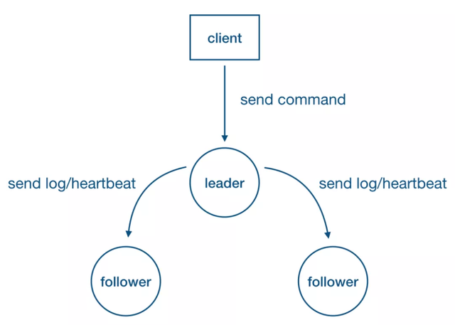

**2 复制状态机**

对于一个无限增长的序列a\[1, 2, 3…\]，如果对于任意整数i， a\[i\]的值满足分布式一致性， 这个系统就满足一致性状态机的要求。

基本上所有的真实系统都会有源源不断的操作，这时候单独对某个特定的值达成一致显然是不够的。为了让真实系统保证所有的副本的一致性，通常会把操作转化为 write-ahead-log(WAL)。然后让系统中所有副本对 WAL 保持一致，这样每个副本按照顺序执行 WAL 里的操作，就能保证最终的状态是一致的。

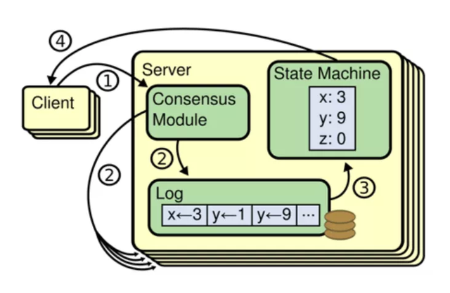

-   Client 向 leader 发送写请求。
-   Leader 把“操作”转化为 WAL 写本地 log 的同时也将 log 复制到所有 followers。
-   Leader 收到多数派应答，将 log 对应的“操作”应用到状态机。
-   回复 client 处理结果。

**3 Raft 中的基本概念**

**Raft-node 的 3 种角色/状态**

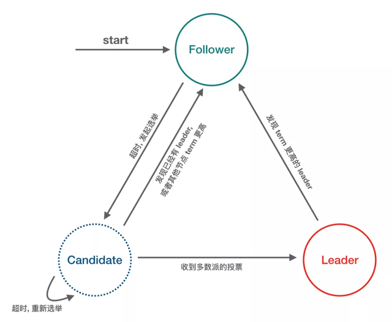

-   Follower：完全被动，不能发送任何请求, 只接受并响应来自 leader 和 candidate 的 message, node启动后的初始状态必须是 follower。
-   Leader：处理所有来自客户端的请求，以及复制 log 到所有 followers。
-   Candidate：用来竞选一个新 leader (candidate 由 follower 触发超时而来)。

**Message 的 3 种类型**

-   RequestVote RPC：Candidate 发出。
-   AppendEntries (Heartbeat) RPC：Leader 发出。
-   InstallSnapshot RPC：Leader 发出。

**任期逻辑时钟**

-   时间被划分为一个个任期(term)，term id 按时间轴单调递增。
-   每一个任期的开始都是 leader 选举，选举成功之后，leader在任期内管理整个集群, 也就是“选举 + 常规操作”。
-   每个任期最多一个 leader，可以没有 leader (spilt-vote 导致)。

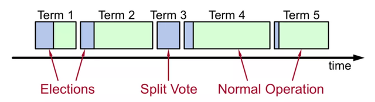

**4 Raft 功能分解**

**Leader 选举**

超时驱动：Heartbeat / Election timeout

随机的超时时间：降低选举碰撞导致选票被瓜分的概率

选举流程：Follower --> Candidate (选举超时触发)

-   赢得选举：Candidate --> Leader
-   另一个节点赢得选举：Candidate --> Follower
-   一段时间内没有任何节点器赢得选举：Candidate --> Candidate

选举动作：

-   Current term++
-   发送 RequestVote RPC

New Leader 选取原则 (最大提交原则)

-   Candidates include log info in RequestVote RPCs(index & term of last log entry)
-   During elections, choose candidate with log most likely to contain all committed entries
-   Voting server V denies vote if its log is “more complete”：(lastTermV > lastTermC) ||((lastTermV == lastTermC) && (lastIndexV > lastIndexC))
-   Leader will have “most complete” log among electing majority

安全性：一个 term，最多选出一个 leader，可以没 leader，下一个 term 再选。


影响 raft 选举成功率的几个时间参数

-   RTT(Round Trip Time)：网络延时
-   Heartbeat timeout：心跳间隔，通常应该比 election timeout 小一个数量级，目的是让 leader 能够持续发送心跳来阻止 followers 触发选举
-   Election timeout：Leader 与 followers 间通信超时触发选举的时间
-   MTBF(Meantime Between Failure)：Servers 连续常规故障时间间隔 RTT << Heartbeat timeout < Election timeout(ET) << MTBF

随机选主触发时间：Random(ET, 2ET)

**日志复制**

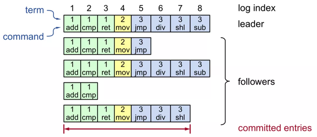

Raft 日志格式

-   (TermId, LogIndex, LogValue)
-   其中 (TermId, LogIndex) 能确定唯一一条日志

Log replication关键点

-   连续性：日志不允许出现空洞
-   有效性：不同节点，拥有相同 term 和 logIndex 的日志 value 一定相同Leader 上的日志一定是有效的Follower 上的日志是否有效，通过 leader 日志对比判断 (How?)

Followers 日志有效性检查

-   AppendEntries RPC 中还会携带前一条日志的唯一标识 (prevTermId, prevLogIndex)
-   递归推导

Followers 日志恢复

-   Leader 将 nextIndex 递减并重发 AppendEntries，直到与 leader 日志一致

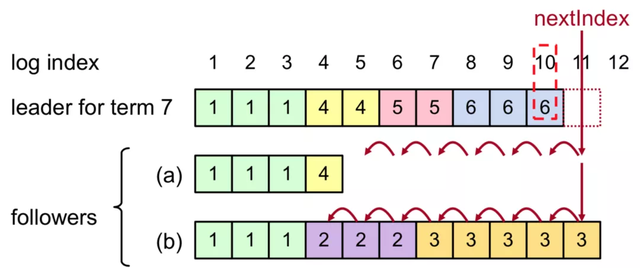

**Commit Index 推进**

CommitIndex (TermId, LogIndex)

-   所谓 commitIndex，就是已达成多数派，可以应用到状态机的最新的日志位置
-   日志被复制到 followers 后，先持久化，并不能马上被应用到状态机
-   只有 leader 知道日志是否达成多数派，是否可以应用到状态机
-   Followers 记录 leader 发来的当前 commitIndex，所有小于等于 commitIndex 的日志均可以应用到状态机

CommitIndex推进

-   Leader 在下一个 AppendEntries RPC (也包括 Heartbeat)中携带当前的 commitIndex
-   Followers 检查日志有效性通过则接受 AppendEntries 并同时更新本地 commitIndex, 最后把所有小于等于 commitIndex 的日志应用到状态机

**AppendEntries RPC**

-   完整信息：(currentTerm, logEntries\[\], prevTerm, prevLogIndex, commitTerm, commitLogIndex)
-   currentTerm, logEntries\[\]：日志信息，为了效率，日志通常为多条
-   prevTerm, prevLogIndex：日志有效性检查
-   commitTerm, commitLogIndex：最新的提交日志位点(commitIndex)

**阶段小结：现在我们能用 raft 做什么?**

-   连续确定多个提案，确保集群中各个系统节点状态完全一致
-   自动选主，保证在只有少数派宕机的情况下持续可用
-   日志强同步，宕机后零数据丢失

## 三 SOFAJRaft

一个纯 Java 的 raft 算法实现库，使用 Java 重写了所有功能，并有一些改进和优化。

**1 SOFAJRaft 整体功能**

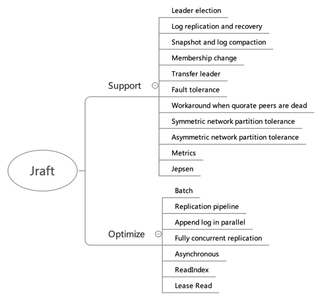

**功能支持**

Leader election：选主。

Log replication and recovery：日志复制和日志恢复，log recovery就是要保证已经被 commit 的数据一定不会丢失，log recovery 包含两个方面

-   Current term 日志恢复，主要针对一些 follower 节点重启加入集群或者是新增 follower 节点
-   Prev term 日志恢复，主要针对 leader 切换前后的日志一致性

Snapshot and log compaction：定时生成 snapshot，实现 log compaction加速启动和恢复，以及InstallSnapshot 给 followers 拷贝数据。

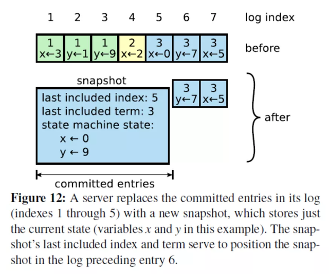

Membership change：集群线上配置变更，增加节点、删除节点、替换节点等。

Transfer leader：主动变更 leader，用于重启维护，leader 负载平衡等。

Symmetric network partition tolerance：对称网络分区容忍性。

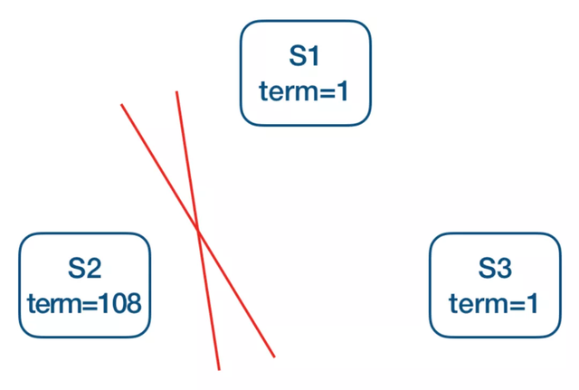

Pre-Vote：如上图 S1 为当前 leader，网络分区造成 S2 不断增加本地 term，为了避免网络恢复后S2发起选举导致正在良心工作的 leader step-down, 从而导致整个集群重新发起选举，在 request-vote 之前会先进行 pre-vote(currentTerm + 1，lastLogIndex, lastLogTerm)，多数派成功后才会转换状态为 candidate 发起真正的 request-vote，所以分区后的节点，pre-vote不会成功，也就不会导致集群一段时间内无法正常提供服务。

Asymmetric network partition tolerance：非对称网络分区容忍性。

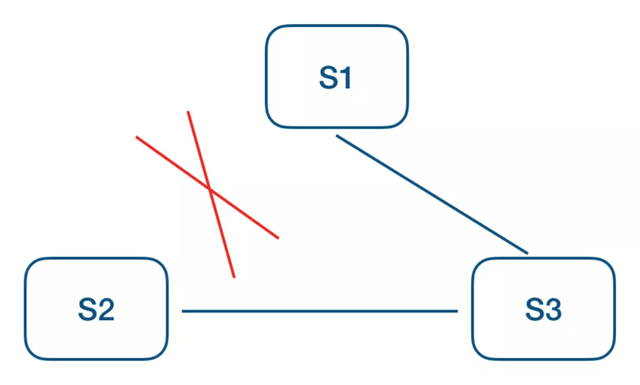

如上图 S1 为当前 leader，S2 不断超时触发选主，S3 提升 term 打断当前 lease，从而拒绝 leader 的更新，这个时候可以增加一个 trick 的检查，每个 follower 维护一个时间戳记录收到 leader 上数据更新的时间(也包括心跳)，只有超过 election timeout 之后才允许接受 request-vote 请求。

Fault tolerance: 容错性，少数派故障，不影响系统整体可用性：

-   机器掉电
-   强杀应用
-   慢节点(GC, OOM等)
-   网络故障
-   其他各种奇葩原因导致 raft 节点无法正常工作

Workaround when quorate peers are dead：多数派故障时整个 grop 已不具备可用性, 安全的做法是等待多数节点恢复，只有这样才能保证数据安全，但是如果业务更追求可用性，放弃数据一致性的话可以通过手动 reset\_peers 指令迅速重建整个集群，恢复集群可用。

Metrics：SOFAJRaft 内置了基于 metrics 类库的性能指标统计，具有丰富的性能统计指标。

Jepsen：除了单元测试之外，SOFAJRaft 还使用 jepsen 这个分布式验证和故障注入测试框架模拟了很多种情况，都已验证通过：

-   随机分区，一大一小两个网络分区
-   随机增加和移除节点
-   随机停止和启动节点
-   随机 kill -9 和启动节点
-   随机划分为两组，互通一个中间节点，模拟分区情况
-   随机划分为不同的 majority 分组

**性能优化**

Batch：SOFAJRaft 中整个链路都是 batch 的，依靠 disruptor 中的 MPSC 模型批量消费，包括但不限于：

-   批量提交 task
-   批量网络发送
-   本地 IO batch 写入，要保证日志不丢，一般每一条 log entry 都要进行 fsync, 比较耗时，SOFAJRaft 中做了合并写入的优化
-   批量应用到状态机

Replication pipeline：流水线复制，leader 跟 followers 节点的 log 同步是串行 batch 的方式，每个 batch 发送之后需要等待 batch 同步完成之后才能继续发送下一批(ping-pong), 这样会导致较长的延迟。可以通过 leader 跟 followers 节点之间的 pipeline 复制来改进，有效降低更新的延迟, 提高吞吐。

Append log in parallel：Leader 持久化 log entries 和向 followers 发送 log entries 是并行的。

Fully concurrent replication：Leader 向所有 follwers 发送 log 也是完全并发的。

Asynchronous：Jraft 中整个链路几乎没有任何阻塞，完全异步的，是一个 callback 编程模型。

ReadIndex：优化 raft read 走 raft log 的性能问题，每次 read，仅记录 commitIndex，然后发送所有 peers heartbeat 来确认 leader 身份，如果 leader 身份确认成功，等到 applied index >= commitIndex，就可以返回 client read 了，基于 ReadIndex 可以很方便的提供线性一致读，不过 commitIndex 是需要从 leader 那里获取的，多了一轮RPC。

Lease Read：通过租约(lease)保证 leader 的身份，从而省去了 readIndex 每次 heartbeat 确认 leader 身份，性能更好, 但是通过时钟维护 lease 本身并不是绝对的安全(jraft 中默认配置是 readIndex，因为 readIndex 性能已足够好)。

**2 SOFAJRaft 设计**

**SOFAJRaft - Raft Node**

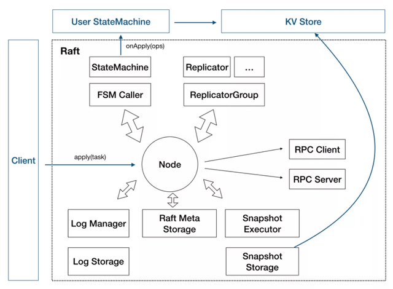

Node：Raft 分组中的一个节点，连接封装底层的所有服务，用户看到的主要服务接口，特别是 apply(task) 用于向 raft group 组成的复制状态机集群提交新任务应用到业务状态机。

存储

-   Log 存储，记录 raft 用户提交任务的日志，将从 leader 复制到其他节点上。LogStorage 是存储实现, LogManager 负责对底层存储的调用，对调用做缓存、批量提交、必要的检查和优化。
-   Metadata 存储，元信息存储，记录 raft 实现的内部状态，比如当前 term、投票给哪个节点等信息。
-   Snapshot 存储，用于存放用户的状态机 snapshot 及元信息，可选. SnapshotStorage 用于 snapshot 存储实现，SnapshotExecutor 用于 snapshot 实际存储、远程安装、复制的管理。

状态机

-   StateMachine：用户核心逻辑的实现，核心是 onApply(Iterator) 方法，应用通过 Node#apply(task) 提交的日志到业务状态机。
-   FSMCaller：封装对业务 StateMachine 的状态转换的调用以及日志的写入等，一个有限状态机的实现, 做必要的检查、请求合并提交和并发处理等。

复制

-   Replicator：用于 leader 向 followers 复制日志，也就是 raft 中的 AppendEntries 调用，包括心跳存活检查等。
-   ReplicatorGroup：用于单个 raft group 管理所有的 replicator，必要的权限检查和派发。

RPC 模块用于节点之间的网络通讯

-   RPC Server：内置于 Node 内的 RPC 服务器，接收其他节点或者客户端发过来的请求, 转交给对应服务处理。
-   RPC Client：用于向其他节点发起请求，例如投票、复制日志、心跳等。

KV Store：SOFAJRaft 只是一个 lib，KV Store 是 SOFAJRaft 的一个典型的应用场景，把它放进图中以便更好的理解 SOFAJRaft。

**SOFAJRaft - Raft Group**

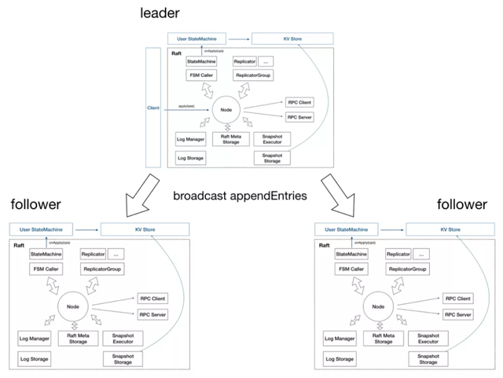

**SOFAJRaft - Multi Raft Group**

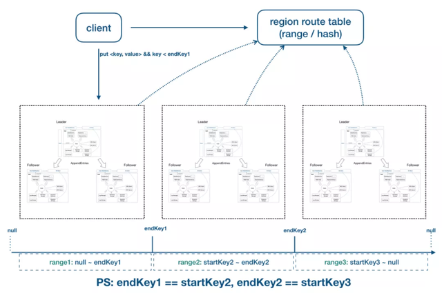

**3 SOFAJRaft 实现细节**

**高效的线性一致读**

什么是线性一致读?

所谓线性一致读，一个简单的例子就是在 t1 的时刻我们写入了一个值, 那么在 t1 之后， 我们一定能读到这个值，不可能读到 t1 之前的旧值 (想想 java 中的 volatile 关键字，说白了线性一致读就是在分布式系统中实现 volatile 语义)。

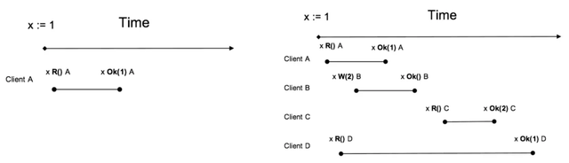

上图Client A、B、C、D均符合线性一致读，其中 D 看起来是 stale read，其实并不是， D 请求横跨了3个阶段，而读可能发生在任意时刻，所以读到 1 或 2 都行。

重要：接下来的讨论均基于一个大前提，就是业务状态机的实现必须是满足线性一致性的, 简单说就是也要具有 java volatile 的语义。

1）直接点，是否可以直接从当前 leader 节点读？

怎么确定当前的 leader 真的是 leader(网络分区)？

2）最简单的实现方式：读请求走一遍 raft 协议

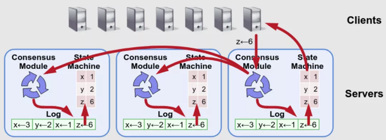

有什么问题?

-   不仅有日志写盘开销，还有日志复制的 RPC 开销，在读比重较大的系统中是无法接受的
-   还多了一堆的 raft “读日志”

3）ReadIndex Read

这是 raft 论文中提到过的一种优化方案，具体来说：

-   将当前自己 log 的 commit index 记录到一个 local 变量 ReadIndex 里面。
-   向其他节点发起一次 heartbeat，如果大多数节点返回了对应的 heartbeat response，那么 leader 就能够确定现在自己仍然是 leader (证明了自己是自己)。
-   Leader 等待自己的状态机执行，直到 apply index 超过了 ReadIndex，这样就能够安全的提供 Linearizable Read 了, 也不必管读的时刻是否 leader 已飘走 (思考：为什么需要等到 apply index 超过了 ReadIndex 才可以执行读请求？)。
-   Leader 执行 read 请求，将结果返回给 Client。

通过ReadIndex，也可以很容易在 followers 节点上提供线性一致读：

-   Follower 节点向 leader 请求最新的 ReadIndex。
-   Leader执行上面 i ~ iii 的过程(确定自己真的是 leader)，并返回 ReadIndex 给 follower。
-   Follower 等待自己的 apply index 超过了 ReadIndex (有什么问题？慢节点？)。
-   Follower 执行 read 请求，将结果返回给 client。

ReadIndex小结：

-   相比较于走 raft log 的方式，ReadIndex 读省去了磁盘的开销，能大幅度提升吞吐，结合 SOFAJRaft 的 batch + pipeline ack + 全异步机制，三副本的情况下 leader 读的吞吐接近于 RPC 的上限。
-   延迟取决于多数派中最慢的一个 heartbeat response，理论上对于降低延时的效果不会非常显著。

4）Lease Read

Lease read 与 ReadIndex 类似，但更进一步，不仅省去了 log，还省去了网络交互。它可以大幅提升读的吞吐也能显著降低延时。

基本的思路是 leader 取一个比 election timeout 小的租期(最好小一个数量级)，在租约期内不会发生选举，这就确保了 leader 不会变，所以可以跳过 ReadIndex 的第二步， 也就降低了延时。可以看到, Lease read 的正确性和时间是挂钩的，因此时间的实现至关重要，如果漂移严重，这套机制就会有问题。

实现方式：

-   定时 heartbeat 获得多数派响应, 确认 leader 的有效性 (在 SOFAJRaft 中默认的 heartbeat 间隔是 election timeout 的十分之一)。
-   在租约有效时间内，可以认为当前 leader 是 raft group 内的唯一有效 leader，可忽略 ReadIndex 中的 heartbeat 确认步骤(2)。
-   Leader 等待自己的状态机执行，直到 apply index 超过了 ReadIndex，这样就能够安全的提供 Linearizable Read 了。

5）更进一步：Wait Free

到此为止 lease 省去了 ReadIndex 的第 2 步(heartbeat)，实际上还能再进一步，省去第 3 步。

我们想想前面的实现方案的本质是什么? 当前节点的状态机达到“读”这一刻的时间点 相同或者更新的状态。

那么更严格一点的约束就是：当前时刻，当前节点的状态机就是最新的。

问题来了，leader 节点的状态机能保证一定是最新的吗？

-   首先 leader 节点的 log 一定是最新的，即使新选举产生的 leader，它也一定包含全部的 commit log，但它的状态机却可能落后于旧的 leader。
-   但是在 leader 应用了自己当前 term 的第一条 log 之后，它的状态机就一定是最新的。
-   所以可以得出结论：当 leader 已经成功应用了自己 term 的第一条 log 之后，不需要再取 commit index，也不用等状态机，直接读，一定是线性一致读。

小结：Wait Free 机制将最大程度的降低读延迟，SOFAJRaft 暂未实现 wait free 这一优化，不过已经在计划中。

在 SOFAJRaft 中发起一次线性一致读请求：

```text
// KV 存储实现线性一致读
public void readFromQuorum(String key, AsyncContext asyncContext) {
    // 请求 ID 作为请求上下文传入
    byte[] reqContext = new byte[4];
    Bits.putInt(reqContext, 0, requestId.incrementAndGet());
    // 调用 readIndex 方法, 等待回调执行
    this.node.readIndex(reqContext, new ReadIndexClosure() {

        @Override
        public void run(Status status, long index, byte[] reqCtx) {
            if (status.isOk()) {
                try {
                    // ReadIndexClosure 回调成功, 可以从状态机读取最新数据返回
                    // 如果你的状态实现有版本概念, 可以根据传入的日志 index 编号做读取
                    asyncContext.sendResponse(new ValueCommand(fsm.getValue(key)));
                } catch (KeyNotFoundException e) {
                    asyncContext.sendResponse(GetCommandProcessor.createKeyNotFoundResponse());
                }
            } else {
                // 特定情况下, 比如发生选举, 该读请求将失败
                asyncContext.sendResponse(new BooleanCommand(false, status.getErrorMsg()));
            }
        }
    });
}
```

## 四 SOFAJRaft 应用场景

**1 SOFAJRaft 可以做什么**

-   选举
-   分布式锁服务，比如 zookeeper
-   高可靠的元信息管理

分布式存储系统，如分布式消息队列、分布式文件系统、分布式块系统等等。

**2 用户案例**

-   AntQ Streams QCoordinator：使用 SOFAJRaft 在 coordinator 集群内做选举、元信息存储等功能。
-   Schema Registry：高可靠 schema 管理服务，类似 kafka schema registry。
-   SOFA 服务注册中心元信息管理模块：IP 数据信息注册，要求写数据达到各个节点一致， 并且在少数派节点挂掉时保证不影响数据正常存储。
-   RheaKV：基于 SOFAJRaft 和 rocksDB 实现的嵌入式、分布式、高可用、强一致的 KV 存储类库。

**3 简单实践：基于 SOFAJRaft 设计一个简单的 KV Store**

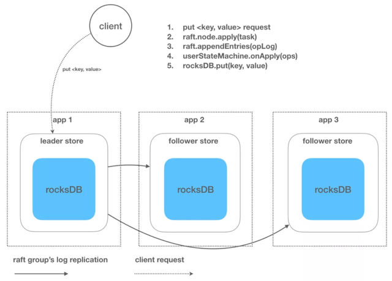

到目前为止，我们似乎还没看到 SOFAJRaft 作为一个 lib 有什么特别之处, 因为 SOFAJRaft 能办到的 zk，etcd 似乎基本上也都可以办到, 那么 SOFAJRaft 算不算重复造轮子？

为了说明 SOFAJRaft 具有很好的想象空间以及扩展能力，下面再介绍一个基于 SOFAJRaft 的复杂一些的实践。

**4 复杂一点的实践：基于 SOFAJRaft 的 Rhea KV 的设计**

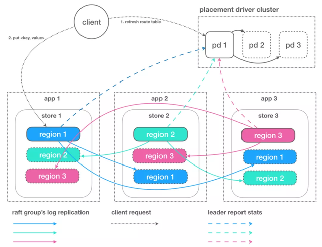

**功能名词**

-   PD：全局的中心总控节点, 负责整个集群的调度, 不需要自管理的集群可不启用 PD (一个PD可管理多个集群，基于 clusterId 隔离)。
-   Store：集群中的一个物理存储节点，一个 store 包含一个或多个 region。
-   Region：最小的 KV 数据单元，每个 region 都有一个左闭右开的区间 \[startKey, endKey)，可根据请求流量/负载/数据量大小等指标自动分裂以及自动副本搬迁。

**特点**

-   嵌入式
-   强一致性
-   自驱动：自诊断，自优化，自决策，自恢复。以上几点(尤其2, 3)基本都是依托于 SOFAJRaft 自身的功能来实现。

作者 | 家纯

**[原文链接](https://link.zhihu.com/?target=https%3A//developer.aliyun.com/article/784430%3Futm_content%3Dg_1000275625)**

**本文为阿里云原创内容，未经允许不得转载。**