最近在推特上看到了一大堆人打算/刚开始做独立开发者。

产品大多是：记账本/记事本/闹钟/清单类等。

大多数的内容反而是各种如何开海外账户等等。

说实话我觉得这跟我看到的一些产品很不一样，我看到的独立开发者其实都是先从问题入手，发现了一个非常通用的问题，然后自己在解决这个问题的时候顺便开发了一款产品。

比如显示不同时区的这个产品。

就这个一个功能，就是显示不同时区的时间。

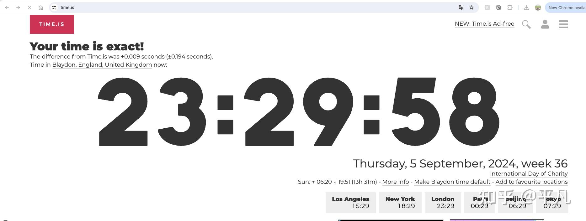

每个月有5300万次访问，接入的是google的广告联盟。

大概一年有100万的收入。

  

还有这个佛教语录网站。

我用similarweb查了查，一个月能干出1百万的有效浏览，每天3-5万。

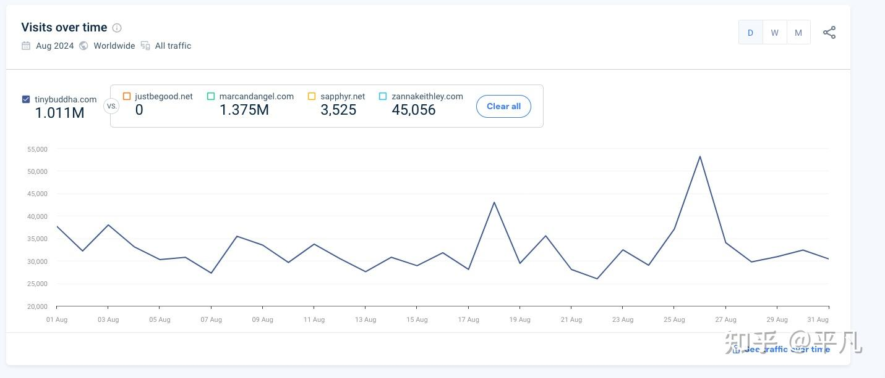

有两种盈利方式：Google广告和卖课。

每个月保守估计几万美元。

说白了独立开发者就是靠这几种方式赚钱。

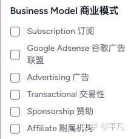

  

但这些方式说白了还是主要的变现方式就是流量。

产品这种东西，有时候只需要满足一个人的某一个具体的需求就行，比如那个时间显示。

而更重要的是让人知道。

或者说你得让人知道你需要这个。

特别是最近cursor的新进展，让有想法但是不会编程的人直接升天。

现在做一个静态网站，真的就是有手就行。

就下面这样的导航网站，用AI做10分钟都用不了。

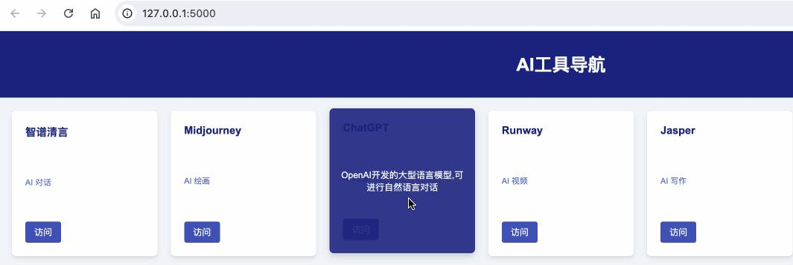

这还是假设你几乎不会编程的前提下，但凡你懂点编程，再加上AI辅助的话，几乎就是几分钟的事情，特别是你还可以给你的网站加各种feature比如AI对话机器人，要知道现在的大模型API价格已经非常便宜了。

但对于大多数普通人，AI大模型其实只停留在一知半解的境地。而对于程序员或者技术人员，这就是优势，懂技术的前提下，加上AI大模型的知识，这就是一个普通的程序员的机会。但应该学习哪些技术？大模型的底层原理？还是极具代表性的LangChain和Fine-tuning如何应用？学什么才能不被淘汰，我建议你可以看看知学堂开设的公开课，花几个小时系统性的了解一下大模型的方方面面，特别是大模型的应用方面，你或许也可以找到一个可以自己给自己打工的方向，做一个独立开发者，入口我给你直接放下面了⬇

比如说我举个最简单的例子，你想要做一个导航站，就是把AI的各类网站都放在一起，跟以前的hao123类似，这种网站在ChatGPT刚出来的时候火了好一阵子，因为很多人除了GPT之外其他的网站知之甚少，导航站就是一个目的是帮助人找到合适的网站。

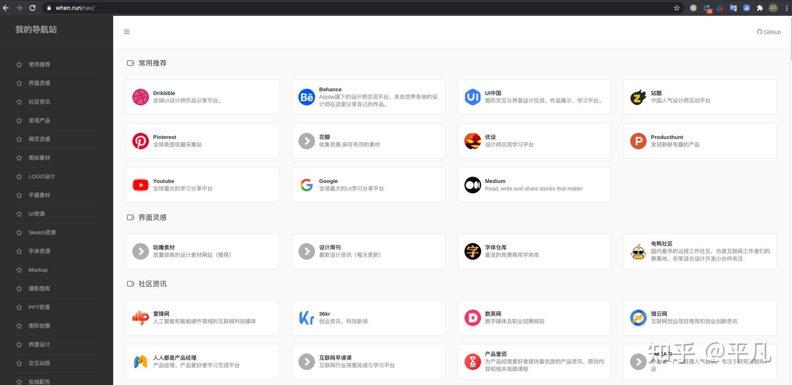

但是要知道，这种网站也是有成本的，你高低得租个小服务器，还得买个域名，另外你的时间也花在里面了。

你得回本对吧，作为一个独立开发者，本质上不就是不想给公司打工来赚钱，而是自己给自己打工。

那么你的收入不就是来自于上面那几个，加广告这个简单粗暴，但是会影响用户使用体验，卖课也行，前提你得自己有课或者搞分销也可以。

特别是你自己有课的话，那做流量就是最好的方法，你卖一份课的成本和1万份课是一样的，因为你已经把课做好了。

导航站就可以是你的一个流量入口，那你要不会技术怎么办？

现在的很多压根不懂代码的人都是直接拿AI做的。

拿这个网站举例。

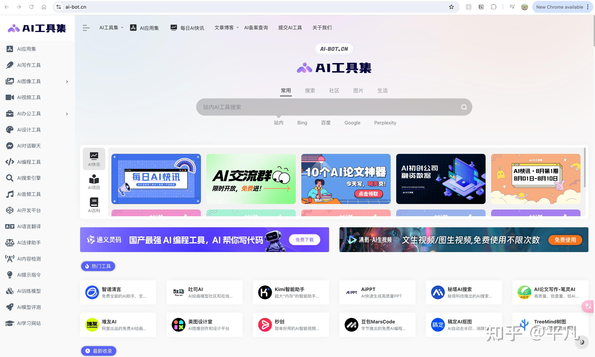

直接截个图，然后打开cursor，Cmd+K打开对话框，把图片复制进去，然后加一句prompt：

> 我只会简单的python，请你指导我一步步的做，我想要你模仿这个网站@【你想要的网站网址】做一个导航站，我想要通过这个导航站给人提供AI的各种应用链接，同时也留一个地方出售我自己的课程

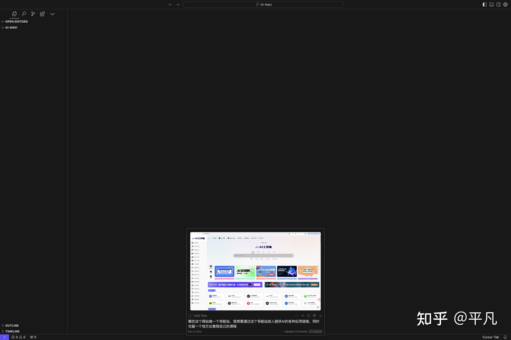

然后你会得到这么一个详细的步骤

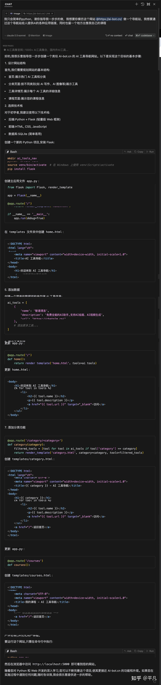

其实文字都是辅助你理解的，只有到了代码部位才是需要你操作的，第三步就是装一些必要的库，看不懂没关系，你点击run就行。

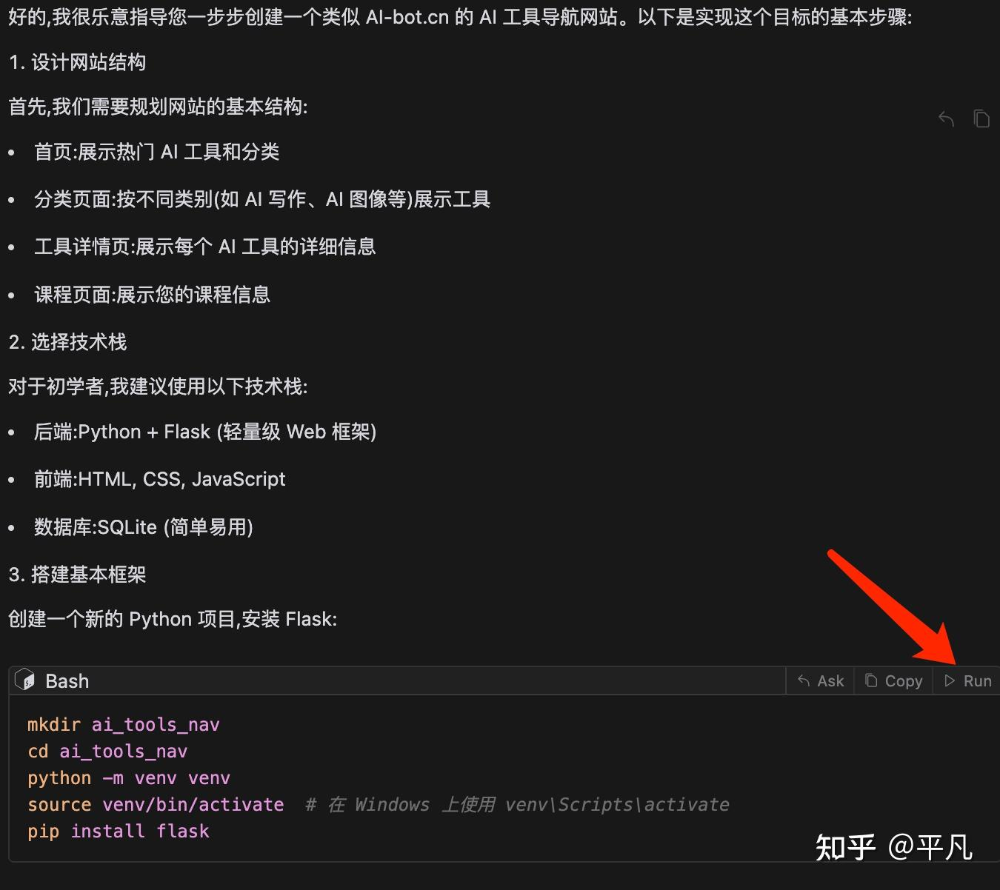

run了之后有问题，其实就是pip不对，应该是pip3，但是你不懂没关系，点那个蓝色的debug with AI。

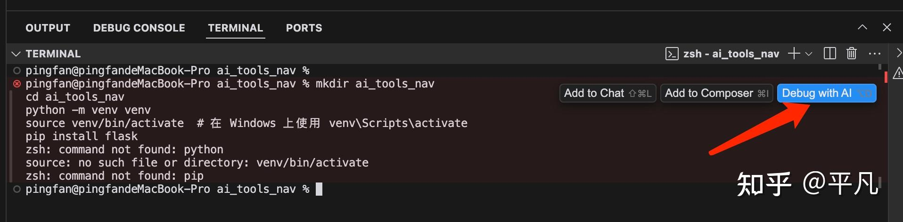

你就按照它所说的做。

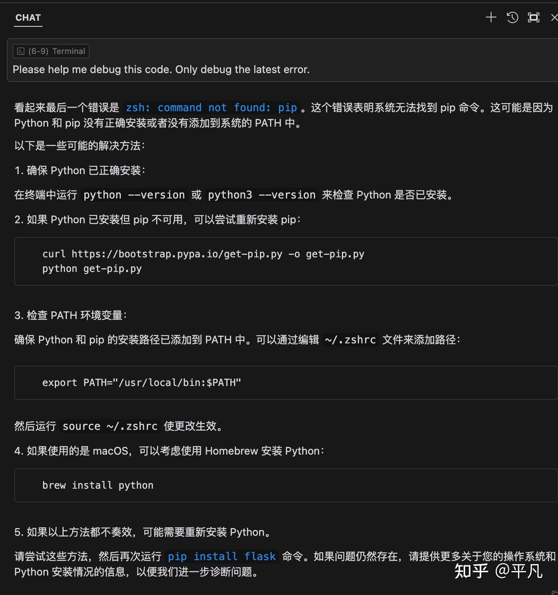

每一个代码都给你提供直接应用的按钮，不会打字都没关系，你会点鼠标就行。

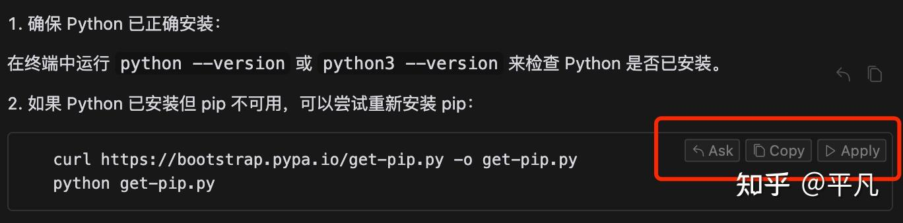

花不了几分钟就能装好。

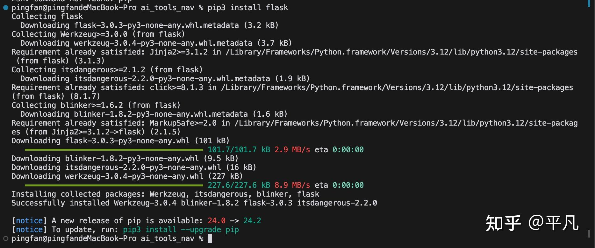

完了你接下来该创建这个文件了，记得你会点apply就行。

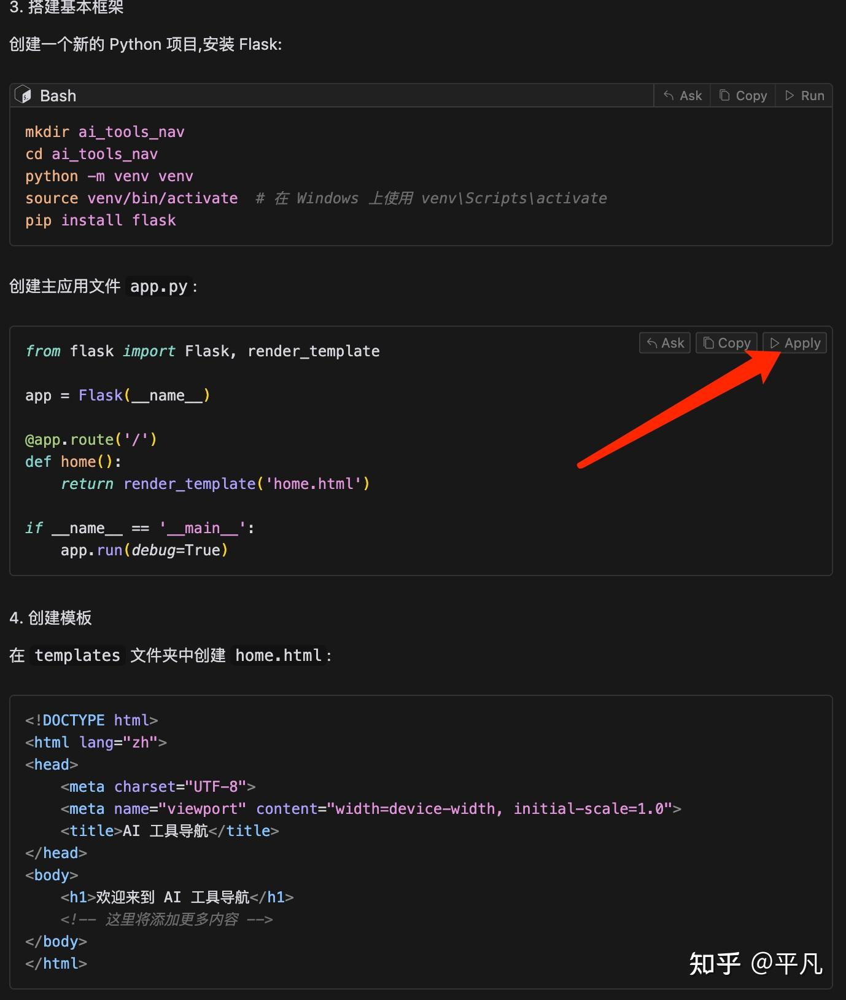

一旦你点击了apply，代码部分就要请求你是否aceept或者reject，接受或者拒绝，你一律点accept就行。

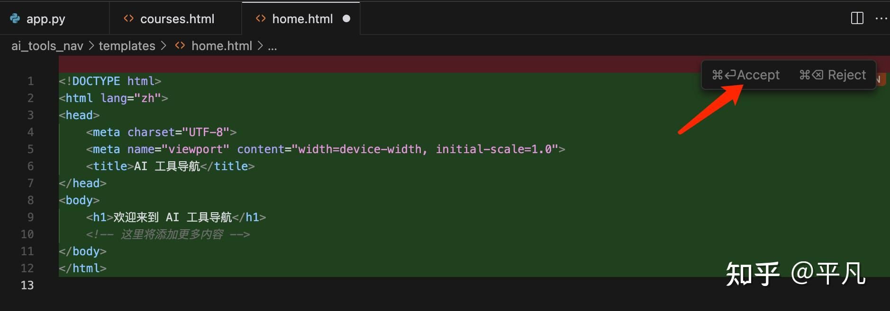

最后10分钟后，我得到了这么一个草草的网站，信息有，但是很不美观。

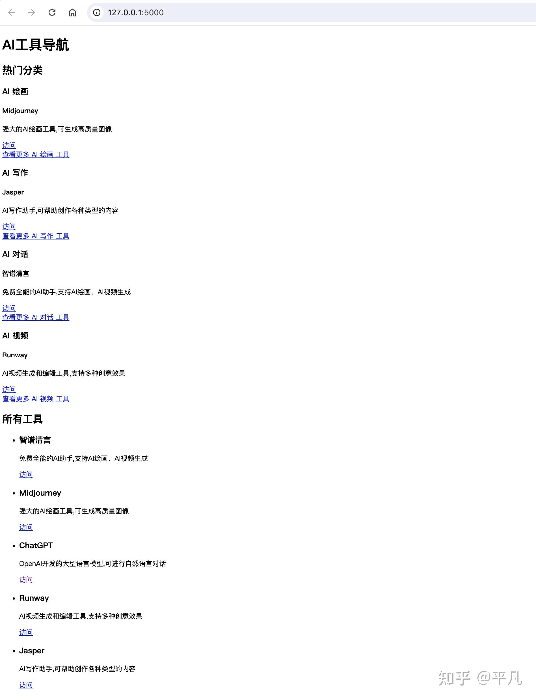

然后让AI帮我美化，prompt：我想要让这些网站按照矩形的方式显示，就是每个工具占据一个大小相同的矩形，然后要用到高级配色，鼠标放上去的话显示它的主要功能

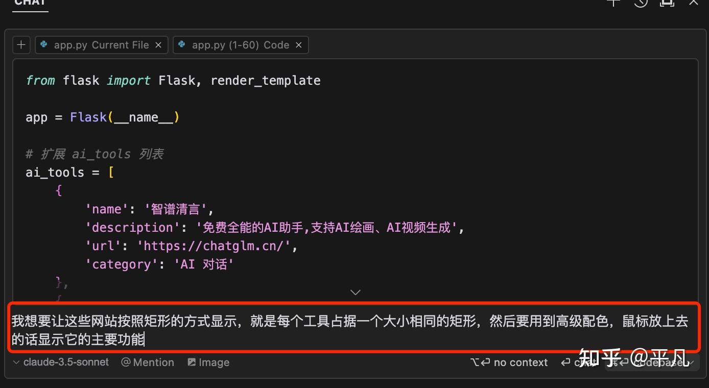

然后你再看看成品，已经实现了鼠标放上去显示简介了。

你还可以让cursor实现更多的功能，比如AI应用分类，今日推荐应用等的。

这就拼的是你的创意，因为千篇一律的导航站肯定竞争很激烈。

你得找出你独特的创意，特别是你遇到的问题，一般也代表了其他跟你类似的人也会遇到，那么这种网站或者工具就一定会有受众。

很多独立开发者做的东西并不复杂，但肯定是在解决某一个痛点。

而这个痛点，就是独立开发者的立足之道。