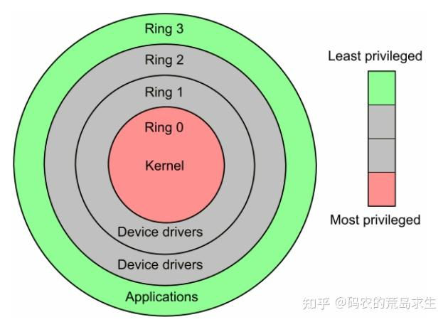
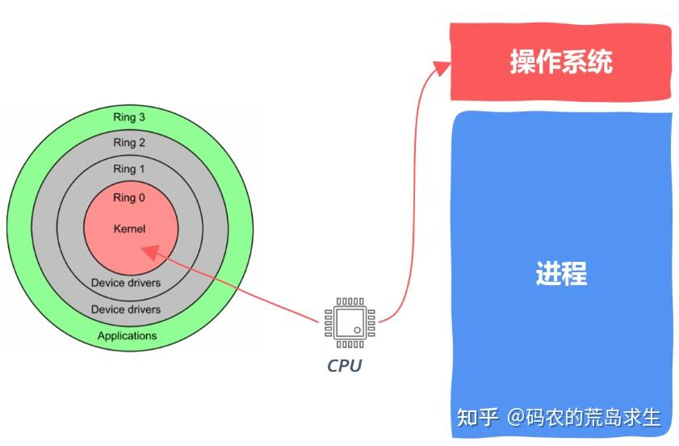
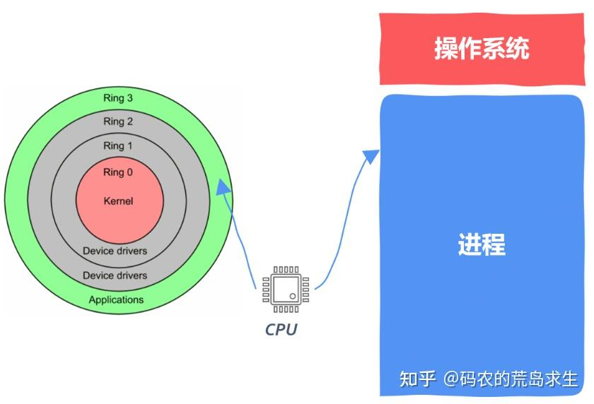

内存的申请释放对程序员来说就像空气一样自然，你几乎不怎么能意识到，却无比重要，申请过这么多内存，但是**你知道申请内存时底层都发生什么了吗**？

大家都喜欢听故事，我们就从神话故事开始吧。

## 三界

中国古代的神话故事通常有“三界”之说，一般指的是天、地、人三界，天界是神仙所在的地方，凡人无法企及；人界说的是就是人间；地界说的是阎罗王所在的地方，孙悟空上天入地无所不能就是说可以在这三界自由出入。

有的同学可能会问，这和计算机有什么关系呢？

原来，我们的代码也是分三六九等的，程序运行起来后也是有“三界”之说的，程序运行起来的“三界”就是这样的：

x86 CPU提供了“四界”：0,1,2,3，**这几个数字其实就是指CPU的几种工作状态**，数字越小表示CPU的特权约大，0号下CPU特权最大，可以执行任何指令。

一般情况下系统只使用0和3，因此确切的说是“两界”，这两界可不是说天、地，这两界指的是“用户态(3)”以及“内核态(0)”，接下来我们看看什么是内核态、什么是用户态。

## 内核态

什么是内核态？当CPU执行操作系统代码时就处于内核态，**在内核态下CPU可以执行任何机器指令、访问所有地址空间、不受限制的访问任何硬件**，可以简单的认为内核态就是“天界”，在这里的代码(操作系统代码)无所不能。

  

## 用户态

什么是用户态？当CPU执行我们写的“普通”代码(非操作系统、驱动程序员)时就处于用户态，粗糙的划分方法就是除了操作系统之外的代码，就像我们写的HelloWorld程序。

用户态就好比“人界”，在用户态我们的代码处处受限，不能直接访问硬件、不能访问特定地址空间，否则神仙(操作系统)直接将你kill掉，这就是著名的Segmentation fault、不能执行特权指令，等等。

  

关于这一部分的详细讲解，请参见《[深入理解操作系统](https://link.zhihu.com/?target=https%3A//mp.weixin.qq.com/mp/appmsgalbum%3F__biz%3DMzU2NTYyOTQ4OQ%3D%3D%26action%3Dgetalbum%26album_id%3D1433368223499796481%23wechat_redirect)》系列文章。

## 跨界

孙悟空神通广大，一个跟斗就能从人间跑到天上去骂玉帝老儿，程序员就没有这个本领了。普通程序永远也去不了内核态，只能以通信的方式从用户态往内核态传递信息。

操作系统为普通程序员留了一些特定的暗号，这些暗号就和普通函数一样，程序员通过调用这些暗号就能向操作系统请求服务了，这些像普通函数一样的暗号就被称为[系统调用](https://link.zhihu.com/?target=https%3A//mp.weixin.qq.com/mp/appmsgalbum%3F__biz%3DMzU2NTYyOTQ4OQ%3D%3D%26action%3Dgetalbum%26album_id%3D1433368223499796481%23wechat_redirect)，System Call，通过系统调用我们可以让操作系统代替我们完成一些事情，像打开文件、网络通信等等。

你可能有些疑惑，什么，还有系统调用这种东西，为什么我没调用过也可以打开文件、进行网络通信？

## 标准库

虽然我们可以通过系统让操作系统替我们完成一些特定任务，但这些系统调用都是和操作系统强相关的，Linux和Windows的系统调用就完全不同。

如果你直接使用系统调用的话，那么Linux版本的程序就没有办法在Windows上运行，因此我们需要某种标准，该标准对程序员屏蔽底层差异，这样程序员写的程序就无需修改的在不同操作系统上运行了。

在C语言中，这就是所谓的**标准库**。

注意，标准库代码也是运行在用户态的，并不是神仙(操作系统)，一般来说，我们调用标准库去打开文件、网络通信等等，标准库再根据操作系统选择对应的系统调用。

从分层的角度看，我们的程序一般都是这样的汉堡包类型：

最上层是应用程序，应用程序一般只和标准库打交道(当然，我们也可以绕过标准库)，标准库通过系统调用和操作系统交互，操作系统管理底层硬件。

**这就是为什么在C语言下同样的open函数既能在Linux下打开文件也能在Windows下打开文件的原因**。

说了这么多，这和malloc又有什么关系呢？

## 主角登场

原来，我们分配内存时使用的malloc函数其实不是实现在操作系统里的，而是在标准库中实现的。

现在我们知道了，malloc是标准库的一部分，当我们调用malloc时实际上是标准库在为我们申请内存。

这里值得注意的是，我们平时在C语言中使用malloc只是内存分配器的一种，实际上有很多内存分配器，像tcmalloc，jemalloc等等，它们都有各自适用的场景，对于高性能程序来说使用满足特定要求的内存分配器是至关重要的。

那么接下来的问题就是malloc又是怎么工作的呢？

## malloc是如何工作的

啊哈，这个问题刚好在《[自己动手实现一个malloc内存分配器](https://zhuanlan.zhihu.com/p/367060283)》中详细讲解过了，通过这篇你就能知道malloc的实现原理了。

[码农的荒岛求生：自己动手实现一个malloc内存分配器](https://zhuanlan.zhihu.com/p/367060283)

但是，请注意但是，**上一篇文章并不是故事的全部**，在这篇文章中有一个问题我们故意忽略了，这个问题就是**如果内存分配器中的空闲内存块不够用了该怎么办呢**？

在上一篇中我们总是假定我们自己实现的malloc总能找到一块空闲内存，但实际上并不是这样的。

## 内存不够该怎么办？

让我们再来看一下程序在内存中是什么样的：

我们已经知道了，malloc管理的是堆区，注意，在堆区和栈区之间有一片空白区域，这片空白区域的目的是什么呢？

原来，栈区其实是可以增长的，随着调用深度的增加，相应的栈区占用的内存也会增加，关于栈区这一主题，你可以参考《[函数运行时在内存中是什么样子](https://zhuanlan.zhihu.com/p/339866296)》这篇文章。

[码农的荒岛求生：函数运行时在内存中是什么样子？](https://zhuanlan.zhihu.com/p/339866296)

栈区的增长就需要占用原来的空白区域。

相应的，堆区也可以增长：

堆区增长后占用的内存就会变多，这就解决了内存分配器空闲内存不足的问题，那么很自然的，malloc该怎样让堆区增长呢？

原来malloc内存不足时要向操作系统申请内存，**操作系统才是真大佬**，malloc不过是小弟，对每个进程，操作系统(类Unix系统)都维护了一个叫做brk的变量，brk发音break，这个brk指向了堆区的顶部。

将brk上移后堆区增大，那么我们该怎么样让堆区增大呢？

这就涉及到我们刚提到的系统调用了。

## 向操作系统申请内存

操作系统专门提供了一个叫做brk的系统调用，还记得刚提到堆的顶部吧，这个brk()系统调用就是用来增加或者减小堆区的。

实际上不止brk系统调用，sbr、mmap系统调用也可以实现同样的目的，mmap也更为灵活，但该函数并不是本文重点，就不在这里详细讨论了。

现在我们知道了，如果malloc自己维护的内存空间不足将通过brk系统调用向操作系统申请内存。这样malloc就可以把这些从操作系统申请到的内存当做新的空闲内存块分配出去。

## 看起来已经讲完的故事

现在我就可以简单总结一下了，当我们申请内存时，经历这样几个步骤：

1.  程序调用malloc申请内存，注意malloc实现在标准库中
2.  malloc开始搜索空闲内存块，如果能找到一块大小合适的就分配出去，前两个步骤都是发生在用户态
3.  如果malloc没有找到空闲内存块那么就像操作系统发出请求来增大堆区，这是通过系统调用brk(sbrk、mmap也可以)实现的，注意，brk是操作系统的一部分，因此当brk开始执行时，此时就进入内核态了。brk增大进程的堆区后返回，malloc的空闲内存块增加，此时malloc又一次能找到合适的空闲内存块然后分配出去。

故事就到这里了吗？

## 冰山之下

实际上到目前为止，我们接触到的仅仅是冰山一角。

我们看到的冰山是这样的：我们向malloc申请内存，malloc内存不够时向操作系统申请内存，之后malloc找到一块空闲内存返回给调用者。

但是，你知道吗，**上述过程根本就没有涉及到哪怕一丁点物理内存**！！！

我们确实向malloc申请到内存了，malloc不够也确实从操作系统申请到内存了，但这些内存都不是真的物理内存，**NOT REAL**。

实际上，进程看到的内存都是假的，是操作系统给进程的一个幻象，这个幻象就是由著名的**虚拟内存**系统来维护的，我们经常说的这张图就是进程从虚拟内存。

所谓虚拟内存就是假的、不是真正的物理内存，虚拟内存是给进程用的，操作系统维护了虚拟内存到物理内存的映射，当malloc返回后，程序员申请到的内存就是虚拟内存。

注意，**此时操作系统根本就没有真正的分配物理内存**。

那么什么时候操作系统才会真正的分配物理内存呢？

答案是当我们真正使用这段内存时，当我们真正使用这段内存时，这时会产生一个缺页错误，操作系统捕捉到该错误后开始真正的分配物理内存，操作系统处理完该错误后我们的程序才能真正的读写这块内存。

现在你应该明白内存分配的原理了吧，除了本文讲解的计算机底层技术，在这里也顺便给大家推荐一份**学习算法刷题的绝技资料，除了计算机底层技术，算法也不可忽视，如果想进BAT、TMD、快手这样的一线大厂，认认真真过上一遍，这些大厂算法面试一关大部分题目都不在话下**：

[Github疯传！阿里P8大佬写的Leetcode刷题笔记，秒杀80%的算法题！](https://link.zhihu.com/?target=https%3A//mp.weixin.qq.com/s/A-HPH3Tkl8KOvZgdRArvIg)

当然这里只是简略的提到了虚拟内存，实际上虚拟内存是当前操作系统内部极其重要的一部分，关于虚拟内存的工作原理将在《[深入理解操作系统](https://link.zhihu.com/?target=https%3A//mp.weixin.qq.com/mp/appmsgalbum%3F__biz%3DMzU2NTYyOTQ4OQ%3D%3D%26action%3Dgetalbum%26album_id%3D1433368223499796481%23wechat_redirect)》系列文章中详细讨论。

## 完整的故事

现在，这个故事就可以完整讲出来了，当我们调用malloc申请内存时：

1.  malloc开始搜索空闲内存块，如果能找到一块大小合适的就分配出去
2.  如果malloc找不到一块合适的空闲内存，那么调用brk等系统调用扩大堆区从而获得更多的空闲内存
3.  malloc调用brk后开始转入内核态，此时操作系统中的虚拟内存系统开始工作，扩大进程的堆区，注意额外扩大的这一部分内存仅仅是虚拟内存，操作系统并没有为此分配真正的物理内存
4.  brk执行结束后返回到malloc，从内核态切换到用户态，malloc找到一块合适的空闲内存后返回
5.  程序员拿到新申请的内存，程序继续
6.  当有代码读写新申请的内存时系统内部出现缺页中断，此时再次由用户态切换到内核态，操作系统此时真正的分配物理内存，之后再次由内核态切换回用户态，程序继续。

以上就是一次内存申请的完整过程，可以看到一次内存申请过程是非常复杂的。

## 总结

怎么样，程序员申请内存使用的malloc虽然表面看上去非常简单，简单到就一行代码，但这行代码背后是非常复杂的。

有的同学可能会问，为什么我们要理解这背后的原理呢？理解了原理后我才能知道内存申请的复杂性，那么对于高性能程序来讲频繁的调用malloc对系统性能是有影响的，那么很自然的一个问题就是我们能否避免malloc内存申请呢？

这个问题我们将在接下来的文章中讲解。

希望本篇对大家理解内存分配的底层原理有所帮助。

作者：码农的荒岛求生

原文：[神秘！申请内存时底层发生了什么？](https://link.zhihu.com/?target=https%3A//mp.weixin.qq.com/s%3F__biz%3DMzg4OTYzODM4Mw%3D%3D%26amp%3Bmid%3D2247485719%26amp%3Bidx%3D1%26amp%3Bsn%3D29d47752010326eb02edf6dadd505d4c%26amp%3Bchksm%3Dcfe99597f89e1c816425848abdf6ad01172a3b22136182e6aa75695f51531a00aff033808aa4%26token%3D2096033094%26lang%3Dzh_CN%23rd)