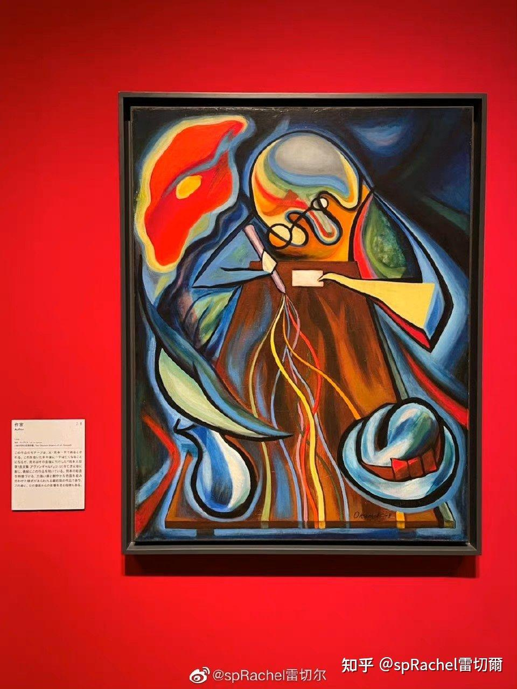

  

Chainsaw Man的灵感不会降临在黑企[chained](https://zhuanlan.zhihu.com/p/523034895)人上。

黑企怎么还不倒闭。

  

## [white作为姓，为何不直接翻译成接地气的白姓？](https://www.zhihu.com/question/571898669/answer/3533509806)

  

因为Black的翻译才是白。当年看《吸血迷情》迷上彼·彼特，再被《情约今生》男主白祖迷死。

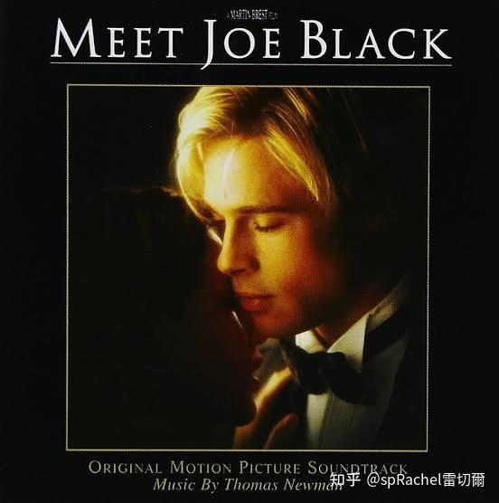

（回答都是古早的Armstrong，这里是幼儿园吗？[发布于 2024-06-17 20:59](https://www.zhihu.com/question/571898669/answer/3533509806)

  

* * *

  

[到底是什么让你坚持写作？](https://www.zhihu.com/question/649199268/answer/3513014882)没人看到也没有意义，这就是他们喜欢当天荒原我的原因

Triborg、Erwin Chen 等 6 人赞同了该回答

两年前答这题被荒原。 看到一個好展，忍不住想寫2000字。 發現一个新艺术家，想寫600字但完美主義加拖延症。 看到爱抖露有新突破，想寫800字。 看到北又让我很開心，想去他日记留言100字。 去到一個新地方旅遊，想寫1500字遊記。 接到约稿寫品牌和商品的之前和之後，想寫1000字相关[有用的知識](https://www.zhihu.com/question/20352200/answer/877419250)、[有感的美學](https://www.zhihu.com/question/452441759/answer/2329512974)和[無用的藝術](https://www.zhihu.com/question/336417193/answer/834469187)。

看到全世界都放開了就傑尼斯的演唱会不讓尖叫，想暴論200字。 看到全世界都可以回家就我窮就那国三年多防民如贼回不去，想罵10000字但都被刪了只能寫上面的字。 其實，10000字大概也就1000被刪，9000是被一群既得利益者、和伥鬼追著罵。 或许现在不会被删，他们会说什么都没发生。 但我已经不想再写。

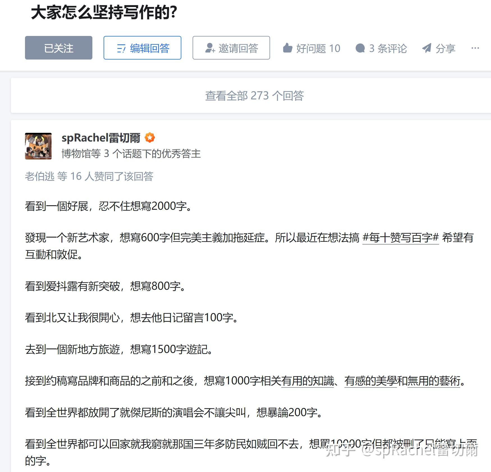

[发布于 2024-05-28 22:08](https://www.zhihu.com/question/649199268/answer/3513014882)・IP 属地日本 ​ 修改

  

* * *

  

[为什么明明很多人喜欢历史但历史学却成了冷门专业？](https://www.zhihu.com/question/303827793/answer/3508233587)

11 人赞同了该回答

用一下知乎句法先问是不是。 喜欢历史的人本来就不多，各位自问线上线下遇到的人里，有几个是以历史为兴趣的？ 最典型就是高考选历史的大部分都谈不上喜欢历史。 男生看上去喜欢历史的更多一些，大多是从游戏、动漫、历史剧、武侠小说中来的，感性地喜欢上后作为谈资和猎奇的更多，但进一步深入到一直喜欢历史、以历史作为兴趣的，总的来说和女生差不多一样少。 以上来自曾经文化沙漠珠三角的观察，更多请看

  

  

然后这些因为出圈文化以为自己喜欢上历史的，大多把时间花在出圈文化本身了，不说正经看历史，连不为了吵架和恰饭的考据党都是珍贵的了。 用电商跳转率来说，从三国游戏，跳转三国演义，再跳到三国历史，还剩多少？ 看过金庸电视剧其中一部，跳到小说已经跳失大部分，有几个会再跳到相关历史？ 把历史作为无功利兴趣的或许有一些是为了逃离肮脏现实。

  

  

例如我看艺术是看展入坑，一度喜欢艺术史，也知道流量喜欢看艺术史，可是，美学艺术学的瘾更大……[编辑于 2024-05-24 10:27](https://www.zhihu.com/question/303827793/answer/3508233587)・IP 属地日本 ​ 修改

  

* * *

  

## [AI绘画有没有艺术价值？你的理由是什么？](https://www.zhihu.com/question/656265840/answer/3502896500)

AI要比某些以标准化、炫技、争流量第一甚至失去人性的作者有价值。 这些大聪明不是在追求独特和人性的艺术表现，而是在取悦和迁就那些只会跟风叫「要创作人民群众不动脑都看懂的艺术」「先看艺术家立场」的。 他们千算万算都比不上AI的算法呀，还浪费粮食呢。唯一能比AI强的是卖惨和脸皮。所以盐碱的好艺术家必须被写成没人理解然后穷死，或者唱颂歌。 [感受下AI答题，和做题家比一比](https://www.zhihu.com/question/655276241/answer/3499593433) [AI绘画的当下，人类美术还有未来吗？](https://www.zhihu.com/question/550568302/answer/2770846522) 我从来都不是讨厌AI，而是生产「民族的」「典型的」「媚俗的」作品的007无趣物种，更讨厌它们的沾沾自喜。

[编辑于 2024-05-19 13:55](https://www.zhihu.com/question/656265840/answer/3502896500)・IP 属地日本 ​ 修改

​赞同 8

## [《歌手2024》被调侃是格莱美 vs 音乐节，欧美歌手嗓音条件真的有先天优势吗？](https://www.zhihu.com/question/656195439/answer/3507117810)

紫山璺 等 5 人赞同了该回答

音乐节怎么了？听个流行曲为什么需要听格莱美学院派的？没有点自己的喜好和判断吗？ 昨天才知道九年义务教育全日制初中音乐教学大纲是要求教音乐知识、唱歌、乐器和欣赏。 原来我还能自己听音乐不用被按头是因为我上了小学，什么课都不听就听了音乐课。 我小学虽不及表姐那家设备好，但还是有学电子琴和竖笛的课，会考试。 考试要求不严，爱玩的玩不爱的随意，考试歌曲自定，我自己肯定吹流行和动画歌，还教感兴趣的同学吹或给他们写简谱。 但正中很多伥鬼主义者下怀，不用考试很多人就是不爱听，没几个人感兴趣。

  

  

我参加合唱队，唱第二声部，老师都不怎么去纠正唱不对低音和音。 大家都跟着第一声部唱主旋律，好久就我一个人唱对，都唱出偏执来了。 导致我后来唱k和搞乐队，对所有能唱和音的人都星星眼。 听我家那些不主打音乐和器乐的爱抖露现场，居然能唱低音和音，比xp对上还开心。 这种事在日本就没什么大不了，但上低音号那种剧情不会出现在国内鼓号队。

  

  

剪中流行音乐就只爱讨论唱功，所谓唱得高和yoaxxbi式9叫，明明大部分生唱连音准都有问题。 幸好我初中后就没听过国语流行曲，高中后连粤语都不听了。 这种比赛节目就扎堆刻奇和卖惨，格莱美卖惨的吗？

  

我只知道这边的音乐节好玩自由丰富。 平日有很多小场子提供给喜欢搞音乐的人去发挥，很多サラリーマン周末背个吉他小号就开jam，哪像我总想躺平后才开练。 列车上月台上每天都看到背着乐器的，看得我又急又懒#貧窮不是不練琴的藉口#

  

* * *

  

## [与日本相比，中国的文化输出有哪些不足之处？](https://www.zhihu.com/question/26469593/answer/2592948137)慌园

王若谷、刘斯坦 等 26 人赞同了该回答

不会写，不敢写，刚在地铁看到JOJO动画十周年广告，顺手查到泥轰15年前是这么搞文化输出的。 **日本媒体艺术100选** 2006年评的，我不敢说，这都是我的童年。不，这就是我二次元，不，是我流行艺术和娱乐鉴赏生涯的70%不为过（剩下20%给杰尼斯，10%给2006年前的香港和美国偶像）。 **アート部門\[**[編集](https://link.zhihu.com/?target=https%3A//ja.wikipedia.org/w/index.php%3Ftitle%3D%25E6%2597%25A5%25E6%259C%25AC%25E3%2581%25AE%25E3%2583%25A1%25E3%2583%2587%25E3%2582%25A3%25E3%2582%25A2%25E8%258A%25B8%25E8%25A1%2593100%25E9%2581%25B8%26action%3Dedit%26section%3D4)**\]**

-   アトムスーツプロジェクト（[ヤノベケンジ](https://link.zhihu.com/?target=https%3A//ja.wikipedia.org/wiki/%25E3%2583%25A4%25E3%2583%258E%25E3%2583%2599%25E3%2582%25B1%25E3%2583%25B3%25E3%2582%25B8)）
-   アルプス一号（[立花ハジメ](https://link.zhihu.com/?target=https%3A//ja.wikipedia.org/wiki/%25E7%25AB%258B%25E8%258A%25B1%25E3%2583%258F%25E3%2582%25B8%25E3%2583%25A1)）
-   映像装置としてのピアノ（[岩井俊雄](https://link.zhihu.com/?target=https%3A//ja.wikipedia.org/wiki/%25E5%25B2%25A9%25E4%25BA%2595%25E4%25BF%258A%25E9%259B%2584)）
-   [NHKスペシャル](https://link.zhihu.com/?target=https%3A//ja.wikipedia.org/wiki/NHK%25E3%2582%25B9%25E3%2583%259A%25E3%2582%25B7%25E3%2583%25A3%25E3%2583%25AB)『驚異の小宇宙人体2脳と心』（[原田大三郎](https://link.zhihu.com/?target=https%3A//ja.wikipedia.org/wiki/%25E5%258E%259F%25E7%2594%25B0%25E5%25A4%25A7%25E4%25B8%2589%25E9%2583%258E)）
-   MPI×IPM（[坂本龍一](https://link.zhihu.com/?target=https%3A//ja.wikipedia.org/wiki/%25E5%259D%2582%25E6%259C%25AC%25E9%25BE%258D%25E4%25B8%2580) / 岩井俊雄）
-   [オープンスカイ](https://link.zhihu.com/?target=https%3A//ja.wikipedia.org/wiki/%25E3%2582%25AA%25E3%2583%25BC%25E3%2583%2597%25E3%2583%25B3%25E3%2582%25B9%25E3%2582%25AB%25E3%2582%25A4)（[八谷和彦](https://link.zhihu.com/?target=https%3A//ja.wikipedia.org/wiki/%25E5%2585%25AB%25E8%25B0%25B7%25E5%2592%258C%25E5%25BD%25A6)）
-   かぼちゃ（[草間彌生](https://link.zhihu.com/?target=https%3A//ja.wikipedia.org/wiki/%25E8%258D%2589%25E9%2596%2593%25E5%25BD%258C%25E7%2594%259F)）
-   坂本龍一 OPERA"LifeCG"（原田大三郎）
-   時間層II（岩井俊雄）
-   視聴覚交換マシン（[八谷和彦](https://link.zhihu.com/?target=https%3A//ja.wikipedia.org/wiki/%25E5%2585%25AB%25E8%25B0%25B7%25E5%2592%258C%25E5%25BD%25A6)）
-   Six String Sonics,The（久野ギル）
-   首都圏清掃整備促進運動（[ハイレッド・センター](https://link.zhihu.com/?target=https%3A//ja.wikipedia.org/wiki/%25E3%2583%258F%25E3%2582%25A4%25E3%2583%25AC%25E3%2583%2583%25E3%2583%2589%25E3%2583%25BB%25E3%2582%25BB%25E3%2583%25B3%25E3%2582%25BF%25E3%2583%25BC)）
-   肖像・[ゴッホ](https://link.zhihu.com/?target=https%3A//ja.wikipedia.org/wiki/%25E3%2583%2595%25E3%2582%25A3%25E3%2583%25B3%25E3%2582%25BB%25E3%2583%25B3%25E3%2583%2588%25E3%2583%25BB%25E3%2583%2595%25E3%2582%25A1%25E3%2583%25B3%25E3%2583%25BB%25E3%2582%25B4%25E3%2583%2583%25E3%2583%259B)（[森村泰昌](https://link.zhihu.com/?target=https%3A//ja.wikipedia.org/wiki/%25E6%25A3%25AE%25E6%259D%2591%25E6%25B3%25B0%25E6%2598%258C)）
-   女神降臨シリーズ（森村泰昌）
-   [太陽の塔](https://link.zhihu.com/?target=https%3A//ja.wikipedia.org/wiki/%25E5%25A4%25AA%25E9%2599%25BD%25E3%2581%25AE%25E5%25A1%2594)（[岡本太郎](https://link.zhihu.com/?target=https%3A//ja.wikipedia.org/wiki/%25E5%25B2%25A1%25E6%259C%25AC%25E5%25A4%25AA%25E9%2583%258E)）
-   突き出す、流れる（[児玉幸子](https://link.zhihu.com/?target=https%3A//ja.wikipedia.org/wiki/%25E5%2585%2590%25E7%258E%2589%25E5%25B9%25B8%25E5%25AD%2590) / 竹野美奈子）
-   TV WAR（ラジカルTV / 坂本龍一 / [浅田彰](https://link.zhihu.com/?target=https%3A//ja.wikipedia.org/wiki/%25E6%25B5%2585%25E7%2594%25B0%25E5%25BD%25B0)）
-   電気服（[田中敦子](https://link.zhihu.com/?target=https%3A//ja.wikipedia.org/wiki/%25E7%2594%25B0%25E4%25B8%25AD%25E6%2595%25A6%25E5%25AD%2590_%28%25E7%2594%25BB%25E5%25AE%25B6%29)）
-   天井の絵/YES(イエス)・ペインティング（[オノ・ヨーコ](https://link.zhihu.com/?target=https%3A//ja.wikipedia.org/wiki/%25E3%2582%25AA%25E3%2583%258E%25E3%2583%25BB%25E3%2583%25A8%25E3%2583%25BC%25E3%2582%25B3)）
-   [ドグラマグラ](https://link.zhihu.com/?target=https%3A//ja.wikipedia.org/wiki/%25E3%2583%2589%25E3%2582%25B0%25E3%2583%25A9%25E3%2583%25BB%25E3%2583%259E%25E3%2582%25B0%25E3%2583%25A9)（[松本俊夫](https://link.zhihu.com/?target=https%3A//ja.wikipedia.org/wiki/%25E6%259D%25BE%25E6%259C%25AC%25E4%25BF%258A%25E5%25A4%25AB)）
-   Bitman（[クワクボリョウタ](https://link.zhihu.com/?target=https%3A//ja.wikipedia.org/wiki/%25E3%2582%25AF%25E3%2583%25AF%25E3%2582%25AF%25E3%2583%259C%25E3%2583%25AA%25E3%2583%25A7%25E3%2582%25A6%25E3%2582%25BF)）
-   ビデオ・レター（[寺山修司](https://link.zhihu.com/?target=https%3A//ja.wikipedia.org/wiki/%25E5%25AF%25BA%25E5%25B1%25B1%25E4%25BF%25AE%25E5%258F%25B8) / [谷川俊太郎](https://link.zhihu.com/?target=https%3A//ja.wikipedia.org/wiki/%25E8%25B0%25B7%25E5%25B7%259D%25E4%25BF%258A%25E5%25A4%25AA%25E9%2583%258E)）
-   ヒロポン（[村上隆](https://link.zhihu.com/?target=https%3A//ja.wikipedia.org/wiki/%25E6%259D%2591%25E4%25B8%258A%25E9%259A%2586)）
-   [明和電機](https://link.zhihu.com/?target=https%3A//ja.wikipedia.org/wiki/%25E6%2598%258E%25E5%2592%258C%25E9%259B%25BB%25E6%25A9%259F)ライブパフォーマンス（[明和電機](https://link.zhihu.com/?target=https%3A//ja.wikipedia.org/wiki/%25E6%2598%258E%25E5%2592%258C%25E9%259B%25BB%25E6%25A9%259F)）
-   湧然する女者達々（[棟方志功](https://link.zhihu.com/?target=https%3A//ja.wikipedia.org/wiki/%25E6%25A3%259F%25E6%2596%25B9%25E5%25BF%2597%25E5%258A%259F)）

**エンターテインメント部門\[**[編集](https://link.zhihu.com/?target=https%3A//ja.wikipedia.org/w/index.php%3Ftitle%3D%25E6%2597%25A5%25E6%259C%25AC%25E3%2581%25AE%25E3%2583%25A1%25E3%2583%2587%25E3%2582%25A3%25E3%2582%25A2%25E8%258A%25B8%25E8%25A1%2593100%25E9%2581%25B8%26action%3Dedit%26section%3D5)**\]**

-   [ウゴウゴルーガ](https://link.zhihu.com/?target=https%3A//ja.wikipedia.org/wiki/%25E3%2582%25A6%25E3%2582%25B4%25E3%2582%25A6%25E3%2582%25B4%25E3%2583%25AB%25E3%2583%25BC%25E3%2582%25AC)（[田中秀幸](https://link.zhihu.com/?target=https%3A//ja.wikipedia.org/wiki/%25E7%2594%25B0%25E4%25B8%25AD%25E7%25A7%2580%25E5%25B9%25B8_%28%25E3%2582%25A2%25E3%2583%25BC%25E3%2583%2588%25E3%2583%2587%25E3%2582%25A3%25E3%2583%25AC%25E3%2582%25AF%25E3%2582%25BF%25E3%2583%25BC%29) / [岩井俊雄](https://link.zhihu.com/?target=https%3A//ja.wikipedia.org/wiki/%25E5%25B2%25A9%25E4%25BA%2595%25E4%25BF%258A%25E9%259B%2584)など）
-   [オセロゲーム](https://link.zhihu.com/?target=https%3A//ja.wikipedia.org/wiki/%25E3%2582%25AA%25E3%2582%25BB%25E3%2583%25AD_%28%25E3%2583%259C%25E3%2583%25BC%25E3%2583%2589%25E3%2582%25B2%25E3%2583%25BC%25E3%2583%25A0%29)（[ツクダ](https://link.zhihu.com/?target=https%3A//ja.wikipedia.org/wiki/%25E3%2583%2584%25E3%2582%25AF%25E3%2583%2580%25E3%2582%25AA%25E3%2583%25AA%25E3%2582%25B8%25E3%2583%258A%25E3%2583%25AB)社）
-   [機動戦士ガンダムプラモデルシリーズ](https://link.zhihu.com/?target=https%3A//ja.wikipedia.org/wiki/%25E3%2582%25AC%25E3%2583%25B3%25E3%2583%2597%25E3%2583%25A9)（[バンダイ](https://link.zhihu.com/?target=https%3A//ja.wikipedia.org/wiki/%25E3%2583%2590%25E3%2583%25B3%25E3%2583%2580%25E3%2582%25A4)社）
-   [ゲームボーイ](https://link.zhihu.com/?target=https%3A//ja.wikipedia.org/wiki/%25E3%2582%25B2%25E3%2583%25BC%25E3%2583%25A0%25E3%2583%259C%25E3%2583%25BC%25E3%2582%25A4)（[任天堂](https://link.zhihu.com/?target=https%3A//ja.wikipedia.org/wiki/%25E4%25BB%25BB%25E5%25A4%25A9%25E5%25A0%2582)社）
-   [ゴジラ](https://link.zhihu.com/?target=https%3A//ja.wikipedia.org/wiki/%25E3%2582%25B4%25E3%2582%25B8%25E3%2583%25A9)（[本多猪四郎](https://link.zhihu.com/?target=https%3A//ja.wikipedia.org/wiki/%25E6%259C%25AC%25E5%25A4%259A%25E7%258C%25AA%25E5%259B%259B%25E9%2583%258E)）
-   [ゴノレゴシリーズ](https://link.zhihu.com/?target=https%3A//ja.wikipedia.org/wiki/%25E3%2582%25B4%25E3%2583%258E%25E3%2583%25AC%25E3%2582%25B4%25E3%2582%25B7%25E3%2583%25AA%25E3%2583%25BC%25E3%2582%25BA)（ポエ山）
-   [人生ゲーム](https://link.zhihu.com/?target=https%3A//ja.wikipedia.org/wiki/%25E4%25BA%25BA%25E7%2594%259F%25E3%2582%25B2%25E3%2583%25BC%25E3%2583%25A0)（[タカラ](https://link.zhihu.com/?target=https%3A//ja.wikipedia.org/wiki/%25E3%2582%25BF%25E3%2582%25AB%25E3%2583%25A9_%28%25E7%258E%25A9%25E5%2585%25B7%25E3%2583%25A1%25E3%2583%25BC%25E3%2582%25AB%25E3%2583%25BC%29)社）
-   [スーパーマリオブラザーズ](https://link.zhihu.com/?target=https%3A//ja.wikipedia.org/wiki/%25E3%2582%25B9%25E3%2583%25BC%25E3%2583%2591%25E3%2583%25BC%25E3%2583%259E%25E3%2583%25AA%25E3%2582%25AA%25E3%2583%2596%25E3%2583%25A9%25E3%2582%25B6%25E3%2583%25BC%25E3%2582%25BA)（任天堂社）
-   [スペースインベーダー](https://link.zhihu.com/?target=https%3A//ja.wikipedia.org/wiki/%25E3%2582%25B9%25E3%2583%259A%25E3%2583%25BC%25E3%2582%25B9%25E3%2582%25A4%25E3%2583%25B3%25E3%2583%2599%25E3%2583%25BC%25E3%2583%2580%25E3%2583%25BC)（[タイトー](https://link.zhihu.com/?target=https%3A//ja.wikipedia.org/wiki/%25E3%2582%25BF%25E3%2582%25A4%25E3%2583%2588%25E3%2583%25BC)社 / [西角友宏](https://link.zhihu.com/?target=https%3A//ja.wikipedia.org/wiki/%25E8%25A5%25BF%25E8%25A7%2592%25E5%258F%258B%25E5%25AE%258F)）
-   [ソーシャル・ネットワーキング・サービス](https://link.zhihu.com/?target=https%3A//ja.wikipedia.org/wiki/%25E3%2582%25BD%25E3%2583%25BC%25E3%2582%25B7%25E3%2583%25A3%25E3%2583%25AB%25E3%2583%25BB%25E3%2583%258D%25E3%2583%2583%25E3%2583%2588%25E3%2583%25AF%25E3%2583%25BC%25E3%2582%25AD%25E3%2583%25B3%25E3%2582%25B0%25E3%2583%25BB%25E3%2582%25B5%25E3%2583%25BC%25E3%2583%2593%25E3%2582%25B9)『[mixi](https://link.zhihu.com/?target=https%3A//ja.wikipedia.org/wiki/Mixi)』（[イー・マーキュリー](https://link.zhihu.com/?target=https%3A//ja.wikipedia.org/wiki/%25E3%2583%259F%25E3%2582%25AF%25E3%2582%25B7%25E3%2582%25A3)社）
-   [ドラゴンクエスト](https://link.zhihu.com/?target=https%3A//ja.wikipedia.org/wiki/%25E3%2583%2589%25E3%2583%25A9%25E3%2582%25B4%25E3%2583%25B3%25E3%2582%25AF%25E3%2582%25A8%25E3%2582%25B9%25E3%2583%2588)（[エニックス](https://link.zhihu.com/?target=https%3A//ja.wikipedia.org/wiki/%25E3%2582%25A8%25E3%2583%258B%25E3%2583%2583%25E3%2582%25AF%25E3%2582%25B9)社）
-   [ドラゴンクエストV 天空の花嫁](https://link.zhihu.com/?target=https%3A//ja.wikipedia.org/wiki/%25E3%2583%2589%25E3%2583%25A9%25E3%2582%25B4%25E3%2583%25B3%25E3%2582%25AF%25E3%2582%25A8%25E3%2582%25B9%25E3%2583%2588V_%25E5%25A4%25A9%25E7%25A9%25BA%25E3%2581%25AE%25E8%258A%25B1%25E5%25AB%2581)（エニックス社）
-   [24時間戦えますか](https://link.zhihu.com/?target=https%3A//ja.wikipedia.org/wiki/%25E3%2583%25AA%25E3%2582%25B2%25E3%2582%25A4%25E3%2583%25B3)（[三共](https://link.zhihu.com/?target=https%3A//ja.wikipedia.org/wiki/%25E4%25B8%2589%25E5%2585%25B1_%28%25E8%25A3%25BD%25E8%2596%25AC%25E4%25BC%259A%25E7%25A4%25BE%29)社）
-   [ニンテンドーDS](https://link.zhihu.com/?target=https%3A//ja.wikipedia.org/wiki/%25E3%2583%258B%25E3%2583%25B3%25E3%2583%2586%25E3%2583%25B3%25E3%2583%2589%25E3%2583%25BCDS)（任天堂社）
-   [ピタゴラスイッチ](https://link.zhihu.com/?target=https%3A//ja.wikipedia.org/wiki/%25E3%2583%2594%25E3%2582%25BF%25E3%2582%25B4%25E3%2583%25A9%25E3%2582%25B9%25E3%2582%25A4%25E3%2583%2583%25E3%2583%2581)（[佐藤雅彦](https://link.zhihu.com/?target=https%3A//ja.wikipedia.org/wiki/%25E4%25BD%2590%25E8%2597%25A4%25E9%259B%2585%25E5%25BD%25A6_%28%25E3%2583%25A1%25E3%2583%2587%25E3%2582%25A3%25E3%2582%25A2%25E3%2582%25AF%25E3%2583%25AA%25E3%2582%25A8%25E3%2583%25BC%25E3%2582%25BF%25E3%2583%25BC%29) / 内野真澄）
-   [ファイナルファンタジーVII](https://link.zhihu.com/?target=https%3A//ja.wikipedia.org/wiki/%25E3%2583%2595%25E3%2582%25A1%25E3%2582%25A4%25E3%2583%258A%25E3%2583%25AB%25E3%2583%2595%25E3%2582%25A1%25E3%2583%25B3%25E3%2582%25BF%25E3%2582%25B8%25E3%2583%25BCVII)（[スクウェア](https://link.zhihu.com/?target=https%3A//ja.wikipedia.org/wiki/%25E3%2582%25B9%25E3%2582%25AF%25E3%2582%25A6%25E3%2582%25A7%25E3%2582%25A2_%28%25E3%2582%25B2%25E3%2583%25BC%25E3%2583%25A0%25E4%25BC%259A%25E7%25A4%25BE%29)社）
-   [ファミリーコンピュータ](https://link.zhihu.com/?target=https%3A//ja.wikipedia.org/wiki/%25E3%2583%2595%25E3%2582%25A1%25E3%2583%259F%25E3%2583%25AA%25E3%2583%25BC%25E3%2582%25B3%25E3%2583%25B3%25E3%2583%2594%25E3%2583%25A5%25E3%2583%25BC%25E3%2582%25BF)（任天堂社）
-   [ぷよぷよ](https://link.zhihu.com/?target=https%3A//ja.wikipedia.org/wiki/%25E3%2581%25B7%25E3%2582%2588%25E3%2581%25B7%25E3%2582%2588)（[サンソフト](https://link.zhihu.com/?target=https%3A//ja.wikipedia.org/wiki/%25E3%2582%25B5%25E3%2583%25B3%25E9%259B%25BB%25E5%25AD%2590)社[\[1\]](https://link.zhihu.com/?target=https%3A//ja.wikipedia.org/wiki/%25E6%2597%25A5%25E6%259C%25AC%25E3%2581%25AE%25E3%2583%25A1%25E3%2583%2587%25E3%2582%25A3%25E3%2582%25A2%25E8%258A%25B8%25E8%25A1%2593100%25E9%2581%25B8%23cite_note-1)）
-   [プレイステーション](https://link.zhihu.com/?target=https%3A//ja.wikipedia.org/wiki/PlayStation_%28%25E3%2582%25B2%25E3%2583%25BC%25E3%2583%25A0%25E6%25A9%259F%29)（[ソニー・コンピュータエンタテインメント](https://link.zhihu.com/?target=https%3A//ja.wikipedia.org/wiki/%25E3%2582%25BD%25E3%2583%258B%25E3%2583%25BC%25E3%2583%25BB%25E3%2582%25B3%25E3%2583%25B3%25E3%2583%2594%25E3%2583%25A5%25E3%2583%25BC%25E3%2582%25BF%25E3%2582%25A8%25E3%2583%25B3%25E3%2582%25BF%25E3%2583%2586%25E3%2582%25A4%25E3%2583%25B3%25E3%2583%25A1%25E3%2583%25B3%25E3%2583%2588)社）
-   [プレイステーション2](https://link.zhihu.com/?target=https%3A//ja.wikipedia.org/wiki/PlayStation_2)（ソニー・コンピュータエンタテインメント社）
-   [ポケットモンスター](https://link.zhihu.com/?target=https%3A//ja.wikipedia.org/wiki/%25E3%2583%259D%25E3%2582%25B1%25E3%2583%2583%25E3%2583%2588%25E3%2583%25A2%25E3%2583%25B3%25E3%2582%25B9%25E3%2582%25BF%25E3%2583%25BC)（任天堂社）
-   [ミニ四駆](https://link.zhihu.com/?target=https%3A//ja.wikipedia.org/wiki/%25E3%2583%259F%25E3%2583%258B%25E5%259B%259B%25E9%25A7%2586)（[田宮模型](https://link.zhihu.com/?target=https%3A//ja.wikipedia.org/wiki/%25E3%2582%25BF%25E3%2583%259F%25E3%2583%25A4)社）
-   [メタルギアソリッド](https://link.zhihu.com/?target=https%3A//ja.wikipedia.org/wiki/%25E3%2583%25A1%25E3%2582%25BF%25E3%2583%25AB%25E3%2582%25AE%25E3%2582%25A2%25E3%2582%25BD%25E3%2583%25AA%25E3%2583%2583%25E3%2583%2589)（[コナミ](https://link.zhihu.com/?target=https%3A//ja.wikipedia.org/wiki/%25E3%2582%25B3%25E3%2583%258A%25E3%2583%259F)社 / [小島秀夫](https://link.zhihu.com/?target=https%3A//ja.wikipedia.org/wiki/%25E5%25B0%258F%25E5%25B3%25B6%25E7%25A7%2580%25E5%25A4%25AB_%28%25E3%2582%25B2%25E3%2583%25BC%25E3%2583%25A0%25E3%2583%2587%25E3%2582%25B6%25E3%2582%25A4%25E3%2583%258A%25E3%2583%25BC%29)）
-   [やわらか戦車](https://link.zhihu.com/?target=https%3A//ja.wikipedia.org/wiki/%25E3%2582%2584%25E3%2582%258F%25E3%2582%2589%25E3%2581%258B%25E6%2588%25A6%25E8%25BB%258A)（[ラレコ](https://link.zhihu.com/?target=https%3A//ja.wikipedia.org/wiki/%25E3%2583%25A9%25E3%2583%25AC%25E3%2582%25B3)）

**アニメ部門\[**[編集](https://link.zhihu.com/?target=https%3A//ja.wikipedia.org/w/index.php%3Ftitle%3D%25E6%2597%25A5%25E6%259C%25AC%25E3%2581%25AE%25E3%2583%25A1%25E3%2583%2587%25E3%2582%25A3%25E3%2582%25A2%25E8%258A%25B8%25E8%25A1%2593100%25E9%2581%25B8%26action%3Dedit%26section%3D6)**\]**

-   [AKIRA](https://link.zhihu.com/?target=https%3A//ja.wikipedia.org/wiki/AKIRA_%28%25E6%25BC%25AB%25E7%2594%25BB%29%23%25E3%2582%25A2%25E3%2583%258B%25E3%2583%25A1%25E6%2598%25A0%25E7%2594%25BB%25E7%2589%2588)（[大友克洋](https://link.zhihu.com/?target=https%3A//ja.wikipedia.org/wiki/%25E5%25A4%25A7%25E5%258F%258B%25E5%2585%258B%25E6%25B4%258B)）
-   [カードキャプターさくら](https://link.zhihu.com/?target=https%3A//ja.wikipedia.org/wiki/%25E3%2582%25AB%25E3%2583%25BC%25E3%2583%2589%25E3%2582%25AD%25E3%2583%25A3%25E3%2583%2597%25E3%2582%25BF%25E3%2583%25BC%25E3%2581%2595%25E3%2581%258F%25E3%2582%2589)（[浅香守生](https://link.zhihu.com/?target=https%3A//ja.wikipedia.org/wiki/%25E6%25B5%2585%25E9%25A6%2599%25E5%25AE%2588%25E7%2594%259F)）
-   [風の谷のナウシカ](https://link.zhihu.com/?target=https%3A//ja.wikipedia.org/wiki/%25E9%25A2%25A8%25E3%2581%25AE%25E8%25B0%25B7%25E3%2581%25AE%25E3%2583%258A%25E3%2582%25A6%25E3%2582%25B7%25E3%2582%25AB_%28%25E6%2598%25A0%25E7%2594%25BB%29)（[宮崎駿](https://link.zhihu.com/?target=https%3A//ja.wikipedia.org/wiki/%25E5%25AE%25AE%25E5%25B4%258E%25E9%25A7%25BF)）
-   [かみちゅ!](https://link.zhihu.com/?target=https%3A//ja.wikipedia.org/wiki/%25E3%2581%258B%25E3%2581%25BF%25E3%2581%25A1%25E3%2582%2585%21)（[舛成孝二](https://link.zhihu.com/?target=https%3A//ja.wikipedia.org/wiki/%25E8%2588%259B%25E6%2588%2590%25E5%25AD%259D%25E4%25BA%258C)）
-   [機動警察パトレイバー 2 the Movie](https://link.zhihu.com/?target=https%3A//ja.wikipedia.org/wiki/%25E6%25A9%259F%25E5%258B%2595%25E8%25AD%25A6%25E5%25AF%259F%25E3%2583%2591%25E3%2583%2588%25E3%2583%25AC%25E3%2582%25A4%25E3%2583%2590%25E3%2583%25BC_2_the_Movie)（[押井守](https://link.zhihu.com/?target=https%3A//ja.wikipedia.org/wiki/%25E6%258A%25BC%25E4%25BA%2595%25E5%25AE%2588)）
-   [機動戦士ガンダム](https://link.zhihu.com/?target=https%3A//ja.wikipedia.org/wiki/%25E6%25A9%259F%25E5%258B%2595%25E6%2588%25A6%25E5%25A3%25AB%25E3%2582%25AC%25E3%2583%25B3%25E3%2583%2580%25E3%2583%25A0)（富野喜幸（現・[富野由悠季](https://link.zhihu.com/?target=https%3A//ja.wikipedia.org/wiki/%25E5%25AF%258C%25E9%2587%258E%25E7%2594%25B1%25E6%2582%25A0%25E5%25AD%25A3)））
-   [機動戦士ガンダム 逆襲のシャア](https://link.zhihu.com/?target=https%3A//ja.wikipedia.org/wiki/%25E6%25A9%259F%25E5%258B%2595%25E6%2588%25A6%25E5%25A3%25AB%25E3%2582%25AC%25E3%2583%25B3%25E3%2583%2580%25E3%2583%25A0_%25E9%2580%2586%25E8%25A5%25B2%25E3%2581%25AE%25E3%2582%25B7%25E3%2583%25A3%25E3%2582%25A2)（富野由悠季）
-   [機動戦士Ζガンダム](https://link.zhihu.com/?target=https%3A//ja.wikipedia.org/wiki/%25E6%25A9%259F%25E5%258B%2595%25E6%2588%25A6%25E5%25A3%25AB%25CE%2596%25E3%2582%25AC%25E3%2583%25B3%25E3%2583%2580%25E3%2583%25A0)（富野由悠季）
-   [銀河英雄伝説](https://link.zhihu.com/?target=https%3A//ja.wikipedia.org/wiki/%25E9%258A%2580%25E6%25B2%25B3%25E8%258B%25B1%25E9%259B%2584%25E4%25BC%259D%25E8%25AA%25AC_%28%25E3%2582%25A2%25E3%2583%258B%25E3%2583%25A1%29)（[石黒昇](https://link.zhihu.com/?target=https%3A//ja.wikipedia.org/wiki/%25E7%259F%25B3%25E9%25BB%2592%25E6%2598%2587)）
-   [紅の豚](https://link.zhihu.com/?target=https%3A//ja.wikipedia.org/wiki/%25E7%25B4%2585%25E3%2581%25AE%25E8%25B1%259A)（[宮崎駿](https://link.zhihu.com/?target=https%3A//ja.wikipedia.org/wiki/%25E5%25AE%25AE%25E5%25B4%258E%25E9%25A7%25BF)）
-   [クレヨンしんちゃん 嵐を呼ぶ モーレツ!オトナ帝国の逆襲](https://link.zhihu.com/?target=https%3A//ja.wikipedia.org/wiki/%25E3%2582%25AF%25E3%2583%25AC%25E3%2583%25A8%25E3%2583%25B3%25E3%2581%2597%25E3%2582%2593%25E3%2581%25A1%25E3%2582%2583%25E3%2582%2593_%25E5%25B5%2590%25E3%2582%2592%25E5%2591%25BC%25E3%2581%25B6_%25E3%2583%25A2%25E3%2583%25BC%25E3%2583%25AC%25E3%2583%2584%21%25E3%2582%25AA%25E3%2583%2588%25E3%2583%258A%25E5%25B8%259D%25E5%259B%25BD%25E3%2581%25AE%25E9%2580%2586%25E8%25A5%25B2)（[原恵一](https://link.zhihu.com/?target=https%3A//ja.wikipedia.org/wiki/%25E5%258E%259F%25E6%2581%25B5%25E4%25B8%2580)）
-   [攻殻機動隊 STAND ALONE COMPLEX](https://link.zhihu.com/?target=https%3A//ja.wikipedia.org/wiki/%25E6%2594%25BB%25E6%25AE%25BB%25E6%25A9%259F%25E5%258B%2595%25E9%259A%258A_STAND_ALONE_COMPLEX)（[神山健治](https://link.zhihu.com/?target=https%3A//ja.wikipedia.org/wiki/%25E7%25A5%259E%25E5%25B1%25B1%25E5%2581%25A5%25E6%25B2%25BB)）
-   [GHOST IN THE SHELL / 攻殻機動隊](https://link.zhihu.com/?target=https%3A//ja.wikipedia.org/wiki/GHOST_IN_THE_SHELL_/_%25E6%2594%25BB%25E6%25AE%25BB%25E6%25A9%259F%25E5%258B%2595%25E9%259A%258A)（[押井守](https://link.zhihu.com/?target=https%3A//ja.wikipedia.org/wiki/%25E6%258A%25BC%25E4%25BA%2595%25E5%25AE%2588)）
-   [新世紀エヴァンゲリオン](https://link.zhihu.com/?target=https%3A//ja.wikipedia.org/wiki/%25E6%2596%25B0%25E4%25B8%2596%25E7%25B4%2580%25E3%2582%25A8%25E3%2583%25B4%25E3%2582%25A1%25E3%2583%25B3%25E3%2582%25B2%25E3%2583%25AA%25E3%2582%25AA%25E3%2583%25B3)（[庵野秀明](https://link.zhihu.com/?target=https%3A//ja.wikipedia.org/wiki/%25E5%25BA%25B5%25E9%2587%258E%25E7%25A7%2580%25E6%2598%258E)）
-   [涼宮ハルヒの憂鬱](https://link.zhihu.com/?target=https%3A//ja.wikipedia.org/wiki/%25E6%25B6%25BC%25E5%25AE%25AE%25E3%2583%258F%25E3%2583%25AB%25E3%2583%2592%25E3%2581%25AE%25E6%2586%2582%25E9%25AC%25B1_%28%25E3%2582%25A2%25E3%2583%258B%25E3%2583%25A1%29)（[石原立也](https://link.zhihu.com/?target=https%3A//ja.wikipedia.org/wiki/%25E7%259F%25B3%25E5%258E%259F%25E7%25AB%258B%25E4%25B9%259F)）
-   [千と千尋の神隠し](https://link.zhihu.com/?target=https%3A//ja.wikipedia.org/wiki/%25E5%258D%2583%25E3%2581%25A8%25E5%258D%2583%25E5%25B0%258B%25E3%2581%25AE%25E7%25A5%259E%25E9%259A%25A0%25E3%2581%2597)（宮崎駿）
-   [天空の城ラピュタ](https://link.zhihu.com/?target=https%3A//ja.wikipedia.org/wiki/%25E5%25A4%25A9%25E7%25A9%25BA%25E3%2581%25AE%25E5%259F%258E%25E3%2583%25A9%25E3%2583%2594%25E3%2583%25A5%25E3%2582%25BF)（宮崎駿）
-   [となりのトトロ](https://link.zhihu.com/?target=https%3A//ja.wikipedia.org/wiki/%25E3%2581%25A8%25E3%2581%25AA%25E3%2582%258A%25E3%2581%25AE%25E3%2583%2588%25E3%2583%2588%25E3%2583%25AD)（宮崎駿）
-   [ドラえもん](https://link.zhihu.com/?target=https%3A//ja.wikipedia.org/wiki/%25E3%2583%2589%25E3%2583%25A9%25E3%2581%2588%25E3%2582%2582%25E3%2582%2593_%281979%25E5%25B9%25B4%25E3%2581%25AE%25E3%2583%2586%25E3%2583%25AC%25E3%2583%2593%25E3%2582%25A2%25E3%2583%258B%25E3%2583%25A1%29)（[芝山努](https://link.zhihu.com/?target=https%3A//ja.wikipedia.org/wiki/%25E8%258A%259D%25E5%25B1%25B1%25E5%258A%25AA)）
-   [ドラゴンボール](https://link.zhihu.com/?target=https%3A//ja.wikipedia.org/wiki/%25E3%2583%2589%25E3%2583%25A9%25E3%2582%25B4%25E3%2583%25B3%25E3%2583%259C%25E3%2583%25BC%25E3%2583%25AB_%28%25E3%2582%25A2%25E3%2583%258B%25E3%2583%25A1%29)シリーズ（[西尾大介](https://link.zhihu.com/?target=https%3A//ja.wikipedia.org/wiki/%25E8%25A5%25BF%25E5%25B0%25BE%25E5%25A4%25A7%25E4%25BB%258B)）
-   [鋼の錬金術師](https://link.zhihu.com/?target=https%3A//ja.wikipedia.org/wiki/%25E9%258B%25BC%25E3%2581%25AE%25E9%258C%25AC%25E9%2587%2591%25E8%25A1%2593%25E5%25B8%25AB_%28%25E3%2582%25A2%25E3%2583%258B%25E3%2583%25A1%29)（[水島精二](https://link.zhihu.com/?target=https%3A//ja.wikipedia.org/wiki/%25E6%25B0%25B4%25E5%25B3%25B6%25E7%25B2%25BE%25E4%25BA%258C)）
-   [劇場版 鋼の錬金術師 シャンバラを征く者](https://link.zhihu.com/?target=https%3A//ja.wikipedia.org/wiki/%25E5%258A%2587%25E5%25A0%25B4%25E7%2589%2588_%25E9%258B%25BC%25E3%2581%25AE%25E9%258C%25AC%25E9%2587%2591%25E8%25A1%2593%25E5%25B8%25AB_%25E3%2582%25B7%25E3%2583%25A3%25E3%2583%25B3%25E3%2583%2590%25E3%2583%25A9%25E3%2582%2592%25E5%25BE%2581%25E3%2581%258F%25E8%2580%2585)（水島精二）
-   [蟲師](https://link.zhihu.com/?target=https%3A//ja.wikipedia.org/wiki/%25E8%259F%25B2%25E5%25B8%25AB)（[長濱博史](https://link.zhihu.com/?target=https%3A//ja.wikipedia.org/wiki/%25E9%2595%25B7%25E6%25BF%25B1%25E5%258D%259A%25E5%258F%25B2)）
-   [もののけ姫](https://link.zhihu.com/?target=https%3A//ja.wikipedia.org/wiki/%25E3%2582%2582%25E3%2581%25AE%25E3%2581%25AE%25E3%2581%2591%25E5%25A7%25AB)（宮崎駿）
-   [ルパン三世 カリオストロの城](https://link.zhihu.com/?target=https%3A//ja.wikipedia.org/wiki/%25E3%2583%25AB%25E3%2583%2591%25E3%2583%25B3%25E4%25B8%2589%25E4%25B8%2596_%25E3%2582%25AB%25E3%2583%25AA%25E3%2582%25AA%25E3%2582%25B9%25E3%2583%2588%25E3%2583%25AD%25E3%2581%25AE%25E5%259F%258E)（宮崎駿）

**マンガ部門\[**[編集](https://link.zhihu.com/?target=https%3A//ja.wikipedia.org/w/index.php%3Ftitle%3D%25E6%2597%25A5%25E6%259C%25AC%25E3%2581%25AE%25E3%2583%25A1%25E3%2583%2587%25E3%2582%25A3%25E3%2582%25A2%25E8%258A%25B8%25E8%25A1%2593100%25E9%2581%25B8%26action%3Dedit%26section%3D7)**\]**

-   [AKIRA](https://link.zhihu.com/?target=https%3A//ja.wikipedia.org/wiki/AKIRA_%28%25E6%25BC%25AB%25E7%2594%25BB%29)（[大友克洋](https://link.zhihu.com/?target=https%3A//ja.wikipedia.org/wiki/%25E5%25A4%25A7%25E5%258F%258B%25E5%2585%258B%25E6%25B4%258B)）
-   [あずまんが大王](https://link.zhihu.com/?target=https%3A//ja.wikipedia.org/wiki/%25E3%2581%2582%25E3%2581%259A%25E3%2581%25BE%25E3%2582%2593%25E3%2581%258C%25E5%25A4%25A7%25E7%258E%258B)（[あずまきよひこ](https://link.zhihu.com/?target=https%3A//ja.wikipedia.org/wiki/%25E3%2581%2582%25E3%2581%259A%25E3%2581%25BE%25E3%2581%258D%25E3%2582%2588%25E3%2581%25B2%25E3%2581%2593)）
-   [うしおととら](https://link.zhihu.com/?target=https%3A//ja.wikipedia.org/wiki/%25E3%2581%2586%25E3%2581%2597%25E3%2581%258A%25E3%2581%25A8%25E3%2581%25A8%25E3%2582%2589)（[藤田和日郎](https://link.zhihu.com/?target=https%3A//ja.wikipedia.org/wiki/%25E8%2597%25A4%25E7%2594%25B0%25E5%2592%258C%25E6%2597%25A5%25E9%2583%258E)）
-   [おおきく振りかぶって](https://link.zhihu.com/?target=https%3A//ja.wikipedia.org/wiki/%25E3%2581%258A%25E3%2581%258A%25E3%2581%258D%25E3%2581%258F%25E6%258C%25AF%25E3%2582%258A%25E3%2581%258B%25E3%2581%25B6%25E3%2581%25A3%25E3%2581%25A6)（[ひぐちアサ](https://link.zhihu.com/?target=https%3A//ja.wikipedia.org/wiki/%25E3%2581%25B2%25E3%2581%2590%25E3%2581%25A1%25E3%2582%25A2%25E3%2582%25B5)）
-   [風の谷のナウシカ](https://link.zhihu.com/?target=https%3A//ja.wikipedia.org/wiki/%25E9%25A2%25A8%25E3%2581%25AE%25E8%25B0%25B7%25E3%2581%25AE%25E3%2583%258A%25E3%2582%25A6%25E3%2582%25B7%25E3%2582%25AB)（[宮崎駿](https://link.zhihu.com/?target=https%3A//ja.wikipedia.org/wiki/%25E5%25AE%25AE%25E5%25B4%258E%25E9%25A7%25BF)）
-   [寄生獣](https://link.zhihu.com/?target=https%3A//ja.wikipedia.org/wiki/%25E5%25AF%2584%25E7%2594%259F%25E7%258D%25A3)（[岩明均](https://link.zhihu.com/?target=https%3A//ja.wikipedia.org/wiki/%25E5%25B2%25A9%25E6%2598%258E%25E5%259D%2587)）
-   [ジョジョの奇妙な冒険](https://link.zhihu.com/?target=https%3A//ja.wikipedia.org/wiki/%25E3%2582%25B8%25E3%2583%25A7%25E3%2582%25B8%25E3%2583%25A7%25E3%2581%25AE%25E5%25A5%2587%25E5%25A6%2599%25E3%2581%25AA%25E5%2586%2592%25E9%2599%25BA)（[荒木飛呂彦](https://link.zhihu.com/?target=https%3A//ja.wikipedia.org/wiki/%25E8%258D%2592%25E6%259C%25A8%25E9%25A3%259B%25E5%2591%2582%25E5%25BD%25A6)）
-   [スラムダンク](https://link.zhihu.com/?target=https%3A//ja.wikipedia.org/wiki/SLAM_DUNK)（[井上雄彦](https://link.zhihu.com/?target=https%3A//ja.wikipedia.org/wiki/%25E4%25BA%2595%25E4%25B8%258A%25E9%259B%2584%25E5%25BD%25A6)）
-   [DEATH NOTE](https://link.zhihu.com/?target=https%3A//ja.wikipedia.org/wiki/DEATH_NOTE)（[小畑健](https://link.zhihu.com/?target=https%3A//ja.wikipedia.org/wiki/%25E5%25B0%258F%25E7%2595%2591%25E5%2581%25A5)・画 / [大場つぐみ](https://link.zhihu.com/?target=https%3A//ja.wikipedia.org/wiki/%25E5%25A4%25A7%25E5%25A0%25B4%25E3%2581%25A4%25E3%2581%2590%25E3%2581%25BF)・原作）
-   [動物のお医者さん](https://link.zhihu.com/?target=https%3A//ja.wikipedia.org/wiki/%25E5%258B%2595%25E7%2589%25A9%25E3%2581%25AE%25E3%2581%258A%25E5%258C%25BB%25E8%2580%2585%25E3%2581%2595%25E3%2582%2593)（[佐々木倫子](https://link.zhihu.com/?target=https%3A//ja.wikipedia.org/wiki/%25E4%25BD%2590%25E3%2580%2585%25E6%259C%25A8%25E5%2580%25AB%25E5%25AD%2590)）
-   [ドラえもん](https://link.zhihu.com/?target=https%3A//ja.wikipedia.org/wiki/%25E3%2583%2589%25E3%2583%25A9%25E3%2581%2588%25E3%2582%2582%25E3%2582%2593)（[藤子不二雄](https://link.zhihu.com/?target=https%3A//ja.wikipedia.org/wiki/%25E8%2597%25A4%25E5%25AD%2590%25E4%25B8%258D%25E4%25BA%258C%25E9%259B%2584)（[藤子・F・不二雄](https://link.zhihu.com/?target=https%3A//ja.wikipedia.org/wiki/%25E8%2597%25A4%25E5%25AD%2590%25E3%2583%25BBF%25E3%2583%25BB%25E4%25B8%258D%25E4%25BA%258C%25E9%259B%2584)））
-   [ドラゴンボール](https://link.zhihu.com/?target=https%3A//ja.wikipedia.org/wiki/%25E3%2583%2589%25E3%2583%25A9%25E3%2582%25B4%25E3%2583%25B3%25E3%2583%259C%25E3%2583%25BC%25E3%2583%25AB)（[鳥山明](https://link.zhihu.com/?target=https%3A//ja.wikipedia.org/wiki/%25E9%25B3%25A5%25E5%25B1%25B1%25E6%2598%258E)）
-   [のだめカンタービレ](https://link.zhihu.com/?target=https%3A//ja.wikipedia.org/wiki/%25E3%2581%25AE%25E3%2581%25A0%25E3%2582%2581%25E3%2582%25AB%25E3%2583%25B3%25E3%2582%25BF%25E3%2583%25BC%25E3%2583%2593%25E3%2583%25AC)（[二ノ宮知子](https://link.zhihu.com/?target=https%3A//ja.wikipedia.org/wiki/%25E4%25BA%258C%25E3%2583%258E%25E5%25AE%25AE%25E7%259F%25A5%25E5%25AD%2590)）
-   [鋼の錬金術師](https://link.zhihu.com/?target=https%3A//ja.wikipedia.org/wiki/%25E9%258B%25BC%25E3%2581%25AE%25E9%258C%25AC%25E9%2587%2591%25E8%25A1%2593%25E5%25B8%25AB)（[荒川弘](https://link.zhihu.com/?target=https%3A//ja.wikipedia.org/wiki/%25E8%258D%2592%25E5%25B7%259D%25E5%25BC%2598)）
-   [HUNTER×HUNTER](https://link.zhihu.com/?target=https%3A//ja.wikipedia.org/wiki/HUNTER%25C3%2597HUNTER)（[冨樫義博](https://link.zhihu.com/?target=https%3A//ja.wikipedia.org/wiki/%25E5%2586%25A8%25E6%25A8%25AB%25E7%25BE%25A9%25E5%258D%259A)）
-   [火の鳥](https://link.zhihu.com/?target=https%3A//ja.wikipedia.org/wiki/%25E7%2581%25AB%25E3%2581%25AE%25E9%25B3%25A5_%28%25E6%25BC%25AB%25E7%2594%25BB%29)（[手塚治虫](https://link.zhihu.com/?target=https%3A//ja.wikipedia.org/wiki/%25E6%2589%258B%25E5%25A1%259A%25E6%25B2%25BB%25E8%2599%25AB)）
-   [ブラック・ジャック](https://link.zhihu.com/?target=https%3A//ja.wikipedia.org/wiki/%25E3%2583%2596%25E3%2583%25A9%25E3%2583%2583%25E3%2582%25AF%25E3%2583%25BB%25E3%2582%25B8%25E3%2583%25A3%25E3%2583%2583%25E3%2582%25AF)（手塚治虫）
-   [HELLSING](https://link.zhihu.com/?target=https%3A//ja.wikipedia.org/wiki/HELLSING)（[平野耕太](https://link.zhihu.com/?target=https%3A//ja.wikipedia.org/wiki/%25E5%25B9%25B3%25E9%2587%258E%25E8%2580%2595%25E5%25A4%25AA)）
-   [ベルセルク](https://link.zhihu.com/?target=https%3A//ja.wikipedia.org/wiki/%25E3%2583%2599%25E3%2583%25AB%25E3%2582%25BB%25E3%2583%25AB%25E3%2582%25AF_%28%25E6%25BC%25AB%25E7%2594%25BB%29)（[三浦建太郎](https://link.zhihu.com/?target=https%3A//ja.wikipedia.org/wiki/%25E4%25B8%2589%25E6%25B5%25A6%25E5%25BB%25BA%25E5%25A4%25AA%25E9%2583%258E)）
-   [北斗の拳](https://link.zhihu.com/?target=https%3A//ja.wikipedia.org/wiki/%25E5%258C%2597%25E6%2596%2597%25E3%2581%25AE%25E6%258B%25B3)（[原哲夫](https://link.zhihu.com/?target=https%3A//ja.wikipedia.org/wiki/%25E5%258E%259F%25E5%2593%25B2%25E5%25A4%25AB)・画 / [武論尊](https://link.zhihu.com/?target=https%3A//ja.wikipedia.org/wiki/%25E6%25AD%25A6%25E8%25AB%2596%25E5%25B0%258A)・原作）
-   [蟲師](https://link.zhihu.com/?target=https%3A//ja.wikipedia.org/wiki/%25E8%259F%25B2%25E5%25B8%25AB)（[漆原友紀](https://link.zhihu.com/?target=https%3A//ja.wikipedia.org/wiki/%25E6%25BC%2586%25E5%258E%259F%25E5%258F%258B%25E7%25B4%2580)）
-   [MONSTER](https://link.zhihu.com/?target=https%3A//ja.wikipedia.org/wiki/MONSTER_%28%25E6%25BC%25AB%25E7%2594%25BB%29)（[浦沢直樹](https://link.zhihu.com/?target=https%3A//ja.wikipedia.org/wiki/%25E6%25B5%25A6%25E6%25B2%25A2%25E7%259B%25B4%25E6%25A8%25B9)）
-   [幽☆遊☆白書](https://link.zhihu.com/?target=https%3A//ja.wikipedia.org/wiki/%25E5%25B9%25BD%25E2%2598%2586%25E9%2581%258A%25E2%2598%2586%25E7%2599%25BD%25E6%259B%25B8)（冨樫義博）
-   [よつばと!](https://link.zhihu.com/?target=https%3A//ja.wikipedia.org/wiki/%25E3%2582%2588%25E3%2581%25A4%25E3%2581%25B0%25E3%2581%25A8%21)（あずまきよひこ）
-   [ONE PIECE](https://link.zhihu.com/?target=https%3A//ja.wikipedia.org/wiki/ONE_PIECE)（[尾田栄一郎](https://link.zhihu.com/?target=https%3A//ja.wikipedia.org/wiki/%25E5%25B0%25BE%25E7%2594%25B0%25E6%25A0%2584%25E4%25B8%2580%25E9%2583%258E)）

这个评选是2006年办的，由一般群众和专家组成选票。 2007在国立新美术馆搞了一个汇报展，那个美术馆搞日本文化外宣就是常事了。 2年前我去过一个先去法国再转东京内销的外宣二次元展，非常满足我这种小气怀旧宅，当然它要外宣同时也搞得很满足看大气和漂亮布展的人的需求。

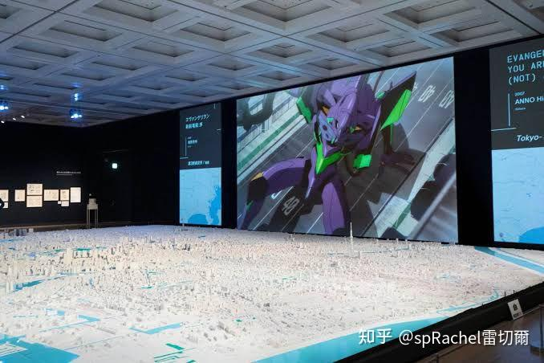

好家伙流量这么多没几个赞，倒害得我时间线一堆夏日祭……准备匿了……走之前再精神污染一下

  

[编辑于 2022-07-26 22:41](https://www.zhihu.com/question/26469593/answer/2592948137)・IP 属地日本

  

* * *

  

[求一个高水平的自我介绍?](https://www.zhihu.com/question/483486920/answer/2094365578)

6 人赞同了该回答

为什么不能匿名…… 推荐一本书 目录如下 从“组织时代”到“个体时代”003 理由1：组织结构改变了006 理由2：企业的价值观改变了012 理由3：工作方法和学习方法发生改变016 理由4：技能需求改变了021 第二章 预期管理决定成败029 “争取被记住”是错误的031 比起被记住，更重要的是被期待036 管理预期的“AIMAS模型”040 事例1：给对方“悦耳的噪声”045 事例2：用“礼物”赢得人心，创造期待048 事例3：通过“请求”加强你的人际关系052 第三章 强的自我介绍是畅谈未来055 不擅长表达也没有关系057 强模式与弱模式061 用“动词”代替“名词”069 我相信：“未来”的创造方法072 我可以创造/改变：如何创造“过去”075 我能帮助：“现在”的创造方法078 第四章 帮助你了解自己的七种道具085 自我“盘点”087 七种道具之一：自我分析表091 七种道具之二：为名字赋予意义095 七种道具之三：品牌形象099 七种道具之四：人生就是一个甜甜圈105 七种道具之五：职业算法110 七种道具之六：贴上容易被发现的标签114 七种道具之七：重新定义工作的意义122 第五章 跨界使人生更丰富131 个人职业道路规划133 寻找能引起摩擦的相遇141 做什么不重要，重要的是与谁合作146 结束语155 参考文献159

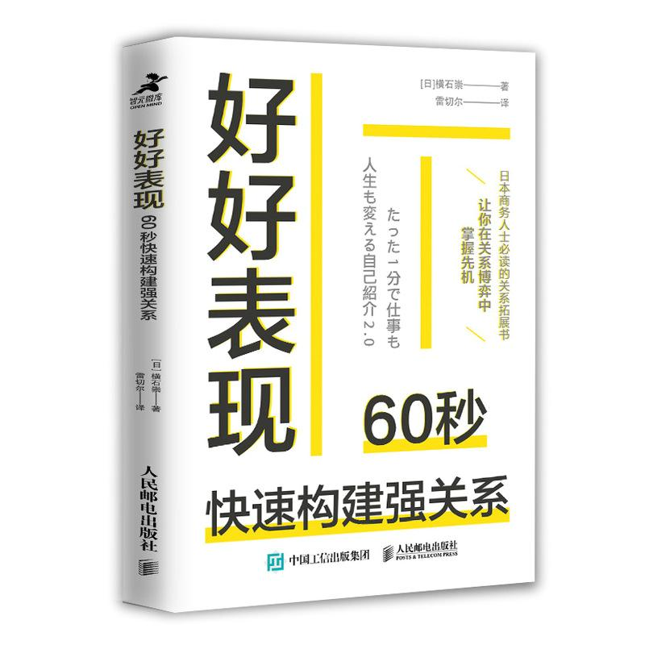

[发布于 2021-08-31 11:30](https://www.zhihu.com/question/483486920/answer/2094365578) ​ 修改（有未发布的编辑草稿）

  

* * *

  

## 中国留学生毁了伦敦街区涂鸦墙，对此有什么看法？

有几千赞的大题方圆了。 游击来这里。 在墙上的涂鸦反应了很多人对墙和对涂鸦的理解不一样。 本人不懂政治，聊一下经验。 关于作品质量本身，很多人还停留在讨论美不美，甚至还说艺术史意义，我之前一直写的时代变了，当代艺术不是这样看的。[^1] 毕竟目前世界上最著名甚至有人认为是没有之一的艺术家就是个涂鸦艺术家。

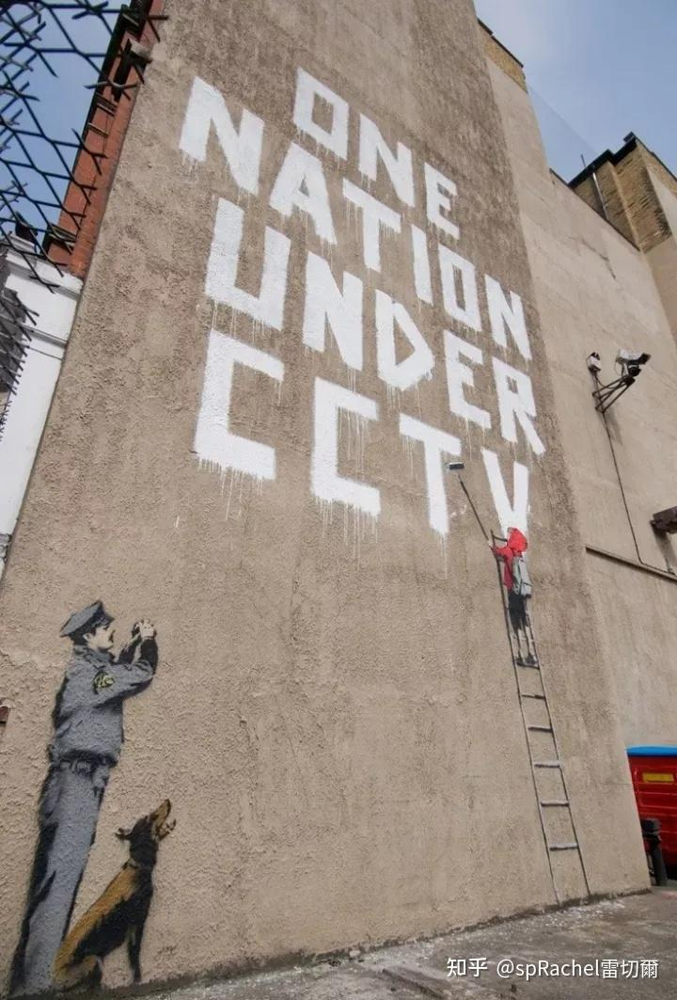

班克西[^2]也有很简单粗暴的作品的（但这个图也被其他平台删过很多次） 我第一时间问了我认识的国内涂鸦朋友，他只说一句这作者沙币。 至于先去看作者是否道德和违法的……也不是我主要想讨论的。 但我觉得那些跑去开盒的（噢我今早才学会这个词），和那些一直只会骂毕加索是渣男和洗钱的也没区别。 根据我在看到方圆贴里其他人贴过来的艺术家自述，感觉这人可能真是我认识的真小粉红，就像很多现在在国外艺术留学的，以及在国内混得很好的利益既得者的子女，他们会自称是小粉红，也真的是爱国。 其实95后大部分除了北极这种你根本奈他不何的，目前父母还在国内的小粉红还是蛮清醒的。 这也不关我事只要他不是我领导来吸我的血。 我注意到他们也只是他们不知道其他人没有他们那么好的条件，他们看到的东西不一样也是真的。 所以他们会看不懂西方的艺术，会觉得当代艺术都丑和捣乱。 他们会觉得他们在国内在生存条件很好的情况下接触到的艺术很好。想让国内的传统的或者是潮流的文化，也被宣扬到他们留学（不一定定居，就算拿到了身份，他们更多是会回来的）的地方。 觉得西方才是真的脏乱差。来到日本也保留着中国胃。 但还是有一些例外的，但也多数是这两年才悟了的。

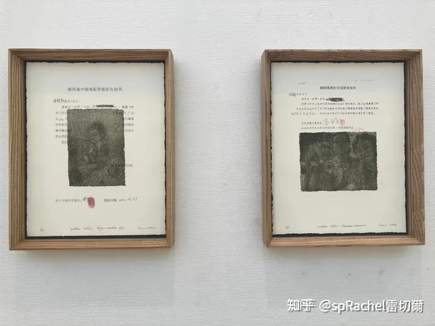

在我去英国前其实我不知道国内贫富悬殊这么厉害，因为我那一代广东人即使是既得利益富起来了，也很低调，毕竟是学生也不会过多去用父母的钱。 我去英国时候发现很多比我小的非广东留学生，实在是让我开了眼。我以前一直觉得广东和包邮区是国内经济最发达的地区。但那些不是来自这地区的留学生，才是最富和表现得最富的，而且他们是真的不知道其他人和他们不是一个富的水平，他们会默认你懂他们的价值观和对名牌的执着…… 别说现在我不看小红书了，那时候还没有小红书呢。我懂个鬼。 话说，这样无聊的作品恰好小野洋子也有类似的，是她标志性作品之一，昨天又在东京现代美术馆看到一次，无聊到照片都懒得拍了。

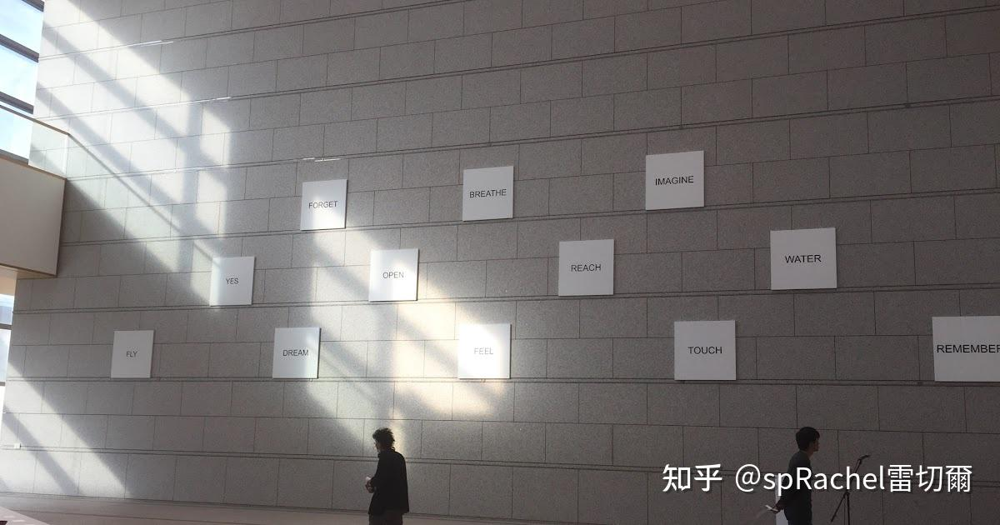

参考

1.  [^](https://www.zhihu.com/question/615939877/answer/3153682391#ref_1_0)人对美术可以无知到何种程度? [https://www.zhihu.com/question/333833021/answer/2467913080?utm\_source=zhihu&utm\_medium=social&utm\_oi=46133057421312](https://www.zhihu.com/question/333833021/answer/2467913080?utm_source=zhihu&utm_medium=social&utm_oi=46133057421312)
2.  [^](https://www.zhihu.com/question/615939877/answer/3153682391#ref_2_0)如何看待涂鸦艺术家班克西（Banksy）在拍卖会上自毁作品这一行为？艺术作品价值该如何去衡量？ [https://www.zhihu.com/question/297525082/answer/506275447](https://www.zhihu.com/question/297525082/answer/506275447)

  

[发布于 2023-08-07 10:51](https://www.zhihu.com/question/615939877/answer/3153682391)・IP 属地日本 ​ 修改

  

* * *

  

## 中国是一个适合旅游的国家吗？

虾扯蛋777、劉亞閤 等 13 人赞同了该回答

说个前移动互联网时代就存在的问题吧…… 人与人（阶层、地域）之间物质和思想上的差别太大，而个人的界限又如此窄，总让跟自己不一样的人痛苦。 所以不适合生活、交流或不交流、旅游……特别不适合穷人、不喜欢扎堆的人、少数派…… 移动互联网解决了一部分问题但因为字节系算法大聪明所以也加深了这个问题……[编辑于 2023-11-16 09:06](https://www.zhihu.com/question/508065742/answer/3290501868)・IP 属地日本

## [能看看你在博物馆里拍得最好的照片吗？哪件文物曾让你受到来自老祖宗的「审美暴击」？](https://www.zhihu.com/question/655236553/answer/3496801657)

Triborg 等 6 人赞同了该回答

昨天骂白瓷，今天的刻奇假花更可怕了。

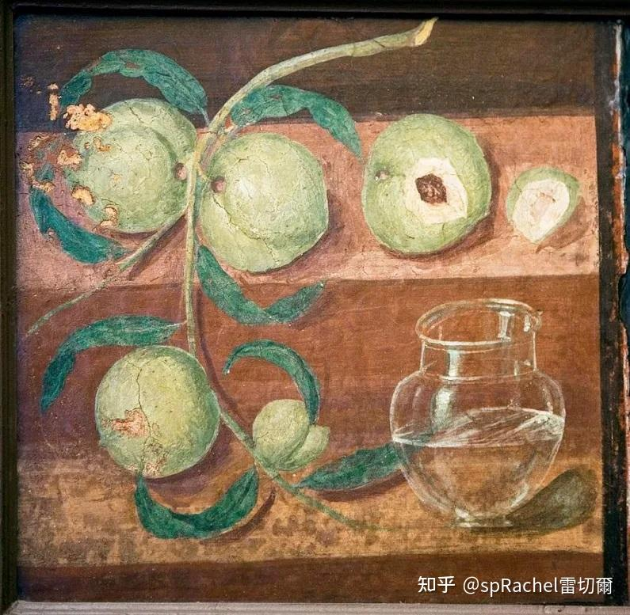

在常玉拍卖纪录中，瓶花作品占6幅，当中4幅同为菊花主题，其中2幅菊花以破亿港元天价落槌，2020年7月《青花盆中盛开的菊花》以1.9亿港元拍出，刷新常玉静物画作纪录。 中华文化中菊花代表高洁刚强，为仁人贤士之精神象征，常玉了解其意义非凡并藉此抒发感悟，三十多年来以菊花为题的创作比任何其他花卉都为多。 西方文化又怎么看花卉和静物画的呢？ **亚历山大·卡茨**说：「美女、鲜花，你觉得我是认真的？我拒绝认真的艺术。」

你们老祖宗明明更有文化、也能欣赏写意，到你们这就变成白瘦嫩和画得真像了？ 我骂归骂，不用给我推画得真像的内容。oet6。

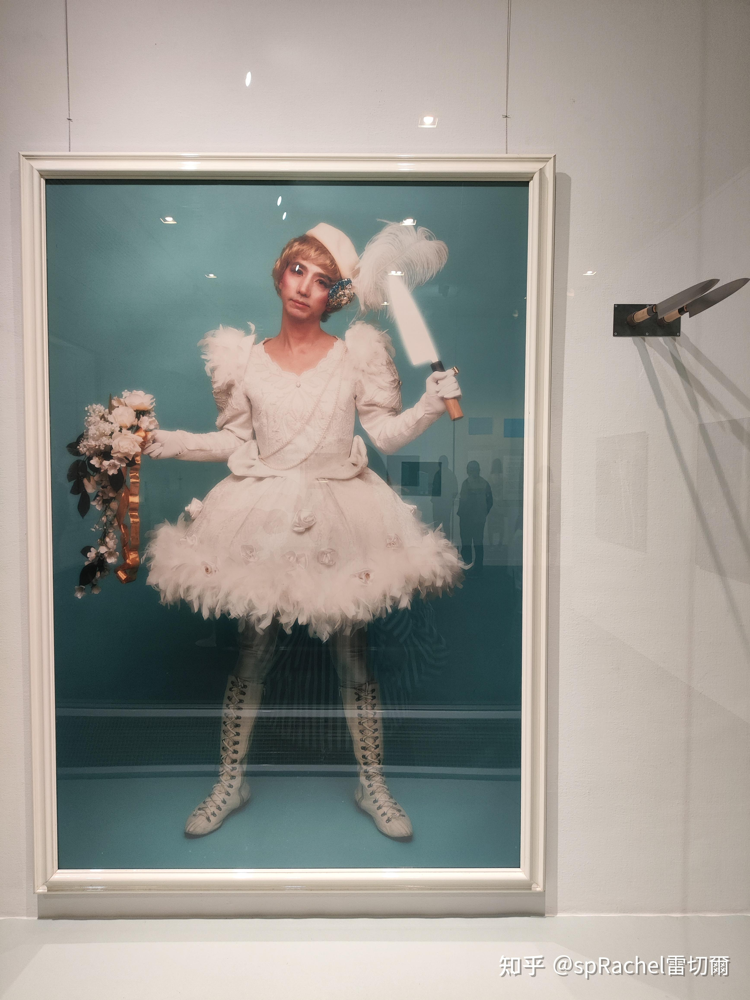

cos的鲁迅

  

  

* * *

  

## [如何看待网红艺术家“曾bobi”“吴衍峰”等人的作品抄袭ai欺骗消费者的事件?](https://www.zhihu.com/question/643866844/answer/3407229859)

精神病老大哥 等 17 人赞同了该回答

看到小紅書就知掉智商。沒想到還是八大美院的。六年前我在北京上海看年輕藝術家展還覺得剪中當代藝術有希望。直到三年前還覺得比日本好。 又是倒車好例子，所以在知乎寫藝術越來越沒流量。都只愛看吃瓜、賣慘，要是稍微沾點發聲也全是媚俗和御用。 就算因為投資和撿便宜有下一步買賣，中間也沒純粹藝術和審美的任何事。

  

  

反正也沒流量我罵完過幾天就刪。

  

  

順便罵我當年還幫忙賣波普的版畫，結果那藝術家自己亂價，給我價格比她給其他人的貴很多，本來都要賣出去了，別人來問我為什麼比其他人買到的貴。只能說，剪中一些專業人士各種意味上的「底線」就……很嘔。 還不如日本美大還沒畢業的，下面也不是搞純藝的，超多商法（我之所以叫他假今野當然因為他長得和演得都很偶像……）

  

  

為什麼以前覺得日本當代不如剪中，因為他們走先鋒的人太少，大部分在追求安穩。 很多美大學生作品和本地畫廊作品。大多數是小確幸。 這很像兩國國情。日本是中間層大兩頭小，剪中是金字塔。 現在剪中金字塔的坡度都大得把頂尖的殺沒了。再加上所謂塔頂還被指揮棒。

  

  

  

不說了……出門看五美大畢業聯展……希望今年能看到比去年好的東西吧，否則我還不如去看音大的。 看完回來了，雖然還是有點賣氣，但中二更可貴。 在鄰國襯托下今年居然比去年好看了一些。

  

[编辑于 2024-02-28 10:20](https://www.zhihu.com/question/643866844/answer/3407229859) ​ 修改

  

* * *

  

## [知识型网红是否让我们离真理更近？](https://www.zhihu.com/question/361373925/answer/3365501290)

Triborg、Erwin Chen 等 16 人赞同了该回答

你会点赞哪种网红？以超冷门艺术类为例 1、分享自己感兴趣的、有研究的、有一定原创性的知识，不一定机灵、不一定实用

2、分享自己的知识、顺便发发自拍、回答键政或情感问题，谈笑风生

3、分享人民群众喜闻乐见的实用知识、表明人民群众喜闻乐见的立场，或完全对立的立场

4、分享自己的知识、搬运考试干货、耐心地解答“我的画画得怎样”等实用问题问题

5、分享自己的知识、专门寻找“画得差”的问题，提供乐子人喜欢的降维打击答案

6、分享自己的知识、特别是那些读者会觉得“学到了”，分享出去觉得自己倍儿有面子有品味的内容

7、分享自己新编的故事，带一点知识。

8、分享自己的知识，同时质疑不合理的现实。

这里面每一类还可以再分为这位网红的目的是什么：分享即是学习赞就是最好的回报？找自己的乐子？为人民服务？为了变现？ 然后才是他的内容和他的目标是否吻合的问题。

在知乎上，是2、3、5类能获得更多的流量和赞同。这是你们要的真理吗？ 你可能会说1、4、6也很多人点赞和愿意看，即使量级不一样，即使知乎现在硬推2、3、5、7类的回答。 曾经1、4这类答案在知乎也会获得人工推荐。這是很多早期為愛發電答主的動力。

然而你们会给1、4这类答案送上你们宝贵的赞吗？送上的话，他们就真的离“真理”更近吗？ 8的答案为什么会变成荒原呢？ 如果他们希望变现，是不是就铜臭了，离“真理”远了呢？ 主要答案如果不实用不有趣，离真理就远了吗？晒自拍答主如果长得很凶离真理近了还是远了？

4和5类答主出现在同一种题目里，是谁离真理更近呢？ 那么对于我这种特别讨厌情感家庭八卦问题，不回答不回关不点赞任何靠回答这类问题累积高赞的所謂專業答主，我是不是就被认为远离真理了呢？

  

正如评论区提醒我曾经是网红，当年我还能收到一些艺术回答的赞同，受到媒体信任，为美术馆和新媒体写展览的有偿推荐和评论文章的。 然而现在比如说下面这个答案我设成收费，大家是怎么看待的呢？ 至今收到3个付费，3个沒付費的回复： 1、“免费部分看完了”——群聊 2、“第三幅作品真震撼”——私聊 3、“感觉知乎都是卖东西的了，没有啥价值内容”——群聊

  

  

真理，很难的，对很多人来说，他们只要免费陪聊和高清美圖。[编辑于 2024-01-23 12:36](https://www.zhihu.com/question/361373925/answer/3365501290) ​ 修改

  

* * *

  

## [你相册中构图最好的照片是什么？](https://www.zhihu.com/question/621418764/answer/3218707469)

劉亞閤、紫山璺 等 10 人赞同了该回答

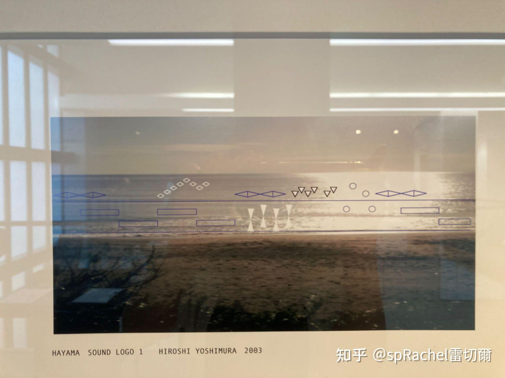

[发布于 2023-09-20 09:59](https://www.zhihu.com/question/621418764/answer/3218707469) ​ 修改 ​赞同 10

  

* * *

  

## [为什么现在年轻人，都喜欢找双休工作，真的是因为感觉不到压力吗？](https://www.zhihu.com/question/522239848/answer/2540344855)

9 人赞同了该回答

我不喜欢，别代表我，我想找一直在宅的，真不行至少也三休啊。

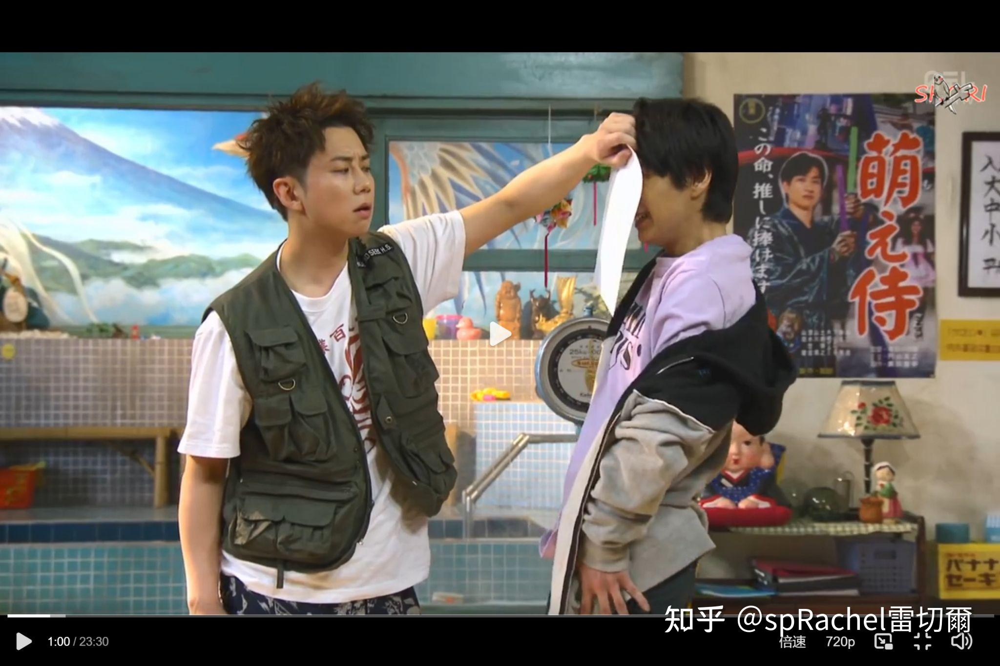

唉，双休够鬼用，平日晚场的演出赶不上，周末看控票又抽不中，美术馆人又多（泣）

[发布于 2022-06-22 22:27](https://www.zhihu.com/question/522239848/answer/2540344855) ​ 修改

  

* * *

  

## [微信头像会影响第一印象吗？](https://www.zhihu.com/question/26833362/answer/3484238400)

  

微信、知乎、微博、x用同一个头像。我猜有1％的人会点开看，而其中有1％知道是什么。 阅读全文​​赞同 3

  

* * *

  

## [2024有什么愿望？](https://www.zhihu.com/question/630590558/answer/3302321058)

Triborg、劉亞閤 等 6 人赞同了该回答

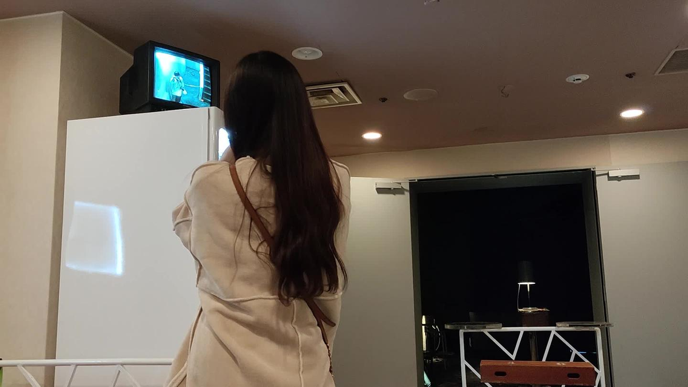

00:07 见多d我担， 搞多d艺术， 彻底离开和躺平， 和大肶在一起。 这是我去投5yen时报的。[编辑于 2023-11-25 21:37](https://www.zhihu.com/question/630590558/answer/3302321058)

  

* * *

  

## [不想涌入人海的你，有哪些「逃离人从众」的旅行方式可以分享？](https://www.zhihu.com/question/654357625/answer/3484179031)

6 人赞同了该回答

去非网红、非市中心的美术馆，如入无人之境。 带作业去做，更旁若无人了。 [东京有哪些值得一去的博物馆美术馆？](https://www.zhihu.com/question/25342827/answer/2941256587) 东京以外可参看#一期一会一展一记# [毕竟大多数时候艺术就是用来逃离现实的](https://www.zhihu.com/question/649050742/answer/3439597169) 我的#美学校#修了展在7月初，但我现在还只有下面这纸上谈兵…… [人生見立て　七人のアーティスト展](https://zhuanlan.zhihu.com/p/688936431)

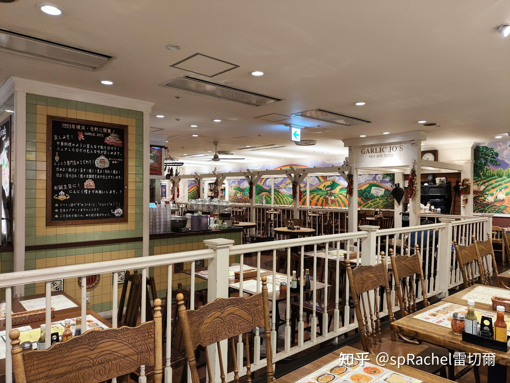

  

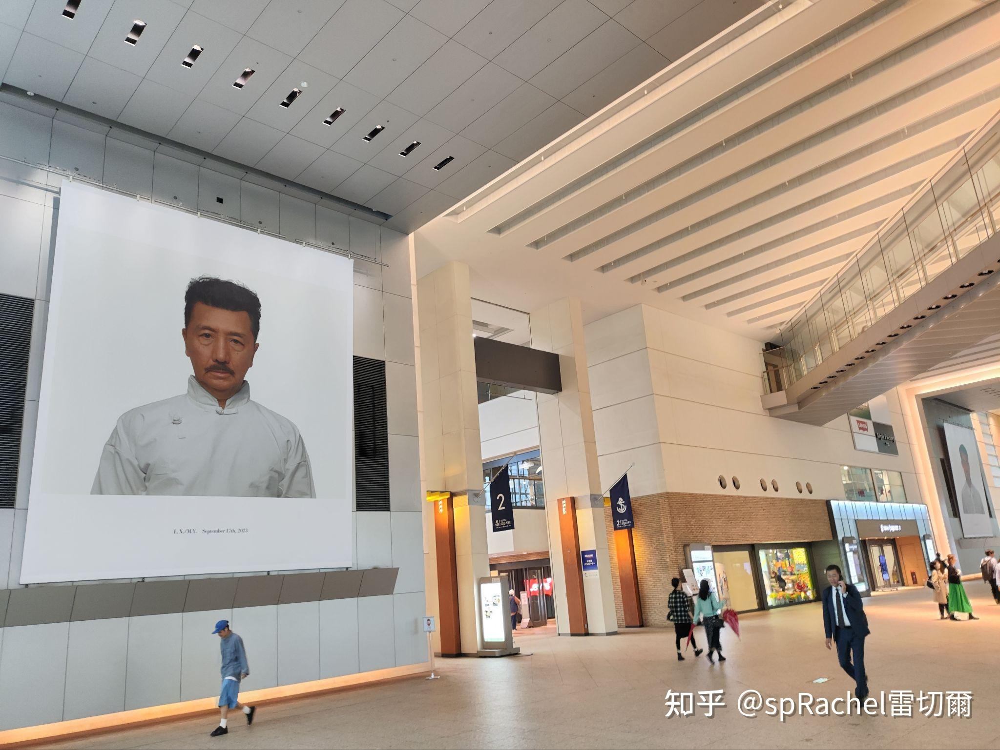

[编辑于 2024-05-01 15:41](https://www.zhihu.com/question/654357625/answer/3484179031)

  

* * *

  

## [中国是否应该封杀梅西?](https://www.zhihu.com/question/643498019/answer/3392886155)

14 人赞同了该回答

赶紧列梅西做冥感词，这几天看腻了。 资瓷明年《杯葛美斯》同李sir一样99%选票获金球奖最佳喜剧。 [中国为什么没有世界出名，震撼人心的现当代艺术作品？艺协的艺术家为什么净是内战内行，外战外行？](https://www.zhihu.com/question/447010310/answer/1760962910) [有哪些作者冷门却好看的画？](https://www.zhihu.com/question/313667055/answer/2611643149)[编辑于 2024-02-10 23:31](https://www.zhihu.com/question/643498019/answer/3392886155)

  

* * *

  

## [莫言说作家不会因为 AI 出现而失业，「作家独具个性的形象思维 AI 永远无法替代」，如何看待此事？](https://www.zhihu.com/question/648364248/answer/3446451159)

Triborg、男爵兔 等 14 人赞同了该回答

不回答藝術問題直到荒原消失。 但這題還是美學問題。 美學是什麼？一句話就是你的感覺，你對這個世界的感覺。 只要是個人（遺憾的某鹽堿地可能沒有），就有感覺。

  

* * *

  

如果平時看虛構作品時，只能欣賞事實、模仿、價值觀、利益等無法遠離生活和現實的部分，那麼AI確實能編寫出比人類更嚴謹的文字。 但藝術呢？ AI能理解為什麼人性會喜歡感覺和無用的藝術嗎？

* * *

  

沒什麼文化就不搬別人的論文[^3]了，搬我自己爛尾的小論文——為什麼人（主要是我自己）會對與自己沒有經歷過、與自己無關、無利益關係的事感興趣。 我還自定了個方法論： 有三個維度的遠離 空間上、時間上、現實上 空間上就是異國、異地， 時間上就是過去或未來， 現實上就是遠離真實的。 更強而混亂的是，這還可以是互相加乘的關係， 空間×時間的遠離就成了異國的歷史 時間×現實的遠離就成了歷史的演義 空間×現實的遠離就成了異國的虛構 當三者乘在一起時，就是異國的歷史的演義。

  

能欣賞這些遠離的美，就能欣賞日常生活中的美，也能接受虛構的、與自己無關的美和表現。 AI就猜不到你喜欢什么，你就能从真正的人类作家那里获得多样性的快樂，唯「我」也好（从接受美學來說），唯「作家」中心也好（從純粹藝術[^4]來說）。 或許有人會說，我喜歡逃避現實可是我看不懂藝術。 那我逃避現實也是長大後的事，小時候我也沒有那麼不開心，那時候我還有希望。

  

但我從小就喜歡遠離的、看不懂的事物。 所以，或許覺得藝術遠離生活的人，要麼就是太熱愛生活，生活太滿足，所以不關心遠離生活的事物…… 要麼就是另一個極端，生活已經苦得無法讓他有餘力去遠離和承載另一種生活…… 马斯洛金字塔一定要完全满足下层需求才可能去要求上层的吗？ 有没有可能上层给你的满足感是下层的好多倍，只要学会从上层获得快乐，那么下层需求只需一丢丢就够（我只要求不餓死，不加班，有時間搞藝術）。

不仅艺术创作者几乎肯定是金字塔的顶层，连艺术鉴赏者都可以是[^5]。 如果告訴一般人，原來不卷也可以過上美學上自給自足的生活。那麼消費主義和宏大敘事的既得利益者，就無法吸血了…… 一張可能圖文有關的照片。

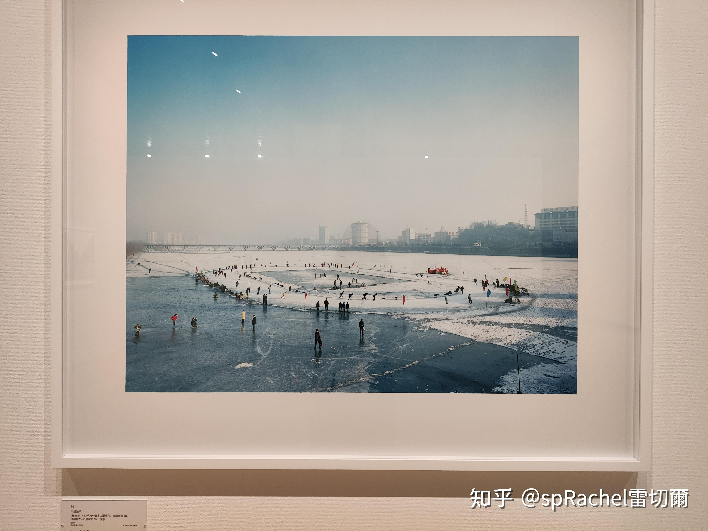

参考

1.  [^](https://www.zhihu.com/people/sprachel/answers#ref_1_0)喜欢美术，但不了解，有什么书籍可以帮助我了解美术史的么？书籍里最好是含有美术大家及其代表作的？ [https://www.zhihu.com/question/370686239/answer/3284749682](https://www.zhihu.com/question/370686239/answer/3284749682)
2.  [^](https://www.zhihu.com/people/sprachel/answers#ref_2_0)藝術和技術 [https://www.zhihu.com/question/617070165/answer/3211509389](https://www.zhihu.com/question/617070165/answer/3211509389)
3.  [^](https://www.zhihu.com/people/sprachel/answers#ref_3_0)艺术在某种程度上是一种孤独吗? [https://www.zhihu.com/question/371803145/answer/2573287466](https://www.zhihu.com/question/371803145/answer/2573287466)

[编辑于 2024-03-28 16:42](https://www.zhihu.com/question/648364248/answer/3446451159) ​ 修改

* * *

## [为什么没有大量的日本人来中国旅行？](https://www.zhihu.com/question/319095359/answer/3468355164)

6 人赞同了该回答

立本人来肛胶会，求我照应。我说有事110。你若有事我也不知怎办。我也为没洗seafood的马桶烦恼。不过，他自己连上了支付宝和外国信用卡。不愧是能在剪中企业上班的立本人。[编辑于 2024-04-16 23:36](https://www.zhihu.com/question/319095359/answer/3468355164)

  

* * *

  

## ​ [为什么国内游戏不能出现骷髅元素?](https://www.zhihu.com/question/642128825/answer/3440190571)

Triborg、郭佳 等 14 人赞同了该回答

  

因為不好是不能說的。 哪止遊戲，我寫的藝術科普書也不能出現。 死神當然也不可以。 宗教和負能量唄。 搞笑的是，寫的時候也就是四年前是可以的。

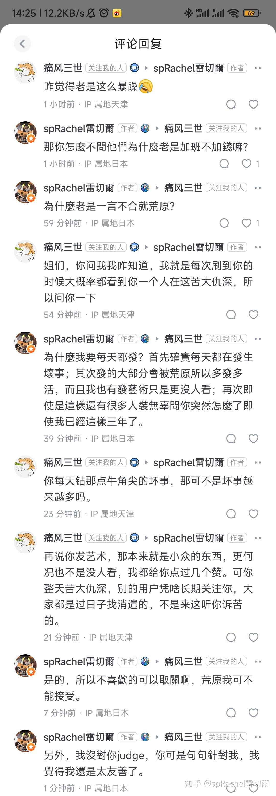

  

[编辑于 2024-04-03 14:27](https://www.zhihu.com/question/642128825/answer/3440190571)・IP 属地日本

## [为什么旅行中的不确定性可以当成一种乐趣，而不是一种压力？](https://www.zhihu.com/question/648669752/answer/3442850713)

6 人赞同了该回答

前提那不是会丢掉身家性命的不确定性。 而我的压力更多来自没钱没假期没签证怕回不来，有些人不怕就没这个压力了。

  

* * *

  

因为穷我已经四年没旅游、六年没出国旅游了，现在主要在油管上旅游。 顺便介绍我最喜欢的旅游油管主ジョー： ジョー在疫情前在世界各地搞穷游还挺刺激的，疫情之后主要搞废墟和泡沫经济遗产游，也没有太穷了（比起他家大阪西城区不算穷）。

ジョーブログ（1991年9月17日 - ）は、大阪府大阪市生野区出身の男性、チャンネル登録者数220万人のYouTuber、元プロボクサー。元在日朝鮮人のハーフ。通称はジョー。本名は金沢仁宏。血液型はRh-B型。所謂『西成家族』の中心人物である(現在は活動休止中)。 現在のカメラマンは、『ちんや』。 長らく金髪だったが、最近は黒髪にしている。

  

  

来歴 高校時代にボクシングジムに通っていたことがある。高校卒業後はママチャリで日本一周旅行をしたり、無一文でアメリカを横断したり、無人島でサバイバル生活をしたり、路上で資金を集めてバーを立ち上げたりしていた\[1\]。 2014年、YouTubeチャンネル「ジョーブログ【CRAZY CHALLENGER】」を開設\[2\]。当初は広告収入で牛丼1杯食べる事を目標にしていた。 2019年3月には、渋谷のスクランブル交差点の真ん中に放置したベッドで寝た動画を自身のチャンネルに投稿し、交通を妨げたとして道路交通法違反の疑いで同月13日に警視庁に書類送検された\[4\]。 2019年3月26日にはクラウドファンディングで資金を募り、新宿区にバー「READY GO」をオープンしたが、2020年6月30日に閉店した。2021年4月1日に大阪府西成区で「西成ホルモンレディゴー」をオープンした\[5\]。 2022年4月4日、YouTube動画内にて旧朝鮮国籍の父親と日本国籍の母親を持つ、在日コリアンだったことを告白した\[6\] 2023年9月、大阪府西成区に1,000万円を寄付し、11月1日に大阪市長より感謝状を受領した。

  

動画活動 動画活動のジャンルとしては、元々アメリカ大陸やアフリカ大陸縦断の貧乏系海外放浪の旅で人気を得ていた。コロナウィルス流行後は、廃墟・廃村・歴史的建造物などへの探訪が多くなった。チャンネル視聴者からの依頼を受けてその場所を探訪し、その場所がかつてどういう場所で、どんなことをしていたのかを事前に調査したり、現地に着いた際に現地の状況から推察するが、その場所がなぜ廃れたのかを追跡調査することは基本的に無い。 嘗ては東京都渋谷区のスクランブル交差点で起こしたような不祥事に代表されるように、炎上系YouTuberとして活動する方針であったが、スクランブル交差点での不祥事で警察に絞られて書類送検されたのを機に反省し、活動路線を廃墟探訪系に変更した。 [发布于 2024-03-25 16:35](https://www.zhihu.com/question/648669752/answer/3442850713) ​ 修改

  

* * *

  

[为什么现在对故宫的宣传基本不提明朝的事？](https://www.zhihu.com/question/305096696/answer/3385182314)

老伯逃 等 14 人赞同了该回答

故宮不但沒有，僅有的也沒研究好介紹好。 某出版社讓我寫故宮藝術書，說市面少有。 我就是以為沒有鞋就該賣鞋的傻豬，寫了好幾篇繪畫書法工藝編年史，結果大部分東西故宮都沒，別人館裡的又不能寫，憋屈。 只能寫清朝次一點的。 我不甘心，想把那點東西寫生動詳細點，但故宮官網實在太爛，我從沒見過這種級別博物館文物介紹可以如此脫離大眾和貧瘠。 連地攤號chatGPT都變不出花的那種貧瘠。 網上關於故宮館藏文物鮮有文獻可查。 我終於知道沒人穿鞋確實不應該去賣鞋。 建國這麼多年甚至故宮火了這麼多年了。 那書我硬是寫完初稿半年了，最近再三催問出版社怎樣，懷疑是才開始看，回復讓我多加些故事，說有些藝術家故事寫得不錯。 呵呵，我能找到的故事大多是在日本童書和漫畫找的，多麼不容易……[编辑于 2024-02-02 22:18](https://www.zhihu.com/question/305096696/answer/3385182314) ​ 修改

[^1]: 人对美术可以无知到何种程度? https://www.zhihu.com/question/333833021/answer/2467913080?utm_source=zhihu&utm_medium=social&utm_oi=46133057421312
[^2]: 如何看待涂鸦艺术家班克西（Banksy）在拍卖会上自毁作品这一行为？艺术作品价值该如何去衡量？ https://www.zhihu.com/question/297525082/answer/506275447
[^3]: 喜欢美术，但不了解，有什么书籍可以帮助我了解美术史的么？书籍里最好是含有美术大家及其代表作的？ https://www.zhihu.com/question/370686239/answer/3284749682
[^4]: 藝術和技術 https://www.zhihu.com/question/617070165/answer/3211509389
[^5]: 艺术在某种程度上是一种孤独吗? https://www.zhihu.com/question/371803145/answer/2573287466