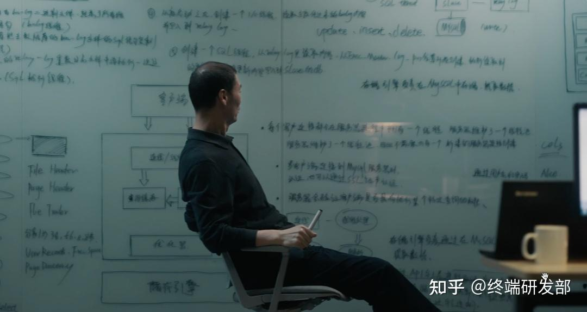
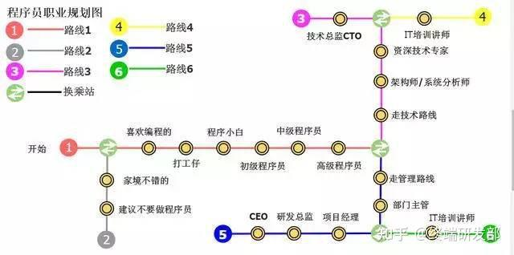

25岁的时候我，是一个非常内向的程序员。我不喜欢管人，不喜欢和女生聊天，不喜欢与人打交道，独自坐在电脑旁是我最舒服的时候。

现在我在改变，积极的蜕变中。。

前几天，一知友，是个领导，找到我说自己被架空了，原因是领导一直觉得他们的公司业务发展缓慢，于是老板经常开会讨论原因，经产品经理、市场经理、销售经理、运营经理一致讨论，最终得出结论是技术开发速度太慢所致。几个负责人每次上线是的时候都故意推脱时间，往后延期！

看吧，这就是资本家的嘴脸！

前两天，之前的老室友，硕士学历，失业了，这几天也穿上了龙袍！我也终于发现，以前自己以为工作稳定，就是大家眼中所说的白领，但是其实危在旦夕！

所以我很早就进行了自我的定位，即使到了35岁，我也有自己的Plan B!

回想起过去的10年之内，前几年比较坎坷，自己并不满意，未能达成自己期望的目标，时间也耗费过去了，**有遗憾、有决策失误、有不甘心**，但不能就此认命，不能后悔，因为未来的路上仍需要全力以赴。

当然现在心态上已经沉淀下来了！

这不仅让我想起了很久以前的文章：

> 笔者是一名程序员老司机，局限于笔者文笔一般，想到哪写到哪\\\_胡乱写一通，篇幅较长\\，希望通过文章的方式简单的回顾过去、总结现在和展望未来，顺便记录一下

[中年程序员写给35岁的自己](https://link.zhihu.com/?target=https%3A//mp.weixin.qq.com/s/KaIBgZ_XF_TkFbQqlzMQlA)

总之，由于迭代太快，难以积累人脉资源，只是难以积累，不是不能积累，难以积累技术资源。**最重要的是这不是一个越老越吃香的职业，这算一个要时刻绷紧，时刻有危机感的职业。**

乔布斯说过：“Stay Hungry，Stay Foolish”（求知若饥，虚心若愚），意思是只有让自己意识到自己的“饥饿”和“愚蠢”，才会像没吃饱一样，由衷的需要学习、持续学习。

## 你要怎么做？

所以，作为程序员

1、你要时刻时刻有危机感，了解最新的技术，建立自己的知识体系，掌握一定层面的编程思想！

2、如果你想用业务时间提升编程能力，提升一下细节工作效率和核心竞争力，比如Python，脚本，爬虫或者ai或者是[gpt](https://www.zhihu.com/search?q=gpt&search_source=Entity&hybrid_search_source=Entity&hybrid_search_extra=%7B%22sourceType%22%3A%22answer%22%2C%22sourceId%22%3A3225489301%7D)那还是可以的，这里给大家一个非常免费的工具教程，利用agi来提升自己的工作效率，用来查找问题，学习方法，自己提高核心竞争力

**时代大浪淘沙，不进则退。**近几年AI发展迅猛，大模型极大的提高程序员的编程能力和工作效率，提升自己的核心竞争力迫在眉睫！为了帮助大家零成本学习AI、大模型相关技术，给大家推荐知乎知学堂的「AI大模型」直播课。邀请了行业大佬坐镇，连续2天直播，听听程序员的未来前景+职业发展，给你解析此次AI变革究竟有何不同，还能学习GPT训练、LangChain技术等。

上课免费给你好用的AI工具，AI大模型的资料包等等。大佬的免费直播，机会难得，推荐你一定要来听听

重要的是免费学习和体验，对于想提高学习算法的程序员可以试试看，绝对很中用！

3、公司给你提供的最有价值的东西，就是实战的机会。 你所学习的技术，最终需要通过工作来变现。这个时候，就是你去积累的时候了！

4、你需要提高自己发现问题和解决问题的能力

6、提高自己的执行力

7、情商很重要，交流表达也同样！

8、积累人脉，保持资源，不光光是技术层面的人脉！

## 所以我今天在一次来总一下，来激励自己，同时也来激励大家

1、不要过的太安稳，有一句话说的好，现在过的多好，将来你会死的多惨！

2、程序员一定要活到老，学到老！

3、做好第二副业，计划Plan B！

4、早结婚，早日找到目标！

5、有机会去搏一搏百万年薪和财富自由，只是有机会，只是在极个别公司中有期权和股权的部分岗位，大部分人是没有这个机会的。但是即使是这样也比很多传统行业，熬个一百年不出头要好多了。

5、选择大于努力！后期的努力同样同样很重要！

如果你还有什么问题，可以咨询我

我是架构师小于哥

[@终端研发部](https://www.zhihu.com/people/0562ae57ba411b146099313075609e94)

在职业上有自己的思考，生活上有自己的规划，不躺平，不抱怨，每天专注于分享职场经验，开发编程小技巧以及面试指导，希望我的回答能够给大家一些帮助哈~