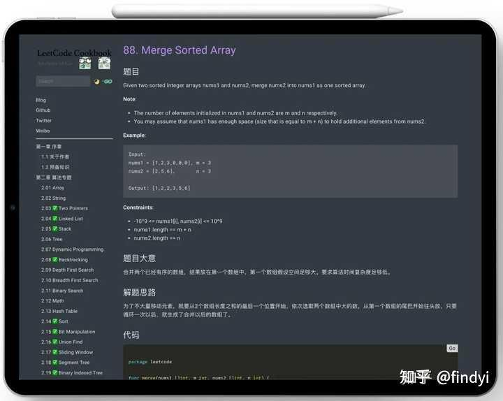
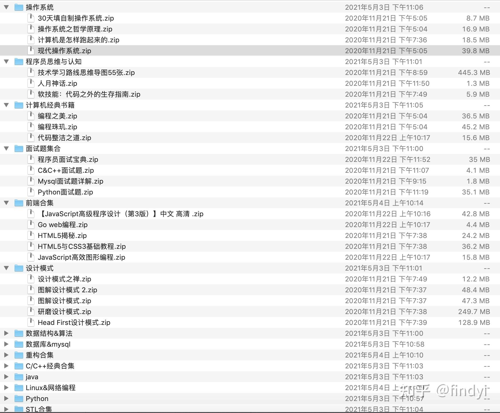
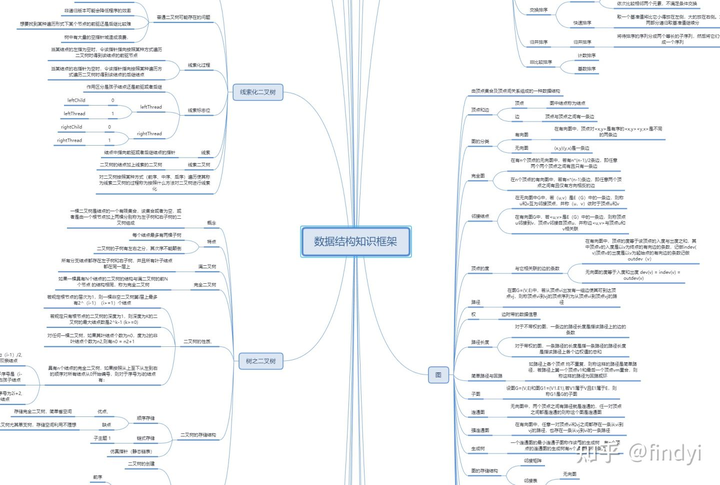
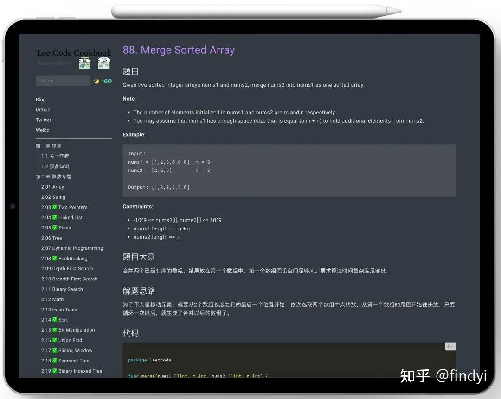

**记住四个字：够用即可。**

如果一个程序员技术已经不是瓶颈了，大部分需求和优化都能实现了，自然可以花精力关注项目业务。

如果一个程序员，实现一个模块还很费劲，也不懂得怎么调优程序，实现的东西还只是勉强可用，这个时候分精力去关注项目业务？那基本就会学废了。

除非是想转产品业务，否则分散精力的后果是很严重的，会让你成为打酱油程序员，离一个优秀的程序员越来越远。

一个注重编码，并跨越了初中级的优秀程序员的前景是美好的，一个优秀程序员还有产品能力、业务能力，前景是不可限量的。

一个没跨越初中级的普通程序员，就开始不注重编程，天天关心产品业务，注定是毫无前途可言的！

**重点说下，如何成为优秀的程序员，拿高薪在职场一马平川吧！**

**我认为，能长期做到以下16点的程序员，达到月薪30K往上，不太难：**

1.优秀的debug能力

普通程序员：编程我最牛，debug？我不太会！  
高级程序员：编程有点慢，debug快速搞定，回家睡觉！

2.夯实的算法基础

普通程序员：算法是什么？我不会，但我依然写代码到飞起！  
高级程序员：算法太重要了，无论是程序性能还是写出优美的代码，我得继续学习！

顺便送大家一份硬核算法资料，程序员要想进大厂先从刷算法做起是个好方法，算法厉害的人进大厂非常容易，这里送一本阿里P8撰写的算法刷题笔记，身边不少朋友通过它加入大厂：

[Github 疯传！史上最强悍！阿里大佬「LeetCode刷题手册」开放下载了！​mp.weixin.qq.com/s?\_\_biz=MzA3MzA5MTU4NA==&mid=100005731&idx=1&sn=5ce2cf62380c53ff7fd6c907cf9769f8&chksm=1f15080c2862811ad02504f0645709e5b08b249a0ad93f8939dcc8f1a1981e6957e9a4dec75f#rd](https://link.zhihu.com/?target=http%3A//mp.weixin.qq.com/s%3F__biz%3DMzA3MzA5MTU4NA%3D%3D%26mid%3D100005731%26idx%3D1%26sn%3D5ce2cf62380c53ff7fd6c907cf9769f8%26chksm%3D1f15080c2862811ad02504f0645709e5b08b249a0ad93f8939dcc8f1a1981e6957e9a4dec75f%23rd)

看看它的排版，非常经典！

3.规范的命名

普通程序员：我想怎么命名就怎么命名，代码世界我做主！  
高级程序员：形成自己固定的变量命名规则，否则取名字就耗费不少时间。

4.优秀的框架设计能力

普通程序员：类结构图和时序图？是什么鬼，需求来了直接撸啊！ 高级程序员：写代码之前，肯定先画好类结构图和时序图啊，这样编码会更轻松。

5.基本编码素养

普通程序员：特么又编译不过？百度上还查不到解决方案？怕不是编译器坏了吧！  
高级程序员：编译不过，查查google上其他大佬有没有遇到过吧。

6.重视自测

普通程序员：什么？让我自测？我这样的天才写出来的代码还需要自测？？？  
高级程序员：交付代码之前反复自测，这样能节省团队时间，也能减少线上bug。

7.多看计算机经典书籍

普通程序员：什么？看书？看多少本书还不如我写一个项目。。。

高级程序员：看书尤其是计算机经典书籍，对提升技术能力技术认知帮助非常大，我有空就看计算机经典书籍！

另外我把大学和工作中用的经典电子书库（包含数据结构、操作系统、C++/C、网络经典、前端编程经典、Java相关、程序员认知、职场发展）、面试找工作的资料汇总都打包放在这了，这套资源可不是一般那种网上找的资源，是伴随我从学生一路成长为腾讯高级开发工程师，360技术经理、360技术总监、中小公司CTO的打包全套，非常宝贵！点击下方链接直达获取：

**我已经帮大家打包好了，点击下方链接直接获取：**

[计算机经典书籍100本（含下载方式）](https://link.zhihu.com/?target=http%3A//mp.weixin.qq.com/s%3F__biz%3DMzA3MzA5MTU4NA%3D%3D%26mid%3D100008684%26idx%3D1%26sn%3Deb2ebb6c6f4da1b6d82c5ea643cad435%26chksm%3D1f16fd83286174959fe46170ccbb1c65d51afb0d174b10f85eaeddfe4030d898042fe5fbecf2%23rd)

8.重视数据备份

普通程序员：数据备份？权限分离？多麻烦啊，我开发这么快，出问题再改呗，嘿嘿嘿。  
高级程序员：数据备份太重要了，千万不能忘！

9.记录卡点问题

普通程序员：代码问题解决了，赶紧下班回家刷抖音！  
高级程序员：终于攻克这个问题了，我得记录下，下次会更快的解决。

10.重视语言的知识点和学习路线

普通程序员：编程语言的知识点和学习路线？我不care，要学新语言就一通猛整不就好了？  
高级程序员：知识点和学习路线太重要了！能让我快速掌握一门语言，学习新语言之际我都会先找下知识点和学习路线。

另外为了帮助大家更好的学习成长，我花了一个月时间，基于现有市面上流行的编程技术，整理了 29 张思维导图，基本覆盖了所有要掌握的知识点，**每一张导图的内容都非常全面，比如这张 数据结构知识框架，足足有 70M：**

点击下方链接，直接下载获取：

[findyi：2021知乎最硬核计算机编程思维导图.zip，开放下载了！7 赞同 · 0 评论文章10 赞同 · 0 评论文章20 赞同 · 1 评论文章](https://zhuanlan.zhihu.com/p/400213346)

11.重视warning

普通程序员：warning算个什么啊，一样编译通过快速上线，美滋滋，无视～  
高级程序员：认真对待代码中的warning，它们虽然不致命，但却是精益求精的好机会。

12.控制不合理需求

普通程序员：需求都冲我来，我是超人，接接接，做做做。  
高级程序员：把感觉不靠谱的需求放到最后做，可能到时候需求就变了。

13.积极主动的精神

普通程序员：这个Bug不是我的，我不管，谁的谁负责！  
高级程序员：主动改Bug，不管是不是你的，当然，不是你的改完要想办法让老板知道。

14.重视日志Log

普通程序员：打Log太麻烦了，有这时间还不如多写几行代码！  
高级程序员：Log要尽可能规范，比如要写时间和分类，要能重定向输出。

15.重视计算机英语能力

普通程序员：英语有什么用，我又不去外企，不学！  
高级程序员：多学英语，无论是Google还是stackoverflow，又或者各种官方文档，流利的英文阅读，和习惯性英文搜索，能帮你超越90%的程序员。

16.做好单元测试

普通程序员：单元测试？没做过，有用吗？不是有测试吗，为什么还让我自己测？  
高级程序员：单元测试很重要，它至少有这几个好处：方便后期重构、优化代码设计、文档记录（单元测试本身即是文档）、具备回归性（随时随地测试）。

17.别造无意义的轮子

普通程序员：我就喜欢造轮子，造轮子牛逼就是技术牛逼的最好体现！ 高级程序员：模仿造轮子是学习编码很好的方法，但熟练后就别疯狂造了。

19.谨慎使用新技术

普通程序员：哇，新技术，好酷好炫，我要用！ 高级程序员：新技术？还说的这么牛？先测试下，再观察观察，可不能直接用于线上环境。

再次推荐这本算法笔记，对程序员来说，算法真的是重中之重。算法厉害的人进大厂非常容易，身边不少朋友通过它加入大厂：

[Github 疯传！史上最强悍！阿里大佬「LeetCode刷题手册」开放下载了！](https://link.zhihu.com/?target=http%3A//mp.weixin.qq.com/s%3F__biz%3DMzA3MzA5MTU4NA%3D%3D%26mid%3D100005731%26idx%3D1%26sn%3D5ce2cf62380c53ff7fd6c907cf9769f8%26chksm%3D1f15080c2862811ad02504f0645709e5b08b249a0ad93f8939dcc8f1a1981e6957e9a4dec75f%23rd)

**看看这本书的目录和排版！相当经典！**

  
**祝大家前程似锦，在编码的道路上一马平川。**

**要是觉得不错的话，那就帮我**

[@findyi](https://www.zhihu.com/people/747cf0e886f38ff62eea3fbfe0542ed5)

**点个赞，一键三连呗，硬核码字不易。**