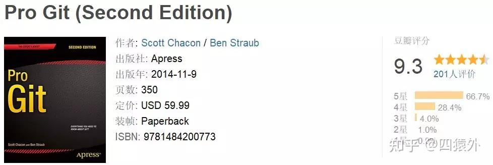

**过来人的建议，不要听有些答主说带薪摸鱼之类的话，程序员唯一的出路就是好好打磨自己的技术。**

作为一个工作十几年的Java程序员，从一名小白到现在的技术总监，经常有新人问我怎么成长，有没有什么窍门。说实话，没啥窍门和捷径。我觉得对我提升帮助最大的，就是我的 10 个习惯。

**1\. 引入新的技术栈的时候，要以官方文档为主**

在项目里，无论使用新的 [jar](https://www.zhihu.com/search?q=jar&search_source=Entity&hybrid_search_source=Entity&hybrid_search_extra=%7B%22sourceType%22%3A%22answer%22%2C%22sourceId%22%3A2581705711%7D) 包，还是用新的中间件，一定要去看官方文档。

现在网上的技术文章鱼龙混杂，再加上国内那个不咋地的搜索引擎，所以在网上搜靠谱的技术文章，就相当于在屎坑里捞金子。

比如，如果你想要对 SpringBoot2 写的代码进行单元测试，JUnit 版本你可能已经是 5 了。但你搜到的网上文章很可能会告诉你测试用例需要注解:  
`@RunWith(SpringRunner.class)`

但是官方文档说了，其实如果你用 JUnit5，就不用加这个注解了，加了反而可能引起不必要的冲突。

所以，官方文档对新技术的引入是唯一的参考金标准。

**2\. 一定要悄悄地把代码测的没问题了再交付**

在职场上，什么样的人才能快速成长、快速得到重用？答案是可靠的人。

那就程序员来说，什么样的人才算是可靠的人？答案是交付可靠的技术产品。

那可靠的产品第一评估标准就是 bug 少。这个 bug 少是别人评估的，而不是自己评估的。

无论咱们自己代码实现成什么样子，哪怕是代码写的还不完美，但是，只要咱们通过自测，在提交之前尽可能把问题解决掉，让别人少发现你的错误，尤其是低级 bug，那么你才是一位可靠的程序员。

所以，交付任务前，一定要自己把代码全方位地测试一遍，保证自己有着优秀的口碑才好。

**3\. 打[日志](https://www.zhihu.com/search?q=%E6%97%A5%E5%BF%97&search_source=Entity&hybrid_search_source=Entity&hybrid_search_extra=%7B%22sourceType%22%3A%22answer%22%2C%22sourceId%22%3A2581705711%7D)的时候尽可能把输入、输出以及耗时都打印出来**

我们打日志的目的是什么？是为了定位问题的。

问题有哪些？其实大体就两种，逻辑问题和性能问题。

逻辑问题，我们如果打印了输入和输出，那么根据业务规则，这么一对照就能很容易定位到问题。

性能问题，我们无论是通过像 grep、sort 等 shell 命令去直接对日志做个过滤加排序，还是通过日志搜集加日志搜索等工具，都能很容易的发现到问题。甚至还可以和监控系统联合起来，直接做预警。

所以，打日志的时候，我们要记得把输入和输出以及时间都打印出来。

**4\. 学好 Git**

Git 这东西太重要了。现在的团队开发，用 Git 管理各种代码版本，代码分支。如果你用不好 Git，很容易就会因为合并代码、升级版本等情况，产生出许多没必要的 bug。

一个用不好 Git 的团队，可能每次上线，都会带来那么几个莫名其妙的问题。

给大家分享一本非常不错的 Git [开源手册](https://www.zhihu.com/search?q=%E5%BC%80%E6%BA%90%E6%89%8B%E5%86%8C&search_source=Entity&hybrid_search_source=Entity&hybrid_search_extra=%7B%22sourceType%22%3A%22answer%22%2C%22sourceId%22%3A2581705711%7D)。  

这本手册在豆瓣上评价极高，之前 9.3，现在也有 9.1 的高分，其作者是 GitHub 的员工，内容主要侧重于各种场合中的惯用法和底层原理的讲述，手册中还针对不同的使用场景，设计了几个合适的版本管理策略。

简而言之，这本手册无论是对于初学者还是想进一步了解 Git 工作原理的开发者都非常合适。

**5\. 优先实现功能，性能问题或许没那么着急**

我在带团队的时候，经常发现有些刚入行的同事，会边写代码边纠结自己写的代码性能是否有问题。其实真的不必这样。像我们这些老程序员，都知道过早优化有时候可能白花费功夫。

像咱们如果写一个批处理的定时任务，这个任务要求只要在凌晨运行，在大家上班前任务完成就行。那么，这个任务从凌晨两点运行到六点和运行到四点，有什么区别吗？

优化代码一定要适度，要在写完功能之后，看功能会怎么被使用，根据实际的要求，去优化真正需要优化的地方。

  
**6\. 先实现最确定的需求，不确定或者模糊的需求先往后放**

实现需求的先后顺序，注意一定要以需求的可靠程度为准。

在分配给我们的需求里一般分两类：

-   有的需求是我们和产品经理都非常明确的需求；
-   也有的需求比较模糊：开会讨论时大家都觉得没什么问题，但是一到代码实现的时候，就发现还存在很多问题。

这时候，咱们应对的技巧是，先对这些需求搭一个统一的架子，把已经非常明确的需求先开发出来。

由于架子搭建出来了，这时候再和产品经理讨论那些模糊的需求，很容易就能让产品明白困难的地方，这样就可以把沟通难度降到最低。

**7\. 主动找项目里的问题并给出解决方案**

问题是什么？问题就是在实践过程中需要解决的东西。

把这些问题一个个找出来，解决掉，这些解决问题中产生出来的方案，全会形成推动项目前进的推动力。那么产生这些推动力的你自己，一定会从中获益良多。

**8\. 评估开发周期，要留出冗余时间**

留出冗余时间的目的很明确，在咱们开发的时候，遇到的意外情况太多了：

-   需求又双叒叕变了
-   团队人员有变化
-   当初估算的时间乐观了
-   这个功能需要动老代码
-   需要跨团队合作开发
-   领导说“加个小功能”，领导认为这个小功能不影响开发周期（此处省略二百字，无F\*\*\*可说）

所以，冗余时间是要留出来的。

留出的冗余时间不等于摸鱼时间，开发还是按照正常的节奏干，早做完早交付。

**9\. 不要光看书去学习技术，要把感兴趣的技术通过代码实现出来**

咱们程序员最重要的就是实践，能把学到的知识转化为实践用到工作上。

光看书学习技术，很可能只会让咱们产生出已经学会的错觉。只有通过代码把感兴趣的技术实践练习了一遍，咱们才真正能明白这技术实际用起来是什么样子，需要注意什么。

**10\. 英语还是挺重要的**

你不得不承认，IT 这行，基本所有的创新都诞生于英语的世界。

比如 k8s，就我所知就是国内英语好的技术人员从英语社区逐渐在国内推广开来，而这些推广了 k8s 的先驱也自然掌握了 k8s 的话语权。大家可以看看 k8s 在市场上的流行程度，也可以看看一位 k8s 专家的工资大概是多少。

而且，我前面说过，大家引入新技术一定要看官方文档，官方文档百分之八十都是英语的，所以英语确实重要。

如果英语不好，是不是就没机会了？没这么绝对。

就说我吧，不瞒大家，我英语四级没过，但还是照样能看英语资料，照样和别人一起翻译了国内的第一本 Hibernate 技术书。

当初我用 Hibernate 在国内算是比较早的一批程序员了，也经常去论坛回答问题，所以后来就有人找我一起翻译书。我最开始是抗拒的，觉得自己英语太烂了，翻译不好。后来我又想，既然我能看着英语文档学 Hibernate，要不就试试。于是就这么着干了一把。

作为一个过来人，我想说的是，技术文档没有特别复杂的语法、生僻单词，而且现在还有翻译软件、插件可以帮我们阅读。即使英语基础一般，也没什么大不了的。

除了以上这10个习惯，多看书这种都知道的就不多说了。看书的话，推荐一份“**豆瓣高分计算机书单**”，几乎都是8分以上的好书。书单详细内容和pdf免费下载方式看这个（有需要下载的尽快了）

[计算机经典必读书单(含下载方式)](https://link.zhihu.com/?target=https%3A//mp.weixin.qq.com/s%3F__biz%3DMzU4MjgwNjQ0OQ%3D%3D%26mid%3D2247487238%26idx%3D1%26sn%3Dc63594d794bed494ff91bebd4c8de37c%26chksm%3Dfdb3f1d8cac478ce0bb20b69a930567c8790e1c3fe4629aacb805a5c2ac9f39035772855738e%23rd)

哦对，还有一个，没事多去逛逛高质量的程序员网站，学学技术，开拓开拓眼界。

我经常去如下网站：

对**国内技术社区**  
[博客园](https://www.zhihu.com/search?q=%E5%8D%9A%E5%AE%A2%E5%9B%AD&search_source=Entity&hybrid_search_source=Entity&hybrid_search_extra=%7B%22sourceType%22%3A%22answer%22%2C%22sourceId%22%3A2581705711%7D) [https://www.cnblogs.com/](https://link.zhihu.com/?target=https%3A//www.cnblogs.com/)  
掘金 [https://juejin.cn/](https://link.zhihu.com/?target=https%3A//juejin.cn/)  
[思否](https://www.zhihu.com/search?q=%E6%80%9D%E5%90%A6&search_source=Entity&hybrid_search_source=Entity&hybrid_search_extra=%7B%22sourceType%22%3A%22answer%22%2C%22sourceId%22%3A2255177799%7D) [https://segmentfault.com/](https://link.zhihu.com/?target=https%3A//segmentfault.com/)  
[开源中国](https://www.zhihu.com/search?q=%E5%BC%80%E6%BA%90%E4%B8%AD%E5%9B%BD&search_source=Entity&hybrid_search_source=Entity&hybrid_search_extra=%7B%22sourceType%22%3A%22answer%22%2C%22sourceId%22%3A2581705711%7D) [https://www.oschina.net/](https://link.zhihu.com/?target=https%3A//www.oschina.net/)  
51CTO [https://www.51cto.com/](https://link.zhihu.com/?target=https%3A//www.51cto.com/)  
V2EX [https://www.v2ex.com/](https://link.zhihu.com/?target=https%3A//www.v2ex.com/)  
开发者头条 [https://toutiao.io/](https://link.zhihu.com/?target=https%3A//toutiao.io/)  
GitChat [https://gitbook.cn/](https://link.zhihu.com/?target=https%3A//gitbook.cn/)  
[牛客网](https://www.zhihu.com/search?q=%E7%89%9B%E5%AE%A2%E7%BD%91&search_source=Entity&hybrid_search_source=Entity&hybrid_search_extra=%7B%22sourceType%22%3A%22answer%22%2C%22sourceId%22%3A2191335701%7D) [https://www.nowcoder.com/](https://link.zhihu.com/?target=https%3A//www.nowcoder.com/) 一个互联网求职学习交流社区。

**国外技术社区**  
Stack Overflow [https://stackoverflow.com/](https://link.zhihu.com/?target=https%3A//stackoverflow.com/) 全球最活跃的程序员技术问答交流社区，程序员的所有问题都能在上面找到答案。  
Medium [https://medium.com/](https://link.zhihu.com/?target=https%3A//medium.com/)

**[电子书](https://www.zhihu.com/search?q=%E7%94%B5%E5%AD%90%E4%B9%A6&search_source=Entity&hybrid_search_source=Entity&hybrid_search_extra=%7B%22sourceType%22%3A%22answer%22%2C%22sourceId%22%3A2581705711%7D)**  
[书栈网](https://www.zhihu.com/search?q=%E4%B9%A6%E6%A0%88%E7%BD%91&search_source=Entity&hybrid_search_source=Entity&hybrid_search_extra=%7B%22sourceType%22%3A%22answer%22%2C%22sourceId%22%3A2255177799%7D) [https://www.bookstack.cn/](https://link.zhihu.com/?target=https%3A//www.bookstack.cn/)  
码农[之家](https://www.zhihu.com/search?q=%E4%B9%8B%E5%AE%B6&search_source=Entity&hybrid_search_source=Entity&hybrid_search_extra=%7B%22sourceType%22%3A%22answer%22%2C%22sourceId%22%3A2191335701%7D) [https://www.xz577.com/](https://link.zhihu.com/?target=https%3A//www.xz577.com/)  
豆瓣高分计算机书单：[计算机经典必读书单(含下载方式)](https://link.zhihu.com/?target=https%3A//mp.weixin.qq.com/s%3F__biz%3DMzU4MjgwNjQ0OQ%3D%3D%26mid%3D2247484272%26idx%3D2%26sn%3D30bd3ee03e1aa063b6f9a458cb7c31e6%26chksm%3Dfdb3fdaecac474b8940f69bcdbc134375f1ac16871ea09a30cf296ef3773e0ca7138eb7c5584%26token%3D893413820%26lang%3Dzh_CN%23rd)

**学编程的教程网站**  
菜鸟教程 [https://www.runoob.com/](https://link.zhihu.com/?target=https%3A//www.runoob.com/)  
W3Cschool [https://www.w3cschool.cn/](https://link.zhihu.com/?target=https%3A//www.w3cschool.cn/)  
[http://how2j.cn](https://link.zhihu.com/?target=http%3A//how2j.cn) [https://how2j.cn/](https://link.zhihu.com/?target=https%3A//how2j.cn/)  
[易百](https://www.zhihu.com/search?q=%E6%98%93%E7%99%BE&search_source=Entity&hybrid_search_source=Entity&hybrid_search_extra=%7B%22sourceType%22%3A%22answer%22%2C%22sourceId%22%3A2255177799%7D)教程 [https://www.yiibai.com/](https://link.zhihu.com/?target=https%3A//www.yiibai.com/)  
[并发编程](https://www.zhihu.com/search?q=%E5%B9%B6%E5%8F%91%E7%BC%96%E7%A8%8B&search_source=Entity&hybrid_search_source=Entity&hybrid_search_extra=%7B%22sourceType%22%3A%22answer%22%2C%22sourceId%22%3A2581705711%7D)网 [https://ifeve.com/](https://link.zhihu.com/?target=https%3A//ifeve.com/)

**视频教程网站**  
B站 [https://www.bilibili.com/](https://link.zhihu.com/?target=https%3A//www.bilibili.com/)  
[慕课网](https://www.zhihu.com/search?q=%E6%85%95%E8%AF%BE%E7%BD%91&search_source=Entity&hybrid_search_source=Entity&hybrid_search_extra=%7B%22sourceType%22%3A%22answer%22%2C%22sourceId%22%3A2191335701%7D) [https://www.imooc.com/](https://link.zhihu.com/?target=https%3A//www.imooc.com/)  
[中国大学MOO](https://www.zhihu.com/search?q=%E4%B8%AD%E5%9B%BD%E5%A4%A7%E5%AD%A6MOO&search_source=Entity&hybrid_search_source=Entity&hybrid_search_extra=%7B%22sourceType%22%3A%22answer%22%2C%22sourceId%22%3A2191335701%7D)C [https://www.icourse163.org/](https://link.zhihu.com/?target=https%3A//www.icourse163.org/)

**[开源社区](https://www.zhihu.com/search?q=%E5%BC%80%E6%BA%90%E7%A4%BE%E5%8C%BA&search_source=Entity&hybrid_search_source=Entity&hybrid_search_extra=%7B%22sourceType%22%3A%22answer%22%2C%22sourceId%22%3A2581705711%7D)**  
GitHub [https://github.com/](https://link.zhihu.com/?target=https%3A//github.com/) 全球最大开源社区，被戏称为全球最大同性交友网站。  
码云 [https://gitee.com/](https://link.zhihu.com/?target=https%3A//gitee.com/) 可以看做GitHub的国内版，GitHub虽好，但GitHub服务器在美国，网络方面main一直是个问题，这种情况下，码云是个不错的替代者。

**面试刷题**  
LeetCode力扣 [https://leetcode-cn.com/](https://link.zhihu.com/?target=https%3A//leetcode-cn.com/) 经典的刷题网站，主要是算法题。  
LintCode [https://www.lintcode.com/](https://link.zhihu.com/?target=https%3A//www.lintcode.com/) 和LeetCode类似  
刷题笔记：[BAT大佬写的Leetcode刷题笔记，看完秒杀90%的算法题！](https://link.zhihu.com/?target=https%3A//mp.weixin.qq.com/s%3F__biz%3DMzU4MjgwNjQ0OQ%3D%3D%26mid%3D2247485348%26idx%3D1%26sn%3D02ede6b715b20a6b981af1d021d77d5d%26chksm%3Dfdb3f97acac4706cc193bec80b984255bb33db2b35366682bd566280326b7029f1dae632abb2%23rd)

Java版本LeetCode刷题笔记:[艾玛，终于来了！《LeetCode Java版题解》.PDF](https://link.zhihu.com/?target=https%3A//mp.weixin.qq.com/s%3F__biz%3DMzU4MjgwNjQ0OQ%3D%3D%26mid%3D2247486850%26idx%3D2%26sn%3Dc8fd9d5ba5808cdbeb64e591cd93019a%26chksm%3Dfdb3f35ccac47a4a9702358dbc13f3ae065ccd0fae8920cc9e150607d96ec335d93afe3c4981%23rd)

**大佬的博客/网站**  
[阮一峰](https://www.zhihu.com/search?q=%E9%98%AE%E4%B8%80%E5%B3%B0&search_source=Entity&hybrid_search_source=Entity&hybrid_search_extra=%7B%22sourceType%22%3A%22answer%22%2C%22sourceId%22%3A2191335701%7D)：[http://www.ruanyifeng.com/home.html](https://link.zhihu.com/?target=http%3A//www.ruanyifeng.com/home.html) 计算机科普博主  
[陈浩](https://www.zhihu.com/search?q=%E9%99%88%E6%B5%A9&search_source=Entity&hybrid_search_source=Entity&hybrid_search_extra=%7B%22sourceType%22%3A%22answer%22%2C%22sourceId%22%3A2191335701%7D)：[https://www.coolshell.cn/](https://link.zhihu.com/?target=https%3A//www.coolshell.cn/) 左耳朵耗子  
[廖雪峰](https://www.zhihu.com/search?q=%E5%BB%96%E9%9B%AA%E5%B3%B0&search_source=Entity&hybrid_search_source=Entity&hybrid_search_extra=%7B%22sourceType%22%3A%22answer%22%2C%22sourceId%22%3A2191335701%7D) [https://www.liaoxuefeng.com/](https://link.zhihu.com/?target=https%3A//www.liaoxuefeng.com/) Python启蒙老师，Python，Git系列教程作者  
[王垠](https://www.zhihu.com/search?q=%E7%8E%8B%E5%9E%A0&search_source=Entity&hybrid_search_source=Entity&hybrid_search_extra=%7B%22sourceType%22%3A%22answer%22%2C%22sourceId%22%3A2191335701%7D) [http://www.yinwang.org/](https://link.zhihu.com/?target=http%3A//www.yinwang.org/) 每写一篇文章都能引发争议的前Google程序员  
  
差不多就说这些吧，剩下的看个人坚持了。记住：

**不是有希望才去坚持，而是坚持才能看到希望。**

**最近很多同学问我大厂面试的核心知识点，东哥熬夜整理出来了9大核心知识点，需要的自取：**

[校招进大厂，9大核心课程知识，熬夜整理成思维导图送给大家​mp.weixin.qq.com/s?\_\_biz=MzU4MjgwNjQ0OQ==&mid=2247487009&idx=1&sn=4495414184e17ee2c4c22cf4f55db467&chksm=fdb3f0ffcac479e9c97c6f70662ae09976b3bf3d49aab7a12bb950db8f8a7502dc39fc24c5e3#rd​mp.weixin.qq.com/s?\_\_biz=MzU4MjgwNjQ0OQ==&mid=2247487009&idx=1&sn=4495414184e17ee2c4c22cf4f55db467&chksm=fdb3f0ffcac479e9c97c6f70662ae09976b3bf3d49aab7a12bb950db8f8a7502dc39fc24c5e3#rd​mp.weixin.qq.com/s?\_\_biz=MzU4MjgwNjQ0OQ==&mid=2247487009&idx=1&sn=4495414184e17ee2c4c22cf4f55db467&chksm=fdb3f0ffcac479e9c97c6f70662ae09976b3bf3d49aab7a12bb950db8f8a7502dc39fc24c5e3#rd​mp.weixin.qq.com/s?\_\_biz=MzU4MjgwNjQ0OQ==&mid=2247487009&idx=1&sn=4495414184e17ee2c4c22cf4f55db467&chksm=fdb3f0ffcac479e9c97c6f70662ae09976b3bf3d49aab7a12bb950db8f8a7502dc39fc24c5e3#rd​mp.weixin.qq.com/s?\_\_biz=MzU4MjgwNjQ0OQ==&mid=2247487009&idx=1&sn=4495414184e17ee2c4c22cf4f55db467&chksm=fdb3f0ffcac479e9c97c6f70662ae09976b3bf3d49aab7a12bb950db8f8a7502dc39fc24c5e3#rd​mp.weixin.qq.com/s?\_\_biz=MzU4MjgwNjQ0OQ==&mid=2247487009&idx=1&sn=4495414184e17ee2c4c22cf4f55db467&chksm=fdb3f0ffcac479e9c97c6f70662ae09976b3bf3d49aab7a12bb950db8f8a7502dc39fc24c5e3#rd​mp.weixin.qq.com/s?\_\_biz=MzU4MjgwNjQ0OQ==&mid=2247487009&idx=1&sn=4495414184e17ee2c4c22cf4f55db467&chksm=fdb3f0ffcac479e9c97c6f70662ae09976b3bf3d49aab7a12bb950db8f8a7502dc39fc24c5e3#rd​mp.weixin.qq.com/s?\_\_biz=MzU4MjgwNjQ0OQ==&mid=2247487009&idx=1&sn=4495414184e17ee2c4c22cf4f55db467&chksm=fdb3f0ffcac479e9c97c6f70662ae09976b3bf3d49aab7a12bb950db8f8a7502dc39fc24c5e3#rd​mp.weixin.qq.com/s?\_\_biz=MzU4MjgwNjQ0OQ==&mid=2247487009&idx=1&sn=4495414184e17ee2c4c22cf4f55db467&chksm=fdb3f0ffcac479e9c97c6f70662ae09976b3bf3d49aab7a12bb950db8f8a7502dc39fc24c5e3#rd​mp.weixin.qq.com/s?\_\_biz=MzU4MjgwNjQ0OQ==&mid=2247487009&idx=1&sn=4495414184e17ee2c4c22cf4f55db467&chksm=fdb3f0ffcac479e9c97c6f70662ae09976b3bf3d49aab7a12bb950db8f8a7502dc39fc24c5e3#rd​mp.weixin.qq.com/s?\_\_biz=MzU4MjgwNjQ0OQ==&mid=2247487009&idx=1&sn=4495414184e17ee2c4c22cf4f55db467&chksm=fdb3f0ffcac479e9c97c6f70662ae09976b3bf3d49aab7a12bb950db8f8a7502dc39fc24c5e3#rd​mp.weixin.qq.com/s?\_\_biz=MzU4MjgwNjQ0OQ==&mid=2247487009&idx=1&sn=4495414184e17ee2c4c22cf4f55db467&chksm=fdb3f0ffcac479e9c97c6f70662ae09976b3bf3d49aab7a12bb950db8f8a7502dc39fc24c5e3#rd​mp.weixin.qq.com/s?\_\_biz=MzU4MjgwNjQ0OQ==&mid=2247487009&idx=1&sn=4495414184e17ee2c4c22cf4f55db467&chksm=fdb3f0ffcac479e9c97c6f70662ae09976b3bf3d49aab7a12bb950db8f8a7502dc39fc24c5e3#rd​mp.weixin.qq.com/s?\_\_biz=MzU4MjgwNjQ0OQ==&mid=2247487009&idx=1&sn=4495414184e17ee2c4c22cf4f55db467&chksm=fdb3f0ffcac479e9c97c6f70662ae09976b3bf3d49aab7a12bb950db8f8a7502dc39fc24c5e3#rd​mp.weixin.qq.com/s?\_\_biz=MzU4MjgwNjQ0OQ==&mid=2247487009&idx=1&sn=4495414184e17ee2c4c22cf4f55db467&chksm=fdb3f0ffcac479e9c97c6f70662ae09976b3bf3d49aab7a12bb950db8f8a7502dc39fc24c5e3#rd](https://link.zhihu.com/?target=https%3A//mp.weixin.qq.com/s%3F__biz%3DMzU4MjgwNjQ0OQ%3D%3D%26mid%3D2247487009%26idx%3D1%26sn%3D4495414184e17ee2c4c22cf4f55db467%26chksm%3Dfdb3f0ffcac479e9c97c6f70662ae09976b3bf3d49aab7a12bb950db8f8a7502dc39fc24c5e3%23rd)[BAT大佬整理的进大厂必看秘籍!​mp.weixin.qq.com/s?\_\_biz=MzU4MjgwNjQ0OQ==&mid=2247487114&idx=1&sn=3daf22898b8149910b297f48376395a3&chksm=fdb3f054cac47942e2dcd43ba8a33ab414e0dafb2300ac2eebc9fe18af5cd9f4618b3b4f3266#rd​mp.weixin.qq.com/s?\_\_biz=MzU4MjgwNjQ0OQ==&mid=2247487114&idx=1&sn=3daf22898b8149910b297f48376395a3&chksm=fdb3f054cac47942e2dcd43ba8a33ab414e0dafb2300ac2eebc9fe18af5cd9f4618b3b4f3266#rd​mp.weixin.qq.com/s?\_\_biz=MzU4MjgwNjQ0OQ==&mid=2247487114&idx=1&sn=3daf22898b8149910b297f48376395a3&chksm=fdb3f054cac47942e2dcd43ba8a33ab414e0dafb2300ac2eebc9fe18af5cd9f4618b3b4f3266#rd​mp.weixin.qq.com/s?\_\_biz=MzU4MjgwNjQ0OQ==&mid=2247487114&idx=1&sn=3daf22898b8149910b297f48376395a3&chksm=fdb3f054cac47942e2dcd43ba8a33ab414e0dafb2300ac2eebc9fe18af5cd9f4618b3b4f3266#rd​mp.weixin.qq.com/s?\_\_biz=MzU4MjgwNjQ0OQ==&mid=2247487114&idx=1&sn=3daf22898b8149910b297f48376395a3&chksm=fdb3f054cac47942e2dcd43ba8a33ab414e0dafb2300ac2eebc9fe18af5cd9f4618b3b4f3266#rd​mp.weixin.qq.com/s?\_\_biz=MzU4MjgwNjQ0OQ==&mid=2247487114&idx=1&sn=3daf22898b8149910b297f48376395a3&chksm=fdb3f054cac47942e2dcd43ba8a33ab414e0dafb2300ac2eebc9fe18af5cd9f4618b3b4f3266#rd​mp.weixin.qq.com/s?\_\_biz=MzU4MjgwNjQ0OQ==&mid=2247487114&idx=1&sn=3daf22898b8149910b297f48376395a3&chksm=fdb3f054cac47942e2dcd43ba8a33ab414e0dafb2300ac2eebc9fe18af5cd9f4618b3b4f3266#rd​mp.weixin.qq.com/s?\_\_biz=MzU4MjgwNjQ0OQ==&mid=2247487114&idx=1&sn=3daf22898b8149910b297f48376395a3&chksm=fdb3f054cac47942e2dcd43ba8a33ab414e0dafb2300ac2eebc9fe18af5cd9f4618b3b4f3266#rd​mp.weixin.qq.com/s?\_\_biz=MzU4MjgwNjQ0OQ==&mid=2247487114&idx=1&sn=3daf22898b8149910b297f48376395a3&chksm=fdb3f054cac47942e2dcd43ba8a33ab414e0dafb2300ac2eebc9fe18af5cd9f4618b3b4f3266#rd​mp.weixin.qq.com/s?\_\_biz=MzU4MjgwNjQ0OQ==&mid=2247487114&idx=1&sn=3daf22898b8149910b297f48376395a3&chksm=fdb3f054cac47942e2dcd43ba8a33ab414e0dafb2300ac2eebc9fe18af5cd9f4618b3b4f3266#rd​mp.weixin.qq.com/s?\_\_biz=MzU4MjgwNjQ0OQ==&mid=2247487114&idx=1&sn=3daf22898b8149910b297f48376395a3&chksm=fdb3f054cac47942e2dcd43ba8a33ab414e0dafb2300ac2eebc9fe18af5cd9f4618b3b4f3266#rd](https://link.zhihu.com/?target=https%3A//mp.weixin.qq.com/s%3F__biz%3DMzU4MjgwNjQ0OQ%3D%3D%26mid%3D2247487114%26idx%3D1%26sn%3D3daf22898b8149910b297f48376395a3%26chksm%3Dfdb3f054cac47942e2dcd43ba8a33ab414e0dafb2300ac2eebc9fe18af5cd9f4618b3b4f3266%23rd)

另外，我当初在准备各大公司技术笔试的时候刷了大量的算法题，其中就是参考了**一本[谷歌](https://www.zhihu.com/search?q=%E8%B0%B7%E6%AD%8C&search_source=Entity&hybrid_search_source=Entity&hybrid_search_extra=%7B%22sourceType%22%3A%22answer%22%2C%22sourceId%22%3A3175812229%7D)大神的LeetCode刷题笔记**，帮我整理了解题思路，归纳了出刷题方法，非常不出错，转给需要的同学：

[BAT大佬写的Leetcode刷题笔记，看完秒杀90%的算法题！​mp.weixin.qq.com/s?\_\_biz=MzU4MjgwNjQ0OQ==&mid=2247485348&idx=1&sn=02ede6b715b20a6b981af1d021d77d5d&chksm=fdb3f97acac4706cc193bec80b984255bb33db2b35366682bd566280326b7029f1dae632abb2#rd​mp.weixin.qq.com/s?\_\_biz=MzU4MjgwNjQ0OQ==&mid=2247485348&idx=1&sn=02ede6b715b20a6b981af1d021d77d5d&chksm=fdb3f97acac4706cc193bec80b984255bb33db2b35366682bd566280326b7029f1dae632abb2#rd​mp.weixin.qq.com/s?\_\_biz=MzU4MjgwNjQ0OQ==&mid=2247485348&idx=1&sn=02ede6b715b20a6b981af1d021d77d5d&chksm=fdb3f97acac4706cc193bec80b984255bb33db2b35366682bd566280326b7029f1dae632abb2#rd​mp.weixin.qq.com/s?\_\_biz=MzU4MjgwNjQ0OQ==&mid=2247485348&idx=1&sn=02ede6b715b20a6b981af1d021d77d5d&chksm=fdb3f97acac4706cc193bec80b984255bb33db2b35366682bd566280326b7029f1dae632abb2#rd​mp.weixin.qq.com/s?\_\_biz=MzU4MjgwNjQ0OQ==&mid=2247485348&idx=1&sn=02ede6b715b20a6b981af1d021d77d5d&chksm=fdb3f97acac4706cc193bec80b984255bb33db2b35366682bd566280326b7029f1dae632abb2#rd​mp.weixin.qq.com/s?\_\_biz=MzU4MjgwNjQ0OQ==&mid=2247485348&idx=1&sn=02ede6b715b20a6b981af1d021d77d5d&chksm=fdb3f97acac4706cc193bec80b984255bb33db2b35366682bd566280326b7029f1dae632abb2#rd​mp.weixin.qq.com/s?\_\_biz=MzU4MjgwNjQ0OQ==&mid=2247485348&idx=1&sn=02ede6b715b20a6b981af1d021d77d5d&chksm=fdb3f97acac4706cc193bec80b984255bb33db2b35366682bd566280326b7029f1dae632abb2#rd​mp.weixin.qq.com/s?\_\_biz=MzU4MjgwNjQ0OQ==&mid=2247485348&idx=1&sn=02ede6b715b20a6b981af1d021d77d5d&chksm=fdb3f97acac4706cc193bec80b984255bb33db2b35366682bd566280326b7029f1dae632abb2#rd​mp.weixin.qq.com/s?\_\_biz=MzU4MjgwNjQ0OQ==&mid=2247485348&idx=1&sn=02ede6b715b20a6b981af1d021d77d5d&chksm=fdb3f97acac4706cc193bec80b984255bb33db2b35366682bd566280326b7029f1dae632abb2#rd​mp.weixin.qq.com/s?\_\_biz=MzU4MjgwNjQ0OQ==&mid=2247485348&idx=1&sn=02ede6b715b20a6b981af1d021d77d5d&chksm=fdb3f97acac4706cc193bec80b984255bb33db2b35366682bd566280326b7029f1dae632abb2#rd​mp.weixin.qq.com/s?\_\_biz=MzU4MjgwNjQ0OQ==&mid=2247485348&idx=1&sn=02ede6b715b20a6b981af1d021d77d5d&chksm=fdb3f97acac4706cc193bec80b984255bb33db2b35366682bd566280326b7029f1dae632abb2#rd​mp.weixin.qq.com/s?\_\_biz=MzU4MjgwNjQ0OQ==&mid=2247485348&idx=1&sn=02ede6b715b20a6b981af1d021d77d5d&chksm=fdb3f97acac4706cc193bec80b984255bb33db2b35366682bd566280326b7029f1dae632abb2#rd​mp.weixin.qq.com/s?\_\_biz=MzU4MjgwNjQ0OQ==&mid=2247485348&idx=1&sn=02ede6b715b20a6b981af1d021d77d5d&chksm=fdb3f97acac4706cc193bec80b984255bb33db2b35366682bd566280326b7029f1dae632abb2#rd​mp.weixin.qq.com/s?\_\_biz=MzU4MjgwNjQ0OQ==&mid=2247485348&idx=1&sn=02ede6b715b20a6b981af1d021d77d5d&chksm=fdb3f97acac4706cc193bec80b984255bb33db2b35366682bd566280326b7029f1dae632abb2#rd​mp.weixin.qq.com/s?\_\_biz=MzU4MjgwNjQ0OQ==&mid=2247485348&idx=1&sn=02ede6b715b20a6b981af1d021d77d5d&chksm=fdb3f97acac4706cc193bec80b984255bb33db2b35366682bd566280326b7029f1dae632abb2#rd](https://link.zhihu.com/?target=https%3A//mp.weixin.qq.com/s%3F__biz%3DMzU4MjgwNjQ0OQ%3D%3D%26mid%3D2247485348%26idx%3D1%26sn%3D02ede6b715b20a6b981af1d021d77d5d%26chksm%3Dfdb3f97acac4706cc193bec80b984255bb33db2b35366682bd566280326b7029f1dae632abb2%23rd)[卧槽！字节跳动《算法中文手册》火了，完整版 PDF 开放下载！​mp.weixin.qq.com/s?\_\_biz=MzU4MjgwNjQ0OQ==&mid=2247487117&idx=1&sn=652cf7049054f421f502ee045454cc3b&chksm=fdb3f053cac4794516387eae78395d23879162d9ce15719444c246c86ca0dad021d8c713502c#rd​mp.weixin.qq.com/s?\_\_biz=MzU4MjgwNjQ0OQ==&mid=2247487117&idx=1&sn=652cf7049054f421f502ee045454cc3b&chksm=fdb3f053cac4794516387eae78395d23879162d9ce15719444c246c86ca0dad021d8c713502c#rd​mp.weixin.qq.com/s?\_\_biz=MzU4MjgwNjQ0OQ==&mid=2247487117&idx=1&sn=652cf7049054f421f502ee045454cc3b&chksm=fdb3f053cac4794516387eae78395d23879162d9ce15719444c246c86ca0dad021d8c713502c#rd​mp.weixin.qq.com/s?\_\_biz=MzU4MjgwNjQ0OQ==&mid=2247487117&idx=1&sn=652cf7049054f421f502ee045454cc3b&chksm=fdb3f053cac4794516387eae78395d23879162d9ce15719444c246c86ca0dad021d8c713502c#rd​mp.weixin.qq.com/s?\_\_biz=MzU4MjgwNjQ0OQ==&mid=2247487117&idx=1&sn=652cf7049054f421f502ee045454cc3b&chksm=fdb3f053cac4794516387eae78395d23879162d9ce15719444c246c86ca0dad021d8c713502c#rd​mp.weixin.qq.com/s?\_\_biz=MzU4MjgwNjQ0OQ==&mid=2247487117&idx=1&sn=652cf7049054f421f502ee045454cc3b&chksm=fdb3f053cac4794516387eae78395d23879162d9ce15719444c246c86ca0dad021d8c713502c#rd​mp.weixin.qq.com/s?\_\_biz=MzU4MjgwNjQ0OQ==&mid=2247487117&idx=1&sn=652cf7049054f421f502ee045454cc3b&chksm=fdb3f053cac4794516387eae78395d23879162d9ce15719444c246c86ca0dad021d8c713502c#rd​mp.weixin.qq.com/s?\_\_biz=MzU4MjgwNjQ0OQ==&mid=2247487117&idx=1&sn=652cf7049054f421f502ee045454cc3b&chksm=fdb3f053cac4794516387eae78395d23879162d9ce15719444c246c86ca0dad021d8c713502c#rd​mp.weixin.qq.com/s?\_\_biz=MzU4MjgwNjQ0OQ==&mid=2247487117&idx=1&sn=652cf7049054f421f502ee045454cc3b&chksm=fdb3f053cac4794516387eae78395d23879162d9ce15719444c246c86ca0dad021d8c713502c#rd​mp.weixin.qq.com/s?\_\_biz=MzU4MjgwNjQ0OQ==&mid=2247487117&idx=1&sn=652cf7049054f421f502ee045454cc3b&chksm=fdb3f053cac4794516387eae78395d23879162d9ce15719444c246c86ca0dad021d8c713502c#rd​mp.weixin.qq.com/s?\_\_biz=MzU4MjgwNjQ0OQ==&mid=2247487117&idx=1&sn=652cf7049054f421f502ee045454cc3b&chksm=fdb3f053cac4794516387eae78395d23879162d9ce15719444c246c86ca0dad021d8c713502c#rd](https://link.zhihu.com/?target=https%3A//mp.weixin.qq.com/s%3F__biz%3DMzU4MjgwNjQ0OQ%3D%3D%26mid%3D2247487117%26idx%3D1%26sn%3D652cf7049054f421f502ee045454cc3b%26chksm%3Dfdb3f053cac4794516387eae78395d23879162d9ce15719444c246c86ca0dad021d8c713502c%23rd)

**码字不易，硬核码字更难，希望大家不要吝啬自己的鼓励，给我 ：**

[@码农出击](https://www.zhihu.com/people/654c3abe48a76ba5ac3c116813806075)

**一个点赞，鼓励下我！**