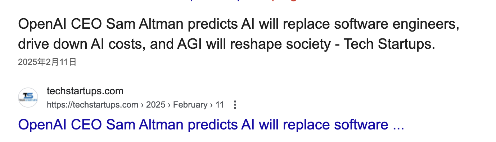
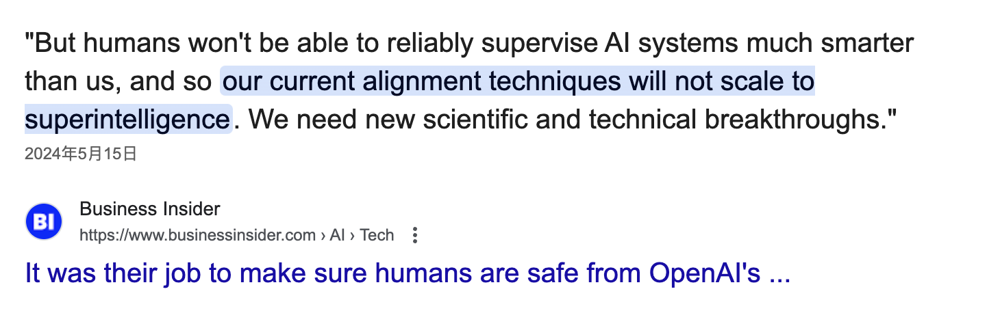

这两天在搞DeepSeek的部署的事，最后完成了这样一个文档：

[亚东：稳定好用还暂时免费的DeepSeek R1方案](https://zhuanlan.zhihu.com/p/24290234281)

用阿里云的方案，稳定性与速度都能有保证。

然后当然是申请经费了，结果一算账，自己的心先凉了！

阿里云打折前的价钱： 100万输入Token，4块钱。 100万输出的Token，16块钱。

我们算贵一点儿，100万Token算16块钱。

我的一个问题，测试时差不多是2万Token。也就是可以问50个问题，也可能输出50个函数或者方法。也就是近2500行代码的绝对正确的产能！

如果折算成初级程序员，差不多是一周的产出（不可能是这个效率），也就是，一周一个替代初级程序员的这个成本是18块钱。

18块钱，现在能买什么呢？

-   一顿麻辣汤，
-   一杯奶茶，
-   一顿老乡鸡，

甚至吃不上麦当劳或者肯德基。但是可能在最近的未来，买一个程序员工作一个星期？？？

200块钱，一顿好一点儿的馆子，就能买程序员一个月的工作？？？

这真的是程序员的AI世界？

还是程序员的AI末世？？？

在完成 DeepSeek R1 部署的这一过程，让我对程序员的未来有了更为深刻的思考。

曾经，程序员群体执着于编程语言的深度钻研，不断提升代码编写能力，追求用代码构建出一个个完美的世界 。但如今，AI 的崛起正逐步改写着程序员的工作模式和职业前景。

AI 工具已经能够高效完成许多重复性高、规律性强的代码编写任务，这意味着单纯依靠传统编程能力的程序员，在未来的职场中竞争力将逐渐减弱。

未来，不会再有纯粹意义上仅靠编写代码为生的程序员，编程将成为 AI 的一项附属能力。

程序员若想在这个时代站稳脚跟，必须把自己的未来构建在 AI 的基础之上。

一方面，我们要学会利用 AI 辅助编程工具。例如，利用代码自动生成工具快速生成部分代码，能大大节省开发时间；借助智能调试工具，可以更快地发现和解决问题。通过这些工具，我们可以将更多的精力投入到更具创造性和价值的工作中。

另一方面，我们要深入学习 AI 相关知识，如机器学习算法、深度学习框架等，了解 AI 的运作原理，从而更好地与 AI 协同工作。

我不知道现在还有什么力量在束缚你不要学习AI，不要有效率的学习AI？大部分人是没有系统性的AI大模型领域的认知的。所以我想推荐一下知乎知学堂的 **AI大模型公开课**，里面有大模型的底层原理与技术，很先进很实用，完整的针对DeepSeek的原理、落地实践、案例什么都会有。入口我直接给大家找过来了，直接听就可以⬇️

如果你要是听了，觉得没有学会DeepSeek，请下这个文章的下方留言，我来给你解答你的疑问！DeepSeek甚至是未来的AI模型，已经是程序员的最后一根稻草了！

创新也是程序员未来发展的关键。在 AI 可以完成基础编程任务的情况下，能够提出创新的想法，开发出具有创新性的应用，才是程序员的核心竞争力所在。

只有通过跨学科学习，引入其他领域的视角和方法来审视和解决编程问题，打破常规思维，创造出更具创新性和实用性的应用才有一个未来吧。

同时，软技能的提升也不容忽视。在 AI 时代，沟通能力、团队协作能力、问题解决能力等软技能变得愈发重要。程序员需要与不同领域的人员合作，共同推动项目的进展，良好的软技能能够帮助我们更好地融入团队，提升工作效率。

总之，在 AI 时代，程序员需要摒弃保守的发展观念，积极拥抱 AI，注重创新，提升软技能，实现自身的转型与发展。

不 AI，无未来，这是时代的趋势，也是我们程序员必须面对的现实。

让我们一起在 AI 的浪潮中，找到属于自己的新方向，开启新的梦想吧。

我还不得不找些证据了：

山姆·奥特曼的论调：

[OpenAI CEO Sam Altman predicts AI will replace software engineers, drive down AI costs, and AGI will reshape society](https://link.zhihu.com/?target=https%3A//techstartups.com/2025/02/11/openai-ceo-sam-altman-predicts-ai-will-replace-software-engineers-drive-down-ai-costs-and-agi-will-reshape-society/)

伊尔亚·索维斯基（Ilya），但是人类无法可靠地监督比我们聪明得多的人工智能系统，因此我们目前的对齐技术将无法扩展到超级智能。我们需要新的科学和技术突破。是监管AI的难题，而不是AI无法比人聪明！你觉得程序员的工作不是智力劳动吗？

[https://www.businessinsider.com/jan\-leike-ilya-sutskever-resignations-superalignment-openai-superintelligence-safe-humanity-2024-5](https://link.zhihu.com/?target=https%3A//www.businessinsider.com/jan-leike-ilya-sutskever-resignations-superalignment-openai-superintelligence-safe-humanity-2024-5)