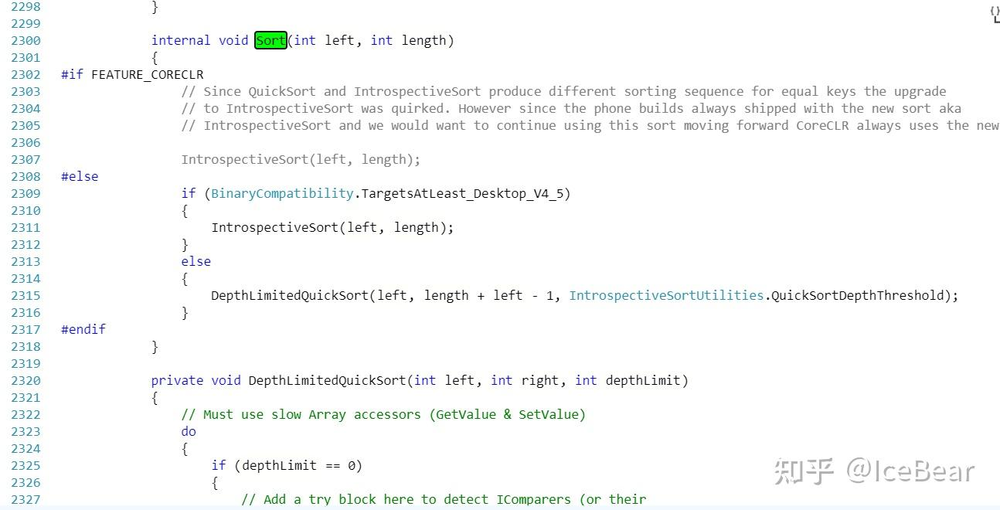
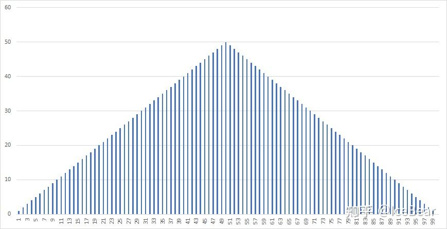
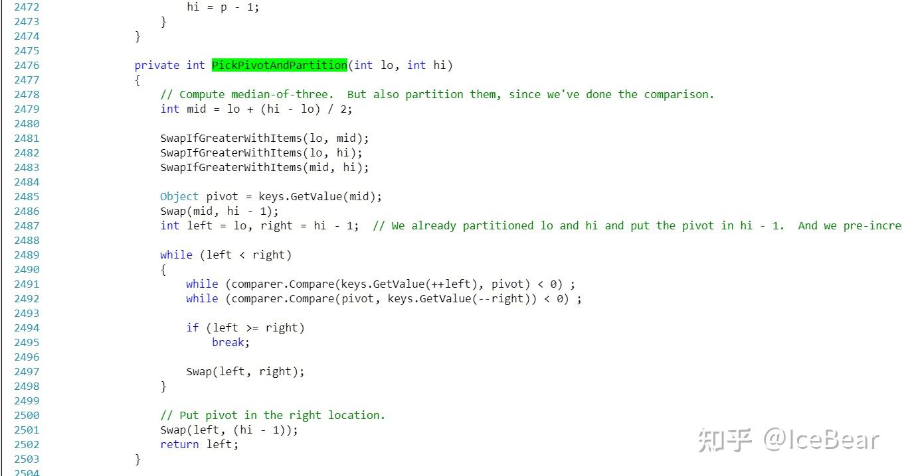
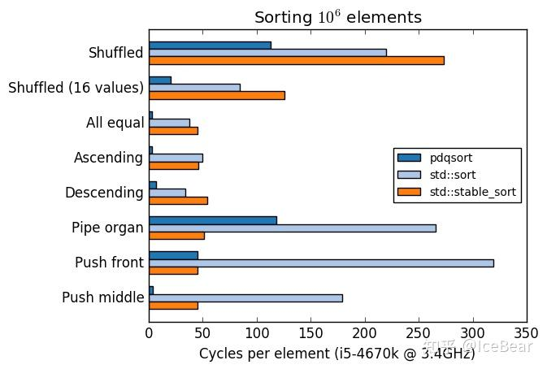

虽然 C# 我不熟，但是 C# Array.Sort 使用的这个排序算法我熟啊。

官方参考源码镇楼：

[Array.cs](https://link.zhihu.com/?target=https%3A//referencesource.microsoft.com/%23mscorlib/system/array.cs%2C3962b0cafae97366)

  

IntroSort，内省排序，巧了，C++ std::sort 同款排序算法。

它的基本思路是这样的：

1.  一般情况下，使用前后双指针快排，以枢轴元素为界划分出两段，再递归排序。
2.  如果排序区间小于一定的阈值（一般是十几到小几十这个量级），快排的递归开销相对而言会比较大，于是使用插入排序。
3.  如果检测到递归层数过大，可以认为快排出了严重的划分不均问题。为了避免爆栈问题，或者快排再次划分不均导致复杂度退化为 O(n^2)，于是使用堆排序。

IntroSort 相对快排的改进的精髓就在这个堆排序上。在十大基本排序算法中，排除掉需要使用辅助空间的，剩下的算法中，堆排序是唯一一个最差的时间复杂度控制在 O(n log n) 的。而快排如果划分不当的话，最差复杂度会退化为 O(n ^ 2)。

换句话说，对于再怎么刁难的序列，堆排序的时间都不会太差，它可以在 IntroSort 中起到一个“兜底”的作用。

既然堆排序的时间复杂度，最好最坏平均三种情况下都是 O(n log n)，干脆只用纯的堆排序排不就好了？干嘛用快排这种会陷入到 O(n ^ 2) 的算法？

这里就牵涉到数据结构的理论里经常忽略的常数了。堆排序的常数太大了，而且是所有 O(n log n) 级的基本排序中，常数最大的一个。对于快排、归并、堆排，大家的用时虽然都是 O(n log n) 级的，但是堆排序所花的时间能达到快排的 1.6 ~ 2 倍。所以堆排序并不能取代快排的地位，只能作为快排划分退化后的保障手段，使得总体的情况“不至于太差”

> （提一嘴，堆排常数大是因为它和其他排序相比，空间访问连续性很差，它在访问堆中的父子节点的时候是跳着访问的，极易造成访存失效）

* * *

IntroSort 的改进非常绝妙，对吧？

但是，有破绽！

  

如果我们故意构造一个能让快排每次划分都很衰的序列。。。

那 IntroSort 会经常性地陷入堆排。

有人会说，可能得要那些专门搞数学的大神才能构造出这种神仙序列叭。。。

其实根本不要，举一个最简单的例子，

pipeorgan，英文原意是管风琴，就是下图这种三角形的序列，轻轻松松就可以卡 IntroSort。

* * *

下面指出原因：

缺陷就在双指针快排的枢轴元素选择策略上。

这里 C# 和 libstdc++ 的 std::sort 实现方法完全一致，采用前、中、后三点取中值法，将三者中间大小的那个元素选为枢轴。

对于一般的序列来说，这是个好方法，能选出更加接近全序列中值的枢轴；而对于 pipeorgan 这种序列就比较悲剧了。

第一轮划分，三点取中是比较的全序列最小的两个元素，和全序列最大的一个元素，取它们的中值。嘶，这个枢轴歪的不行。

第二轮划分也别想多好。由于第一轮选中的是全序列最小的值作为枢轴，所以第一轮划分根本就没怎么变动原序列。第二轮三点取中依旧是在两个较小的元素和一个较大的元素之间取中值。

第三轮、第四轮。。。随着一定的精度上的扰动（比如序列长度分别为奇偶数时，整除 2 有个精度上的差异这种），三点取中的情况可能会逐渐有所好转。但是，还没等缓过来，就已经陷入比较慢的堆排序了。

对于正常的序列来说，如果运气比较背，陷入了堆排序的时候，上层的快排基本上划分的也差不多了，堆排的对象都是比较短的序列。而且，也不会陷入好几次堆排。

pipeorgan 这种则是，会陷入好几次堆排，而且每次堆排处理的序列都会很长。。。嘶。

* * *

来看几段动画演示直观感受一下。

这些动画演示是我自己写程序生成的。虽然动画演示程序用的是 C++，用的 IntroSort 写法细节上 C# 标准库的算法并不完全一致，但是大致上还是相同的。

先来看看 IntroSort 排完全随机序列是什么样的：

[视频](https://link.zhihu.com/?target=https%3A//www.zhihu.com/video/1415808779149115392)

下面是 IntroSort 排 pipeorgan 的动画：

[视频](https://link.zhihu.com/?target=https%3A//www.zhihu.com/video/1415809073270517760)

可以看到，和排完全随机序列时的快速流畅相比，IntroSort 排 pipeorgan 看的令人十分捉急。。。

而且，你可以看到这里面发生了好几次很明显的长序列的堆排。

如果你并不知道堆排的动画特征是什么样的话，这里也有堆排序排 pipeorgan 的：

[视频](https://link.zhihu.com/?target=https%3A//www.zhihu.com/video/1415809310269689856)

  

* * *

改进方法：

第一种方法，肯定很多人都会搬出你们在数据结构课上学的办法，采用随机数。每次选取随机位置的元素做枢轴不就好了？

但是很可惜，这在工程的角度来说是个根本就不可行的方法。这会导致每次对完全相同的序列进行排序时，排序算法内部的执行流程，排序的执行时间，乃至排序后的结果都不一样。

比如，你写的排序函数有个隐藏的 bug，不过触发的条件很隐蔽，一直没有显现。有一天，你发现用你的排序函数排某个序列时，排出来的结果是错的。然而，因为你的排序函数内部引入的随机数机制，导致你再去对同样的序列去做测试时，问题不见了。

这还怎么调试。。。每次测试时都走的不同路径，问题还怎么复现。。。

好，就算你能确保你写的排序绝对没 bug，那我再举个场景。

我们知道快排是不稳定的。引入随机数的话，可能每次会产生 1 2 2\* 3 或者 1 2\* 2 3 这两种不同的结果。当用户调完你的排序，再去使用这个有序序列时，假如他写的业务代码对 1 2 2\* 3 这种序列执行正常，而对于另一种情况有 bug 怎么办？那用户想去复现问题的时候，也是遭罪。

  

第二种，增加枢轴选取时，候选者的个数。看 MSVC C++ STL 的实现，在排序序列长度大于一定值的时候，采用的是**九点取中**（长度太短的话，三点取中就够了，比较多了也没必要）。pipeorgan 的尴尬轻松化解。

  

第三种，换排序算法呗。

Rust 的标准库采用的是非常新的 Pattern-defeating Qsort 算法，最近 C++ 的社区也有呼声要把 std::sort 的 IntroSort 算法换成这个。

除了标配九点取中以外，pdqsort 在检测到快排划分严重不均时（比如设定左右长度比超过 1:N 时就认为产生了划分不均），还会主动地去调整下一段区间中，一些元素的位置，将它们打乱。而不是被动地陷入堆排（不过 pdqsort 依旧是有堆排保底的）。

这是 boost::pdqsort 排 pipeorgan 的动画：

[视频](https://link.zhihu.com/?target=https%3A//www.zhihu.com/video/1415809416805888000)

  

还有，像 Java 和 Python 的标准库使用的是 TimSort 的算法，它的主要思想是识别出尽可能长的升序或者降序子序列（降序序列逆转一下就好了；要是识别出来的有序序列太短，或者根本就不有序的话，会使用插入排序构造一个长度能达到最短要求的有序序列），然后将这些有序的序列按照一定的规则进行归并。

你肯定已经猜到了，TimSort 对于那些内部局部有序的序列效果会非常好。所以它**赌的就是业务代码里局部有序的情况会比较多**。但是对于完全随机的序列效果就会差了。

这是 gfx::timsort 排 pipeorgan 的动画：

[视频](https://link.zhihu.com/?target=https%3A//www.zhihu.com/video/1415809623710806016)

  

* * *

所以，标准库的算法不一定就是完美的，对于一些特别的情况，也可能处理的并不好。一个算法能作为一门语言的内置排序算法，证明它其实已经很通用了，但是比它更优秀、更适应特别情况的新算法也在不断地推出。