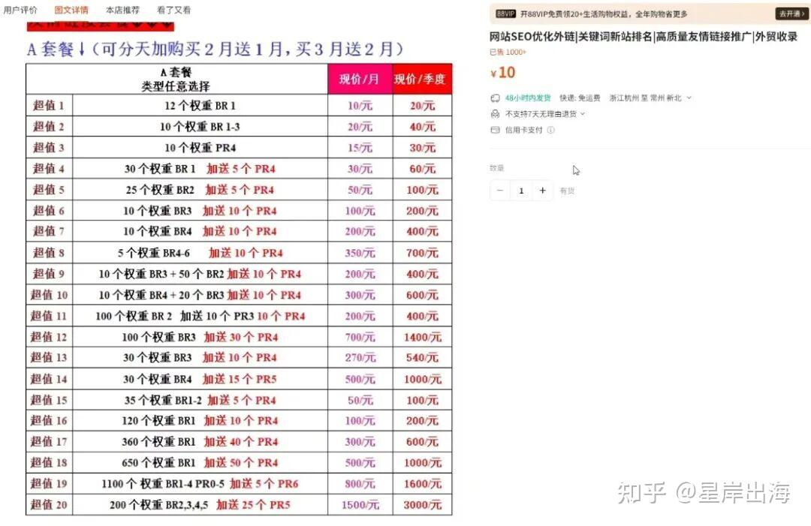
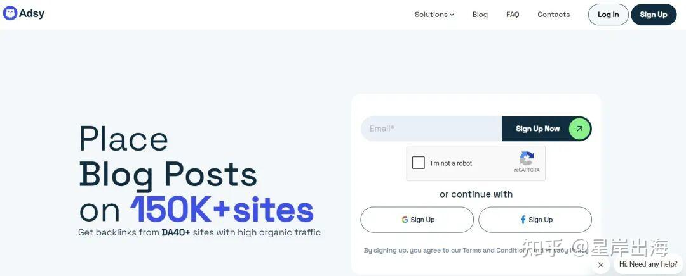
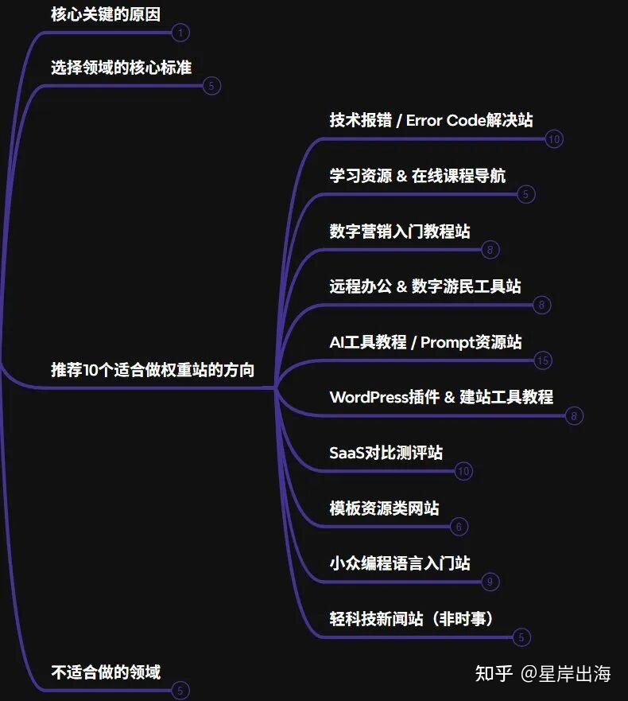
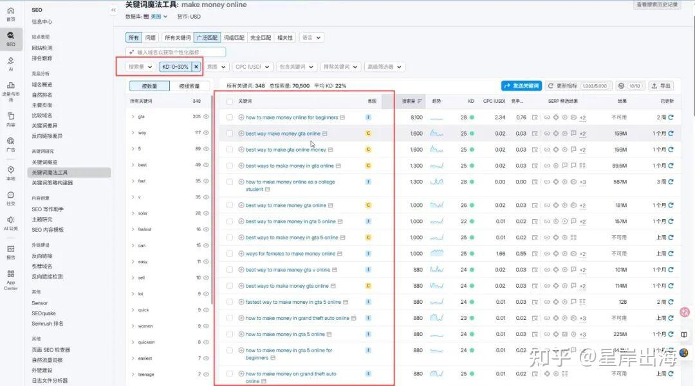
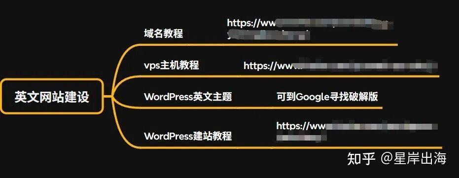
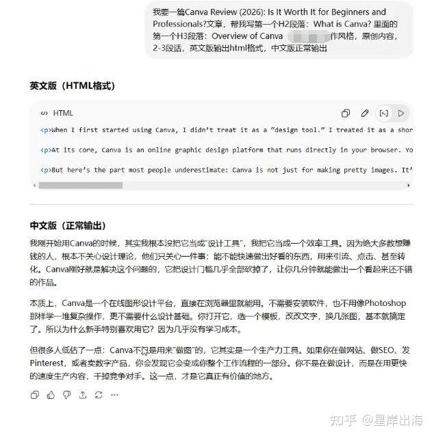
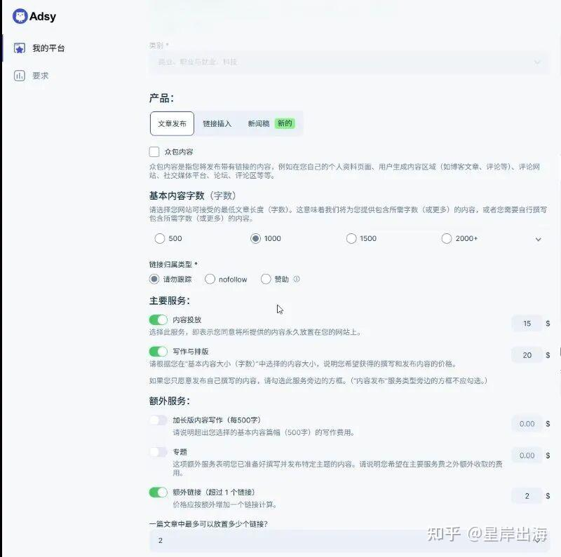

这几年国内做网站的，基本都改行了。

大家一窝蜂往某音、某红书这些APP里挤，没人愿意再碰网站这条路。

但星岸出海最近盯上的，恰恰就是网站这条没人走的路，而且是做给老外的英文网站。

国内是APP的天下，国外还是网站的天下，这一个反差，就是今天这个项目全部的机会。

今天我就把这个英文AI站群权重变现项目，从头到尾给兄弟们拆明白。

## **这个英文AI站群项目，到底靠啥赚钱**

先把赚钱原理讲清楚，搞懂这一点，后面就都顺了。

一句话，星岸出海做的不是流量生意，卖的是网站的权重。

啥叫权重？

你可以把它理解成一个网站在谷歌眼里的江湖地位，地位越高，权重越高。

在做谷歌SEO这行，外链是刚需，没有之一。

一个老外的网站想往谷歌前面排，就得有别的网站给它投票，这个投票，就是外链。

而我们的网站给对方发一条带链接的文章，就等于把自己一部分权重传过去了。

说白了，老外掏钱买的，不是那篇文章，也不是那条链接本身，买的是我这个网站的权重。

这门生意国内其实早些年也有人干，但现在国内没人做网站了，市场早就萎了。

国外完全不一样，企业也好，个人站长也好，做网站的一抓一大把，买外链买软文的需求常年都在。

而且老外人工贵，自己慢慢发外链不划算，宁可花钱买现成的，所以这个市场大得惊人。

这市场到底有多大，我给你看个国内的例子你就懂了。

你看，连国内某宝上都有人专门卖这种外链，十块钱一单，已经卖了一千多份。

注意，某宝上这种几块钱几百条的，全是垃圾外链，新手千万别碰，这个坑后面专门讲。

国内这种不懂行的小市场都能卖一千多单，老外那个正经市场是它的几百倍上千倍，你自己感受一下这个体量。

## **这项目一个网站一个月能赚多少钱**

接下来算笔账，这玩意儿到底能赚多少。

卖的主要是两样东西，一是带链接的软文，二是纯外链。

价格跟你网站的权重直接挂钩，权重越高越值钱。

权重DR在20到30之间，一条软文大概能卖20到50美金。

DR做到30到40，一条能卖50到150美金。

DR上了40，一条150美金往上走。

星岸出海给你按最保守的算，一个网站一个月卖10条，一条按80美金，就是800美金。

这还只是一个站，你手上要是有十个八个站，这个数自己往上乘。

养上半年，这个站本身还能整体打包卖掉，月利润乘个二三十倍，又是一笔。

还有个隐形的好处，咱们赚的是美金。

按现在的汇率，一美金换七块多人民币，同样的活，出海做就比在国内做的回报高一截。

当然这数字弹性很大，做得勤一个月卖二三十条也正常，我给的只是个保守的参照。

## **靠的是哪个平台，凭啥是它**

那这些软文外链，卖到哪儿去？

海外有专门的交易平台，比较有名的一个叫Adsy。

你看它首页就写着，能在15万多个网站上帮你发文章拿外链。

这平台上挂着卖的网站，光权重低一点的就有上万个，全开放着等人来买。

它分两种账号，一种是买家账号，给想买外链的人用，另一种是卖家账号，咱们做项目挂网站就是用卖家账号。

凭啥是这种平台？

因为海外是网站生态，买家一大把，做SEO的机构、卖独立站的、做软件SaaS的、做联盟的站长，天天都在上面找网站买外链。

对我来说，权重养起来的网站，就是一笔能反复卖钱的资产，挂在平台上躺着就有人来询价。

## **具体怎么操作，新手照着这六步做就行**

道理讲完，下面是最关键的实操，我给兄弟们拆成六步，照着做就行。

### **第一步：先把卖货的平台账号注册了**

### 卖东西之前，总得先有个摊位。

所以先去Adsy这种平台注册账号，记住要注册的是卖家账号，不是买家账号。

卖家账号的入口藏得有点深，不在首页那个明显的注册按钮里。

你得点到附加服务那一栏，找到“加入我们赚取收入”或者“靠博客盈利”那个入口，从那儿进去注册。

几分钟就能搞定，注册完，心里就有个卖货的地方了。

### **第二步：选一个好做的行业方向**

账号有了，接下来这步最关键，方向选错，后面全白搭。

选方向就一个总原则，挑那种竞争弱、长尾词多、流量大、但内容又能用AI批量写的行业。

选方向就一个总原则，挑那种竞争弱、长尾词多、流量大、但内容又能用AI批量写的行业。

星岸出海给你列了10个好做的方向，像技术报错解决站、AI工具教程站、WordPress插件教程站、SaaS对比测评站、数字营销入门站这些都行。

这里面我最推荐新手从技术报错类入手，就是各种软件报错怎么解决的内容，长尾词多到吓人，流量起得最快。

有几类坚决别碰，医疗、金融、法律、还有盗版资源。

这几类要么要专业资质，要么谷歌严打，新手做了纯白费功夫。

### **第三步：用工具挖一堆弱关键词**

方向定下来，就该去挖关键词了。

用一个叫Semrush的SEO工具，某宝上能买到共享版，不贵。

重点就一个，专挑那种难度低的弱关键词，把难度KD这个值筛到0到30之间。

再看一眼搜索量，五十到一千就行，太小没意义，太大你也抢不过大站。

还有个动作，把挑出来的词丢到谷歌里，用美国那边的线路搜一下，看看前几页是不是全是大站。

要是前几页全被大站占了，这词就别写了，写了也排不上去，纯白搭。

记住咱们这个项目的立场，流量能不能变现压根不重要，能上排名、能给网站攒权重，就够了。

### **第四步：搭一个英文网站**

关键词攒够了，就可以动手搭网站了。

网站用WordPress搭，配一个VPS主机和一个宝塔面板，域名买全新的就行。

这里星岸出海提醒一句，别折腾那种带历史的老域名，坑特别多，新手根本判断不了好坏，老老实实用干净的新域名。

网站主题可以到Google上找破解版，因为正版一套几十美金，你做十个站就得买十套，成本太高。

而且一个好主题里头其实带了好几十种风格，一套主题就能撑起你几十个不同的站。

这一步对网站要求不高，模板装好、把演示内容清空、建好自己的栏目，就能开始发文章了。

### **第五步：用AI把文章批量写出来**

网站搭好只是个空壳子，真正往里头填东西的活，全交给AI。

内容主要写三类，工具测评、教程报错、还有A和B的对比，这三类最好做又最容易卖外链。

写法也简单，先让AI帮你挖好关键词，再让它生成文章大纲，然后一篇文章一两千个英文单词，让AI按大纲写出来。

像上面这样，让AI直接输出英文的HTML格式，复制粘贴到网站后台就能发，一篇文章几分钟搞定。

三个月的目标，是把文章怼到三五百篇，每天稳定更新个几篇到十几篇。

这里有个铁律，更新一定要稳，每天匀着发，千万别一天发一百篇然后半个月不动，谷歌最讨厌这种。

### **第六步：养出权重，挂上去卖**

文章源源不断怼上去之后，剩下的事就是养权重，再把网站挂出去卖。

养权重的过程里，配合发一点点安全的外链，比如去Quora、Medium、Reddit、还有一些目录站，自然地留几条链接就行。

一般三到六个月，网站的权重DR就能养到20甚至30以上，到这时候就能挂到平台上卖了。

挂的时候记住两个关键设置。

第一，链接类型一定选dofollow那个，因为老外买的就是能传权重的链接，你给个不传权重的他根本不要。

第二，别勾“标注为赞助内容”，一标上权重就传得弱了，价格也卖不上去。

价格参考一下同行，别比人家贵，差不多或者稍微低一点，单子自然就来了。

## **这几个坑，我提前给你点出来**

项目能赚钱，但有几个坑要是踩了，前面全白干，星岸出海挨个给你点一下。

第一个坑，别买某宝、Fiverr上那种几美金几百条的外链套餐。

那玩意儿全是垃圾站群的链接，新站买了不光没用，还大概率被谷歌降权。

第二个坑，你网站里往外导链接的文章别太多，控制在一两成、最多三成。

你想啊，要是大半文章都往外导链接，你自己的权重不就导光了，买家一看也知道你是垃圾站，没人买。

第三个坑，做站群千万别瞎互链。

星岸出海早年做站群就吃过这个亏，一批站放在同一条线路下、又是同类内容，结果被搜索引擎一锅端，大半都被降了权。

所以同一条线路下别放同类网站，站和站之间也别乱连，新手干脆别互链，最安全。

还有一点，一上来别只做一个站，新域名有运气成分，建议直接开三个站一起跑，数据才有参考价值。

## 最后说几句

说到底，这个英文AI站群权重变现项目，星岸出海看下来最大的好处就三条。

一是内容全用AI写，成本压到极低，一个站一年也就域名加主机几十美金。

二是它不靠流量吃饭，权重养起来就是一笔能反复卖、还能整站打包卖的资产，赚的还是美金。

三是这套打法能复制，一个站跑通，后面十个二十个站照着搭就行。

它不是那种今天上手明天就来钱的快项目，得花三五个月慢慢养，但养起来就是长期被动的活。

门槛其实没你想的高，不用懂英文，也不用会代码，照着上面六步一步步来，普通人完全能上手。

国内没人做的方向，往往才是闷声赚钱的方向，这事我做了快二十年，越来越信。

今天星岸出海就把这个项目分享到这里，希望对在创业路上琢磨项目的你有点帮助。