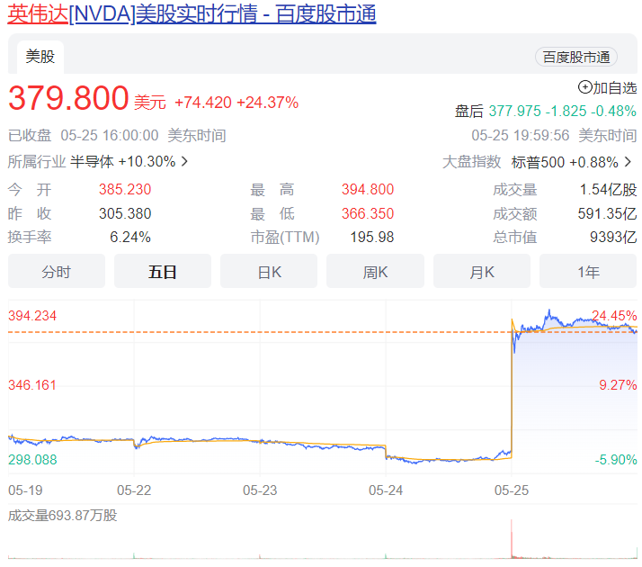
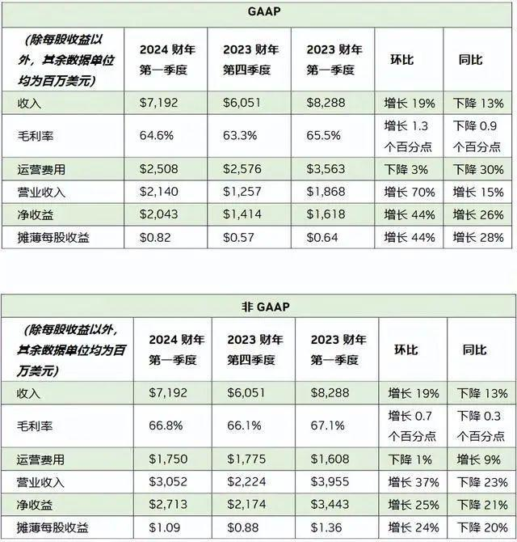
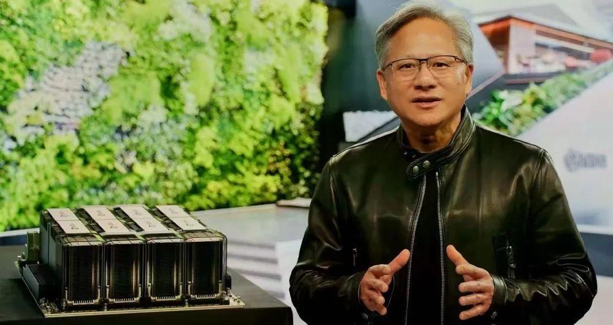

本周四英伟达**暴涨24.37%**，市值一日之内猛增**1980亿美元**，达到**9393亿美元**，创美股历史上个股市值最大单日涨幅。

也就是说，英伟达市值一夜反超特斯拉，涨出了一个AMD、将近两个英特尔。目前英伟达的总市值已经是老牌巨头英特尔的8.2倍。

据多个金融机构预计，英伟达可能很快成为苹果、微软、谷歌母公司字母表以及亚马逊之后，美国的第五家市值突破一万亿美元的上市公司。

  

  

要知道，两周前我们还在说IC设计巨头们已经连跌三个季度，半导体行业已经跌到了“M周期”的谷底。

但此次受英伟达股价大涨带动，芯片股普遍走高，超威半导体（AMD）上涨11.2%，博通涨超7%，芯片行业基准费城半导体指数收涨6.8%。

各大芯片巨头已经开始“爬坡”，这一态势也即将会传导到整个IC行业。  

英伟达之所以拥有如此惊人的涨幅，最主要的原因正是此前公布的一份强劲财报。

北京时间5月25日，英伟达发布了2024财年第一季度财报（截至4月30日）：

收入**71.9亿美元**，高于市场预期的65.2亿美元，与上一财季的60.51亿美元相比**增长19%**。

  

  

在具体业务中，业绩最亮眼的莫过于**数据中心：营收为42.8亿美元，占总业绩近六成。**同比增长14%，较分析师预期的39.1亿美元高约9.5%。

很显然，数据中心已经取代游戏成为英伟达最大的收入来源。这一波全球AI热潮为英伟达带来的收益远超预期。

火爆全球的ChatGPT作为人工智能的产物，运行条件离不开算法、算力和数据。能够为AI提供强大算力的底层核心硬件，正是芯片。目前，唯一可以实际处理ChatGPT的芯片就是英伟达GPU——HGX A100。

英伟达CEO黄仁勋发布财报时提到：

“计算机行业正在同时经历两个转变——加速计算和生成式AI，企业竞相将生成式AI应用到各个产品、服务和业务流程中，全球万亿美元规模的已安装数据中心将从通用计算转变到加速计算。”

  

  

华尔街分析师称“生成式人工智能和大型语言/转换器模型正在推动对英伟达加速计算/网络平台和软件解决方案的需求加速增长。”

人工智能对于强大算力的需求就等于对高端芯片的需求，我们完全可以说英伟达当前在AI芯片领域占据了主导地位。

英伟达引领人工智能革命，也势必会带动芯片行业的新热潮。

芯片行业，正在迎来新生。