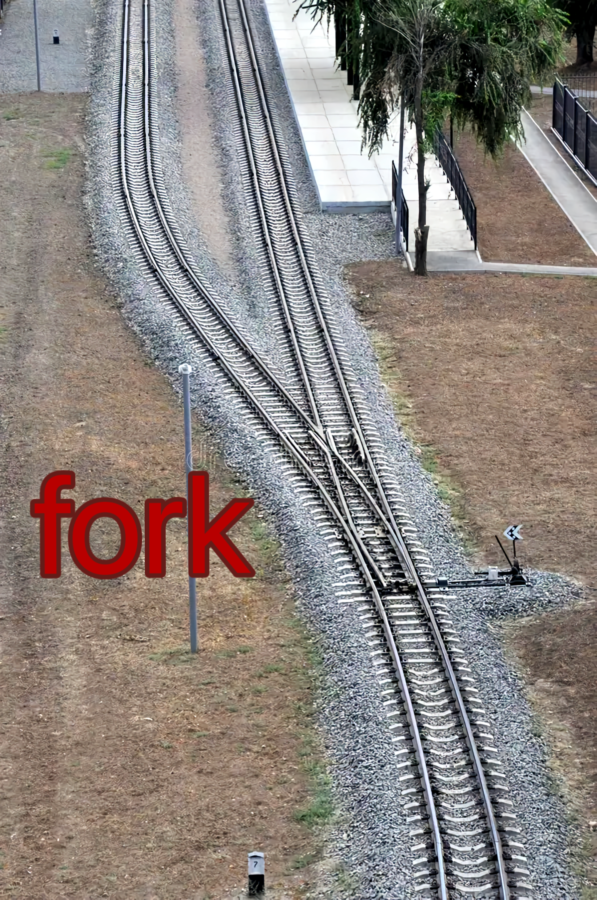

fork 是叉子，就是欧美人吃饭用的叉子，然后引申为铁路的「分叉」。copy 则是原样复制过去。

  

  

  

  

  

有什么区别？

分叉之前是只有一条路，分叉之后才有两条路。复制则是直接造一条一模一样的路，不存在什么一条路两条路的概念，或者说至始至终都是两条路，没有什么节点之前一条路之后两条路的概念。

分叉是有主次关系的，也可以说成亲子关系、上下级关系等等。复制则没有主次关系，原件和复印件没有区别。

  

  

* * *

  

  

计算机行业的 fork 其实就是指「分叉」。一个进程可以「分叉」（fork）成两个进程，主路叫做父进程，岔路则叫做子进程。

分叉之前是一个进程，分叉之后是两个进程，并且两个进程是有亲子关系的。