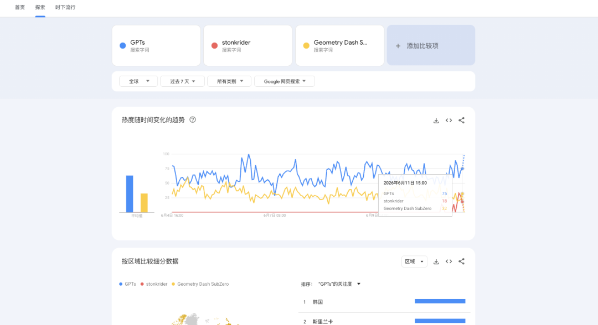

现在外网上，AI 站、游戏周边站，国人的站已经占据半壁江山了（因为套路就我天天说的那几种，一眼就能看出是国人开发的）。但是由于比较隐蔽，所以一直很神秘。

我隔三差五在本平台发一些我们行业的笔记和知识，发了有 150+ 篇了，今天依然继续：

### 新手做新词，长什么样？

一般我们行业内的新手，是做新词的，比如游戏词。



（GPTS 和 Geometry 是对比词，这些词搜索量大约是 1 天 5000 次，因此可以看出 stonk rider 的搜索量当时也是差不多的）

比如最近 6 月 9 号的一个新词， stonk rider ，然后一瞬间，有如此多的站就出现了，这些都是我在谷歌搜索 stonk rider 前 15 页发现的。

```text
https://stonk-rider.com
https://stonkrider.world
https://stonkrider.site
https://stonkridergame.com
https://stonk-rider.org
https://stonkrider.net
https://stonkrider.online
https://stonk-rider.net
https://stonkrider.one
https://stonkrider.app
https://stonkrider.cc
https://stonkrider.wiki
https://stonkrider.win
https://stonkrider.org
https://stonkrider.xyz
https://stonkrider.run
https://stonkrider.com

```

这些站都是 6-11 那天下午注册的，是很多很多人在抓这个新词，然后上站后第二天就在谷歌收录了。

以至于原版作者在推特上大呼 amazing ，笑死我了哈哈：

让老外感受到了中国 SEO 的威力。

当然，这个很显然是特殊情况，是有人泄露了这个新词，导致竞品爆炸，99% 的情况下，新站遇到的竞争对手不超过 5 个，绝大部分情况下，新词竞争对手是 0 ，没错，是 0。

只要，对方不上心，你稍微上点心，你就可以接到这些流量，对于各位程序员来讲，这很简单。

我分析了一下这些站，真是八仙过海，各显神通，其中 iframe 套壳站 4 个，AI 仿站 11 个！无一例外，都在谷歌拿到了流量。

流量一般是通过谷歌广告流量主变现，1000 个欧美流量，大约是 4 美元。就是这样。

所以说，新手一般适合去做 游戏站 或者 新词 站。

只有这一种方式可以在 5 天内给你一个反馈。也是唯一一个不做外链，直接上站就能拿到热词排名的方式。

但是，也仅限反馈.... 就是给自己一个自信，亲眼目睹过，亲手挣过，所以相信。一旦有了信心，就要去做老词。

## 应该做老词

老词，它们有稳定的搜索量，而且可以在 trends 上感受到稳定度，日均搜索量，稳定的流量，带来的就是稳定的收入。可以当成一个事业、保底的睡后收入，而且是很夸张的甩手掌柜级别的睡后收入。因为一旦占据了老词的排名，靠前，你的站就不用大更新了。

要知道，真正的老站长，其实有良好 SEO 意识的，不到 1% 。大部分都半桶水，我们只要努力，即便是再难的词，我们也能搞到手。

新词是有缺点的，新词大部分都不一定能活很久，所以玩玩就行，真正搞事业，还得是投资老词。

哥飞最近的文章《新词老词都可以做，老词可以用长尾表达反向吃主词》里说：

新词活的久的，会竞争加剧，先发优势越来越弱。还是得买外链。

狭义上的新词，是一个月以内的新词，广义上的新词是 半年内 。

那些靠前的，大部分人都没有 SEO 意识，只要做好站内 SEO ，以及做好外链就可以再拿到，后发往往也会先至的！没有第一时间上车，并不可怕。

而且也不一定第一名，只要在前 2 页，都算赢。

## 老词的知识

老词分两种，蓝海词 和 红海词。

谷歌使用 intitle: 命令来判断供应量。然后根据搜索结果的竞争程度来判断怎么对付。

（不是看 KD ，而是看到搜索结果里的，是不是首页，独立站首页才是我们的竞争对手，那些内页，大部分是谷歌拿来糊弄我们凑数的）

竞争激烈的肯定是很挣钱的词，但是那种都是给 公司 甚至 工作室 准备的，对于我们原子人，一个很普通的老词，一个月挣几千美元，就够我们活的非常体面了。

【每一个关键词的搜索结果，就是一个排行榜。】

你的竞争对手，一般只有十几个，甚至几个。

## 重点！长尾词！

哥飞在文章里说：

真正值钱的干货来了！

一旦我们发现，在谷歌搜索某个（主要指有高搜索量）词，返回的结果，是谷歌拼凑的别的词，那就是我们的机会！就是财富！

对于大厂，他们看不上，对于我们，就是几年的生计！

（别小看这个道理，靠你自己悟，5 年不见得悟出来）

我们可以用 B C A 来注册域名，然后举全站之力来优化 B C A 这个词。做老词不一定要一上来就硬刚主词。先从竞争小的表达切进去。

不断上内页，不断搞外链，慢慢会发现，我们能够拿到一些关键词的排名了，有曝光，有点击。

一般三个月，最多 6 个月，我们就有很多流量，很多曝光了 ~

其实，现在很多站点，就是靠这个心照不宣的技巧，从默默无闻，变成深海巨龙的。