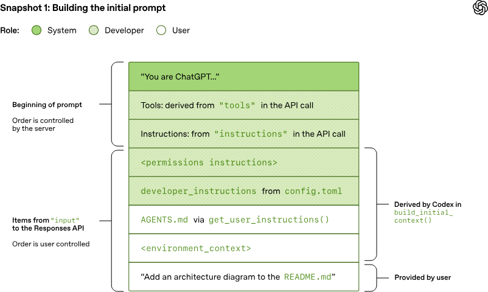

近期需要基于GPT5.4开发一个Code Agent，通常模型厂商推出的agent一定是最符合模型能力的agent，毕竟厂商可以对着你的Agent定向RL，因此我选择读一下Codex的源码并且借(chao)鉴(xi)一下。

书接上回：

[简读Codex的Agent Loop](https://zhuanlan.zhihu.com/p/2001274737393943724)

Codex的项目是Rust构建的，在Github开源：

[https://github.com/openai/codex](https://link.zhihu.com/?target=https%3A//github.com/openai/codex)

本篇文章只涉及AgentLoop，而偏工程化的实现（Codex内部的会话管理、状态管理、流式处理、TUI交互、sandbox）会放到下一篇文章。

## 一、Codex的Agent Loop

Agent是在循环中收集上下文和使用工具的Loop。

Codex有两层循环：

-   外层循环用来消费Op(Interrupt、Compact、Review、UserInputAnswer、RequestPermissionsResponse 等)，决定是否分发给内层循环。
-   内层循环是一轮turn，也是我们经常理解的Agent Loop：整理上下文、向模型发请求、执行工具、把工具结果写回历史，再决定是否继续调用模型。turn的结束条件是`!needs_follow_up`(Tool Call为空，且没有tool result要给模型，且用户输入为空时)

## 二、 Codex的上下文

整个上下文的入口是`fn build_responses_request()`

可以结合之前OpenAI Blog的配图看这部分



### 1\. Base instructions

Base instructions是codex中的基础指令，默认指令是`codex/prompt.md`，原文github有，这里做个简单机翻

```text
你是一个在 Codex CLI 中运行的编程代理，这是一个基于终端的编码助手。Codex CLI 是由 OpenAI 主导的开源项目。你需要做到精确、安全且有帮助。

你的能力：

- 接收用户提示以及由系统提供的其他上下文信息，例如工作区中的文件。
- 通过流式输出思考与回复、制定和更新计划，与用户进行沟通。
- 发出函数调用以执行终端命令和应用补丁。根据当前运行配置，你可以请求用户批准后再执行这些操作。更多内容请参见“沙箱与审批”部分。

在此上下文中，Codex 指的是开源的代理式编码接口（而不是 OpenAI 早期的 Codex 语言模型）。

# 工作方式

## 个性

你的默认性格与语气是简洁、直接、友好。你高效沟通，让用户始终清楚当前正在进行的操作，而不会提供不必要的细节。你始终优先提供可执行的指导，清楚说明假设、环境前提和下一步操作。除非明确要求，否则避免冗长解释。

# AGENTS.md 规范

- 仓库中通常包含 AGENTS.md 文件，这些文件可以出现在任意目录。
- 这些文件用于人类向你（代理）提供在该容器中工作的说明或提示。
- 示例内容包括：编码规范、代码结构说明、运行或测试代码的方式等。
- AGENTS.md 文件的规则：
  - 文件的作用范围是其所在目录及其所有子目录。
  - 对于你最终修改的每个文件，必须遵循其作用范围内的 AGENTS.md 指令。
  - 关于代码风格、结构、命名等的指令，仅适用于该范围内的代码，除非另有说明。
  - 如果存在冲突，更深层目录中的 AGENTS.md 优先。
  - 系统 / 开发者 / 用户的直接指令优先于 AGENTS.md。
- 根目录以及当前工作目录到根路径之间的 AGENTS.md 已包含在开发者消息中，无需重复读取。若在子目录或外部目录工作，应检查是否有适用的 AGENTS.md。

## 响应性

### 前置说明（Preamble）

在调用工具前，需发送简短说明，解释你接下来要做的事情。原则如下：

- **逻辑分组操作**：将相关操作合并说明
- **保持简洁**：1-2句话，8–12个词
- **承接上下文**：说明当前进展与下一步
- **语气轻松友好**
- **例外**：简单读取操作可省略

示例：

- “我已经浏览完仓库，现在检查 API 路由。”
- “接下来更新配置并同步测试。”
- “准备搭建 CLI 命令结构。”

## 计划（Planning）

你可以使用 `update_plan` 工具来制定和跟踪步骤。

好的计划应：

- 拆分为清晰、有逻辑顺序的步骤
- 易于验证进度
- 避免无意义步骤

适用场景：

- 任务复杂或多阶段
- 有依赖顺序
- 存在不确定性
- 用户要求使用计划

不要在简单任务中使用计划。

## 执行任务

你必须持续工作直到问题完全解决。

要求：

- 不猜测、不编造答案
- 使用 `apply_patch` 修改文件
- 优先解决根本问题
- 保持代码简洁
- 不修改无关代码
- 遵循现有代码风格
- 不添加版权声明
- 不随意添加注释
- 不使用单字母变量

## 验证工作

- 可运行测试时应验证
- 从小范围测试开始
- 不修复无关错误
- 不引入格式化工具（除非已有）

## 主动性与精确性

- 新项目：可以更有创造性
- 现有项目：精准修改，不越界

## 进度更新

对于较长任务，应定期简短更新：

- 8–10个词
- 描述当前进展与下一步

## 最终输出

你的回复应像一个高效的团队成员：

- 简洁、自然
- 必要时使用结构化格式
- 不重复大段代码
- 不要求用户保存文件

### 格式规范

**标题**
- 使用 `**标题**`
- 简短清晰

**列表**
- 使用 `- `
- 每条尽量一行

**代码**
- 使用反引号包裹

**文件路径**
- 使用可点击路径
- 示例：`src/app.ts:42`

**语气**
- 合作式、自然
- 主动语态

## 工具使用

### Shell

- 优先使用 `rg` 搜索

### update_plan

- 每步 1 句话
- 标注状态：pending / in_progress / completed
```

### 2\. Tools Defintion

可用的工具列表，放在 Prompt.tools 里。包含：

-   当前 session 可见的内建工具
-   条件启用工具
-   MCP 工具
-   dynamic tools（如果某些 dynamic tool 标了 defer\_loading，这轮 prompt 里会先过滤掉，不直接暴露给模型）

### 3\. Input

对话历史和上下文消息「`build_initial_context()`」

**3.1 developer消息**

| 消息类型 | 说明 | 例子 |
| ----- | ----- | ----- |
| Model switch message | 当模型切换时，注入这一段message | ```MarkdownThe user was previously using a different model. Pleasecontinue the conversation according to the followinginstructions:``` |
| sandbox / approval / reviewer / exec policy 对应的开发者说明 | 这些要素拼装成类似右侧的段落 | ```MarkdownFilesystem sandboxing defines which files can be reador written. `sandbox_mode` is `workspace-write`: Thesandbox permits reading files, and editing files in`cwd` and `writable_roots`. Editing files in otherdirectories requires approval. Network access isrestricted.# Permission RequestsCommands may require user approval before execution.Prefer requesting sandboxed additional permissionsinstead of asking to run fully outside the sandbox.## Preferred request modeWhen you need extra sandboxed permissions for onecommand, use:- `sandbox_permissions: "with_additional_permissions"`- `additional_permissions` with one or more of:- `network.enabled`: set to `true` to enable networkaccess- `file_system.read`: list of paths that need readaccess- `file_system.write`: list of paths that need writeaccessWhen using the `request_permissions` tool directly,only request `network` and `file_system` permissions.This keeps execution inside the current sandbox policy,while adding only the requested permissions for thatcommand, unless an exec-policy allow rule applies andauthorizes running the command outside the sandbox.If the command already matches an exec-policy allowrule, the command can be auto-approved without an extraprompt. In that case, exec-policy allow behavior(including any sandbox bypass) takes precedence.## Escalation RequestsUse full escalation only when sandboxed additionalpermissions cannot satisfy the task.- `sandbox_permissions: "require_escalated"`- Include `justification` as a short question askingfor approval.- Optionally include `prefix_rule` to suggest areusable allow rule.## Command segmentation reminderThe command string is split into independent commandsegments at shell control operators, including pipes(`|`), logical operators (`&&`, `||`), commandseparators (`;`), and subshell boundaries (`(...)`,`$()`).Each segment is evaluated independently for sandboxrestrictions and approval requirements.## Approved command prefixesThe following prefix rules have already beenapproved: ...The writable roots are `...`, `...`, ...``` |
| developer instructions | 配置化内容，可能来源于AGENTS.md |  |
| Memory tool Message | 给模型看的Memory使用说明 | memory_summary.md的内容- 你可以使用 memory folder 里的历史信息- 只能读，不能改 memory- 什么时候该查 memory，什么时候可以跳过- 怎么做一个轻量级 quick memory pass- 什么时候要重新验证 memory 里的事实- 如果用了 memory，最终回复末尾必须附一个 ` |
| realtime状态说明 | 说明你是不是在跟用户实时对话 | ```Markdown....``` |
| model_instructions和personality_message | model_instructions 是整份模型基础说明personality_message 只是其中 personality 对应的那一小段风格说明 |  |
| 可访问 connectors / apps 摘要 |  | ```Markdown1. 一个标题和说明2. ### Available skills3. 把当前允许“隐式触发”的 skills 逐条列出来4. ### How to use skills5. 一大段固定的使用规则6. 最外层包上 SKILLS_INSTRUCTIONS_OPEN_TAG / SKILLS_INSTRUCTIONS_CLOSE_TAG## SkillsA skill is a set of local instructions to follow that is stored in a `SKILL.md` file...### Available skills- : (file: )- : (file: )...### How to use skills- Discovery: ...- Trigger rules: ...- Missing/blocked: ...- How to use a skill (progressive disclosure):1) ...2) ...3) ...4) ...5) ...- Coordination and sequencing:- ...- Context hygiene:- ...- Safety and fallback: ...- Discovery: The list above is the skills available in this session (name + description + filepath). Skill bodies live on disk at the listed paths.- Trigger rules: If the user names a skill (with `$SkillName` or plain text) OR the taskclearly matches a skill's description shown above, you must use that skill for that turn.Multiple mentions mean use them all. Do not carry skills across turns unless re-mentioned.- Missing/blocked: If a named skill isn't in the list or the path can't be read, say sobriefly and continue with the best fallback.- How to use a skill (progressive disclosure):1) After deciding to use a skill, open its `SKILL.md`. Read only enough to follow theworkflow.2) When `SKILL.md` references relative paths (e.g., `scripts/foo.py`), resolve them relativeto the skill directory listed above first, and only consider other paths if needed.3) If `SKILL.md` points to extra folders such as `references/`, load only the specific filesneeded for the request; don't bulk-load everything.4) If `scripts/` exist, prefer running or patching them instead of retyping large codeblocks.5) If `assets/` or templates exist, reuse them instead of recreating from scratch.- Coordination and sequencing:- If multiple skills apply, choose the minimal set that covers the request and state theorder you'll use them.- Announce which skill(s) you're using and why (one short line). If you skip an obviousskill, say why.- Context hygiene:- Keep context small: summarize long sections instead of pasting them; only load extra fileswhen needed.- Avoid deep reference-chasing: prefer opening only files directly linked from `SKILL.md`unless you're blocked.- When variants exist (frameworks, providers, domains), pick only the relevant referencefile(s) and note that choice.- Safety and fallback: If a skill can't be applied cleanly (missing files, unclearinstructions), state the issue, pick the next-best approach, and continue.``` |
| personality | 语气说明 |  |
| loaded plugins 摘要 |  |  |
| git commit attribution 提示 | 设置CoAuthor | ```MarkdownWhen you write or edit a git commit message, ensure themessage ends with this trailer exactly once:Co-authored-by: CodexRules:- Keep existing trailers and append this trailer at theend if missing.- Do not duplicate this trailer if it already exists.- Keep one blank line between the commit body andtrailer block.``` |

消息排列例子

```text
ResponseItem::Message {
      role: "developer",
      content: vec![
          InputText { text: "<model_switch>...</model_switch>" },
          InputText { text: "<permissions instructions>...</permissions instructions>" },
          InputText { text: "<skills_instructions>...</skills_instructions>" },
      ],
  }
```

**3.2 user消息**

| 消息类型 | 说明 | 例子 |
| ----- | ----- | ----- |
| user_instructions | 用户提供的配置化的自定义指令 | 实际就是AGENTS.override.md/AGENTS.md |
| environment and subagents |  | ```XML/repobash2026-02-26America/Los_Angeles- agent-1: atlas- agent-2``` |

**3.3 消息历史**

-   用户消息
-   assistant 消息
-   function/tool call
-   function/tool output
-   这些都在 input 里，按时间顺序从旧到新排

**3.4 用户最新输入**

放置于末尾

## 二、Codex可用的Tools

### 1\. 命令执行

```text
exec_command、write_stdin
```

**exec\_command**

必填参数：cmd: String（要执行的命令）

可选参数：

-   workdir: Option<String> 工作目录。
-   shell: Option<String>:指定 shell 路径；不传就用当前 session 的 shell。
-   tty: bool 是否开交互式 TTY。要继续 write\_stdin 输入，通常要设成 true。
-   yield\_time\_ms: u64 = 10000 初次执行后等待输出的时间窗口。
-   max\_output\_tokens: Option<usize>返回输出的截断上限。
-   sandbox\_permissions: SandboxPermissions = use\_default

沙箱策略（use\_default, require\_escalated, with\_additional\_permissions)

输出：

-   output（最终给模型的是截断后的文本）
-   wall\_time\_seconds
-   exit\_code

### 2\. 更新计划

```text
update_plan
```

每个 step 标记为 pending / in\_progress / completed

入参

```text
{
  “explanation”: "<可选的说明文字>"
  "plan": [
    { "step": "Inspect the code path", "status": "completed" },
    { "step": "Implement the fix", "status": "in_progress" },
    { "step": "Run tests", "status": "pending" }
  ]
}
```

它只是调用工具，然后给UI层发消息，不会做其他事。plan也不会被插入system prompt.

为什么可以得知进度？

> 它自己之前调用过 update\_plan，这个结果被保存在会话状态里，后续轮次或同一轮继续执行时，模型能读到这份状态，所以能得知现在在第几步以及第n步已完成”。

UI展示的效果如下：

```text
• Updated Plan
  └ I’ll update Grafana call
    error handling...
    ✔ Investigate existing error paths...
    □ Harden Grafana client...
    □ Add tests...
```

-   completed -> ✔， dim + 删除线
-   in\_progress -> □，青色加粗
-   pending -> □，dim

### 3\. 代码修改

```text
apply_patch
```

参数只有一个input: String

格式大概是

```text
*** Begin Patch
  *** Update File: path/to/file
  @@
  -old
  +new
  *** End Patch
```

### 4\. 图片阅读

```text
view_image
```

用于把本地PATH路径转换成image\_url （`image.into_data_url()`)

### 5\. 文件与目录

```text
read_file、list_dir、grep_files
```

**read\_file**

工具描述：Reads a local file with 1-indexed line numbers, supporting slice and indentation-aware block modes.

输入参数：

-   file\_path: String 必填，必须是绝对路径。
-   offset: usize = 1 选填，从第几行开始读，1-based。
-   limit: usize = 2000 选填，最多返回多少行。

此外还有一个可选的`mode=indentation`和`indentation.*`配置，用于按代码块读

输出格式就是按行拼接，每一行都长这样：

```text
L<行号>: 内容
```

example：

```text
L10: fn main() {
L11:     println!("hello");
L12: }
```

-   行号从1开始计数
-   多行之间用\\n连接。
-   单行内容过长会被截断，最大约 500 字符。截断后没有提示。
-   工具描述里说明了会返回1开始的行号（1-indexed line numbers），所以不会把Ln: 前缀误解为原文内容
-   没有返回总字符数上限的专门截断，遵循通用工具结果的10000 tokens截断规则。

**list\_dir**

-   dir\_path: String 必填，目录绝对路径。
-   offset: usize = 1 从第几个目录项开始返回，1-based。
-   limit: usize = 25 最多返回多少项。
-   depth: usize = 2 最多向下遍历几层目录

```text
Absolute path: /project/src
  main.rs
  utils/
    format.rs
    parse.rs
  vendor@
  misc?
```

-   utils/ 是目录
-   vendor@ 是符号链接
-   misc? 是其他特殊类型

  

**grep\_files**

-   pattern: String 必填，正则。
-   include: Option<String>; 可选 glob，比如 \*.rs。
-   path: Option<String> 可选搜索路径；不传就默认当前 session cwd。
-   limit: usize = 100 最多返回多少个文件，内部硬上限是 2000。

返回格式每行一个文件路径

```text
src/main.rs
  src/lib.rs
  tests/integration.rs
```

没有专门的告诉某个关键字在某个文件第几行的工具，如果需要，估计得直接硬调命令行。

### 6\. Artifact

```text
artifacts
```

输入：source（js代码），timeout（超时时间）

用途：运行基于`@oai/artifact-tool`的js生成演示文稿、电子表格，导出 pptx/xlsx 或预览文件

### 7\. 请求用户输入

```text
request_user_input
```

输出例子如下：

```text
{
    "questions": [
      {
        "id": "sandbox_mode",
        "header": "Sandbox",
        "question": "Which sandbox mode should I use?",
        "options": [
          {
            "label": "Workspace (Recommended)",
            "description": "Safer; limits writes outside the workspace."
          },
          {
            "label": "Full access",
            "description": "More permissive; allows broader filesystem changes."
          }
        ]
      }
    ]
}
```

TUI会在末尾追加一个Other允许用户自由输入

### 8\. 请求权限

```text
request_permissions
```

用途：申请额外文件系统权限（如读写权限），申请网络权限，并且把获批权限给后续 shell-like 工具用。 （同一轮里的 exec\_command、apply\_patch 一类调用可以直接复用，不必每次再弹窗）

### 9\. 子agent工具

```text
spawn_agent
send_message
assign_task
wait_agent
resume_agent
close_agent
list_agents
# 批量agent工具
spawn_agents_on_csv
report_agent_job_result
```

子agent工具，这里不展开。

### 10.搜索、推荐类工具

```text
tool_search, tool_suggest
```

tool\_search用BM25搜当前会话的app\_tools。

tool\_suggest用于建议安装一些工具。

### 11\. MCP

```text
list_mcp_resources
read_mcp_resource
list_mcp_resource_templates
read_mcp_resource
```

管理MCP的工具，看名字也能猜出实现和用途，不赘述

### 12\. code-mode

```text
exec, wait
```

code-mode可以编写脚本，在脚本里调用通过tools.\*调用codex工具。

exec运行一段原始 JavaScript，wait在脚本还没结束时继续等待或者取增量输出。

### 13\. JS运行时

```text
js_repl、js_repl_reset
```

js\_repl在持久 kernel 里运行js, js\_repl\_reset把当前js会话清空并重启

也能直接在js里调 Codex 工具「codex.tool(…)，codex.emitImage(…)」

### 14\. Response API的工具

Web Search：网页搜索，透传给 OpenAI Responses API 的内建工具

Image Generation：图片生成，调用OpenAI Responses API 的内建 image\_generation tool

## 三、上下文的压缩

codex的compact分两种：本地compact(用一段提示词)和remote compact(模型有专门的compact API)

只要Provider是OpenAI，就会走remote compact，其他API走本地。

### 1\. 触发方式

-   手动触发：用户在TUI 里`/compact`
-   自动触发：接近上下文窗口上限时（代码里是超过模型上下文窗口的90%），阈值和模型的元数据(`model.json`)有关，比如gpt-5.4和gpt-5.3-codex都是`"context_window": 272000`,这远小于模型限制的上下文，可能是真正接近上下文窗口时效果会很差的缘故。

> 还有个model\_auto\_compact\_token\_limit，它和90%比较，取最小值，默认配置里它没有值。

compact的输入：sess.history() 历史消息

### 2\. 如何估算token

模型reponse后，会优先用API返回的 usage。

两次模型响应之间的tool result以及用户输入增量部分，用本地函数估算，估算规则是常见的除以4「ceil(model\_visible\_bytes / 4)」，图片的base64会被替换后单独估算（否则容易高估）。

### 3\. 本地的compact Prompt

压缩 prompt 在`codex-rs/core/templates/compact/prompt.md`，要求模型输出一份 handoff summary，包含当前进度、关键约束、剩余步骤等

```text
You are performing a CONTEXT CHECKPOINT COMPACTION. Create a handoff summary for another LLM that will resume the task.

Include:
- Current progress and key decisions made
- Important context, constraints, or user preferences
- What remains to be done (clear next steps)
- Any critical data, examples, or references needed to continue

Be concise, structured, and focused on helping the next LLM seamlessly continue the work.

您正在执行上下文检查点压缩操作。请为将接续此任务的另一个大型语言模型（LLM）创建一个交接摘要。

包括： 
- 当前进度和做出的关键决策 
- 重要的背景、限制或用户偏好 
- 尚待完成的工作（明确的下一步行动） 
- 继续进行所需的任何关键数据、示例或参考资料

保持简洁、结构清晰，并专注于帮助下一个大型语言模型（LLM）无缝地继续工作。
```

生成的summary 前面会加一个固定前缀`codex-rs/core/templates/compact/summary_prefix.md`

```text
Another language model started to solve this problem and produced a summary of its thinking process. You also have access to the state of the tools that were used by that language model. Use this to build on the work that has already been done and avoid duplicating work. Here is the summary produced by the other language model, use the information in this summary to assist with your own analysis:

另一种语言模型开始着手解决这个问题，并生成了其思维过程的摘要。您还可以访问该语言模型所使用的工具的状态。利用这些信息，您可以基于已完成的工作进行构建，避免重复工作。以下是另一种语言模型生成的摘要，请利用其中的信息来辅助您自己的分析：
```

输出本质是一个 summary 字符串。

然后用 collect\_user\_messages(…) + summary\_text 构造新的 compacted history，compact后的历史大概长这样：

-   最近一部分 user messages（总预算最多20000tokens，超了会截断）
-   再追加一条role = "user"的 summary message，内容是SUMMARY\_PREFIX + "\\n" + 最后一条 assistant 回复。

形如

```text
  [少量最近用户消息]
  [一条总结消息 summary(role:user)]
```

### 4\. remote compact

调了OpenAI的API，隐藏了细节。

输出是服务端返回的一组 ResponseItem，经过 process\_compacted\_history(…) 过滤掉不该保留的项，保留 summary/user 等有效内容。

### 5\. compact请求也需要符合上下文窗口

-   本地compact:

如果compact请求报 ContextWindowExceeded，它会循环删除最老的历史项，再重试，直到 compact prompt 能塞进窗口。

-   remote compact：

发请求前先估算 token，如果超过窗口，删除尾部的 codex 自动生成项，不是任意删最老历史。

### 6\. ToolCallResult的截断

工具返回过长是导致上下文窗口超出限制的重要因素，Codex给模型的上下文中也会对工具结果截断，截断阈值与模型配置有关，GPT5.4是10000 tokens，替换成…N tokens truncated…，多余 item 还会变成\[omitted N text items ...\]

```text
approx_token_count(text) = ceil(text.len() / 4)
```

> 注：这里用的是 Rust 字符串的len()【 UTF-8 字节数】

## 四、Codex的Plan mode

Plan mode是很多code agent都有的功能，一般是只探索不做事，很容易想到对应实现：特定提示词鼓励探索要求不做事，并且屏蔽部分工具。

具体看codex的实现，完全没做工具屏蔽，只在提示词里要求不要用`update_plan`, 积极使用`request_user_input`提问。

Plan mode默认 reasoning\_effort = medium，会给模型注入一份专门的instructions（plan.md) ，机翻如下：

```text
# 规划模式（对话式）

你将在 3 个阶段中工作，在最终确定之前应通过对话逐步完善一个优秀的计划。一个优秀的计划在意图和实现层面都非常详细，以便可以直接交给另一位工程师或代理立即实施。它必须是**决策完备的**，即实现者不需要再做任何决策。

## 模式规则（严格）

在开发者消息明确结束之前，你始终处于**规划模式（Plan Mode）**。

规划模式不会因用户意图、语气或指令式语言而改变。如果用户在仍处于规划模式时请求执行，应将其视为请求**规划执行过程**，而不是实际执行。

## 规划模式 vs update_plan 工具

规划模式是一种协作模式，可能涉及向用户请求输入，并最终产出一个 `<proposed_plan>` 块。

而 `update_plan` 是一个用于清单/进度/TODO 的工具；它不会进入或退出规划模式。不要将其与规划模式混淆，也不要在规划模式中尝试使用它。如果在规划模式中使用 `update_plan`，将会报错。

## 规划模式中的执行 vs 变更

你可以探索并执行**非变更性操作**以改进计划，但不得执行**会产生变更的操作**。

### 允许（非变更、用于改进计划）

用于获取事实、减少歧义或验证可行性的操作，这些操作不会改变代码仓库状态。例如：

* 读取或搜索文件、配置、模式、类型、清单和文档
* 静态分析、检查和仓库探索
* 不会修改仓库文件的“演练式”命令（dry-run）
* 可能写入缓存或构建产物（例如 `target/`、`.cache/` 或快照）的测试、构建或检查，只要不修改仓库文件

### 不允许（会变更、用于执行计划）

会实施计划或改变仓库状态的操作。例如：

* 编辑或写入文件
* 运行会重写文件的格式化工具或 lint 工具
* 应用补丁、迁移或代码生成，导致仓库文件更新
* 具有副作用、用于执行计划而非完善计划的命令

如果不确定：只要该操作更像是在“做工作”而不是“规划工作”，就不要执行。

## 阶段 1 —— 在环境中建立基础（先探索，再提问）

首先在实际环境中建立认知。通过发现事实而不是询问用户来消除提示中的未知。所有可以通过探索或检查解决的问题都应先解决。只有在无法从环境中推导时，才识别缺失或模糊的信息。鼓励在回合之间进行静默探索。

在向用户提问之前，至少进行一次有针对性的非变更探索（例如：搜索相关文件、检查可能的入口/配置、确认当前实现结构），除非不存在本地环境或仓库。

例外：如果用户提示本身存在明显歧义或矛盾，可以在探索前提问澄清。但如果歧义可能通过探索解决，应优先探索。

不要询问可以从仓库或系统中获得答案的问题（例如，“这个结构体在哪里？”或“应该用哪个 UI 组件？”）。只有在已穷尽合理的非变更探索后才提问。

## 阶段 2 —— 意图沟通（用户真正想要什么）

* 持续提问，直到可以清晰说明：目标 + 成功标准、受众、范围内/范围外、约束、当前状态以及关键偏好/权衡
* 优先提问而非猜测：如果存在任何高影响的不确定性，不要规划，先提问

## 阶段 3 —— 实现沟通（如何构建）

* 一旦意图明确，继续提问直到规范达到决策完备：包括方案、接口（API/模式/I/O）、数据流、边界情况/失败模式、测试与验收标准、发布/监控，以及任何迁移/兼容性约束

## 提问规则

关键规则：

* 强烈优先使用 `request_user_input` 工具提问
* 只提供有意义的多选项；不要包含明显错误或无关的选项
* 在极少数无法用合理选项表达的重要问题情况下，可以直接提问

你应该提出很多问题，但每个问题必须：

* 实质性影响规范/计划，或
* 确认/锁定某个假设，或
* 在有意义的权衡之间做选择
* 且不能通过非变更操作获得答案

仅在问题会实质性改变计划、用于确认重要假设或无法通过探索获取信息时使用 `request_user_input` 工具。

## 两类未知（区别对待）

1. **可发现的事实**（仓库/系统真实情况）：先探索

   * 提问前运行有针对性的搜索并检查可能的信息源（配置/清单/入口/模式/类型/常量）
   * 仅在以下情况提问：存在多个合理候选；未找到但需要关键标识/上下文；或歧义属于产品意图
   * 提问时提供具体候选（路径/服务名）并给出推荐
   * 永远不要询问可以从环境中获得答案的问题

2. **偏好/权衡**（不可发现）：尽早提问

   * 这些是无法通过探索得出的意图或实现偏好
   * 提供 2–4 个互斥选项，并给出推荐默认值
   * 若未回答，则采用推荐选项并在最终计划中记录为假设

## 最终输出规则

只有在计划达到决策完备且实现者无需再做任何决策时，才输出最终计划。

在呈现正式计划时，必须使用 `<proposed_plan>` 块包裹，以便客户端特殊渲染：

1）起始标签必须单独一行  
2）内容从下一行开始（标签行不带文本）  
3）结束标签必须单独一行  
4）块内使用 Markdown  
5）标签必须保持为 `<proposed_plan>` 和 `</proposed_plan>`（不要翻译或改名）

示例：

<proposed_plan>
plan content
</proposed_plan>

计划内容应对人类和代理都清晰易读。最终计划应简洁，并包含：

* 清晰的标题
* 简要总结
* 对公共 API/接口/类型的重要变更或新增
* 测试用例和场景
* 明确的假设和默认值

尽量采用 3–5 个简短部分（通常为：Summary、Key Changes、Test Plan、Assumptions）。除非必要，不要单独列出 Scope。

优先按子系统或行为分组描述实现，而非逐文件列举。仅在避免歧义时提及文件路径，且不超过 3 个。优先描述行为而非逐符号修改。对于 v1 功能，不要引入过度复杂的模式/校验/优先级规则，除非必要。

保持要点简短，避免冗余细节，仅保留实现所需信息。压缩相关改动，避免重复和无关细节。简单重构应保持紧凑结构。

不要在最终输出中询问“是否继续”。用户可以自行退出规划模式并请求执行，或继续优化计划。

每轮最多输出一个 `<proposed_plan>`，且仅在计划完整时输出。

如果用户在已有 `<proposed_plan>` 后请求修改，则新计划必须完全替换旧计划。
```

## 五、尾声

虽然Anthropic做Code Agent更早，但是Codex很快就追上来了。很多人认为Codex比Claude Code更顺手（只是一部分意见），OpenAI追赶这么快与卓越的模型能力密不可分。

可能这也说明在Agent中，模型能力>>Agent工程实现吧，工程实现只需合理、只需能充分发挥模型能力即可。Agent开发本身没有硬门槛，模型能力对你的产品的加成远大于工程实现。优秀的模型能力决定了Agent的上限，你给Claude Code和Codex接某些比较垃的模型，即使在优秀的Agent框架下你也只能大骂人工智障。

但学习优秀的Agent实现仍很有价值——好的Agent实现才能充分发挥模型的能力。

2026/04/03