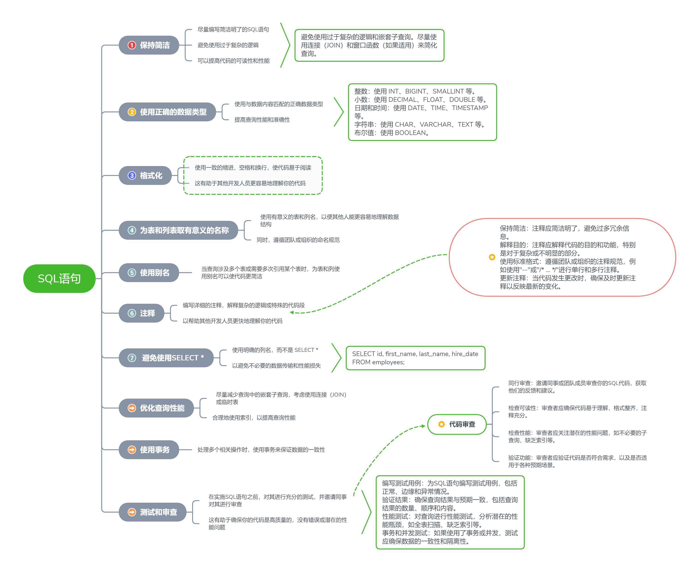

GitHub上有很多有意思的sql查询语句和项目。

1.  [SQL Murder Mystery](https://link.zhihu.com/?target=https%3A//github.com/NUKnightLab/sql-mysteries): 一个有趣的交互式游戏，通过解决 SQL 查询谜题来解决一个虚构的凶杀案。
2.  [SQL Style Guide](https://link.zhihu.com/?target=https%3A//github.com/sqlstyle.guide): 一个关于 SQL 编码风格和最佳实践的指南，其中包含一些有趣的示例和案例研究。
3.  [SQL-Interview-Preparation](https://link.zhihu.com/?target=https%3A//github.com/ramitsurana/SQL-Interview-Preparation): 这个存储库收集了一些常见的 SQL 面试问题和解答，可以帮助你准备 SQL 面试。
4.  [SQL Advent Calendar](https://link.zhihu.com/?target=https%3A//github.com/kenkoooo/sql-advent-calendar): 这个存储库收集了每年 12 月期间发布的有趣的 SQL 相关的博客文章和示例代码，涵盖了各种主题。
5.  [SQL Queries for Data Analysis](https://link.zhihu.com/?target=https%3A//github.com/tomarraj008/sql-queries-for-data-analysis): 一个收集了用于数据分析的 SQL 查询示例的存储库，包含了从简单到复杂的查询示例。

### 还有一些展示了高级和复杂SQL技巧，可以让我们在查询和处理方面更加灵活的语句

使用自连接查询找出同一表中具有相同值的记录：

```sql
SELECT A.column_name, B.column_name
FROM table_name A, table_name B
WHERE A.column_name = B.column_name
AND A.id <> B.id;
```

在查询结果中使用 CASE 表达式进行条件判断和转换：

```sql
SELECT name, age,
CASE
    WHEN age < 18 THEN '未成年'
    WHEN age >= 18 AND age < 65 THEN '成年'
    ELSE '老年'
END AS age_group
FROM customers;
```

使用窗口函数计算累积和（Cumulative Sum）：

```sql
SELECT date, revenue,
SUM(revenue) OVER (ORDER BY date) AS cumulative_sum
FROM sales;
```

利用交叉连接（CROSS JOIN）生成所有可能的组合：

```sql
SELECT A.column_name, B.column_name
FROM table_A A
CROSS JOIN table_B B;
```

使用递归查询处理树状结构数据：

```sql
WITH RECURSIVE tree_path AS (
    SELECT id, name, CAST(name AS VARCHAR(255)) AS path
    FROM categories
    WHERE parent_id IS NULL
    UNION ALL
    SELECT c.id, c.name, CONCAT(tp.path, ' > ', c.name)
    FROM categories c
    INNER JOIN tree_path tp ON c.parent_id = tp.id
)
SELECT id, name, path
FROM tree_path;
```

* * *

## SQL语句如何优化？

要遵循一些最佳实践，一张图就可以知道[高质量SQL](https://www.zhihu.com/search?q=%E9%AB%98%E8%B4%A8%E9%87%8FSQL&search_source=Entity&hybrid_search_source=Entity&hybrid_search_extra=%7B%22sourceType%22%3A%22answer%22%2C%22sourceId%22%3A2987532850%7D)是怎么写的：



## 我们根据图片总结一下所有需要注意的事项

**保持简洁：**

-   编写简洁明了的SQL语句。
-   避免使用过于复杂的逻辑。
-   尽量减少嵌套[子查询](https://www.zhihu.com/search?q=%E5%AD%90%E6%9F%A5%E8%AF%A2&search_source=Entity&hybrid_search_source=Entity&hybrid_search_extra=%7B%22sourceType%22%3A%22answer%22%2C%22sourceId%22%3A2987532850%7D)，使用连接（JOIN）或[窗口函数](https://www.zhihu.com/search?q=%E7%AA%97%E5%8F%A3%E5%87%BD%E6%95%B0&search_source=Entity&hybrid_search_source=Entity&hybrid_search_extra=%7B%22sourceType%22%3A%22answer%22%2C%22sourceId%22%3A2987532850%7D)等方法简化查询。

**使用正确的数据类型：**

-   选择与数据内容匹配的数据类型。
-   根据数据特性选择合适的数据类型，如整数、小数、日期和时间、字符串和[布尔值](https://www.zhihu.com/search?q=%E5%B8%83%E5%B0%94%E5%80%BC&search_source=Entity&hybrid_search_source=Entity&hybrid_search_extra=%7B%22sourceType%22%3A%22answer%22%2C%22sourceId%22%3A2987532850%7D)。

**格式化：**

-   使用一致的缩进、空格和换行。
-   保持代码整洁、易读。

**为表和列取有意义的名称：**

-   使用描述性的表和列名。
-   遵循团队或组织的命名规范。

**使用别名：**

-   为表和列使用简短的别名，使代码更简洁。
-   别名应该简洁且具有描述性。

**注释：**

-   保持注释简洁明了。
-   解释代码的目的和功能。
-   使用标准的注释格式。
-   更新注释以反映代码的变化。

**避免使用 SELECT \*：**

-   明确列出所需查询的[列名](https://www.zhihu.com/search?q=%E5%88%97%E5%90%8D&search_source=Entity&hybrid_search_source=Entity&hybrid_search_extra=%7B%22sourceType%22%3A%22answer%22%2C%22sourceId%22%3A2987532850%7D)。
-   减少不必要的数据传输和性能损失。

**优化查询性能：**

-   关注潜在的性能问题，如[全表扫描](https://www.zhihu.com/search?q=%E5%85%A8%E8%A1%A8%E6%89%AB%E6%8F%8F&search_source=Entity&hybrid_search_source=Entity&hybrid_search_extra=%7B%22sourceType%22%3A%22answer%22%2C%22sourceId%22%3A2987532850%7D)、缺乏索引等。
-   合理地使用索引，以提高查询性能。

**使用事务：**

-   在处理多个相关操作时，使用事务来保证数据的一致性。
-   注意事务的[隔离级别](https://www.zhihu.com/search?q=%E9%9A%94%E7%A6%BB%E7%BA%A7%E5%88%AB&search_source=Entity&hybrid_search_source=Entity&hybrid_search_extra=%7B%22sourceType%22%3A%22answer%22%2C%22sourceId%22%3A2987532850%7D)和锁定策略。

**测试和审查：**

-   为[SQL语句](https://www.zhihu.com/search?q=SQL%E8%AF%AD%E5%8F%A5&search_source=Entity&hybrid_search_source=Entity&hybrid_search_extra=%7B%22sourceType%22%3A%22answer%22%2C%22sourceId%22%3A2987532850%7D)编写[测试用例](https://www.zhihu.com/search?q=%E6%B5%8B%E8%AF%95%E7%94%A8%E4%BE%8B&search_source=Entity&hybrid_search_source=Entity&hybrid_search_extra=%7B%22sourceType%22%3A%22answer%22%2C%22sourceId%22%3A2987532850%7D)。
-   验证查询结果的正确性和性能。
-   邀请同事或团队成员审查代码。
-   关注可读性、性能和功能正确性。

## 更多内容分享

### 分享MySQL 28个小技巧（干货，收藏！）

[MySQL 数据库操作小技巧有哪些？](https://www.zhihu.com/question/590312429/answer/2944396477)

### 为什么MySQL 索引要使用B+树

[为什么MySQL 索引要使用B+树，而不是B树？或者其他树？](https://www.zhihu.com/question/483689690/answer/2880990344)

### 如何提高查询的效率？

[一般在写SQL时需要注意哪些问题，可以提高查询的效率？](https://www.zhihu.com/question/29619558/answer/2830786420)

### 千万级的大表要怎么优化？

[MySQL 对于千万级的大表要怎么优化？](https://www.zhihu.com/question/19719997/answer/2827095423)