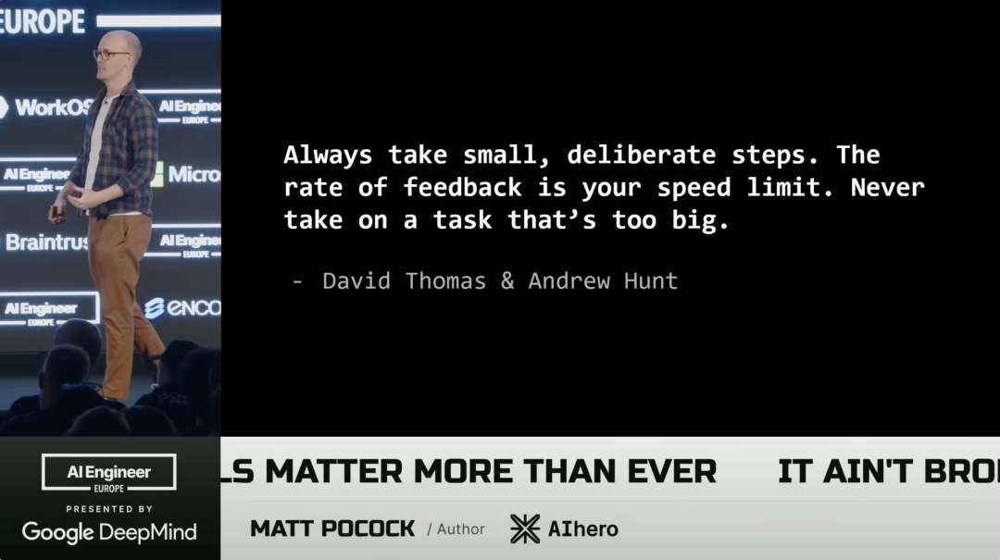
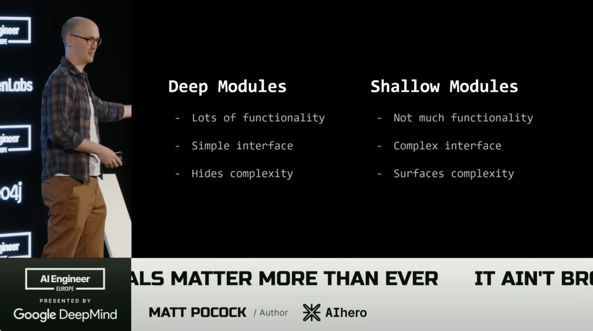

这两天，一个叫`mattpocock/skills`的仓库在 GitHub Trending 榜上突然爆发——短短一天内新增超过 5600 颗 Star，总 Star 数突破 3 万，成功登顶。

这个仓库的作者叫 Matt Pocock，一个 TypeScript 课程作者，最近一年多在教开发者如何真正用好 AI 编程。他最近在 AI Engineer 上的演讲被放了出来，反响不错。应该是这个演讲让他的 skills 翻红。

今天这篇文章，不仅仅是介绍他的 skills，主要是介绍这些 skills 产生的思路。

* * *

Matt Pocock 认为：

**软件工程基本功在 AI 时代比以往任何时候都更重要。**

绝大多数关于 AI 编程的叙事走向是"代码不再重要"、"会提问就够了"、"程序员要失业了"。Matt 的观点完全相反。

他花了 18 个月教开发者用 AI 智能体构建应用，观察到一个持续出现的规律：**那些用 AI 成功的开发者，不是把什么都委托出去的人，也不是什么都自己做的人。他们是在 AI 遇到困难时能回归工程基本功的人。**

他问了自己一个问题：为什么同样用 AI，有的人越用越好，有的人越用越乱？

答案指向了代码本身。好的代码库让 AI 表现出色。差的代码库让 AI 一塌糊涂。"坏代码是有史以来最贵的"——因为它让你无法利用 AI 能带来的一切红利。

他还反对"specs to code"范式——用规格说明书生成代码，代码出问题时改说明书而不是改代码，把代码当成黑盒编译产物。

他试过。结果是：第一次编译出来的代码还行，第二次变差，第三次更差，越跑越烂，最后一堆垃圾。

他的诊断是：这和" vibe coding "换了个名字没有本质区别——两者都在**放弃对代码的所有权**。而代码是你的战场，你必须掌控它，理解它，塑造它。

这是他整个方法论的出发点。

* * *

## 六个失败模式，六个解法

Matt 把 AI 编程中常见的问题归纳为六个失败模式，他的 Skills 仓库里的每一个工具，基本上都对应其中一个，很多论据则来自软件工程领域的一些书籍和概念。

#### 失败模式一：AI 没做我想要的

这是最普遍的问题。你脑子里有个想法，AI 做出来的是另一回事。

Matt Pocock 从 Frederick P. Brooks 的《设计的设计》里找到了诊断词：**设计概念（Design Concept）**。当多个人协同设计某个东西时，他们之间漂浮着一个无形的共同理解，对将要构建的东西的构想，即设计概念。

你和 AI 之间缺的就是这个。

他的解法是`grill-me`技能，全文只有几行：

> 以无情审问的方式采访我，直到我们达成共识。逐一追究设计树的每个分支，一个一个地解决依赖关系。对每个问题提供你的推荐答案。每次只问一个问题。

这几行字意味着 AI 会问你大概 40 个问题、60 个问题。这个 skill 把 AI 变成了一种对手，它不断地向你抛出想法，试图达成共识。

这个技能应该是他最出圈的 skill，他认为这比 Claude Code 默认的 plan 模式要好。 plan 模式急于创建一个资产，它非常想直接创建一个计划然后开始干活，`grill-me`则先明确设计感念。

#### 失败模式二：AI 太啰嗦，鸡同鸭讲

AI 太啰嗦了，并且总是到不了点子上，它会试图通过说大量的话来试图表达它在做什么。

这里面的问题可能在于，你和 AI 没有在同一个话语体系里。

Matt Pocock 从领域驱动设计（DDD）里拿了一个概念：**通用语言（Ubiquitous Language）**。开发者之间的对话、代码里的命名、和领域专家的交流，都来自同一个领域模型。

他做了一个`ubiquitous-language`技能，扫描你的代码库，提取所有术语，生成一个 Markdown 表格。然后在每次和 AI 规划时把这个文件带进去。

他观察 AI 的思维链后发现：通用语言不仅改善了规划质量，还让 AI 的实现更贴近你的设想，因为它在用和你完全一致的词汇思考。

#### 失败模式三：AI 做了正确的事，但代码不工作

当前两步都搞定，概念和术语都对齐了，AI 也确实干活了，但是输出不 work，怎么办 ？

Matt Pocock 说通过反馈循环，可以显著改善这个问题。

没有类型检查、没有测试、没有静态分析，AI 就是在黑暗中编程。

但问题不只是"加上测试"这么简单。AI 的默认行为是**先写完所有实现，然后想到要测试了才测试**，AI 总是倾向于一次做太多，产出大量代码。

《程序员修炼之道》管这个叫，"跑在前灯前面"——开车开太快，灯光照不到那么远，你就看不到前面的路。

**反馈速度是你的速度上限。**

他的解法是`tdd`（测试驱动开发）技能，强制 LLM 真正采取小步骤，强制 AI 走红-绿-重构的循环：先写一个失败的测试，然后让实现通过，然后重构。AI 很难在这个模式下作弊，因为它必须在代码存在之前就把测试写好。



#### 失败模式四：代码库太混乱，AI 越改越烂

好的代码库就是容易测试的代码库。

这里 Matt 引用了 John Ousterhout《软件设计哲学》里的核心概念：**深模块（Deep Module）vs 浅模块（Shallow Module）**。

浅模块：接口复杂，功能少，大量小文件相互依赖——AI 需要手动追踪整个依赖图，很快迷失，产生的代码越来越乱。

深模块：接口简单，内部封装大量功能——AI 只需要理解接口，不需要钻进每个细节。这样的代码库也更容易测试：你在模块外部建一个测试边界，从接口层面验证行为。



他的`improve-codebase-architecture`技能会扫描你的代码库，找出可以合并为深模块的代码群，提出重构建议。他自己的例子：把一个浏览器端视频编辑器的前端到后端的完整流程包进一个大模块，从外部统一测试。AI 在这个代码库里的表现是"翻天覆地的改变"。

#### 失败模式五：大脑跟不上

你比以前交付了更多代码，但也比以前更累了。你对代码库的理解越来越模糊。

深模块提供了一个思维上的解法：把这些模块当成**灰箱**——你设计接口，你验证行为，但内部实现可以委托给 AI 处理，你不需要审查每一行。

Matt 的建议：设计接口，委托实现（Design the interface, delegate the implementation）。这来自 Kent Beck 的话："每天投资于系统的设计。"

这也是他反对"specs to code"最本质的理由：specs to code 是在**撤资**系统设计，而你应该持续投资。

#### 失败模式六：大任务让 AI 进入愚蠢区

他有个 LLM 的基本认知模型：**智慧区和愚蠢区**。每个对话从零开始，在上下文大约 100k tokens 之前，LLM 工作良好。超过这个范围，注意力机制的压力呈平方级增长，LLM 开始变笨。

大任务不能在一个上下文里完成，但顺序多阶段计划也只能被一个智能体线性执行。他的解法是把大任务变成一张**有向无环图（DAG）的看板**，任务之间有阻塞关系，没有阻塞关系的任务可以被多个智能体并行领取。

* * *

## 它们怎么连成一个工作流

这些技能不是孤立工具，它们构成了一套完整的工作流：

```text
想法
 ↓
/grill-me [客户需求文档]    -- 与 AI 建立共同的设计概念
 ↓
/to-prd            -- 将对话转化为目的地文档
 ↓
/to-issues           -- 切分为垂直曳光弹 Issue（看板）
 ↓
ralph-once.sh / ralph-loop.sh -- AFK 智能体逐 Issue 实现（TDD）
 ↓
人工 QA + 代码审查       -- 把品味和判断注回代码
 ↓
回到看板            -- QA 产生新 Issue，循环继续

```

几个关键细节：

**垂直切片而非水平切片**。AI 的本能是先建好所有数据库层，再建 API 层，再建前端——这意味着你要等到第三阶段才能获得任何真实反馈。正确的方式是垂直切片：第一个 Issue 就应该包含 schema 变更 + 服务创建 + 最小前端呈现，一个完整的薄片穿透所有层。这就是《程序员修炼之道》里的曳光弹：不是看不见的普通子弹，而是发光的曳光弹，让你立刻知道你打到哪了。

**不要压缩，要清除**。Context 用满时有两个选项：压缩（把对话历史精简成摘要继续）或清除（回到零）。他选择清除，每次都从一个稳定的起点开始，而不是在沉积的上下文里越走越偏。

**人类做两件事，智能体做一件事**。规划（grill-me 到 PRD 到 Issue）是人在环路的，必须是。实现是 AFK 的，可以完全交出去。QA 是人在环路的，必须是——这是你将品味和判断注回代码的唯一窗口。

**并行化**。他还做了一个叫 Sand Castle 的 TypeScript 库：一个 Planner 智能体分析 Issue 依赖图，对可并行的 Issue 各创建一个 Docker 沙箱，多个 Implementer 智能体同时运行，完成后 Merger 智能体负责合并并解决冲突。Reviewer 使用 Opus，Implementer 使用 Sonnet，审查在清空的上下文里运行，处于完整的智慧区。

* * *

Matt 在演讲中引用并推荐了这些书单：

-   《软件设计哲学》- John Ousterhout（深模块）
    
-   《程序员修炼之道》- Hunt & Thomas（曳光弹、软件熵、超越车灯）
    
-   《设计的设计》- Frederick P. Brooks（设计概念）
    
-   《领域驱动设计》- Eric Evans（通用语言）
    

这些书写于 AI 编程存在之前，有的写于二三十年前。他的论点是：这些书里的原则在 AI 时代不是过时了，而是**被放大了**。

AI 在好代码库里的表现是指数级更好的，这意味着好代码的价值也是指数级放大的。软件熵在 AI 时代的扩散速度比人类写代码时快得多——一个差的代码库加上 AI 会更快地变成无法维护的泥潭。

他的 Skills 仓库本质上是一个接口——把这些几十年前的工程智慧封装成可以被 AI 智能体调用的提示词原语。让你不需要每次都去翻书，让 AI 也能理解和遵循这些原则。

`mattpocock/skills`登顶 GitHub Trending，也许只是因为它恰好击中了一个开发者集体焦虑的时刻：不知道如何和 AI 协作才是对的，不知道自己的工程经验还算不算数。

Matt 的答案是：算数，比以前更算数。

* * *

*GitHub 仓库: [http://github.com/mattpocock/skills](https://link.zhihu.com/?target=http%3A//github.com/mattpocock/skills)*  
*演讲一: Software Fundamentals Matter More Than Ever (AI Engineer World's Fair 2026)*  
*演讲二: Full Walkthrough: Workflow for AI Coding (AI Engineer World's Fair 2026)*

\- END -