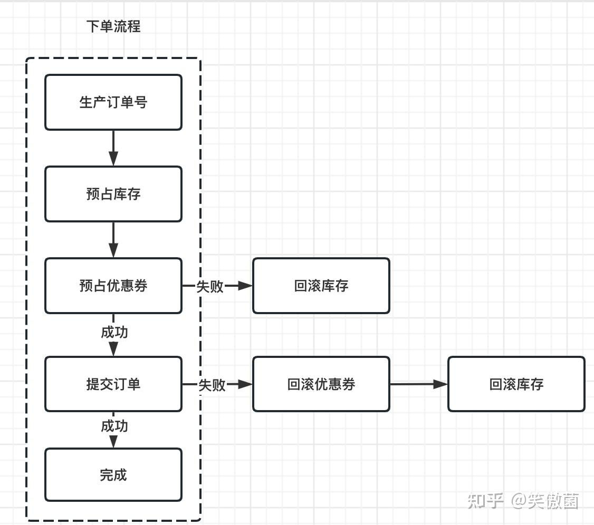
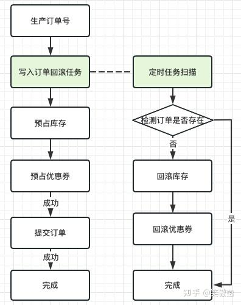
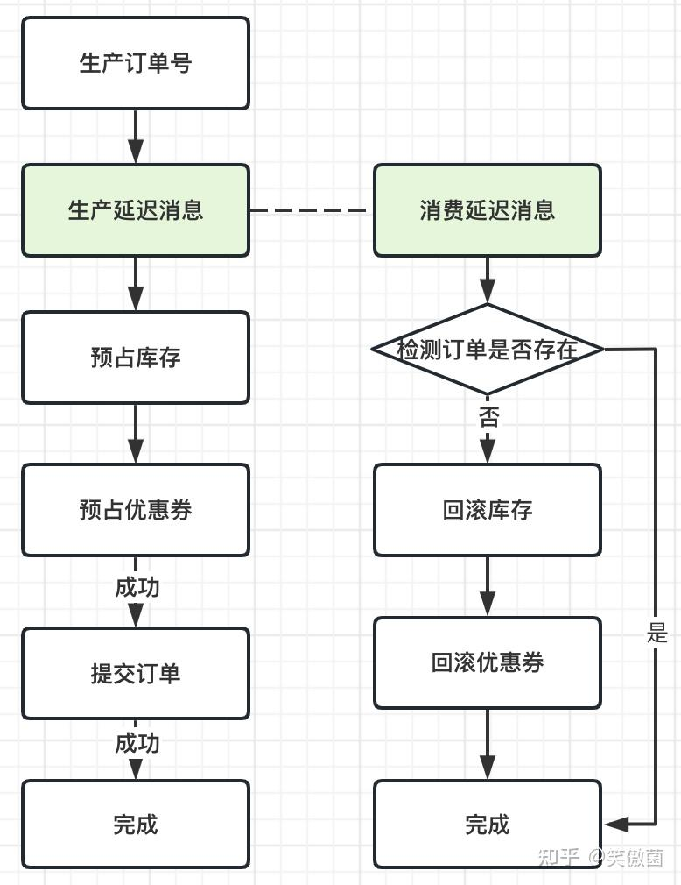
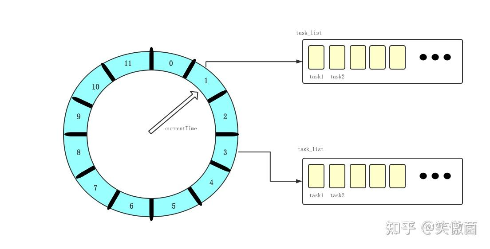
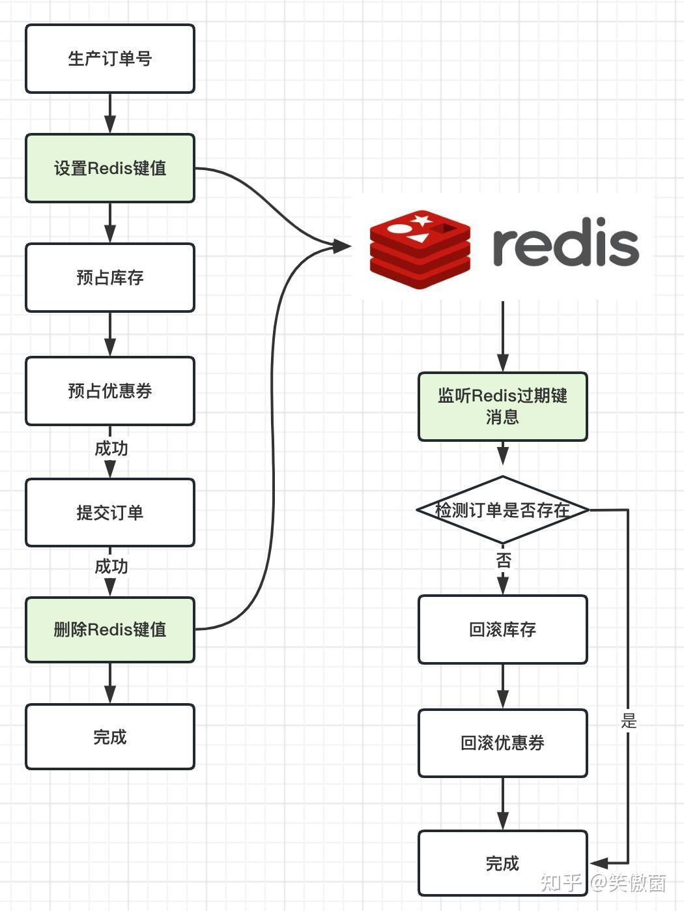
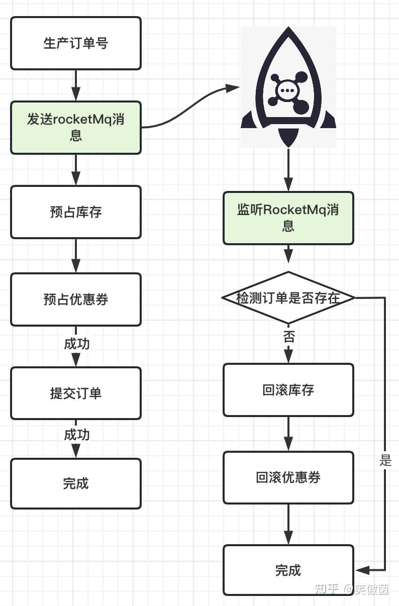

## **背景介绍**

提交订单，是交易领域避不开的一个话题。在提交订单设计时，会涉及到各种资源的预占：如商品库存、优惠券数量等等。但是，下单的流程并不能总是保证成功的，如商品库存异常的时候被拦截、优惠券数量不足的时候拦截等等。因此自然会涉及到需要将已被预占的资源回退。

以我现有负责的交易流程为例，一个基本的下单的逻辑大致如下所示：



  

正常的下单流程实现较为简单，但是要想处理好异常情况下的数据回滚却是件难事。为此，我大致总结了现有常见的回滚方案。

  

## **定时任务**

最常见到的订单回滚的实现方案，其实就是采用定时任务扫描的方式。通过单独建立一个任务表，然后启动任务扫描，对扫描到的订单都做一次判断，如果实际上订单没有生成，那么此时进行相应的回滚操作，具体流程如下所示：



  

实现定时任务的方式有很多，如通过SpringBoot自带的注解@Scheduled、特定的类库quartz等等。这里我简单写了一段根据Spring自带注解实现的扫描表回退预占的代码：

```java
 @Component
 @Slf4j
 public class RollBackSchedule {
 ​
     @Scheduled(cron ="*/6 * * * * ?")
     public void rollBack() {
         //扫描当前的订单task表
         taskService.selectByExample(...);
         //判断当前的订单号orderNo是否已经生成实际订单
         Order order = orderService.selectByOrderNo(...);
         if (order != null){
             //若当前订单已经生成
             return;
         }
         //回滚优惠券
         couponService.rollBack(...);
         //回滚商品库存
         stockService.rollBack(...);
     }
 }
```

**优点**

采用定时任务实现的方案，实现思路相对简单，实现成本较小。

**劣势**

定时任务查表，给数据库会带来较大的查询压力，只适合较小的业务数据量。同时，由于被扫描到的具体时间是无法控制的，只能通过控制扫描的时间间隔来尽量精确实现，因此，如果对于实效性较高的系统，定时任务也比较难满足需求。

  

## **延迟队列**

进一步的，提交订单除了采用定时任务轮训的方式，也可以采用延迟队列的实现方式。简单描述来说，就是首先将订单号生成出来，并放入延迟队列中，消费者则实时监听延迟队列中的消息。如果有消息生成了，那么此时进行消费。大致流程如下所示：



  

要实现延迟队列也不是一个难题，这里我简要介绍一下如何采用Spring自带的延迟队列实现：

**生产者：**

```java
 @Slf4j
 @Component
 public class DelayQueueProducer {
 ​
     /**
      * @param orderNo  业务id
      * @param time 消费时间  单位：毫秒
      */
     public void produceTask(String orderNo, Long time){
         DelayQueue<DelayOrder> delayQueue = DelayTaskQueue.getInstance();//创建队列 1
         DelayOrder delayOrder = DelayOrder.builder()
                 .orderNo(orderNo)
                 .timeout(time)
                 .build();
         boolean offer = delayQueue.offer(delayOrder);//任务入队
         if(offer){
             LOGGER.info("=============入队成功,{}",delayQueue);
         }else{
             LOGGER.error("=============入队失败!");
         }
     }
 }
```

**消费者：**

```java
 @Slf4j
 @Component
 public class RollBackDelayQueueConsumer implements CommandLineRunner {
     
     @Override
     @SneakyThrows
     public void run(String... args) {
         DelayQueue<DelayOrder> delayQueue = DelayTaskQueue.getInstance();//获取同一个put进去任务的队列
         new Thread(() -> {
             while (true) {
                 try {
                     // 从延迟队列的头部获取已经过期的消息
                     // 如果暂时没有过期消息或者队列为空，则take()方法会被阻塞，直到有过期的消息为止
                     DelayOrder delayOrder = delayQueue.take();
                     String orderNo = delayOrder.getOrderNo();
                     
                     //判断当前的订单号orderNo是否已经生成实际订单
                     Order order = orderService.selectByOrderNo(orderNo);
                     if (order != null){
                         //当前订单已经生成
                         return;
                     }
                     //回滚优惠券
                     couponService.rollBack(...);
                     //回滚商品库存
                     stockService.rollBack(...);
                 } catch (InterruptedException e) {
                     e.printStackTrace();
                 }
             }
         }).start();
     }
 }
```

**优点**

内存队列操作，处理效率十分高效

**劣势**

由于缺少持久化，服务重启会丢失回滚数据；大量请求的情况下容易出现OOM问题；

  

## **时间轮算法**

时间轮算法也是一种时常被提及到的超时回滚方案。在时间轮算法中，有三个比较重要的参数：**ticksPerWheel（一轮的 tick 数），tickDuration（一个 tick 的持续时间）以及 timeUnit（时间单位）**。



  

如果tickPerWheel=60，tickDuration=1，timeUnit=秒，那么其实此时就跟我们日常的时钟是一摸一样了。那么如果我们期望一个任务130s后执行，那么该怎么设置呢？

首先通过130/60=2，我们知道要执行的时间至少需要我们当前的时钟执行两轮，这里我们记作round=2。同时，由于130%60=10，那么此时我们知道这个任务需要被放在第10个位置上。于是，我们就可以在第十个位置上放下一个Round=2的任务，每当指针经过一次10号位置，我们就将该任务的round-1，直到round值等于0的时候，我们就可以执行该任务了。

**定时订单任务**：

```java
 class OrderTask implements TimerTask {
     String orderNo;
     public MyTimerTask(String orderNo){
         this.orderNo = orderNo;
     }
 ​
     public void run(Timeout timeout) {
         String orderNo = this.orderNo;
 ​
         //判断当前的订单号orderNo是否已经生成实际订单
         Order order = orderService.selectByOrderNo(orderNo);
         if (order != null){
             //当前订单已经生成
             return;
         }
         //回滚优惠券
         couponService.rollBack(...);
         //回滚商品库存
         stockService.rollBack(...);
     }
 }
```

**主函数部分：**

```java
     @SneakyThrows
     public static void main(String[] argv) {
         DateTimeFormatter formatter = DateTimeFormatter.ofPattern("yyyy-MM-dd HH:mm:ss");
         HashedWheelTimer timer = new HashedWheelTimer(1, TimeUnit.MILLISECONDS,8);
         TimerTask timerTask = new MyTimerTask("");
 ​
         //将定时任务放入时间轮
         timer.newTimeout(timerTask, 4, TimeUnit.SECONDS);
         Thread.currentThread().join();
     }
```

**优点：**

内存操作速度快、实现简单不引入中间件。

**劣势：**

容易出现OOM、内存数据重启后易丢失。

  

## **Redis键过期订阅**

除了采用上述的超时回滚方案，我们也可以借助于Redis的键过期订阅的能力实现超时回滚方案。



  

实现代码如下：

**Key过期配置类**：

```java
 @Configuration
 public class KeyExpireConfig {
     
     @Bean
     RedisMessageListenerContainer container(RedisConnectionFactory connectionFactory) {
         RedisMessageListenerContainer container = new RedisMessageListenerContainer();
         container.setConnectionFactory(connectionFactory);
         return container;
     }
 }
```

**Key过期监听器**：

```java
 @Component
 @Slf4j
 public class OrderRollBackSubscriber extends KeyExpirationEventMessageListener {
 ​
     /**
      * Creates new {@link MessageListener} for {@code __keyevent@*__:expired} messages.
      *
      * @param listenerContainer must not be {@literal null}.
      */
     public OrderRollBackSubscriber(RedisMessageListenerContainer listenerContainer) {
         super(listenerContainer);
     }
 ​
     //监听的关键
     public void onMessage(@Nullable Message message, byte[] pattern) {
         LOGGER.info("监听到的Key为{}", message);
         String key = new String(message.getBody());
         if (key.startsWith("order")){
             LOGGER.info("执行订单回滚流程");
             ......
         }
     }
 }
```

**优点：**

实现相对简单、过期时间相对精确、分布式保存服务重启不会丢失。

**劣势：**

发布订阅采用的是短链接的方式，因此并不能保证能够准确消费到对应的事件；且订阅的消息没有开启持久化；另外一方面，如果出现大数据量时，订阅消费的时间可能会不精确。

  

## **消息队列**

除了上述采用到的实现方式，超时回滚中，消息队列也是十分重要的一类实现方式。首先，在消息队列的细分中，也包含很多实现：

1、采用rabbitMq通过TTL+死信队列实现；

2、采用Kafka检查放回实现；

3、采用RocketMq延迟消息实现；

方案上各有优劣，方案一方案成熟且实现简单，但是rabbitMq本身吞吐量小，难以处理大批量的业务；kafka支持大吞吐量的处理业务，但是没有现成的延迟方案实现机制，需要自行开发。而方案三支持大吞吐量且也有比较成熟的延迟消息实现机制，但是延迟的时间是按照刻度做处理的，没法做到精确的延迟。

鉴于实际场景和方案的抉择，大部分情况会选择方案三，因此这里我主要围绕方案三展开介绍。整体流程上，消息队列实现的流程同内存的延迟队列实现是基本一致的：



  

**发送消息：**

```java
 @Service
 @Slf4j
 public class RocketMqServiceImpl implements RocketMqService {
    @Resource
    private RocketMQTemplate rocketMQTemplate;
 ​
    @Value("${rocketmq.producer.topics[0]}")
    private String topic;
 ​
    @PostConstruct
    private void init() {
       rocketMQTemplate.getProducer().getDefaultMQProducerImpl().registerSendMessageHook(new SwimLaneSendMessageHook());
    }
 ​
    @Override
    public SendResult sengDelayMessage(String uniqId, String msgInfo, int level, String tag) {
       SendResult sendResult = null;
        /** 创建消息，并指定Topic，Tag和消息体 */
        Message sendMsg = new Message(topic, tag, msgInfo.getBytes());
        sendMsg.setDelayTimeLevel(level);
        /** 发送带规则的延迟消息 */
        sendResult = rocketMQTemplate.getProducer().send(sendMsg, (mqs, msg, arg) -> {
            try {
                String uniqIdStr = String.valueOf(arg);
                String orderNo = StringUtils.substring(uniqIdStr, 1, uniqIdStr.length());
                long id = Long.parseLong(orderNo);
                long index = id % mqs.size();
                return mqs.get(Integer.parseInt(index + ""));
            } catch (Exception e) {
                return mqs.get(1);
            }
        }, uniqId);
       LOGGER.info("发送延迟消息: {}", sendResult);
       return sendResult;
    }
 }
```

**消息监听：**

```java
@Slf4j
@Component
@RocketMQMessageListener(
   topic = "${rocketmq.consumer.listener.topic}",
   consumerGroup = "${rocketmq.consumer.listener.group}",
   messageModel = MessageModel.CLUSTERING,
   consumeMode = ConsumeMode.ORDERLY
)
public class RocketMsgListener implements RocketMQListener<MessageExt> {

   @Override
   public void onMessage(MessageExt messageExt) {
       if(messageExt.getTags().equals("order")){
           //执行订单回滚代码
           ......
       }
   }
}
```

**优点：**

现成方案完备、实现相对简单；

**劣势：**

预占时间无法自定义，仅有1s、5s等特定的时间间隔；

  

## **总结**

本文介绍了常见的五种实现超时回滚的方案，分别是：**定时任务扫描、延迟队列、时间轮算法、Redis键过期订阅和消息队列**。本质上来说，消息队列实现和Redis键过期订阅的方案完备性较好，优先推荐这两种实现方式。但是如果只是简单的单机应用或者是低数据量的情况下，考虑到实现、运维成本的情况下，采用前三种方案也是可行的。没有最好的方案，只有最合适的方案。

  

## **参考文献**

[springBoot之延时队列](https://link.zhihu.com/?target=https%3A//blog.csdn.net/weixin_47366919/article/details/124816955)

[订单30分钟未支付自动取消怎么实现？](https://link.zhihu.com/?target=https%3A//juejin.cn/post/7181297729979547705)

[redis过期key监听与发布订阅功能java](https://link.zhihu.com/?target=https%3A//www.codenong.com/cs111037739/)