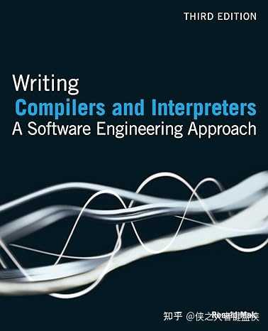

多看看这方面教材，很多国外教材，在第一章就会解释虚拟机和解释器的区别。

lua也是脚本语言，人家lua的就叫虚拟机。

区别不是什么解释执行的问题，而是概念本身就很清晰明确。虚拟机，它为什么叫虚拟机？这才是你应该思考的问题。虚拟机，它本身就是对物理机的一个虚拟，就是在模拟CPU指令和执行的过程，虚拟机一般分为寄存器虚拟机和栈虚拟机，这也是对物理机的模拟。Lua就是寄存器虚拟机，Java是栈虚拟机，一个是模拟寄存器操作，一个是模拟栈操作。

如果你运行时没有这一套机制，模仿指令和指令操作，你凭什么叫虚拟机？

一般的解释器，它没有这套机制，是直接执行ast，称作解释器，是实至名归的。

当然了，国外教材写得好的地方，就在于人家把前因后果，来龙去脉解释得清清楚楚。Python和Ruby一开始就是我上面说的，直接解释执行ast，所以它确实就是解释器，这个命名没问题。但是随着时间发展，解释器性能太差了，越来越不满足性能要求，为了提升性能，它们最终都发展成了虚拟机，其实内部早就引入虚拟机那一套机制，虚拟机指令和指令操作。但是他们内部命名没有改，还是沿用了之前的名字，称作解释器。

所以结论就是，Python这些只是挂着解释器名称的虚拟机