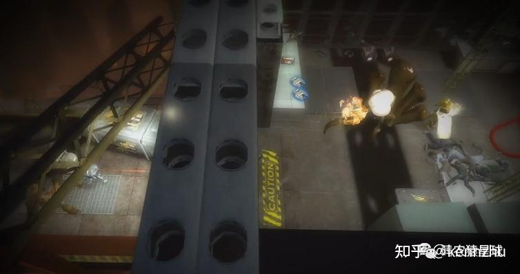

  

## **1，Roboden实时策略游戏**

  

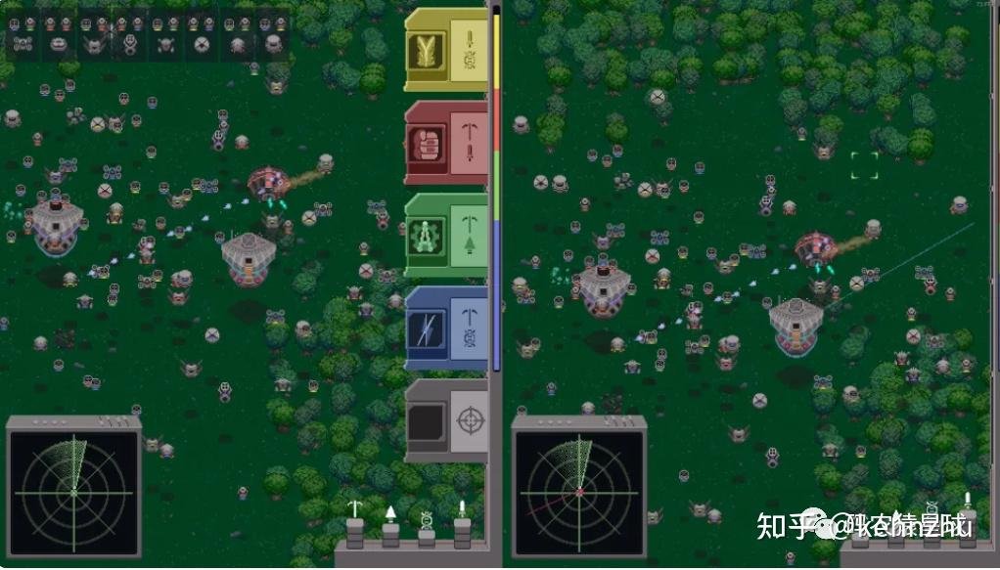

  

Roboden 是一款富有创意的实时策略游戏，您将带领机器人殖民地与敌方无人机发生冲突。该游戏以多种方式采用 RTS 格式进行游戏。首先，派系是不对称的：敌方单位并不等同于你自己的单位。在 Roboden 中，你不能直接控制你的单位；你可以直接控制你的单位。相反，您可以为您的自主无人机机队设定优先级。  

***[https://github.com/quasilyte/roboden-game](https://link.zhihu.com/?target=https%3A//github.com/quasilyte/roboden-game)***

最新版本引入了新的地狱环境，带来了间歇泉、熔岩和枯竭资源等新威胁，但也带来了丰富的新奖励。可以查看 Steam 上最新的《Roboden》发布公告玩最新的地狱关卡。

  

***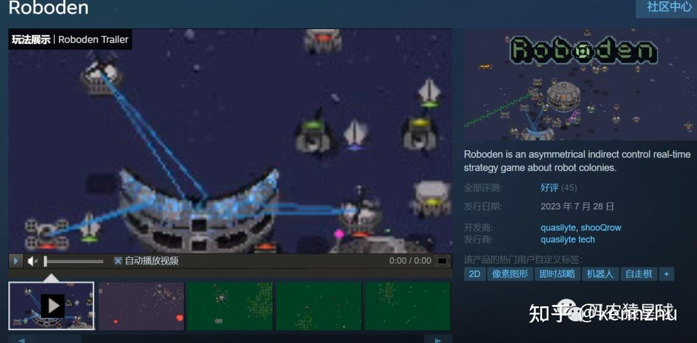***

  

## **2，Aaaaxy 四A级解谜游戏**

  

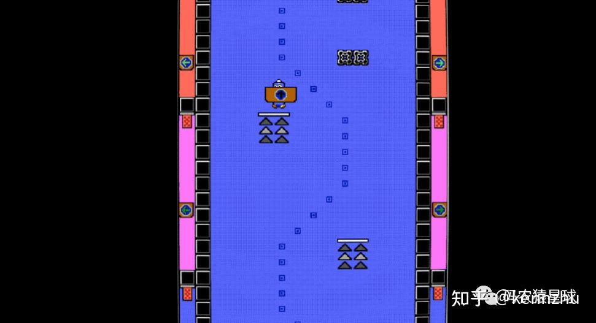

  

我们很少能报道四A级游戏，所以当我们得知 Aaaaxy 时，我们知道我们必须分享它。Aaaaxy 是一款非常难以解释的非线性 2D 解谜平台游戏。该游戏在一个绝对非传统的游戏世界中使用传统的平台游戏机制：一个非欧几里得空间，其中两点之间的最短路径并不总是直线（也是这游戏非常有意思的点）。

***[https://github.com/quasilyte/roboden-game](https://link.zhihu.com/?target=https%3A//github.com/quasilyte/roboden-game)***

  

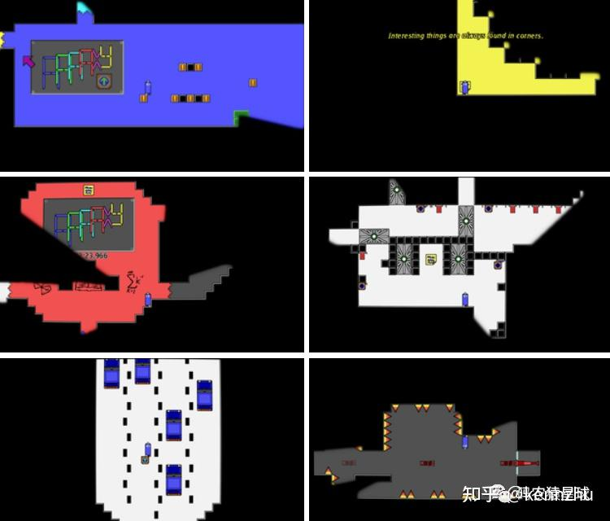

  

该游戏是使用许多免费和开源工具创建的，游戏本身也支持跨平台：

-   Ebitengine 一个用 Go 编写的 2D 游戏引擎
-   Oto – 在多个平台上播放声音的低级库
-   用于解析 Tiled（本博文中也有介绍）tile 地图文件的 Tmx

  

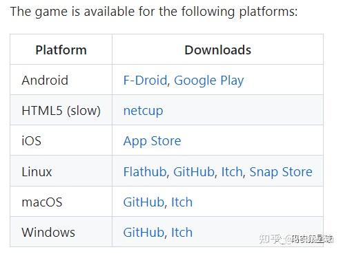

  

## **3，Crazee Rider 赛车游戏**

  

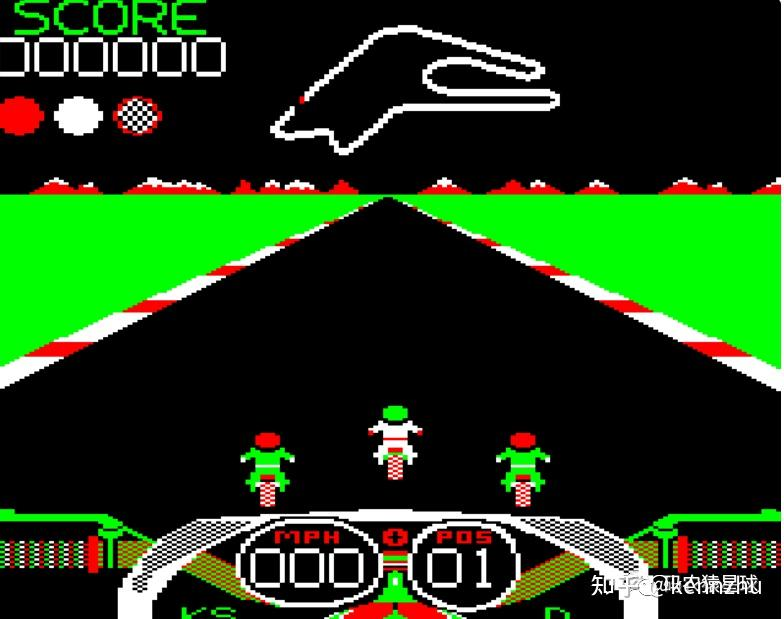

  

Acorn Electron 最近庆祝了它的 40 岁生日：这款于 1983 年发布的家用计算机是颇具影响力的 BBC 微型计算机的大众市场继任者。如果您想知道那个时代的游戏开发是什么样子，那就看看 Crazee Rider 的源代码吧，这是一款 1987 年发布的摩托车赛车游戏，最开始由KevEdwards 在 6502 汇编中编写了该游戏 - 与赛道非常相似，没有护栏。

现在允许使用 Visual Code 或其他 IDE 在良好的开发环境中构建代码。这里的代码适用于游戏的 Acorn Electron 版本。BBC Micro 和 Master 128 版本的代码略有不同。 您还可以在作者的 GitHub 账户上找到 BBC Micro 源代码。

***[https://github.com/KevEdwards/CrazeeRiderElectron](https://link.zhihu.com/?target=https%3A//github.com/KevEdwards/CrazeeRiderElectron)***

由于 Electron 的硬件速度较慢，屏幕上任何时候出现的自行车骑手都较少。 它还缺少 BBC Micro 版本中屏幕下方的调色板更改。 但是，您可以重新定义三种主要颜色的调色板（在标题页上按 C ）。  

希望它对那些对 6502 汇编语言编程感兴趣的人和那些想了解 20 世纪 80 年代游戏是如何制作的人有用。  

## **4，Beyond All Reason即时战略游戏**

  

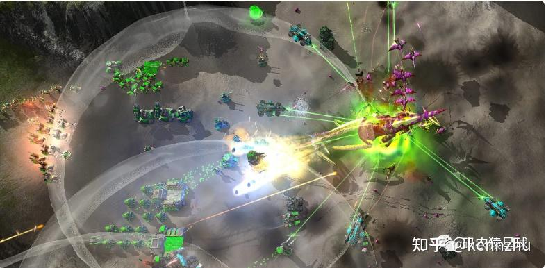

  

Beyond All Reason（之前在 Game Bytes 上）是一款以无数单位的大规模战斗为特色的即时战略游戏，更新了清道夫游戏模式。游戏模式让玩家在新的敌人生成机制、新的最终 Boss 和变种单位的对抗中挣扎求存。发布公告不仅描述了新的游戏玩法，还描述了游戏模式开发过程中的辛苦工作。

***[https://github.com/beyond-all-reason/Beyond-All-Reason](https://link.zhihu.com/?target=https%3A//github.com/beyond-all-reason/Beyond-All-Reason)***

如果您是新玩家，或者想将您的游戏技能提升到一个新的水平，请参考官方精心准备的指南（***[https://www.beyondallreason.info/guides](https://link.zhihu.com/?target=https%3A//www.beyondallreason.info/guides)***），逐步从基础、高级到专业，然后超越！

  

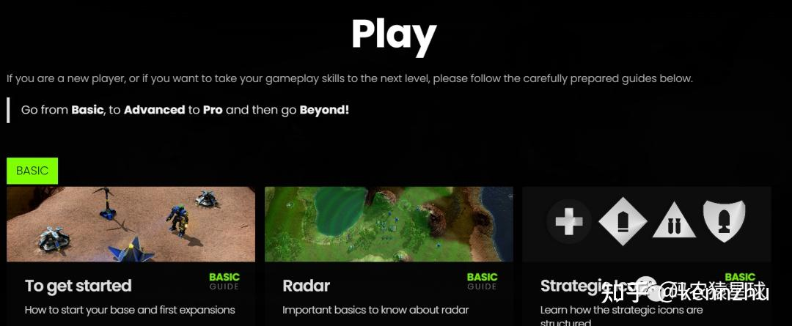

  

## **5，LDTK：地图、模组、工具等等**

  

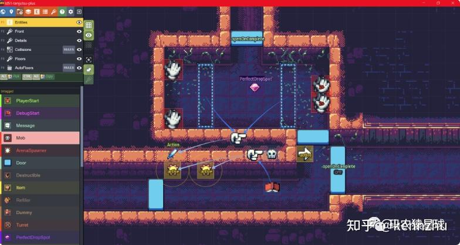

  

LDTK（“关卡设计工具包”）是一款 2D 关卡编辑器，由《死亡细胞》和《核火焰》的创建者 @deepnight 开发。最新版本包括 UI 改进、更好的后台加载和保存处理以及错误修复。作为一个编辑器、一个关卡格式和一个用于加载关卡的 Haxe 库，它是一个值得考虑用来构建游戏的引人注目的工具。在 GitHub 上的发行说明中了解有关 LDTK 最新更新的更多信息。

***[https://github.com/deepnight/ldtk](https://link.zhihu.com/?target=https%3A//github.com/deepnight/ldtk)***

更多详细开发文档和搭建使用说明可以参考官方网站：***[https://ldtk.io/](https://link.zhihu.com/?target=https%3A//ldtk.io/)***

  

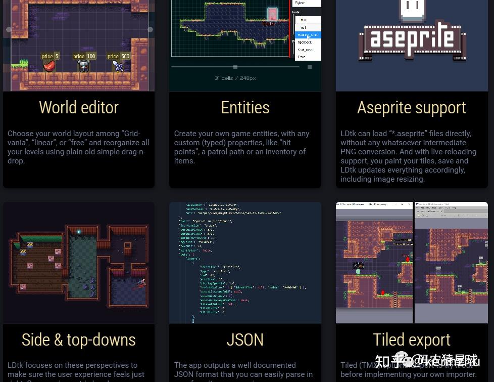

  

## **6，Titled关卡编辑器**

  

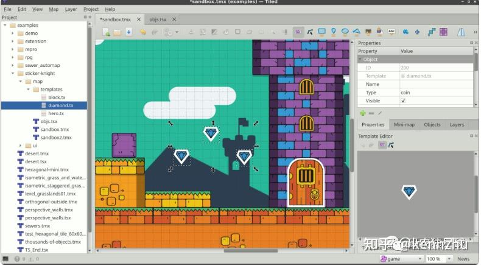

  

在其他关卡编辑器新闻中，Tiled——一款灵活的 2D 关卡编辑器，适合从自上而下的角色扮演游戏到快节奏的横向卷轴游戏——也发布了新版本。最新版本添加了对设置自定义项目属性的支持，添加了多个新的脚本功能，并修复了错误。您的关卡设计工具箱的另一个值得加入的人。请阅读 v1.10.2 发布公告以了解所有详细信息。

***[https://github.com/mapeditor/tiled](https://link.zhihu.com/?target=https%3A//github.com/mapeditor/tiled)***

Tiled非常灵活。它可用于创建任何大小的地图，对图块大小或可使用的图层或图块数量没有限制。地图、图层、图块和对象都可以分配任意属性。Tiled 的地图格式 (TMX) 易于理解，并且允许在任何地图中使用多个图块集。可以随时修改图块集。

  

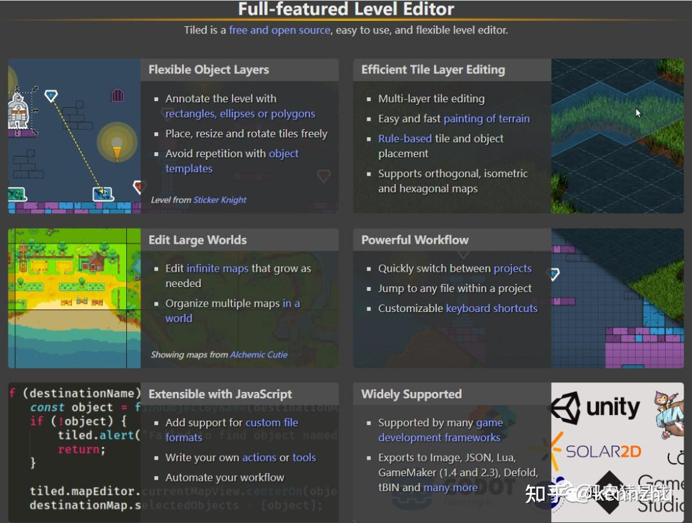

  

## **7，FamiStudio音乐创作工具**

  

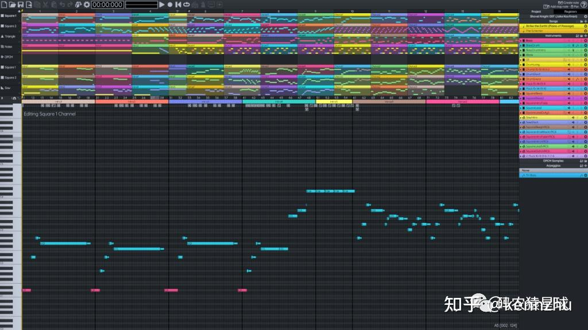

  

FamiStudio 是一款为 Nintendo NES（也称为 Famicom）创作音乐的工具。FamiStudio 专为芯片音乐音乐家和自制 NES 开发人员而设计，使 [http://thyoutube.com/watchose](https://link.zhihu.com/?target=http%3A//thyoutube.com/watchose) 的作曲变得轻而易举。最新版本包括一些错误修复和本地化更新，但我们最想以此为借口来提及我们喜欢芯片音乐。

***[https://github.com/BleuBleu/FamiStudio](https://link.zhihu.com/?target=https%3A//github.com/BleuBleu/FamiStudio)***

所有功能都需要在所有 4 个平台（Windows、MacOS、Linux 和 Android）上实现和并经过了测试，任何影响音乐的功能都需要集成到所有导入/导出格式（FamiTracker、NSF、FTI 等）。

## **8，Alien Swarm: Reactive Drop** **关卡编辑器**

  

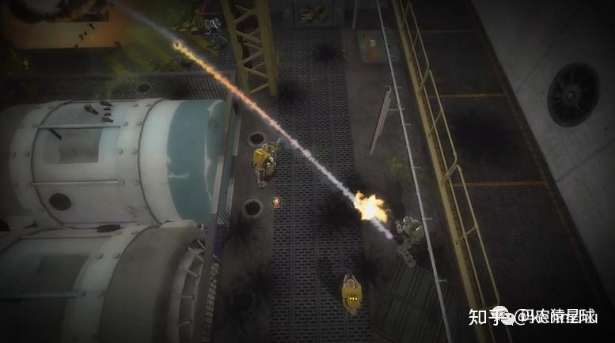

  

一个与 Valve 相关的项目引起了我们的关注，即《Alien Swarm：Reactive Drop》的八月更新，这是 Valve 的源游戏 Alien Swarm 的开源模组，是Valve 的 Alien Swarm 游戏的独立修改版。该模组建立在 Valve 的 Source 引擎演示之上，具有更多地图、外星敌人和游戏模式。最新版本改进了各种任务，并开始开发游戏内报告系统。

***[https://github.com/ReactiveDrop/reactivedrop\_public\_src](https://link.zhihu.com/?target=https%3A//github.com/ReactiveDrop/reactivedrop_public_src)***

使用 Visual Studio，您将能够构建这些 DLL 文件：client.dll、missionchooser.dll、server.dll。

  

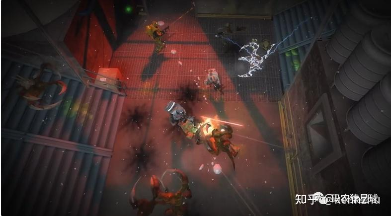

  

这个存储库有什么用？访问源代码后，您可以：

-   添加新武器、NPC、修复错误以及向游戏添加新功能并将其作为拉取请求提交
-   创建模组。服务器端和客户端 mods。或完全独立的模组
-   注意：模组不得用于篡改游戏排行榜或排名服务器。