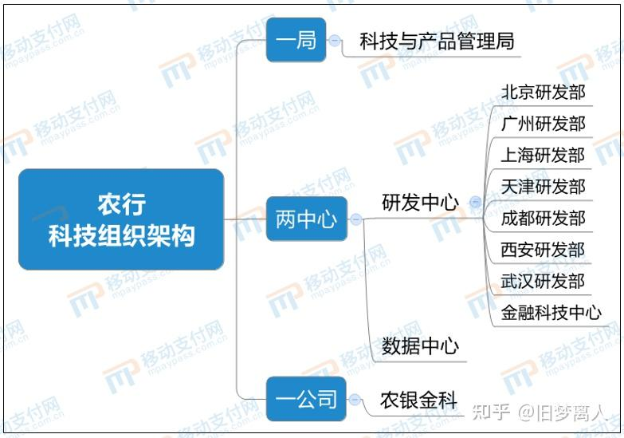
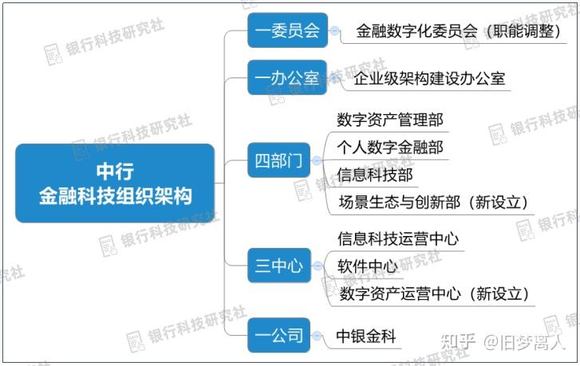

国内的银行分很多种，包括国有商业银行、股份制商业银行、政策性银行、城商行、农商行等。目前来看，国有银行干到退休的可能性最大。为什么只说可能性呢？因为在2018年建设银行开了一个头，把他的总行直属机构软开中心全部划转成了子公司建信金科，软开员工重新签订了合同，从建行总行机构员工的身份变成了建信金科子公司员工的身份，稳定性下降。因此一时间大家风声鹤唳，2018-2021年这个期间，国有大行软开子公司化的传言也是甚嚣尘上，大家包括我在内也是担心软开子公司化的风险。但是，建行软开子公司化后的效果并不好，建信金科员工流动性加大，风评也是急剧下降。因此其他几家国有行没有继续效仿，而是在保留软开的基础上，单独成立了子公司，软开和子公司进行了职责划分，负责的业务不同。

除了建设银行之外，其他国有银行的金融科技布局如下：

工商银行在2019年5月8日年挂牌成立科技子公司工银科技，是工商银行“一部、三中心、一公司、一研究院”金融科技战略布局的重要组成。；

农业银行在2020年7月28日注册成立科技子公司农银金科，形成“一局两中心一司”的科技布局；

中国银行2019年6月11日成立科技子公司中银金科，

交通银行2020年11月27号成立科技子公司交银金科，形成“两部、三中心、一公司、一研究院、一办”的集团金融科技总体架构；

邮政储蓄银行是国有六大行中唯一没有成立科技子公司的，它也是六大行中金融科技起步最晚的，不过也已经是总行“三部两中心” IT 治理架构。

从总的金融科技战略和布局来看，其他5家国有行目前并没有把软开全部划转为子公司的趋向。因此除了建行外，其他国有行的软开稳定性基本得以保障。而且至少未来十年，金融科技在银行依然市场很大，大有可为。至于能不能干到退休，不好说，因为不排除战略调整的可能性。但是干到退休的可能性肯定比互联网、子公司大得多。假设硕士毕业25岁，65岁退休，那么实际上任何一个央企都无法保证40年后的事情。

至于说股份制银行，像招行2002年就成立了子公司招银网络科技，没有自己的软开；而浦发则开启了把自己的总行科技部全部划转为科技子公司的进程，目前在筹备阶段。至于城商行、农商行体量更小，他们的软开稳定性会更差一些。

因此，目前来看，稳定性上国有银行软开要高于其他银行软开，干到退休的可能性更大。