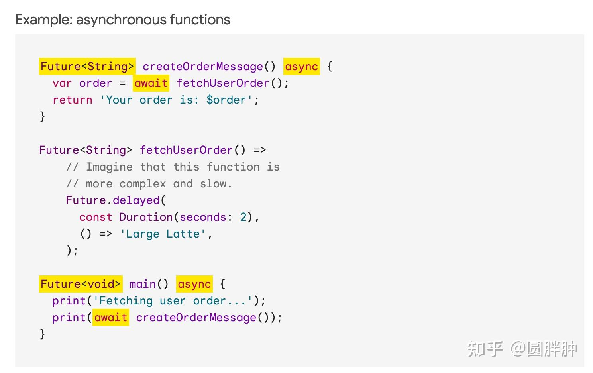
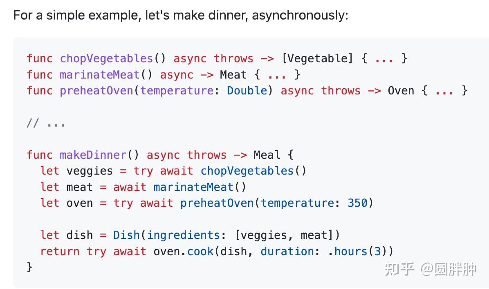
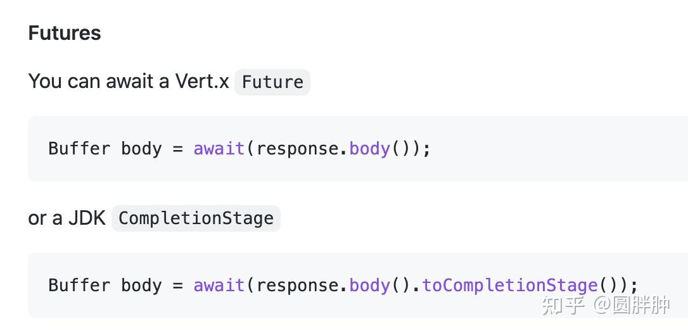

有的，今天在群里聊的，大概有这三种形式

当然，这是实现机制，也就是你问的，但是最终暴露给用户的，都是future和await，也就是，虽然实现机制不一样，但是用法几乎是一样的

## 分类

先做个简单的分类，大概有这么三类：

第一类：fiber，中文翻译成纤程，同义词：虚拟线程（java），goroutine（go），java和go的实现机制是这一类，这一类有时也会被叫做有栈协程

第二类，coroutine，中文翻译成协程，或者具体一点叫无栈协程，代表语言有：swift，kotlin

第三类，语法糖，就编译器会把await后面的代码，转换成回调函数，代表语言有：dart，js

* * *

## 回调

先看最原始的写法，比如我们发送一个http请求，收到一个response，如果只有回调的话，会写成这样，伪码

```text
var future = request.send();
future.then(response -> {
    //response的处理代码
});
```

这里有一个大问题，就是response的处理代码，在只有回调的时候，只能写在then这个缩进里面

多来几次io/request-response处理，那这个缩进就会不断加深，代码就很难看

那怎么办呢？

要实现的效果是

```text
var future = request.send(); 
var response = await future;
//后续添加reponse的处理代码
```

这样就不会有缩进问题，代码就比较容易读懂

那实现机制就是前面说的三种

## 语法糖

先说最后一种，就是语法糖机制，dart等语言，会把await后面的代码，变成future.then里面的内容，这个工作交给编译器去做就好了，用这种实现机制，要求，原来的io方法啊，比如常见的http client，都需要兼容future这个类型（js里面返回的是promise）

这个在dart等新生语言中，是没什么问题的，dart从诞生之初起，就要求，所有标记为async的方法，返回类型是future，然后再在future里面加入范型，约束future里面的具体的类型

比如上面的io代码可以写成

```dart
var response = await future<Response>;
```

所以这里有一个约束，要求所有标记async的方法，返回类型必须是future，然后用await拆开

这个约束很强，三个要素，future，async，await，三者缺一不可

dart在诞生之初，就做了这个约定，这对于dart来说是可行的，下图截取自dart的官方文档



## 协程（无栈）

但是对于那些，一开始设计时候，没有future和async/await这个机制的语言呢？

也就是一开始的例子，可能写成这样

```text
request.send(response -> {
    //你的方法处理
});
```

那在后续添加async/await的时候，可以做得更简单，那就是摒弃future/promise这个类型

看到async返回的类型就允许await，比如在swift里面，会写成这样

```swift
var response = await request.send();
//send方法的定义就变成
func send() async -> Response
```

注意，这里没有future或者promise类型，返回类型就是Response而不是Future<Response>，而且，await只能出现在标记为async的函数上下文中

这样做，就可以尽可能兼容以前，没有出现async/await时候的代码，用户并不需要去修改返回类型为future或者promise，把原来代码拷贝过来，就能用了

这种实现，就需要实现一个协程coroutine，当然你实现成纤程fiber，也可以，后者兼容前者

这个协程做什么用呢，在io的时候，它能够把整个线程yield挂起，让这个线程去做其他事，等到响应回来之后，再通过某种机制（一般是循环线程+队列）模式，交还给原来线程去执行

这就是标记方法为async的由来，这其实就是swift和kotlin的实现，这就能解释第二个机制



但是这样还有问题，就是你发现没有，我们需要把异步处理的方法，做async标记，这就会带来染色问题，就是你会因为异步处理，把方法/函数，分成两个不同的类

做了async标记的，和没做async标记的

那有没有办法连async标记都不做呢？

## 纤程（有栈）/虚拟线程

嗯，那这个就需要协程进一步模拟线程，就完全模拟线程了，线程对比前面说的协程，有自己的stack栈，如果你把协程给加上栈，就可以模拟线程了，这就是虚拟线程的由来

所以为什么java叫做虚拟线程，当然在虚拟线程这个概念诞生之前，出现了green thread绿色线程，fiber纤程，还有goroutine这几种不同表达，但意思是一样的，都是一个东西

本质上就是一个带了栈的虚拟线程，区别于操作系统线程，虚拟线程的调度，由runtime运行时，放到java里就是虚拟机来做，操作系统线程的调度由操作系统完成

由于完全模拟了线程，所以在io时候，阻塞的线程，变成了虚拟线程，实现则完全交给了语言的运行时/虚拟机

在代码中就几乎感受不到区别了，这就是为什么go一开始流行的原因，写起来方便

这样用户就完全不需要去了解什么async/await这些东西了，原来的代码怎么写，现在就怎么写

这就没有染色问题，这就很方便，尤其对于服务器端日常的crud应用而言，提升是很明显的

代码（几乎）不变，资源占用瞬间下降，用户也不需要去了解什么是async，什么是await，java就是这种实现

那如果我就是想要用future和await呢？

也可以，就把有栈的纤程，当做无栈的用就好了，遇到await，也不需要用关键字，直接给future加一个await方法就行了，就像这样

```java
var future = request.send(); 
var response =  future.await();
```

然后具体的实现，你丢给框架，比如vert.x之类的去实现就好了，下图是vert.x中虚拟线程实现的await机制，注意，java中await不是关键字，这里await是一个方法



所以不管是哪种实现，其实用起来都很简单，你看到async或者future，你就找await就行了

这个await可能是关键字，也可能是方法

如果是无脑crud的代码，不需要你了解这些，那更好

所以虽然实现机制有所不同，但是用起来都差不多