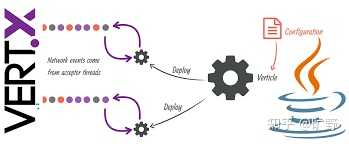

## Java异步HTTP库的真相：2025年，我们还在用线程池伪装异步吗？

## 什么是“真异步”？为什么要关心？

先明确“真异步”的定义。在网络编程中，**异步通常指基于事件驱动、非阻塞I/O（Non-blocking I/O）的模型。**简单来说：

-   **同步阻塞：**线程发起请求后，等待响应返回，线程被挂起（blocking），无法干其他事。
-   **线程池伪异步：**用线程池管理多个同步阻塞请求，表面上并发了，但本质上还是阻塞的，每个请求仍绑定一个线程。
-   **真异步（非阻塞）：**线程发起请求后不等待，通过回调、Future或事件循环机制在响应到达时处理，线程可以继续干其他事。

那为什么我们需要真异步？因为现代高并发场景下，线程池伪异步的方案有局限，线程是有成本的（内存、上下文切换开销），大量线程可能导致资源耗尽。在高并发场景下（如每秒处理百万请求）需要更高效的I/O模型。另外线程池伪异步的扩展性受限于线程数量，而非阻塞模型可以让少量线程处理大量请求。

* * *

## 主流HTTP库的异步实现：线程池的“遮羞布”

先来看看Java生态中主流HTTP库的现状，以**OkHttp**和**Apache HttpClient**为例。

### OkHttp


OkHttp（由Square维护，广泛用于Android和Java后端）提供了异步API，比如*Call.enqueue(Callback)*方法，表面上看是异步的。但它的实现本质上依赖Dispatcher类管理线程池：每个异步请求会被提交到线程池（默认最大64个并发请求，每主机最大5个）。在线程池中，请求仍然是同步阻塞执行的，即线程会等待响应返回。**好处是API简单，开发友好；坏处是高并发下线程池可能成为瓶颈。**

### Apache HttpClient


Apache HttpClient（包括其异步变种）也有类似的问题。尽管它提供了CloseableHttpAsyncClient来支持异步请求，但底层仍然依赖线程池：异步请求通过NIO（Java的非阻塞I/O）实现了一部分非阻塞特性，但在很多场景下（比如处理响应）依然会绑定线程。直到**Apache HttpClient 5.x**（2025年最新版本），它在某些配置下可以做到接近真异步，但默认行为和使用方式仍倾向于线程池驱动。

**伪异步的本质，**这两种主流库的“异步”更多是给开发者一个方便的接口，本质上还是线程池并行执行的同步逻辑。它们适合中等规模的并发，但在大规模、高并发场景下（比如每秒几十万请求），可能会遇到线程资源耗尽或性能瓶颈。

* * *

## Java生态中“真异步”HTTP库的探索

好消息是，Java生态并非完全停留在伪异步阶段。基于NIO或其他非阻塞模型的HTTP库已经存在，部分库甚至结合了现代Java特性（如Project Loom的虚拟线程）提供了更优雅的解决方案。以下是一些值得关注的选项：

### Java 11+ 自带的 java.net.http.HttpClient

从Java 11开始，JDK引入了新的HttpClient（包名java.net.http），这是一个官方支持的现代HTTP客户端，支持HTTP/1.1和HTTP/2，提供同步和异步API：

-   **异步API：**通过sendAsync方法，返回CompletableFuture<HttpResponse>，这是一种真正的非阻塞实现。
-   **底层实现：**基于NIO（非阻塞I/O），不依赖线程池来模拟异步，而是使用事件驱动机制。
-   **优点**：原生支持，不引入额外依赖；支持HTTP/2和WebSocket，提升性能；与Java生态深度整合（比如CompletableFuture）。
-   **缺点：**API相对简单，功能不如OkHttp丰富（比如拦截器、缓存支持较弱）；配置灵活性有限，定制化不如第三方库。

```java
HttpClient client = HttpClient.newHttpClient();
HttpRequest request = HttpRequest.newBuilder()
    .uri(URI.create("https://api.example.com/data"))
    .build();
client.sendAsync(request, HttpResponse.BodyHandlers.ofString())
    .thenAccept(response -> System.out.println(response.body()))
    .join(); // join仅用于示例，生产中可不阻塞
```

### Reactor Netty / WebFlux


Spring WebFlux（基于Project Reactor）和底层的Reactor Netty提供了真正非阻塞的HTTP客户端

-   **Reactor Netty：**一个基于Netty（高性能NIO框架）的异步网络库，支持非阻塞HTTP请求。
-   **WebFlux：**Spring框架的响应式Web模块，内置WebClient，基于Reactor Netty实现。  
    

他们都是完全非阻塞，基于事件循环（event loop）模型。支持响应式编程（Reactive Streams），适合高并发场景。与Spring生态深度整合。适合需要响应式编程的高并发Web应用。

使用WebClient的例子：

```java
WebClient client = WebClient.create("https://api.example.com");
client.get()
    .uri("/data")
    .retrieve()
    .bodyToMono(String.class)
    .subscribe(System.out::println);
```

### Vert.x



Vert.x 是一个基于Netty的高性能响应式工具集，提供非阻塞的HTTP客户端。基于事件循环和Netty实现，完全非阻塞。轻量级，性能极高。支持多种编程风格（回调、Future、RxJava等）。不依赖Spring，适合独立使用。适合追求极致性能的高并发场景。

```java
Vertx vertx = Vertx.vertx();
HttpClient client = vertx.createHttpClient();
client.request(HttpMethod.GET, 80, "api.example.com", "/data")
    .compose(req -> req.send().compose(resp -> resp.body()))
    .onSuccess(body -> System.out.println(body.toString()))
    .onFailure(Throwable::printStackTrace);
```

### 3.4 Project Loom：虚拟线程带来的新可能


Project Loom（Java 19+引入实验性虚拟线程，预计后续版本稳定）为异步编程提供了全新思路：

-   **虚拟线程：**轻量级线程，可创建数百万个，成本极低。
-   **对HTTP库的影响：**即使是同步阻塞的API（如OkHttp的同步调用），在虚拟线程环境下也能达到类似异步的效果。
-   截至2025年，虚拟线程仍在完善，但一些库（如OkHttp）已开始实验性支持。

所以未来，传统HTTP库可能通过虚拟线程实现“伪异步”到“真异步”的平滑过渡。

* * *

## 那为什么主流库仍倾向伪异步？

尽管真异步方案存在，为什么OkHttp、Apache HttpClient等主流库仍以线程池为主？原因有几点：

1.  **历史包袱：**这些库诞生时，Java的NIO生态不成熟，线程池是最简单可靠的并发方案。
2.  **开发友好性：**真异步需要回调、Future或响应式编程，开发复杂度高，容易出错；线程池伪异步的API更直观。
3.  大多数应用（中小规模并发）并不需要极致的非阻塞性能，线程池已足够。
4.  Java生态（尤其是阻塞型框架如Spring MVC）更习惯线程模型，非阻塞模型需要整体架构调整。

**回到你的问题，Java生态中确实有真异步HTTP库，但选择哪个取决于你的需求：**

-   **中小规模并发：**OkHttp、Apache HttpClient足够，异步API简单易用。
-   **高并发且追求性能：**优先尝试java.net.http.HttpClient（原生）、Spring WebFlux（响应式生态）、Vert.x（极致性能）。

如果你对“真异步”有强需求，且不介意响应式编程的复杂性，推荐从Spring WebFlux的WebClient入手；如果需要独立轻量方案，Vert.x是不错选择。

* * *

## 异步的真谛，从阻塞中解脱

Java的HTTP库生态在2025年早已不再局限于伪异步的线程池，真正的非阻塞方案已经在高concurrency的战场上站稳脚跟。选择哪条路，不在于技术有多新，而是你的场景有多“真”。毕竟，异步的意义，不是为了炫技，而是为了让每一毫秒都找到归宿。

如果觉得文章有帮助，欢迎点赞关注一波~ 我是旷野，带你探索无尽技术！