做后端开发这些年，发现很多朋友在面试或工作中聊到 QPS 时，总容易陷入两个误区：

-   **要么报个几百上千的数字，却讲不清数字来源**；
-   **要么把 QPS 和 TPS、并发数混为一谈，被追问几句就卡壳**；

其实面试官问 QPS，就像聊天时问 "你最近项目忙吗"，不是要个忙或者不忙的答案，而是是想听听答案背后的细节。**数字怎么来的？和业务匹配吗？遇到过哪些问题？**今天牛哥就把这些内容梳理出来，帮你彻底弄懂 QPS，把日常工作里的经验，变成面试时的加分项。

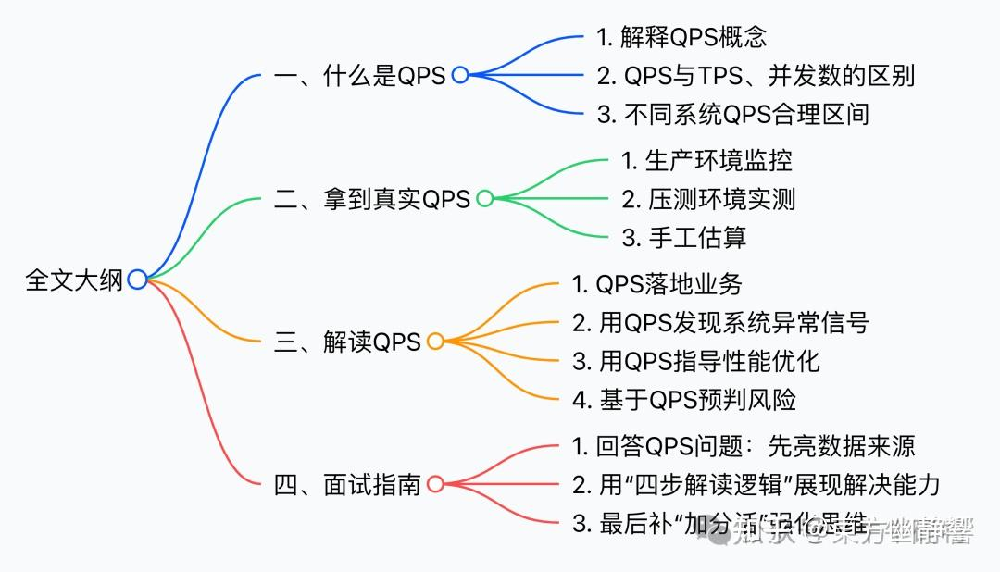

阅读全文需要 22 分钟，希望大家有所收获。

  

  

**1**

**先搞懂 QPS 到底是什么？**当面试官抛出"你的系统 QPS 是多少"这个问题时，很多人的第一反应是在脑海里搜寻一个数字。但是相信我，一个孤立的数字几乎毫无意义。在给出任何答案之前，我们必须先确保自己真正理解这个问题的核心： QPS 究竟是什么。**1.1 一句话说清QPS**简单来讲，**QPS = QueriesPerSecond**，即每秒查询数。

如果把系统想象成一家繁忙的餐厅，QPS 就是每秒走进餐厅的顾客数量。这个数字直接反映了餐厅的受欢迎程度和潜在的营收能力。QPS 的统计范围很灵活：

-   App 或浏览器向服务器发起的每一次请求（比如点外卖、发朋友圈），是应用的 QPS；
-   数据库每秒执行的读写指令（比如查用户信息、存订单数据），是数据库的 QPS；
-   微服务之间每秒的接口调用（比如支付服务调用会员服务），是微服务的 QPS；

**本质上，你想衡量哪个系统环节的每秒交互量，这个量就是该环节的 QPS**。

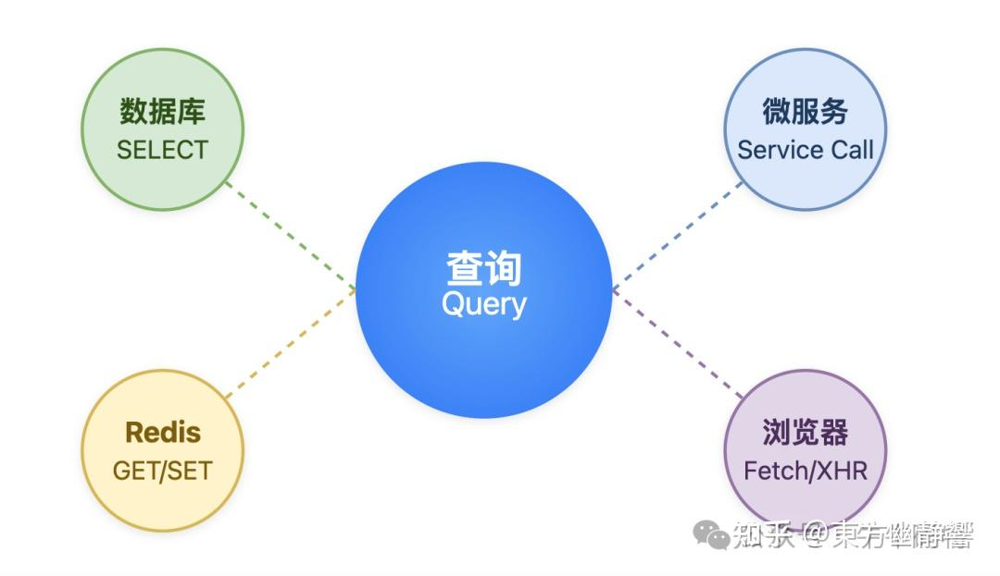

也正因为 QPS 统计范围广，场景多样，很多人容易把 QPS 和另外两个指标 — TPS 和并发数弄混淆。其实这三个指标各有各的关注点。**1.2 QPS 和 TPS、并发数的区别**我们用一个表格来清晰地对比一下：**指标**

**核心关注点**

**通俗理解**

QPS请求的频率每分钟进来多少位顾客TPS业务的完整性餐厅每分钟能完整服务完多少桌客人（从入座到结账离开）并发数系统的容量餐厅里同时有多少桌客人正在用餐看完表格，我们再结合实际场景，看看每个指标是如何落地应用的。**先看 QPS（每秒查询数），它核心盯的是请求的数量和速度。**

只要客户端，向服务器发了请求，不管这个请求是做什么的，都算做一个请求。比如网购下单支付这个场景，需要拆成 5 个独立的请求才能完成：

-   请求1：查看目标商品库存是否充足；
-   请求2：在系统中创建订单记录；
-   请求3：扣减对应商品的库存数量；
-   请求4：向支付系统发起支付请求；
-   请求5：根据支付结果更新订单的最终状态。

这一套操作下来，**发了5个独立请求，自然也就贡献了5个 QPS**。**而 TPS（每秒事务数），它和 QPS 最大的不同，是更看重业务逻辑的完成度**。对应到上面的网购下单场景，即便整个流程发起了5个独立请求，也只能算作**1个事务**，而且要这一整套步骤全部执行完，才能被统计为**1个完整的 TPS**。因此事务的核心是**业务完整性**，它不是孤立的单个请求，而是一组存在先后执行顺序的操作集合，这组集合必须全部执行完毕，才算一个完整的事务。

  

  

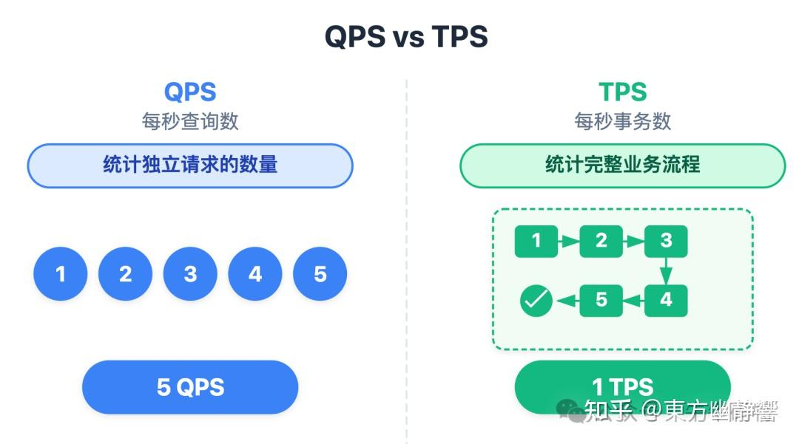

  

  

通常来说，一个事务会包含多个独立请求，系统的 TPS 会小于或等于 QPS。**最后是并发数，它关注的是同一时间点，系统正在处理的请求有多少。**这里的**正在处理**是关键：它既不统计已经处理完的请求，也不统计还在排队的请求，只盯着当下正占用系统资源、处于处理中状态的请求数量。以外卖场景为例：饭点12点，你常用的外卖 App 有1500个用户同时点 "查看附近的商家"，这些请求会同步发送到外卖平台的服务器。

若服务器同一时间能分心处理 300 个请求，那此时系统的并发数就是 300。

虽然并发数为 300 ，但随着请求的处理难度不同，对应的 QPS 也会有所差异：

**第一种情况，这类请求需要复杂的计算**，1500 个请求得 15 秒才能处理完。QPS = 1500（请求总数） / 15（请求总时长） = 100这种情况下，虽然 QPS 只有100，但 300 个并发已让服务器算力饱和，**属于低 QPS 高并发场景**；

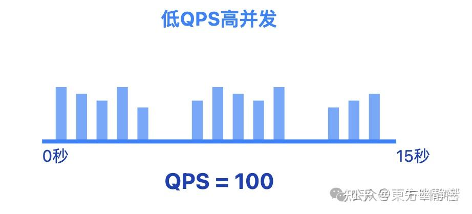

**第二种情况，这类请求只需简单查询、处理速度极快**，1500 个请求仅需 0.5 秒就全处理完。QPS = 1500（请求总数） / 0.5（请求总时长） = 3000这种情况 QPS 虽高，但 300 个并发远没到服务器承载上限，**属于高 QPS 低并发场景**。

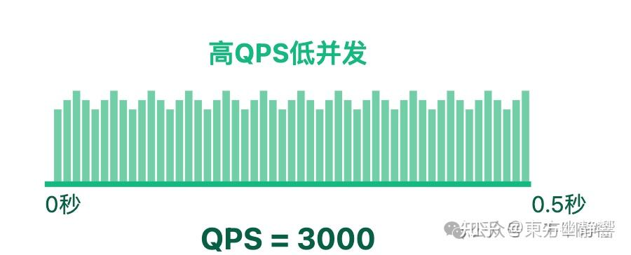

  

可见，QPS 的高低看的是**每秒请求总量**，并发数的高低看的是**同一时间实际处理的请求量**，高并发不等于高 QPS，二者完全可能呈现反向关系，不能混为一谈。

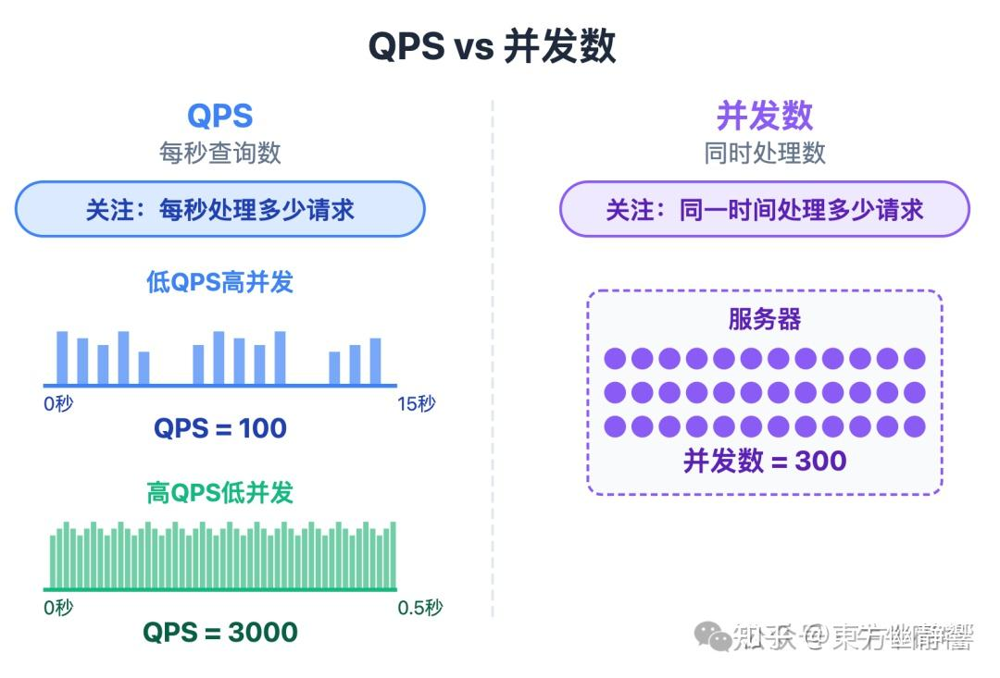

  

在理解了两者差异后，我们再回归到实际场景，结合系统定位来判断不同系统对 QPS 的需求。

**1.3 不同系统QPS的合理范围**按系统类型划分，我们能清晰地看到不同场景下的 QPS 合理区间：**1\. 小型内部系统**

**合理区间：QPS 日常 10-50、峰值 100-300**这类系统用户规模只有几十到几百人，核心是**够用就行**。**2\. 电商详情页接口合理区间：QPS 日常 5000-20000、峰值 20w - 50w**这类电商接口日常 QPS 维持在 5000-20000。但到了 618、双 11 大促，用户会集中刷商品、查库存，流量可能暴涨 10 倍以上，因此关键在于**扛住突发流量**。**3.支付核心接口合理区间：QPS 日常 1000-5000、峰值 1w - 3w**它们的核心不是快，而是稳，哪怕峰值时响应慢一点，也得**优先稳住系统**。

**4.工具类接口合理区间：QPS 日常 100-500、峰值 1000 - 2000**工具类接口的用户使用场景很分散，比如注册收验证码、活动发通知。核心是 **保证成功率**，而不是单纯提升处理速度。

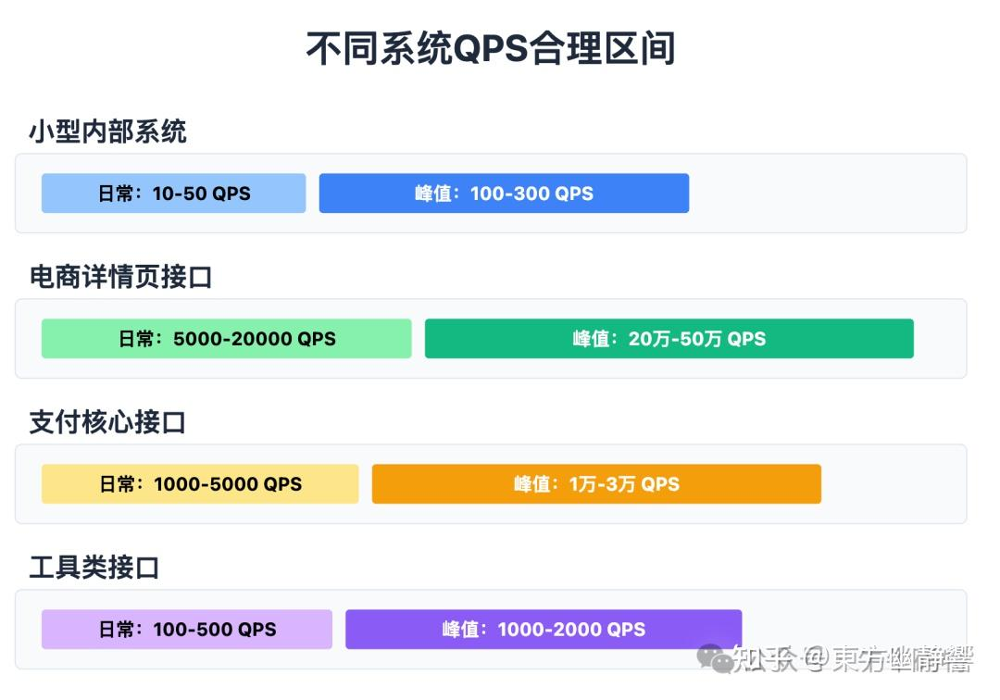

不过这些区间只能作为参考，在实际的面试和工作中，我们必须要拿到系统真实运行时的 QPS 数据，才能准确判断当前性能是否够用、要不要优化。接下来，我们就聊聊怎么拿到真实的QPS。

  

  

**2**

**拿到真实的 QPS**

要获取系统真实的 QPS，主要有三种方法，**第一种生产环境监控，这是最核心、最能反映系统实际运行状态的方式**。

另外两种，压测工具和手工估算则作为补充，用于验证或快速估算。

**2.1 生产环境监控**这种方法通过多维度监控生产系统的实际运行数据，它的逻辑是：**先统计 QPS，再验证真实性**具体分应用层和系统层两层展开：**1\. 应用层：直接看接口的 QPS**应用层是 QPS 的直接发源地，所有用户操作最终都会转化为接口请求，因此在这里统计 QPS 最直接。

按照使用场景来分，统计方式主要有三种：

**第一种：日志收集与可视化分析，适合已有完善日志体系的系统。**这种方式的核心思路是先记录请求日志，再提取关键信息统计，最常用的工具组合是 ELKStack，也就是 **Elasticsearch + Logstash + Kibana** 的组合。

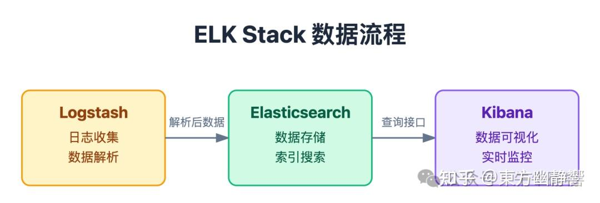

具体流程是：

-   先在接口代码中打印请求日志，日志里要包含接口路径、请求时间、请求 ID 等信息；
-   然后通过 Logstash 读取日志文件，按预设规则解析数据；
-   解析后的数据会存入 Elasticsearch；
-   最后在 Kibana 中创建可视化图表。

这样就能直观看到每个接口的实时 QPS，还能回溯历史 QPS 波动。

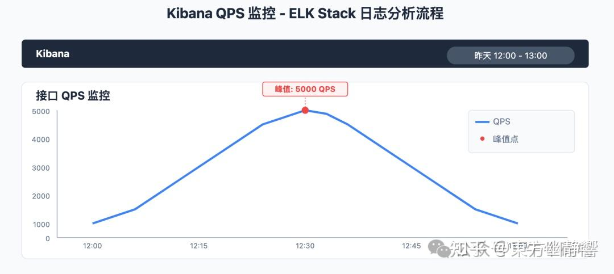

**查看昨天 12 点的峰值第二种：APM 工具自动追踪，适合追求 "零侵入统计" 的场景。**它的核心优势是**不需要在业务代码中额外写统计逻辑，只需在项目中引入对应的探针**。引入探针后，工具会自动拦截所有接口调用，记录请求时间、接口名称等信息，并在自带的控制台中展示 QPS。常用的APM工具有SkyWalking、Pinpoint、Zipkin等，比如用 SkyWalking 时：进入服务接口页面选择 QPS 指标，就能看到每个接口的实时 QPS 曲线，还能对比不同接口的 QPS 占比，方便快速定位核心接口。

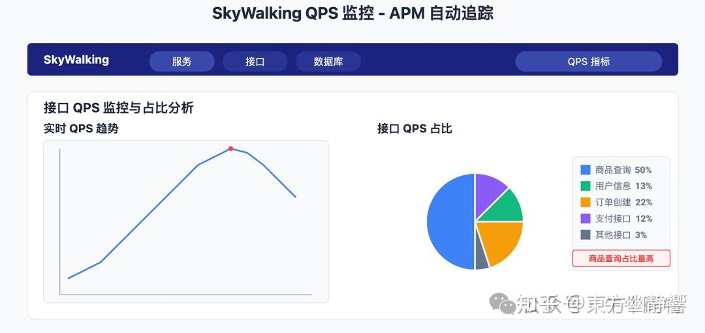

**查看 QPS 占比最高的接口第三种：自定义埋点统计，适合需要精准控制统计范围的场景。**这种方式需要在接口代码中嵌入简单的统计逻辑，核心是用 "**计数器 + 时间窗口**" 计算每秒请求量。这样就能精准统计核心接口的 QPS，不但没有额外的工具依赖，还能根据需求扩展，比如只统计成功响应的请求、按用户地区区分统计等。


讲完了应用层的监控，并不意味着 QPS 统计就结束了，光看应用层的 QPS 还不够。实际场景中，有时会出现**应用层显示 QPS 很高，但系统却很空闲**的情况，比如日志统计错误、重复计数。这时候就需要通过系统层监控验证 QPS 的 "可信度"。**2\. 系统层监控:验证 QPS 是否可信**

这层监控的核心逻辑是：

真实的高 QPS 一定会消耗系统资源，若资源消耗与 QPS 不匹配，说明统计数据可能有问题。

**首先监控服务器资源，重点关注 CPU、内存、网络 IO 这三个指标**。


在企业级监控实践中，**Prometheus + Grafana 是当前最主流、最常用的技术组合**。用它监控 Linux 服务器时，能直观对比资源消耗与 QPS 的匹配度：若应用层显示 QPS 达到5000，但 CPU 使用率仅10%、内存占用不到30%，且网络 IO 也很低，那大概率是 QPS 统计有误；反之，若 QPS 升高时，CPU 使用率持续超过80%、内存占用稳步上升，且网络 IO 同步增长，说明 QPS 数据基本可信。

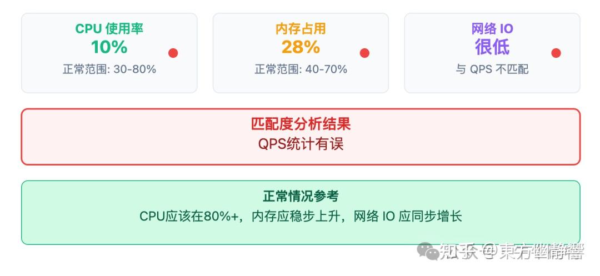

正是这种资源与 QPS 的联动关系，构成了验证 QPS 数据真实性的核心依据 — 请求处理必然伴随着资源消耗。**其次是数据库监控，尤其是依赖数据库的接口。**常用的数据库监控工具是：

-   MySQL 监控：采用「**Prometheus + mysqld\_exporter**」组合，mysqld\_exporter 负责采集指标，再由 Prometheus 存储指标数据，配合 Grafana 可实现可视化仪表盘。
-   PostgreSQL 监控：采用「**Prometheus + pg\_exporter**」组合，pg\_exporter 专注采集 PostgreSQL 的指标，与 Prometheus 联动后，可实时追踪 PostgreSQL 运行状态。

通过这类组合能直接获取数据库 QPS、连接数、慢查询数量等指标。验证逻辑也很直接：若应用层显示订单创建接口 QPS 为 1000，但数据库 QPS 仅 200 且连接数无明显增长，大概率是应用层统计有误；

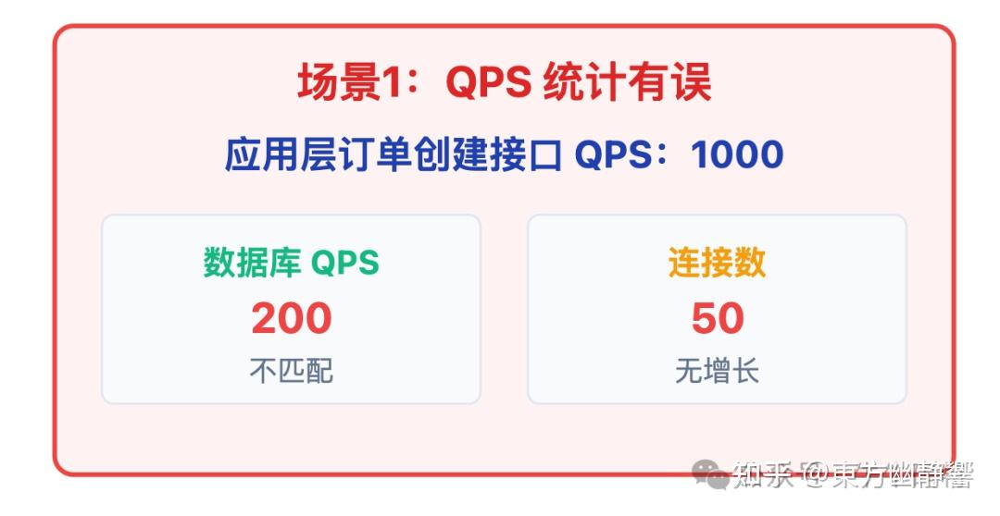

而当接口 QPS 从 500 增至 1000 时，数据库 QPS 也从 800 涨到 1600，连接数同步从 50 升到 100，这种趋势匹配就说明 QPS 真实。

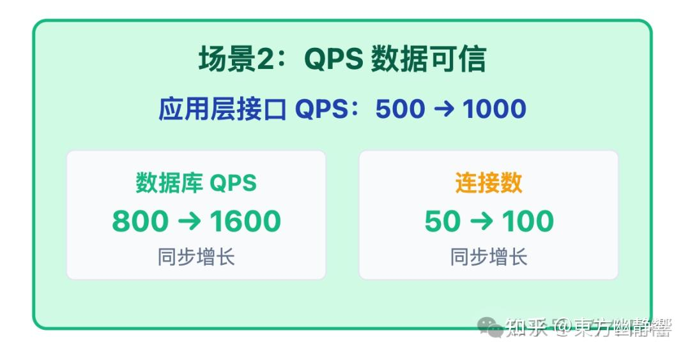

毕竟接口请求最终会转化为数据库操作，两者变化本应正相关。**最后是网络监控，关注带宽使用率和网络延迟。**正常情况下，**高QPS 的请求传输应该带动带宽消耗上升**。如果接口 QPS 很高，但服务器带宽使用率仅 20%，且没有丢包，大概率是应用层统计时出现了问题。例如重复请求或无效请求误计入 QPS，此时就需要核查日志或埋点逻辑，修正 QPS 数据。至此，生产环境监控的核心步骤就完整了。但是又引出了另一个问题：生产环境监控只能反映当下的实时 QPS，没法提前预判系统能扛住的最大承载上限，比如：**大促峰值流量来临，系统会不会被压崩？加了缓存后 QPS 具体能提升多少？**这些涉及到系统的极限 QPS 的场景，靠实时监控无法得到答案，只能通过模拟的手段来测试。这时候，压测工具就派上用场了。**2.2 压测工具实测**压测工具的核心价值就是：**通过模拟高并发请求复现极端流量场景，帮我们测出系统 QPS 的极限。**市面上的压测工具有很多种，这里重点介绍 JMeter、wrk、Locust 这三款主流工具，它们覆盖了从 "复杂全链路压测" 到 "轻量快速验证" 再到 "高度定制化测试" 的绝大多数场景。

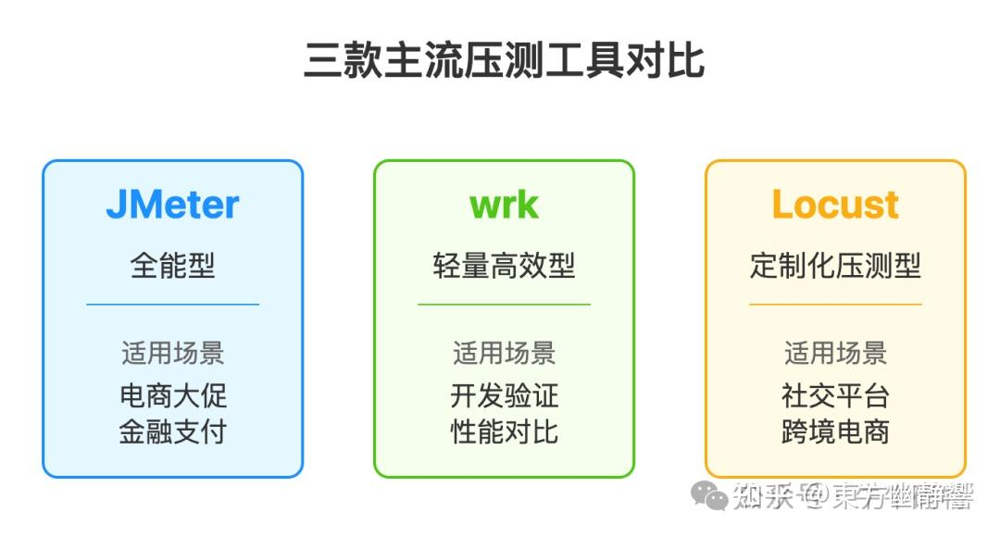

**1\. 全能型：JMeter**JMeter 作为压测领域的国民级工具，几乎是所有性能测试场景的首要选项。压测后会生成包含 QPS 趋势图、响应时间分布、错误率占比的详细报告，帮我们精准定位瓶颈。适合电商大促全链路压测、金融支付系统多流程验证等复杂且需深度分析的场景**2\. 轻量高效型：wrk**如果只是想快速验证某个接口的性能，那 wrk 就是最高效的选择。一行命令就能发起压测并输出 QPS、响应时间等核心指标。例如通过 10 个线程、维持 1000 个并发连接，对商品接口持续压测 60 秒的命令如下：

```text
wrk -t10 -c1000 -d60s http://localhost:8080/api/goods
```

不过 wrk 的定位很明确，它是开发者的随手测工具，不支持复杂业务流程模拟，也没法生成详细的可视化报告。

适合开发阶段的高频次、轻量化验证，比如测试数据库索引优化后的接口响应速度，或是快速对比不同版本接口的 QPS 差异。

**3\. 定制化压测型：Locust**

这款压测工具代表了**以代码驱动压测**的主流方向，开发者可以通过脚本自由控制请求参数，也能灵活定义用户行为。适合社交平台的 "点赞 / 评论 / 转发" 混合接口压测，或是跨境电商的 "多地区用户访问延迟模拟" 这类非标准化场景，体现工具的定制化能力。基于上面的介绍，我们发现无论是生产环境监控的实时 QPS 统计，还是压测工具对极限 QPS 的实测，都需要依赖一定的技术工具或系统支持。但如果只是想快速粗略判断 QPS 范围，用最基础的手工估算就能满足需求。**2.3 最基础的手工估算**手工估算的逻辑非常简单，核心公式就是 QPS = 总请求数 / 时间窗口只需找到两个关键数据，**某段时间内的总请求量**和**对应的时间长度**，就能快速算出平均 QPS。比如日常业务中常见的场景：某接口1小时内处理了36万次用户请求，按公式计算：**QPS = 360,000 / 3600 = 100**，即该接口**平均 QPS 约为100**；这种方法的优势是零门槛、无需任何工具，适合前期做容量规划、或没有工具支持的临时场景。通过以上三种方法，我们拿到了系统的 QPS，但是拿到 QPS 并非最终目的。更重要的是解读它，让数字转化为指导业务和系统优化的有效信息。

  

  

**3**

**拿到 QPS 之后：更重要的是解读它**解读 QPS 的关键在于建立一套连贯的解读逻辑：**理解数字背后的业务含义 → 发现系统潜在问题 → 制定优化方案 → 应对突发情况**这四步循序渐进、相互支撑。**第一步：让 QPS 落地业务，让数字有实际意义**拿到 QPS 的第一反应不该是 "这个数字高不高"，而是 "**这个数字对业务有什么用**"。比如电商的商品查询接口 QPS 再高，若订单接口 QPS 没跟上，说明用户只看不买，高 QPS 反而暴露了转化问题；反之，若两者同步增长，才证明流量真的带动了业务。

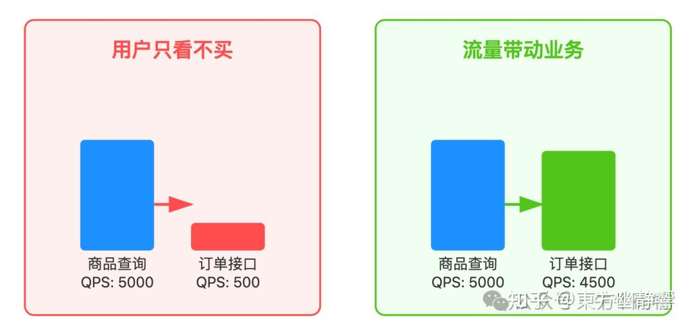

  

**同时还要关注 "健康度"：高 QPS 并非绝对是好事。**如果支付接口 QPS 上涨的同时，超时订单变多，说明高错误率正在消耗业务价值；如果 QPS 还没到系统上限，用户却反馈页面加载缓慢，意味着慢响应正在损害用户体验，需要立即优化。

通过落地业务，QPS 有了实际意义，那么当 QPS 出现异常变化时，其异常变化也就成了系统出问题的强烈信号。

**第二步：从 QPS 变化里，发现系统异常信号**QPS 的异常通常表现为**突然暴跌、骤升或呈现剧烈波动**。

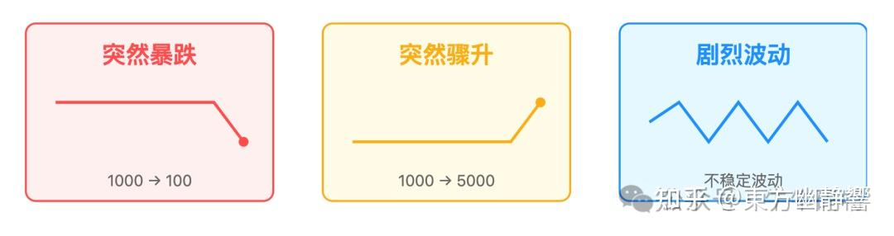

例如当平时稳定在 1000 的接口 QPS 突然降至 100，大概率是系统内部出现严重问题。

-   接口代码层面：可能因逻辑设计缺陷形成死锁，导致请求处理流程停滞；
-   数据库连接池方面：如果配置不合理，或者应用存在连接泄漏问题，就会出现连接池耗尽的情况。
-   缓存方面：可能因大量缓存同时失效即缓存雪崩，数据库瞬间被高并发请求压垮，处理能力大幅下降。
-   而网络故障、负载均衡器异常，会使得请求无法顺利抵达服务器，服务器处理的请求量锐减，QPS 也就随之暴跌。


这些异常本质上是系统通过 QPS 传递求助信号。及时捕捉这些信号，才能在小问题扩大前介入，避免故障蔓延。**第三步：用 QPS 指导系统性能优化，不盲目加服务器**发现异常或明确性能目标后，需要结合 QPS 表现针对性优化。这一步要避免盲目扩容，而是让 QPS 成为 「**问题导航仪**」。


针对上一步中的异常场景，优化思路也各有侧重：

-   若 QPS 暴跌源于接口代码死锁，需要通过日志定位死锁产生的代码块，优化锁的获取与释放顺序，或减少不必要的锁竞争；
-   若因数据库连接池耗尽导致 QPS 下跌，可以先检查连接池配置，调整参数匹配业务请求量，同时排查应用是否存在连接未释放的泄漏问题，避免连接资源被浪费；
-   如果是 "缓存雪崩" 引发的 QPS 骤降，可采用缓存过期时间随机化、添加本地缓存作为兜底、给数据库加读写锁或队列削峰等方式，减轻数据库压力；
-   若 QPS 骤升且响应恶化，如遭遇恶意请求或逻辑重试，可以先通过Sentinel、Nginx 等限流工具限流，再修复重试漏洞，避免无效请求占用资源；

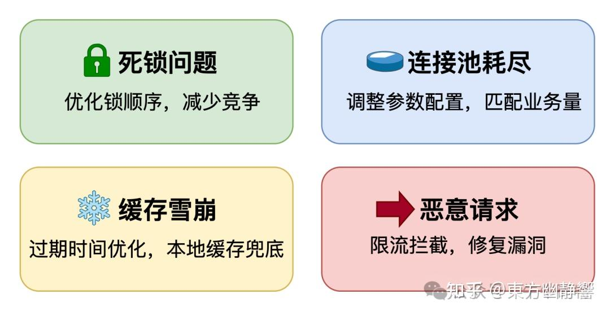

当然如果没有明显异常，但是QPS 已接近系统上限、响应时间持续变长的情况，也需先判断瓶颈再采取措施。解决了当下的问题，还要通过 QPS 预判未来的风险。**第四步：基于 QPS 预判风险，提前准备应对策略**像大促、直播带货这类可预期的突发场景，流量往往会远超日常，若等到流量涌来再应对，很容易手忙脚乱。这一步不用复杂操作，结合历史 QPS 数据和业务规划，分两点做好准备：**第一点是推算峰值 QPS，明确系统需要扛住的压力上限。**核心是一个简单公式：峰值 QPS = （预期用户数 × 平均请求频率）× 峰值系数。比如大促期间，我们预计会有 20000 名用户同时在线，推算过程为：

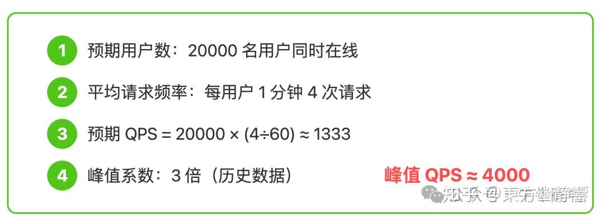

4000 QPS 就是系统需要应对的极限流量目标。**第二点是提前验证和做足准备，确保系统能扛住峰值压力。**先使用常用的压测工具如 JMeter，模拟 4000 QPS 的流量对系统进行测试，重点观察两个关键指标：

-   响应时间是否能稳定在用户可接受的范围，比如 200ms 以内；
-   错误率是否控制在合理标准内，不出现大量请求失败的情况。

如果测试不达标，就**提前启动优化**，比如扩容服务器、升级缓存集群。

同时还要**制定应急方案**：给核心接口设定好限流阈值，比如 QPS 超过 4000 时自动拦截部分非关键请求；

**准备好降级策略**，比如暂时关掉商品推荐这类非核心功能，就算流量比预期还高，也能优先保障下单、支付这些核心业务正常运行。

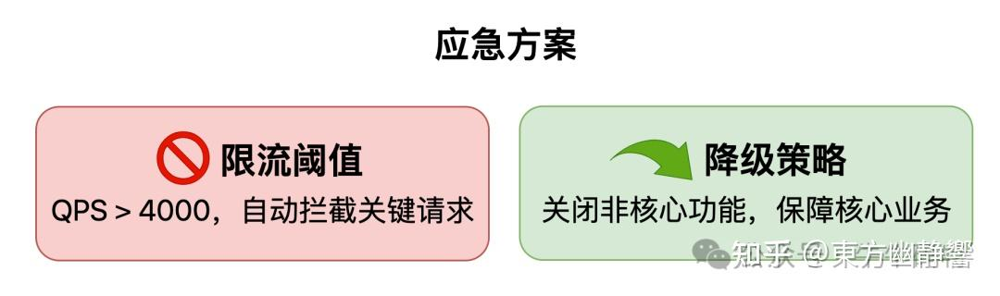

这一步将 QPS 从 「问题诊断工具」 升级为 「风险预警器」，让系统在流量高峰前有备无患。

以上四步，从判断业务价值到捕捉异常，从精准优化到提前布局，层层递进，形成了完整的 QPS 解读闭环，最终让 QPS 真正成为系统性能和业务健康的 "晴雨表"。

  

**4**

**面试指南：把 QPS 知识转化为面试加分项**看到这里，相信大家对 QPS 的认知已经不止于一个性能数字。从通过三种手段获取 QPS，到用四步逻辑解读其背后的业务价值与系统状态，我们其实是在构建一套 "用数据驱动决策" 的思维。而这套思维，正是面试中打动面试官的关键。接下来聚焦最核心的方法，帮你把知识转化为面试中的加分项。**一、回答 QPS 问题，先亮数据来源**面试中被问：系统 QPS 多少，别直接报数字，先说明数据怎么来的。

针对电商商品接口，可以这样说：

”我负责的商品详情页接口，**日常 QPS 是通过 Prometheus + Grafana 实时监控拿到的**，因为用户白天刷商品的频率高，QPS 稳定在 8000-10000 之间，晚上会降到 3000；**而峰值 QPS 是大促前用 JMeter 压测出来的**，当时结合近 2 年双 11 流量增长数据，模拟了 3 万 QPS 的极限场景，最终接口能扛住，且响应时间稳定在 300ms 以内。”

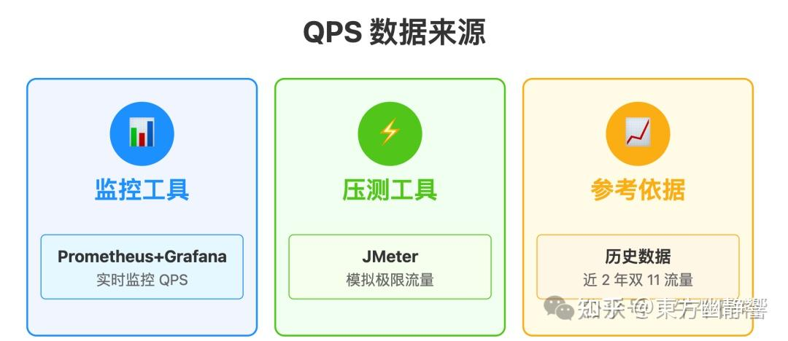

这段话里，监控工具、压测工具和参考依据三个细节，既证明了 QPS 数据的真实性，也展现了你懂实时监控和峰值预判的实战经验。

**二、用 「四步解读」 展现解决能力**当然，光有真实的 QPS 数据还不够，面试官更想知道你如何用 QPS 解决实际问题。前文提到的 “**判断业务价值 → 捕捉异常 → 精准优化 → 提前布局**” 四步解读，不用在面试中全讲，选一个你经历过的核心场景展开，就能让面试官看到你把理论落地到实践的能力。

以 「**QPS 异常暴跌**」 的排查场景为例，可以这样说：

“之前负责的订单创建接口，平时 QPS 稳定在 1000 左右，有次促销活动中突然跌到 200，用户还反馈下单加载慢。我当时按 **捕捉异常→精准优化**的逻辑一步步查：

第一步先看**应用层监控**，用的是 SkyWalking，发现接口响应时间从正常的 300ms 涨到了 5 秒，而且报错里有大量数据库连接超时；

第二步就去**查数据库层**，用 Prometheus + mysqld\_exporter 看了 MySQL 监控，发现数据库连接数已经满了，我们配置的最大连接数是 100，当时已经用了 100 个，还堆积了 20 多个等待连接的请求，另外还有 3 个慢查询没走索引；

  

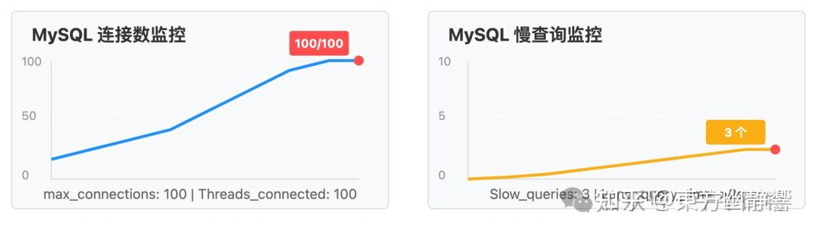

  

第三步就顺着这些现象**定位原因**：

-   一方面是前一天上线的代码里，有个地方用了数据库连接后没释放，导致连接泄漏，慢慢占满了连接池；
-   另一方面是促销期间用户查历史订单的请求变多，触发了慢查询，进一步占用了连接资源；

**最后优化**的时候，我先修复了代码里的连接泄漏问题，给订单表加了用户 ID + 创建时间的联合索引，再把数据库最大连接数调整到 150。优化上线后大概 10 分钟，接口的 QPS 就恢复到了 1000，响应时间也回到了 300ms 左右。”

  

回答完核心问题后，别着急结束，补一句体现 “**延伸思考**” 的话，能让你的回答多一层长远视角。

比如聊完 QPS 数据后，可以补充：

“**现在我们不只盯着实时 QPS，还会用过去半年的 QPS 数据做容量规划**。比如根据近 3 个月的增长趋势，算出来下季度订单接口的 QPS 可能会涨到 1500，到时候现有服务器可能扛不住，所以我们计划提前扩容 1 台应用服务器，再给数据库加 1 个从库分担读请求，避免等流量来了再应急，影响用户体验。”

  

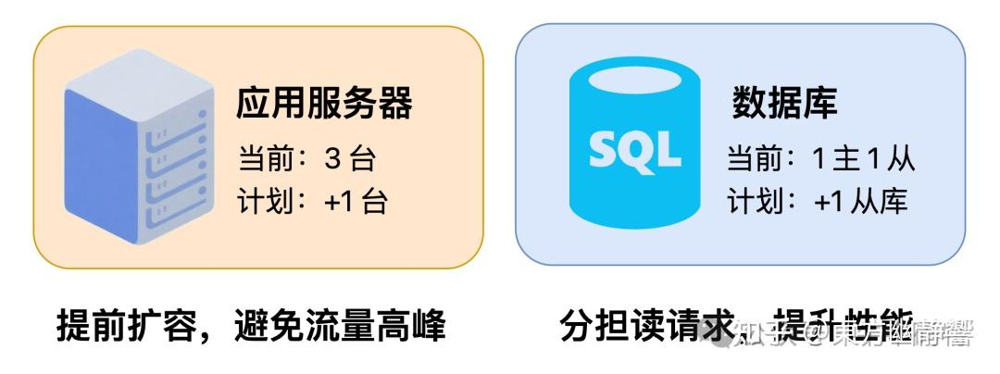

  

这句话既呼应了 “四步逻辑” 里的 「提前布局」，也让面试官看到你具备 “用 QPS 数据做预判” 的思维，从**会解决问题到主动规划未来**，这正是面试官青睐的高阶能力。

  

**5**

**写在最后：面试拼的不是数字，而是理解能力**

很多人担心 “我没做过高 QPS 系统，会不会答不好”。

其实面试官更看重你对 QPS 的理解，哪怕你做的是 QPS 100 的内部系统，只要能说清 “**怎么监控 QPS、怎么排查异常、怎么结合业务优化**”，照样能拿高分。

当你能把 QPS 和具体工作、业务场景绑在一起时，面试自然能脱颖而出。

写到这里，关于 QPS 的所有核心内容就梳理完毕了。

希望这篇文章能帮你彻底摆脱聊 QPS 只报数的困境，无论是日常工作中的性能优化，还是面试时的能力展现，都能让 QPS 成为你技术体系里的加分符