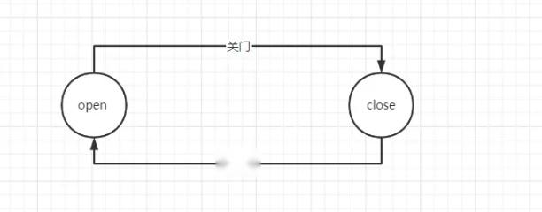
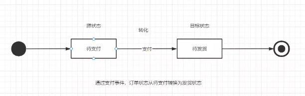
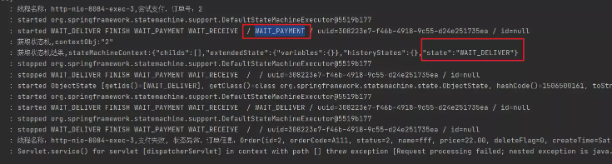
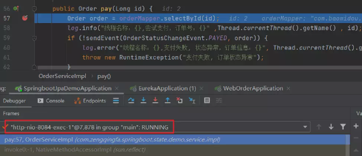
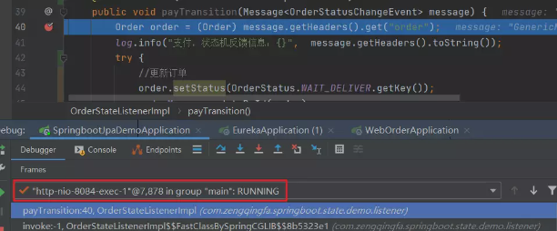

## 1、什么是状态机

### 1.1 什么是状态

先来解释什么是“状态”（ State ）。现实事物是有不同状态的，例如一个自动门，就有 open 和 closed 两种状态。我们通常所说的状态机是有限状态机，也就是被描述的事物的状态的数量是有限个，例如自动门的状态就是两个 open 和 closed 。

状态机，也就是 State Machine ，不是指一台实际机器，而是指一个数学模型。说白了，一般就是指一张状态转换图。例如，根据自动门的运行规则，我们可以抽象出下面这么一个图。

自动门有两个状态，open 和 closed ，closed 状态下，如果读取开门信号，那么状态就会切换为 open 。open 状态下如果读取关门信号，状态就会切换为 closed 。

状态机的全称是有限状态自动机，自动两个字也是包含重要含义的。给定一个状态机，同时给定它的当前状态以及输入，那么输出状态时可以明确的运算出来的。例如对于自动门，给定初始状态 closed ，给定输入“开门”，那么下一个状态时可以运算出来的。

这样状态机的基本定义我们就介绍完毕了。重复一下：状态机是有限状态自动机的简称，是现实事物运行规则抽象而成的一个数学模型。

### 1.2 四大概念

下面来给出状态机的四大概念。

-   第一个是 State ，状态。一个状态机至少要包含两个状态。例如上面自动门的例子，有 open 和 closed 两个状态。
    
-   第二个是 Event ，事件。事件就是执行某个操作的触发条件或者口令。对于自动门，“按下开门按钮”就是一个事件。
    
-   第三个是 Action ，动作。事件发生以后要执行动作。例如事件是“按开门按钮”，动作是“开门”。编程的时候，一个 Action一般就对应一个函数。
    
-   第四个是 Transition ，变换。也就是从一个状态变化为另一个状态。例如“开门过程”就是一个变换。
    

### 1.3 状态机

有限状态机（Finite-state machine,FSM），又称有限状态自动机，简称状态机，是表示有限个状态以及在这些状态之间的转移和动作等行为的数学模型。

FSM是一种算法思想，简单而言，有限状态机由一组状态、一个初始状态、输入和根据输入及现有状态转换为下一个状态的转换函数组成。

其作用主要是描述对象在它的生命周期内所经历的状态序列，以及如何响应来自外界的各种事件。

## 2、状态机图

做需求时，需要了解以下六种元素：起始、终止、现态、次态（目标状态）、动作、条件，我们就可以完成一个状态机图了：

以订单为例：以从待支付状态转换为待发货状态为例

-   ①现态：是指当前所处的状态。待支付
    
-   ②条件：又称为“事件”，当一个条件被满足，将会触发一个动作，或者执行一次状态的迁移。支付事件
    
-   ③动作：条件满足后执行的动作。动作执行完毕后，可以迁移到新的状态，也可以仍旧保持原状态。动作不是必需的，当条件满足后，也可以不执行任何动作，直接迁移到新状态。状态转换为待发货
    
-   ④次态：条件满足后要迁往的新状态。“次态”是相对于“现态”而言的，“次态”一旦被激活，就转变成新的“现态”了。待发货 注意事项
    

1、避免把某个“程序动作”当作是一种“状态”来处理。那么如何区分“动作”和“状态”？“动作”是不稳定的，即使没有条件的触发，“动作”一旦执行完毕就结束了；而“状态”是相对稳定的，如果没有外部条件的触发，一个状态会一直持续下去。

2、状态划分时漏掉一些状态，导致跳转逻辑不完整。所以在设计状态机时，我们需要反复的查看设计的状态图或者状态表，最终达到一种牢不可破的设计方案。另外，推荐公众号Java精选，回复java面试，获取在线面试资料，支持随时随地刷题。

## 3、spring statemachine

### 3.1 状态机spring statemachine 概述

Spring Statemachine是应用程序开发人员在Spring应用程序中使用状态机概念的框架。关于更多spring架构知识：[https://www.yoodb.com/spring/spring\-ioc-architecture.html](https://link.zhihu.com/?target=https%3A//www.yoodb.com/spring/spring-ioc-architecture.html)

Spring Statemachine旨在提供以下功能：

1.  易于使用的扁平单级状态机，用于简单的使用案例。
    
2.  分层状态机结构，以简化复杂的状态配置。
    
3.  状态机区域提供更复杂的状态配置。
    
4.  使用触发器，转换，警卫和操作。
    
5.  键入安全配置适配器。
    
6.  生成器模式，用于在Spring Application上下文之外使用的简单实例化通常用例的食谱
    
7.  基于Zookeeper的分布式状态机
    
8.  状态机事件监听器。
    
9.  UML Eclipse Papyrus建模。
    
10.  将计算机配置存储在永久存储中。
     
11.  Spring IOC集成将bean与状态机关联起来。
     

状态机功能强大，因为行为始终保证一致，使调试相对容易。这是因为操作规则是在机器启动时写成的。这个想法是你的应用程序可能存在于有限数量的状态中，某些预定义的触发器可以将你的应用程序从一个状态转移到另一个状态。此类触发器可以基于事件或计时器。

在应用程序之外定义高级逻辑然后依靠状态机来管理状态要容易得多。您可以通过发送事件，侦听更改或仅请求当前状态来与状态机进行交互。官网：[https://spring.io/projects/spring-statemachine](https://link.zhihu.com/?target=https%3A//spring.io/projects/spring-statemachine)

### 3.2 快速开始

以订单状态扭转的例子为例：

表结构设计如下：

``CREATETABLE`tb_order`( `id`bigint(20)unsignedNOTNULLAUTO_INCREMENTCOMMENT'主键ID', `order_code`varchar(128)COLLATEutf8mb4_binDEFAULTNULLCOMMENT'订单编码', `status`smallint(3)DEFAULTNULLCOMMENT'订单状态', `name`varchar(64)COLLATEutf8mb4_binDEFAULTNULLCOMMENT'订单名称', `price`decimal(12,2)DEFAULTNULLCOMMENT'价格', `delete_flag`tinyint(2)NOTNULLDEFAULT'0'COMMENT'删除标记，0未删除1已删除', `create_time`timestampNOTNULLDEFAULTCURRENT_TIMESTAMPONUPDATECURRENT_TIMESTAMPCOMMENT'创建时间', `update_time`timestampNOTNULLDEFAULT'0000-00-0000:00:00'COMMENT'更新时间', `create_user_code`varchar(32)COLLATEutf8mb4_binDEFAULTNULLCOMMENT'创建人', `update_user_code`varchar(32)COLLATEutf8mb4_binDEFAULTNULLCOMMENT'更新人', `version`int(11)NOTNULLDEFAULT'0'COMMENT'版本号', `remark`varchar(64)COLLATEutf8mb4_binDEFAULTNULLCOMMENT'备注', PRIMARYKEY(`id`) )ENGINE=InnoDBAUTO_INCREMENT=6DEFAULTCHARSET=utf8mb4COLLATE=utf8mb4_binCOMMENT='订单表'; /*Dataforthetable`tb_order`*/ insertinto`tb_order`(`id`,`order_code`,`status`,`name`,`price`,`delete_flag`,`create_time`,`update_time`,`create_user_code`,`update_user_code`,`version`,`remark`)values (2,'A111',1,'A','22.00',0,'2022-10-1516:14:11','2022-10-0221:29:14','zhangsan','zhangsan',0,NULL), (3,'A111',1,'订单A','22.00',0,'2022-10-0221:53:13','2022-10-0221:29:14','zhangsan','zhangsan',0,NULL), (4,'A111',1,'订单A','22.00',0,'2022-10-0221:53:13','2022-10-0221:29:14','zhangsan','zhangsan',0,NULL), (5,'A111',1,'订单A','22.00',0,'2022-10-0309:08:30','2022-10-0221:29:14','zhangsan','zhangsan',0,NULL);`` 1）引入依赖`<!--redis持久化状态机--> <dependency> <groupId>org.springframework.statemachine</groupId> <artifactId>spring-statemachine-redis</artifactId> <version>1.2.9.RELEASE</version> </dependency> <!--状态机--> <dependency> <groupId>org.springframework.statemachine</groupId> <artifactId>spring-statemachine-starter</artifactId> <version>2.0.1.RELEASE</version> </dependency>` 2）定义状态机状态和事件

状态枚举：

`/** *公众号：Java精选 */ publicenumOrderStatus{ //待支付，待发货，待收货，已完成 WAIT_PAYMENT(1,"待支付"), WAIT_DELIVER(2,"待发货"), WAIT_RECEIVE(3,"待收货"), FINISH(4,"已完成"); privateIntegerkey; privateStringdesc; OrderStatus(Integerkey,Stringdesc){ this.key=key; this.desc=desc; } publicIntegergetKey(){ returnkey; } publicStringgetDesc(){ returndesc; } publicstaticOrderStatusgetByKey(Integerkey){ for(OrderStatuse:values()){ if(e.getKey().equals(key)){ returne; } } thrownewRuntimeException("enumnotexists."); } }`

事件：

`/** *公众号：Java精选 */ publicenumOrderStatusChangeEvent{ //支付，发货，确认收货 PAYED,DELIVERY,RECEIVED; }` 3）定义状态机规则和配置状态机`@Configuration @EnableStateMachine(name="orderStateMachine") publicclassOrderStateMachineConfigextendsStateMachineConfigurerAdapter<OrderStatus,OrderStatusChangeEvent>{ /** *配置状态 * *@paramstates *@throwsException */ publicvoidconfigure(StateMachineStateConfigurer<OrderStatus,OrderStatusChangeEvent>states)throwsException{ states .withStates() .initial(OrderStatus.WAIT_PAYMENT) .states(EnumSet.allOf(OrderStatus.class)); } /** *配置状态转换事件关系 * *@paramtransitions *@throwsException */ publicvoidconfigure(StateMachineTransitionConfigurer<OrderStatus,OrderStatusChangeEvent>transitions)throwsException{ transitions //支付事件:待支付-》待发货 .withExternal().source(OrderStatus.WAIT_PAYMENT).target(OrderStatus.WAIT_DELIVER).event(OrderStatusChangeEvent.PAYED) .and() //发货事件:待发货-》待收货 .withExternal().source(OrderStatus.WAIT_DELIVER).target(OrderStatus.WAIT_RECEIVE).event(OrderStatusChangeEvent.DELIVERY) .and() //收货事件:待收货-》已完成 .withExternal().source(OrderStatus.WAIT_RECEIVE).target(OrderStatus.FINISH).event(OrderStatusChangeEvent.RECEIVED); } }`

配置持久化：

`/** *公众号：Java精选 */ @Configuration @Slf4j publicclassPersist<E,S>{ /** *持久化到内存map中 * *@return */ @Bean(name="stateMachineMemPersister") publicstaticStateMachinePersistergetPersister(){ returnnewDefaultStateMachinePersister(newStateMachinePersist(){ @Override publicvoidwrite(StateMachineContextcontext,ObjectcontextObj)throwsException{ log.info("持久化状态机,context:{},contextObj:{}",JSON.toJSONString(context),JSON.toJSONString(contextObj)); map.put(contextObj,context); } @Override publicStateMachineContextread(ObjectcontextObj)throwsException{ log.info("获取状态机,contextObj:{}",JSON.toJSONString(contextObj)); StateMachineContextstateMachineContext=(StateMachineContext)map.get(contextObj); log.info("获取状态机结果,stateMachineContext:{}",JSON.toJSONString(stateMachineContext)); returnstateMachineContext; } privateMapmap=newHashMap(); }); } @Resource privateRedisConnectionFactoryredisConnectionFactory; /** *持久化到redis中，在分布式系统中使用 * *@return */ @Bean(name="stateMachineRedisPersister") publicRedisStateMachinePersister<E,S>getRedisPersister(){ RedisStateMachineContextRepository<E,S>repository=newRedisStateMachineContextRepository<>(redisConnectionFactory); RepositoryStateMachinePersistp=newRepositoryStateMachinePersist<>(repository); returnnewRedisStateMachinePersister<>(p); } }` 4）业务系统

controller：

`/** *公众号：Java精选 */ @RestController @RequestMapping("/order") publicclassOrderController{ @Resource privateOrderServiceorderService; /** *根据id查询订单 * *@return */ @RequestMapping("/getById") publicOrdergetById(@RequestParam("id")Longid){ //根据id查询订单 Orderorder=orderService.getById(id); returnorder; } /** *创建订单 * *@return */ @RequestMapping("/create") publicStringcreate(@RequestBodyOrderorder){ //创建订单 orderService.create(order); return"sucess"; } /** *对订单进行支付 * *@paramid *@return */ @RequestMapping("/pay") publicStringpay(@RequestParam("id")Longid){ //对订单进行支付 orderService.pay(id); return"success"; } /** *对订单进行发货 * *@paramid *@return */ @RequestMapping("/deliver") publicStringdeliver(@RequestParam("id")Longid){ //对订单进行确认收货 orderService.deliver(id); return"success"; } /** *对订单进行确认收货 * *@paramid *@return */ @RequestMapping("/receive") publicStringreceive(@RequestParam("id")Longid){ //对订单进行确认收货 orderService.receive(id); return"success"; } }`

servie：

`/** *公众号：Java精选 */ @Service("orderService") @Slf4j publicclassOrderServiceImplextendsServiceImpl<OrderMapper,Order>implementsOrderService{ @Resource privateStateMachine<OrderStatus,OrderStatusChangeEvent>orderStateMachine; @Resource privateStateMachinePersister<OrderStatus,OrderStatusChangeEvent,String>stateMachineMemPersister; @Resource privateOrderMapperorderMapper; /** *创建订单 * *@paramorder *@return */ publicOrdercreate(Orderorder){ order.setStatus(OrderStatus.WAIT_PAYMENT.getKey()); orderMapper.insert(order); returnorder; } /** *对订单进行支付 * *@paramid *@return */ publicOrderpay(Longid){ Orderorder=orderMapper.selectById(id); log.info("线程名称：{},尝试支付，订单号：{}",Thread.currentThread().getName(),id); if(!sendEvent(OrderStatusChangeEvent.PAYED,order)){ log.error("线程名称：{},支付失败,状态异常，订单信息：{}",Thread.currentThread().getName(),order); thrownewRuntimeException("支付失败,订单状态异常"); } returnorder; } /** *对订单进行发货 * *@paramid *@return */ publicOrderdeliver(Longid){ Orderorder=orderMapper.selectById(id); log.info("线程名称：{},尝试发货，订单号：{}",Thread.currentThread().getName(),id); if(!sendEvent(OrderStatusChangeEvent.DELIVERY,order)){ log.error("线程名称：{},发货失败,状态异常，订单信息：{}",Thread.currentThread().getName(),order); thrownewRuntimeException("发货失败,订单状态异常"); } returnorder; } /** *对订单进行确认收货 * *@paramid *@return */ publicOrderreceive(Longid){ Orderorder=orderMapper.selectById(id); log.info("线程名称：{},尝试收货，订单号：{}",Thread.currentThread().getName(),id); if(!sendEvent(OrderStatusChangeEvent.RECEIVED,order)){ log.error("线程名称：{},收货失败,状态异常，订单信息：{}",Thread.currentThread().getName(),order); thrownewRuntimeException("收货失败,订单状态异常"); } returnorder; } /** *发送订单状态转换事件 *synchronized修饰保证这个方法是线程安全的 * *@paramchangeEvent *@paramorder *@return */ privatesynchronizedbooleansendEvent(OrderStatusChangeEventchangeEvent,Orderorder){ booleanresult=false; try{ //启动状态机 orderStateMachine.start(); //尝试恢复状态机状态 stateMachineMemPersister.restore(orderStateMachine,String.valueOf(order.getId())); Messagemessage=MessageBuilder.withPayload(changeEvent).setHeader("order",order).build(); result=orderStateMachine.sendEvent(message); //持久化状态机状态 stateMachineMemPersister.persist(orderStateMachine,String.valueOf(order.getId())); }catch(Exceptione){ log.error("订单操作失败:{}",e); }finally{ orderStateMachine.stop(); } returnresult; } }`

监听状态的变化：

`/** *公众号：Java精选 */ @Component("orderStateListener") @WithStateMachine(name="orderStateMachine") @Slf4j publicclassOrderStateListenerImpl{ @Resource privateOrderMapperorderMapper; @OnTransition(source="WAIT_PAYMENT",target="WAIT_DELIVER") publicvoidpayTransition(Message<OrderStatusChangeEvent>message){ Orderorder=(Order)message.getHeaders().get("order"); log.info("支付，状态机反馈信息：{}",message.getHeaders().toString()); //更新订单 order.setStatus(OrderStatus.WAIT_DELIVER.getKey()); orderMapper.updateById(order); //TODO其他业务 } @OnTransition(source="WAIT_DELIVER",target="WAIT_RECEIVE") publicvoiddeliverTransition(Message<OrderStatusChangeEvent>message){ Orderorder=(Order)message.getHeaders().get("order"); log.info("发货，状态机反馈信息：{}",message.getHeaders().toString()); //更新订单 order.setStatus(OrderStatus.WAIT_RECEIVE.getKey()); orderMapper.updateById(order); //TODO其他业务 } @OnTransition(source="WAIT_RECEIVE",target="FINISH") publicvoidreceiveTransition(Message<OrderStatusChangeEvent>message){ Orderorder=(Order)message.getHeaders().get("order"); log.info("确认收货，状态机反馈信息：{}",message.getHeaders().toString()); //更新订单 order.setStatus(OrderStatus.FINISH.getKey()); orderMapper.updateById(order); //TODO其他业务 } }`

### 3.3 测试验证

1）验证业务

-   新增一个订单
    
    http://localhost:8084/order/create
    
-   对订单进行支付
    
    http://localhost:8084/order/pay?id=2
    
-   对订单进行发货
    
    http://localhost:8084/order/deliver?id=2
    
-   对订单进行确认收货
    
    http://localhost:8084/order/receive?id=2
    

正常流程结束。如果对一个订单进行支付了，再次进行支付，则会报错：`http://localhost:8084/order/pay?id=2`

报错如下：

2）验证持久化

内存。java进阶技术路线：[https://www.yoodb.com/](https://link.zhihu.com/?target=https%3A//www.yoodb.com/)

使用内存持久化类持久化：

`/** *公众号：Java精选 */ @Resource privateStateMachinePersister<OrderStatus,OrderStatusChangeEvent,String>stateMachineMemPersister; /** *发送订单状态转换事件 *synchronized修饰保证这个方法是线程安全的 * *@paramchangeEvent *@paramorder *@return */ privatesynchronizedbooleansendEvent(OrderStatusChangeEventchangeEvent,Orderorder){ booleanresult=false; try{ //启动状态机 orderStateMachine.start(); //尝试恢复状态机状态 stateMachineMemPersister.restore(orderStateMachine,String.valueOf(order.getId())); Messagemessage=MessageBuilder.withPayload(changeEvent).setHeader("order",order).build(); result=orderStateMachine.sendEvent(message); //持久化状态机状态 stateMachineMemPersister.persist(orderStateMachine,String.valueOf(order.getId())); }catch(Exceptione){ log.error("订单操作失败:{}",e); }finally{ orderStateMachine.stop(); } returnresult; }`

redis持久化

引入依赖：

`<!--redis持久化状态机--> <dependency> <groupId>org.springframework.statemachine</groupId> <artifactId>spring-statemachine-redis</artifactId> <version>1.2.9.RELEASE</version> </dependency>`

配置yaml：

`spring: redis: database:0 host:localhost jedis: pool: max-active:8 max-idle:8 max-wait:'' min-idle:0 password:'' port:6379 timeout:0`

使用redis持久化类持久化：

`/** *公众号：Java精选 */ @Resource privateStateMachinePersister<OrderStatus,OrderStatusChangeEvent,String>stateMachineRedisPersister; /** *发送订单状态转换事件 *synchronized修饰保证这个方法是线程安全的 * *@paramchangeEvent *@paramorder *@return */ privatesynchronizedbooleansendEvent(OrderStatusChangeEventchangeEvent,Orderorder){ booleanresult=false; try{ //启动状态机 orderStateMachine.start(); //尝试恢复状态机状态 stateMachineRedisPersister.restore(orderStateMachine,String.valueOf(order.getId())); Messagemessage=MessageBuilder.withPayload(changeEvent).setHeader("order",order).build(); result=orderStateMachine.sendEvent(message); //持久化状态机状态 stateMachineRedisPersister.persist(orderStateMachine,String.valueOf(order.getId())); }catch(Exceptione){ log.error("订单操作失败:{}",e); }finally{ orderStateMachine.stop(); } returnresult; }`

### 3.4 状态机存在的问题

1）stateMachine无法抛出异常，异常会被状态机给消化掉

问题现象

从orderStateMachine.sendEvent(message);获取的结果无法感知到。无论执行正常还是抛出异常，都返回true。

`@Resource privateOrderMapperorderMapper; @Resource privateStateMachine<OrderStatus,OrderStatusChangeEvent>orderStateMachine; @OnTransition(source="WAIT_PAYMENT",target="WAIT_DELIVER") @Transactional(rollbackFor=Exception.class) publicvoidpayTransition(Message<OrderStatusChangeEvent>message){ Orderorder=(Order)message.getHeaders().get("order"); log.info("支付，状态机反馈信息：{}",message.getHeaders().toString()); try{ //更新订单 order.setStatus(OrderStatus.WAIT_DELIVER.getKey()); orderMapper.updateById(order); //TODO其他业务 //模拟异常 if(Objects.equals(order.getName(),"A")){ thrownewRuntimeException("执行业务异常"); } }catch(Exceptione){ //如果出现异常，记录异常信息，抛出异常信息进行回滚 log.error("payTransition出现异常：{}",e); throwe; } }`

监听事件抛出异常，在发送事件中无法感知：

`privatesynchronizedbooleansendEvent(OrderStatusChangeEventchangeEvent,Orderorder){ booleanresult=false; try{ //启动状态机 orderStateMachine.start(); //尝试恢复状态机状态 stateMachineMemPersister.restore(orderStateMachine,String.valueOf(order.getId())); Messagemessage=MessageBuilder.withPayload(changeEvent).setHeader("order",order).build(); //事件执行异常了，依然返回true，无法感知异常 result=orderStateMachine.sendEvent(message); if(result){ //持久化状态机状态，如果根据true持久化，则会出现问题 stateMachineMemPersister.persist(orderStateMachine,String.valueOf(order.getId())); } }catch(Exceptione){ log.error("订单操作失败:{}",e); }finally{ orderStateMachine.stop(); } returnresult; }`

调试发现：发送事件和监听事件是一个线程，发送事件的结果是在监听操作执行完之后才返回

监听线程：

解决方案：自己保存异常到数据库或者内存中，进行判断。java技术进阶路线：[https://www.yoodb.com/](https://link.zhihu.com/?target=https%3A//www.yoodb.com/)

也可以通过接口：org.springframework.statemachine.StateMachine##getExtendedState

方法把执行状态放入这个变量中

`publicinterfaceExtendedState{ Map<Object,Object>getVariables(); <T>Tget(Objectvar1,Class<T>var2); voidsetExtendedStateChangeListener(ExtendedState.ExtendedStateChangeListenervar1); publicinterfaceExtendedStateChangeListener{ voidchanged(Objectvar1,Objectvar2); } }`

org.springframework.statemachine.support.DefaultExtendedState##getVariables

`privatefinalMap<Object,Object>variables; publicDefaultExtendedState(){ this.variables=newObservableMap(newConcurrentHashMap(),newDefaultExtendedState.LocalMapChangeListener()); } publicMap<Object,Object>getVariables(){ returnthis.variables; }`

改造监听状态：把业务的执行结果进行保存，1成功，0失败

`@Resource privateOrderMapperorderMapper; @Resource privateStateMachine<OrderStatus,OrderStatusChangeEvent>orderStateMachine; @OnTransition(source="WAIT_PAYMENT",target="WAIT_DELIVER") @Transactional(rollbackFor=Exception.class) publicvoidpayTransition(Message<OrderStatusChangeEvent>message){ Orderorder=(Order)message.getHeaders().get("order"); log.info("支付，状态机反馈信息：{}",message.getHeaders().toString()); try{ //更新订单 order.setStatus(OrderStatus.WAIT_DELIVER.getKey()); orderMapper.updateById(order); //TODO其他业务 //模拟异常 if(Objects.equals(order.getName(),"A")){ thrownewRuntimeException("执行业务异常"); } //成功则为1 orderStateMachine.getExtendedState().getVariables().put(CommonConstants.payTransition+order.getId(),1); }catch(Exceptione){ //如果出现异常，则进行回滚 log.error("payTransition出现异常：{}",e); //将异常信息变量信息中，失败则为0 orderStateMachine.getExtendedState().getVariables().put(CommonConstants.payTransition+order.getId(),0); throwe; } }`

发送事件改造：如果获取到业务执行异常，则返回失败，不进行状态机持久化 com.zengqingfa.springboot.state.demo.service.impl.OrderServiceImpl##sendEvent

`@Resource privateStateMachine<OrderStatus,OrderStatusChangeEvent>orderStateMachine; @Resource privateStateMachinePersister<OrderStatus,OrderStatusChangeEvent,String>stateMachineMemPersister; /** *发送订单状态转换事件 *synchronized修饰保证这个方法是线程安全的 * *@paramchangeEvent *@paramorder *@return */ privatesynchronizedbooleansendEvent(OrderStatusChangeEventchangeEvent,Orderorder){ booleanresult=false; try{ //启动状态机 orderStateMachine.start(); //尝试恢复状态机状态 stateMachineMemPersister.restore(orderStateMachine,String.valueOf(order.getId())); Messagemessage=MessageBuilder.withPayload(changeEvent).setHeader("order",order).build(); result=orderStateMachine.sendEvent(message); if(!result){ returnfalse; } //获取到监听的结果信息 Integero=(Integer)orderStateMachine.getExtendedState().getVariables().get(CommonConstants.payTransition+order.getId()); //操作完成之后,删除本次对应的key信息 orderStateMachine.getExtendedState().getVariables().remove(CommonConstants.payTransition+order.getId()); //如果事务执行成功，则持久化状态机 if(Objects.equals(1,Integer.valueOf(o))){ //持久化状态机状态 stateMachineMemPersister.persist(orderStateMachine,String.valueOf(order.getId())); }else{ //订单执行业务异常 returnfalse; } }catch(Exceptione){ log.error("订单操作失败:{}",e); }finally{ orderStateMachine.stop(); } returnresult; }`

代码优化

-   发送事件只针对了支付，如果是非支付事件呢？
    

`//获取到监听的结果信息 Integero=(Integer)orderStateMachine.getExtendedState().getVariables().get(CommonConstants.payTransition+order.getId());`

-   监听设置状态的代码有重复代码，需要进行优化，可使用aop
    

`try{ //TODO其他业务 //成功则为1 orderStateMachine.getExtendedState().getVariables().put(CommonConstants.payTransition+order.getId(),1); }catch(Exceptione){ //如果出现异常，则进行回滚 log.error("payTransition出现异常：{}",e); //将异常信息变量信息中，失败则为0 orderStateMachine.getExtendedState().getVariables().put(CommonConstants.payTransition+order.getId(),0); throwe; }`

常量类：

`publicinterfaceCommonConstants{ StringorderHeader="order"; StringpayTransition="payTransition"; StringdeliverTransition="deliverTransition"; StringreceiveTransition="receiveTransition"; }`

支付发送事件：com.zengqingfa.springboot.state.demo.service.impl.OrderServiceImpl##pay

`@Resource privateStateMachine<OrderStatus,OrderStatusChangeEvent>orderStateMachine; @Resource privateStateMachinePersister<OrderStatus,OrderStatusChangeEvent,String>stateMachineMemPersister; @Resource privateOrderMapperorderMapper; /** *对订单进行支付 * *@paramid *@return */ publicOrderpay(Longid){ Orderorder=orderMapper.selectById(id); log.info("线程名称：{},尝试支付，订单号：{}",Thread.currentThread().getName(),id); if(!sendEvent(OrderStatusChangeEvent.PAYED,order,CommonConstants.payTransition)){ log.error("线程名称：{},支付失败,状态异常，订单信息：{}",Thread.currentThread().getName(),order); thrownewRuntimeException("支付失败,订单状态异常"); } returnorder; } /** *发送订单状态转换事件 *synchronized修饰保证这个方法是线程安全的 * *@paramchangeEvent *@paramorder *@return */ privatesynchronizedbooleansendEvent(OrderStatusChangeEventchangeEvent,Orderorder,Stringkey){ booleanresult=false; try{ //启动状态机 orderStateMachine.start(); //尝试恢复状态机状态 stateMachineMemPersister.restore(orderStateMachine,String.valueOf(order.getId())); Messagemessage=MessageBuilder.withPayload(changeEvent).setHeader("order",order).build(); result=orderStateMachine.sendEvent(message); if(!result){ returnfalse; } //获取到监听的结果信息 Integero=(Integer)orderStateMachine.getExtendedState().getVariables().get(key+order.getId()); //操作完成之后,删除本次对应的key信息 orderStateMachine.getExtendedState().getVariables().remove(key+order.getId()); //如果事务执行成功，则持久化状态机 if(Objects.equals(1,Integer.valueOf(o))){ //持久化状态机状态 stateMachineMemPersister.persist(orderStateMachine,String.valueOf(order.getId())); }else{ //订单执行业务异常 returnfalse; } }catch(Exceptione){ log.error("订单操作失败:{}",e); }finally{ orderStateMachine.stop(); } returnresult; }`

使用aop对监听事件切面，把业务执行结果封装到状态机的变量中，注解：

`@Retention(RetentionPolicy.RUNTIME) public@interfaceLogResult{ /** *执行的业务key * *@returnString */ Stringkey(); }`

切面：

`@Component @Aspect @Slf4j publicclassLogResultAspect{ //拦截LogHistory注解 @Pointcut("@annotation(com.zengqingfa.springboot.state.demo.aop.annotation.LogResult)") privatevoidlogResultPointCut(){ //logResultPointCut日志注解切点 } @Resource privateStateMachine<OrderStatus,OrderStatusChangeEvent>orderStateMachine; @Around("logResultPointCut()") publicObjectlogResultAround(ProceedingJoinPointpjp)throwsThrowable{ //获取参数 Object[]args=pjp.getArgs(); log.info("参数args:{}",args); Messagemessage=(Message)args[0]; Orderorder=(Order)message.getHeaders().get("order"); //获取方法 Methodmethod=((MethodSignature)pjp.getSignature()).getMethod(); //获取LogHistory注解 LogResultlogResult=method.getAnnotation(LogResult.class); Stringkey=logResult.key(); ObjectreturnVal=null; try{ //执行方法 returnVal=pjp.proceed(); //如果业务执行正常，则保存信息 //成功则为1 orderStateMachine.getExtendedState().getVariables().put(key+order.getId(),1); }catch(Throwablee){ log.error("e:{}",e.getMessage()); //如果业务执行异常，则保存信息 //将异常信息变量信息中，失败则为0 orderStateMachine.getExtendedState().getVariables().put(key+order.getId(),0); throwe; } returnreturnVal; } }`

监听类使用注解：

`@Component("orderStateListener") @WithStateMachine(name="orderStateMachine") @Slf4j publicclassOrderStateListenerImpl{ @Resource privateOrderMapperorderMapper; @OnTransition(source="WAIT_PAYMENT",target="WAIT_DELIVER") @Transactional(rollbackFor=Exception.class) @LogResult(key=CommonConstants.payTransition) publicvoidpayTransition(Message<OrderStatusChangeEvent>message){ Orderorder=(Order)message.getHeaders().get("order"); log.info("支付，状态机反馈信息：{}",message.getHeaders().toString()); //更新订单 order.setStatus(OrderStatus.WAIT_DELIVER.getKey()); orderMapper.updateById(order); //TODO其他业务 //模拟异常 if(Objects.equals(order.getName(),"A")){ thrownewRuntimeException("执行业务异常"); } } @OnTransition(source="WAIT_DELIVER",target="WAIT_RECEIVE") @LogResult(key=CommonConstants.deliverTransition) publicvoiddeliverTransition(Message<OrderStatusChangeEvent>message){ Orderorder=(Order)message.getHeaders().get("order"); log.info("发货，状态机反馈信息：{}",message.getHeaders().toString()); //更新订单 order.setStatus(OrderStatus.WAIT_RECEIVE.getKey()); orderMapper.updateById(order); //TODO其他业务 } @OnTransition(source="WAIT_RECEIVE",target="FINISH") @LogResult(key=CommonConstants.receiveTransition) publicvoidreceiveTransition(Message<OrderStatusChangeEvent>message){ Orderorder=(Order)message.getHeaders().get("order"); log.info("确认收货，状态机反馈信息：{}",message.getHeaders().toString()); //更新订单 order.setStatus(OrderStatus.FINISH.getKey()); orderMapper.updateById(order); //TODO其他业务 } }`

> 作者：betheme
> 
> [http://e.betheme.net/article/show-950658.html](https://link.zhihu.com/?target=http%3A//e.betheme.net/article/show-950658.html)

`公众号“Java精选”所发表内容注明来源的，版权归原出处所有（无法查证版权的或者未注明出处的均来自网络，系转载，转载的目的在于传递更多信息，版权属于原作者。如有侵权，请联系，笔者会第一时间删除处理！最近有很多人问，有没有读者交流群！加入方式很简单，公众号Java精选，回复“加群”，即可入群！ Java精选面试题（微信小程序）：3000+道面试题，包含Java基础、并发、JVM、线程、MQ系列、Redis、Spring系列、Elasticsearch、Docker、K8s、Flink、Spark、架构设计等，在线随时刷题！------ 特别推荐 ------特别推荐：专注分享最前沿的技术与资讯，为弯道超车做好准备及各种开源项目与高效率软件的公众号，「大咖笔记」，专注挖掘好东西，非常值得大家关注。点击下方公众号卡片关注。点击“阅读原文”，了解更多精彩内容！文章有帮助的话，点在看，转发吧！`